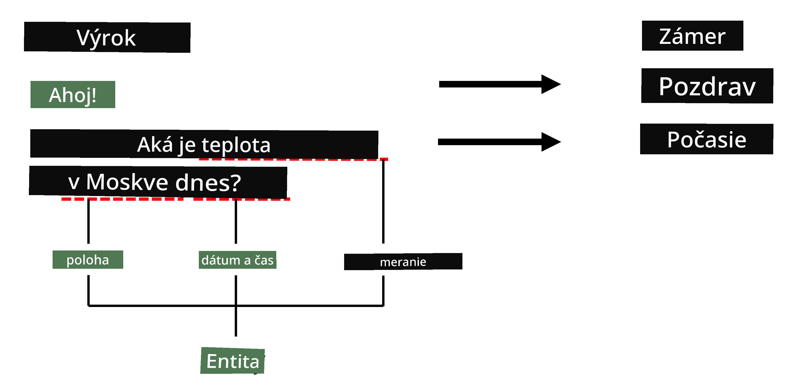
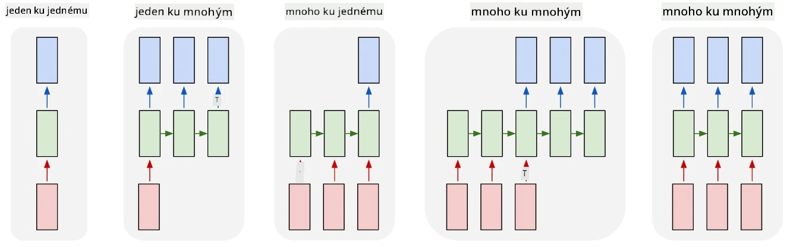

# Rozpoznávanie pomenovaných entít

Doteraz sme sa väčšinou sústredili na jednu úlohu NLP - klasifikáciu. Existujú však aj ďalšie úlohy NLP, ktoré je možné riešiť pomocou neurónových sietí. Jednou z týchto úloh je **[Rozpoznávanie pomenovaných entít](https://wikipedia.org/wiki/Named-entity_recognition)** (NER), ktoré sa zaoberá identifikáciou konkrétnych entít v texte, ako sú miesta, mená osôb, časové intervaly, chemické vzorce a podobne.

## [Kvíz pred prednáškou](https://ff-quizzes.netlify.app/en/ai/quiz/37)

## Príklad použitia NER

Predstavte si, že chcete vyvinúť chatbot na spracovanie prirodzeného jazyka, podobný Amazon Alexa alebo Google Assistant. Inteligentné chatboty fungujú tak, že *rozumejú* tomu, čo používateľ chce, prostredníctvom klasifikácie textu na vstupnej vete. Výsledkom tejto klasifikácie je tzv. **zámer**, ktorý určuje, čo by mal chatbot urobiť.

> Obrázok od autora

Používateľ však môže poskytnúť niektoré parametre ako súčasť frázy. Napríklad pri otázke na počasie môže špecifikovať lokalitu alebo dátum. Bot by mal byť schopný rozpoznať tieto entity a vyplniť príslušné parametre pred vykonaním akcie. Presne tu prichádza na rad NER.

> ✅ Ďalším príkladom by mohlo byť [analyzovanie vedeckých medicínskych článkov](https://soshnikov.com/science/analyzing-medical-papers-with-azure-and-text-analytics-for-health/). Jednou z hlavných vecí, ktoré je potrebné hľadať, sú konkrétne medicínske termíny, ako sú choroby a medicínske látky. Zatiaľ čo malý počet chorôb je pravdepodobne možné extrahovať pomocou vyhľadávania podreťazcov, zložitejšie entity, ako chemické zlúčeniny a názvy liekov, vyžadujú komplexnejší prístup.

## NER ako klasifikácia tokenov

Modely NER sú v podstate **modely klasifikácie tokenov**, pretože pre každý vstupný token musíme rozhodnúť, či patrí k nejakej entite alebo nie, a ak áno - ku ktorej triede entít.

Zvážte nasledujúci názov článku:

**Regurgitácia trojcípej chlopne** a **toxickosť lítia karbonátu** u novorodenca.

Entity sú tu:

* Regurgitácia trojcípej chlopne je choroba (`DIS`)
* Lítium karbonát je chemická látka (`CHEM`)
* Toxicita je tiež choroba (`DIS`)

Všimnite si, že jedna entita môže zahŕňať niekoľko tokenov. A, ako v tomto prípade, musíme rozlíšiť medzi dvoma po sebe nasledujúcimi entitami. Preto je bežné používať dve triedy pre každú entitu - jednu, ktorá špecifikuje prvý token entity (často sa používa predpona `B-` pre **začiatok**), a druhú - pokračovanie entity (`I-`, pre **vnútorný token**). Používame tiež `O` ako triedu na reprezentáciu všetkých **ostatných** tokenov. Takéto označovanie tokenov sa nazýva [BIO označovanie](https://en.wikipedia.org/wiki/Inside%E2%80%93outside%E2%80%93beginning_(tagging)) (alebo IOB). Po označení bude náš názov vyzerať takto:

Token | Tag
------|-----
Trojcípa | B-DIS
chlopňa | I-DIS
regurgitácia | I-DIS
a | O
lítium | B-CHEM
karbonát | I-CHEM
toxickosť | B-DIS
u | O
novorodenca | O
. | O

Keďže potrebujeme vytvoriť jednoznačnú korešpondenciu medzi tokenmi a triedami, môžeme trénovať pravú **mnoho-na-mnoho** neurónovú sieť z tohto obrázku:

> *Obrázok z [tohto blogového príspevku](http://karpathy.github.io/2015/05/21/rnn-effectiveness/) od [Andreja Karpathyho](http://karpathy.github.io/). Modely klasifikácie tokenov NER zodpovedajú najpravšej architektúre siete na tomto obrázku.*

## Trénovanie modelov NER

Keďže model NER je v podstate model klasifikácie tokenov, môžeme na túto úlohu použiť RNN, ktoré už poznáme. V tomto prípade každý blok rekurentnej siete vráti ID tokenu. Nasledujúci príkladový notebook ukazuje, ako trénovať LSTM na klasifikáciu tokenov.

## ✍️ Príkladové notebooky: NER

Pokračujte vo svojom učení v nasledujúcom notebooku:

* [NER s TensorFlow](NER-TF.ipynb)

## Záver

Model NER je **model klasifikácie tokenov**, čo znamená, že ho možno použiť na vykonávanie klasifikácie tokenov. Ide o veľmi bežnú úlohu v NLP, ktorá pomáha rozpoznávať konkrétne entity v texte vrátane miest, mien, dátumov a ďalších.

## 🚀 Výzva

Dokončite úlohu uvedenú nižšie, aby ste vytrénovali model na rozpoznávanie pomenovaných entít pre medicínske termíny, a potom ho vyskúšajte na inom datasete.

## [Kvíz po prednáške](https://ff-quizzes.netlify.app/en/ai/quiz/38)

## Prehľad a samostatné štúdium

Prečítajte si blog [The Unreasonable Effectiveness of Recurrent Neural Networks](http://karpathy.github.io/2015/05/21/rnn-effectiveness/) a prejdite si sekciu Ďalšie čítanie v tomto článku, aby ste si prehĺbili svoje vedomosti.

## [Úloha](lab/README.md)

V úlohe k tejto lekcii budete musieť vytrénovať model na rozpoznávanie medicínskych entít. Môžete začať s trénovaním modelu LSTM, ako je popísané v tejto lekcii, a pokračovať použitím modelu transformátora BERT. Prečítajte si [pokyny](lab/README.md), aby ste získali všetky podrobnosti.

---

