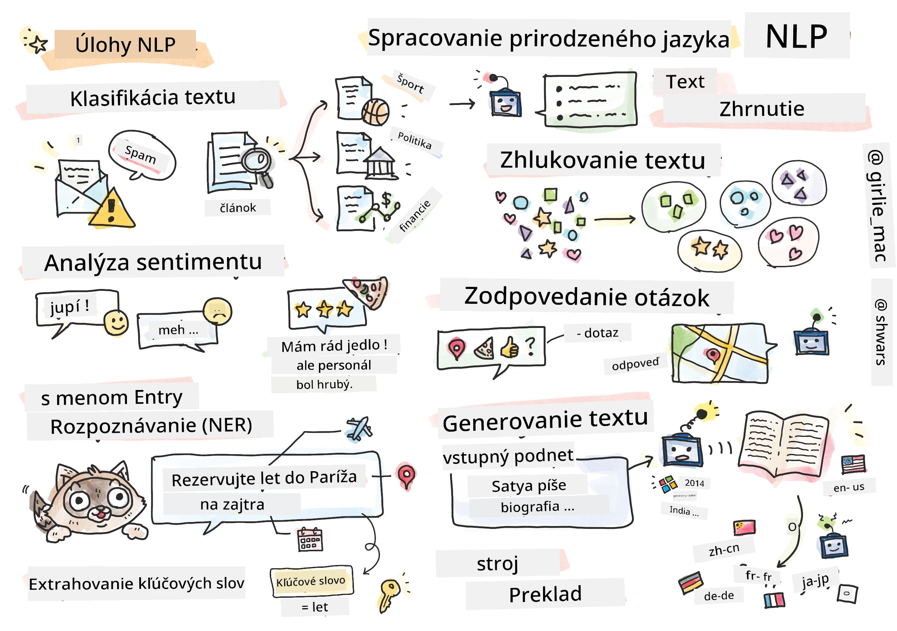

# Spracovanie prirodzeného jazyka



V tejto sekcii sa zameriame na využitie neurónových sietí na riešenie úloh súvisiacich so **spracovaním prirodzeného jazyka (NLP)**. Existuje veľa problémov v oblasti NLP, ktoré chceme, aby počítače vedeli riešiť:

* **Klasifikácia textu** je typický klasifikačný problém týkajúci sa sekvencií textu. Príklady zahŕňajú triedenie e-mailových správ na spam a ne-spam, alebo kategorizáciu článkov ako šport, biznis, politika a pod. Tiež pri vývoji chat botov často potrebujeme rozumieť, čo používateľ chcel povedať – v tomto prípade ide o **klasifikáciu zámerov** (intent classification). Často musíme v klasifikácii zámerov pracovať s mnohými kategóriami.
* **Sentimentálna analýza** je typický regresný problém, kde potrebujeme priradiť číselnú hodnotu (sentiment) zodpovedajúcu tomu, ako pozitívny alebo negatívny je význam vety. Pokročilejšou verziou sentimentálnej analýzy je **analýza založená na aspektoch** (ABSA), kde sentiment nepriraďujeme celej vete, ale rôznym jej častiam (aspektom), napr. *V tejto reštaurácii som mal rád kuchyňu, ale atmosféra bola hrozná*.
* **Rozpoznávanie pomenovaných entít** (NER) sa týka problému extrahovania určitých entít z textu. Napríklad potrebujeme pochopiť, že vo vete *Musím zajtra letieť do Paríža* slovo *zajtra* označuje DÁTUM a *Paríž* je MIESTO.  
* **Extrahovanie kľúčových slov** je podobné NER, ale automaticky musíme vybrať slová dôležité pre význam vety bez predtrénovania na špecifické typy entít.
* **Zhlukovanie textu** je užitočné, keď chceme zoskupiť podobné vety, napríklad podobné požiadavky v rozhovoroch technickej podpory.
* **Odpovedanie na otázky** znamená schopnosť modelu odpovedať na konkrétnu otázku. Model dostáva ako vstup textový úsek a otázku a musí poskytnúť miesto v texte, kde je odpoveď obsiahnutá (alebo niekedy vygenerovať odpoveď).
* **Generovanie textu** je schopnosť modelu vytvárať nový text. Dá sa to považovať za klasifikačnú úlohu, ktorá predpovedá ďalší znak/slovo na základe nejakej *textovej výzvy*. Pokročilé modely generovania textu, ako GPT-3, dokážu riešiť aj iné úlohy NLP, napríklad klasifikáciu pomocou techniky nazývanej [prompt programming](https://towardsdatascience.com/software-3-0-how-prompting-will-change-the-rules-of-the-game-a982fbfe1e0) alebo [prompt engineering](https://medium.com/swlh/openai-gpt-3-and-prompt-engineering-dcdc2c5fcd29)
* **Zhrnutie textu** je technika, keď chceme, aby počítač „prečítal“ dlhý text a zhrnul ho do niekoľkých viet.
* **Strojový preklad** možno považovať za kombináciu pochopenia textu v jednom jazyku a generovania textu v inom jazyku.

Spočiatku sa väčšina úloh NLP riešila použitím tradičných metód, ako sú gramatiky. Napríklad pri strojovom preklade sa používali parsery na transformáciu vety na syntaktický strom, potom sa extrahovali vyššie úrovne sémantických štruktúr na reprezentáciu významu vety a na základe tohto významu a gramatiky cieľového jazyka sa generoval výsledok. Dnes sa veľa úloh NLP efektívnejšie rieši pomocou neurónových sietí.

> Mnohé klasické metódy NLP sú implementované v Python knižnici [Natural Language Processing Toolkit (NLTK)](https://www.nltk.org). K dispozícii je výborná [NLTK kniha](https://www.nltk.org/book/), ktorá pokrýva, ako rôzne úlohy NLP riešiť s využitím NLTK.

V našom kurze sa budeme predovšetkým venovať využitiu neurónových sietí pre NLP a NLTK využijeme tam, kde bude potrebné.

Už sme sa učili používať neurónové siete na spracovanie tabuľkových údajov a obrázkov. Hlavný rozdiel medzi týmito typmi dát a textom je, že text je sekvencia premennej dĺžky, zatiaľ čo veľkosť vstupu v prípade obrázkov je vopred známa. Kým konvolučné siete dokážu extrahovať vzory zo vstupných dát, vzory v texte sú zložitejšie. Napríklad záporka môže byť vzdialená od podmetu o ľubovoľný počet slov (napr. *Nemám rád pomaranče* vs. *Nemám rád tie veľké farebné chutné pomaranče*) a stále by to malo byť interpretované ako jeden vzor. Preto na spracovanie jazyka potrebujeme zaviesť nové typy neurónových sietí, ako sú *rekurentné siete* a *transformery*.

## Inštalácia knižníc

Ak používate lokálnu inštaláciu Pythonu na spustenie tohto kurzu, možno budete musieť nainštalovať všetky potrebné knižnice pre NLP pomocou nasledujúcich príkazov:

**Pre PyTorch**
```bash
pip install -r requirements-pytorch.txt
```
**Pre TensorFlow**
```bash
pip install -r requirements-tf.txt
```

> NLP s TensorFlow si môžete vyskúšať na [Microsoft Learn](https://docs.microsoft.com/learn/modules/intro-natural-language-processing-tensorflow/?WT.mc_id=academic-77998-cacaste)

## Upozornenie na GPU

V tejto sekcii budeme v niektorých príkladoch trénovať pomerne veľké modely.
* **Používajte počítač s GPU**: Odporúča sa spúšťať notebooky na počítači s GPU, aby sa skrátili čakacie doby pri práci s veľkými modelmi.
* **Obmedzenia pamäte GPU**: Pri práci na GPU môže nastať situácia vyčerpania pamäte GPU, najmä pri trénovaní veľkých modelov.
* **Spotreba pamäte GPU**: Množstvo spotrebovanej pamäte GPU pri tréningu závisí od rôznych faktorov, vrátane veľkosti minibatchu.
* **Minimalizujte veľkosť minibatchu**: Ak narazíte na problém s pamäťou GPU, zvážte zníženie veľkosti minibatchu vo vašom kóde ako možné riešenie.
* **Uvoľňovanie pamäte GPU v TensorFlow**: Staršie verzie TensorFlow nemusia správne uvoľňovať pamäť GPU pri tréningu viacerých modelov v jednom Python kerneli. Na efektívne riadenie spotreby pamäte GPU môžete nakonfigurovať TensorFlow tak, aby alokoval pamäť GPU len podľa potreby.
* **Zahrnutie kódu**: Na nastavenie TensorFlow tak, aby zväčšoval alokáciu pamäte GPU len podľa potreby, vložte do svojich notebookov nasledujúci kód:

```python
physical_devices = tf.config.list_physical_devices('GPU') 
if len(physical_devices)>0:
    tf.config.experimental.set_memory_growth(physical_devices[0], True) 
```

Ak vás zaujíma učenie NLP z klasickej perspektívy strojového učenia, navštívte [túto sadu lekcií](https://github.com/microsoft/ML-For-Beginners/tree/main/6-NLP)

## V tejto sekcii
V tejto sekcii sa naučíme:

* [Reprezentácia textu ako tenzorov](13-TextRep/README.md)
* [Vkladanie slov](14-Embeddings/README.md)
* [Modelovanie jazyka](15-LanguageModeling/README.md)
* [Rekurentné neurónové siete](16-RNN/README.md)
* [Generatívne siete](17-GenerativeNetworks/README.md)
* [Transformery](18-Transformers/README.md)

---

<!-- CO-OP TRANSLATOR DISCLAIMER START -->
**Vyhlásenie o zodpovednosti**:
Tento dokument bol preložený pomocou AI prekladateľskej služby [Co-op Translator](https://github.com/Azure/co-op-translator). Hoci sa snažíme o presnosť, vezmite prosím na vedomie, že automatické preklady môžu obsahovať chyby alebo nepresnosti. Pôvodný dokument v jeho natívnom jazyku by mal byť považovaný za autoritatívny zdroj. Pre kritické informácie sa odporúča profesionálny ľudský preklad. Nie sme zodpovední za žiadne nedorozumenia alebo nesprávne interpretácie vyplývajúce z použitia tohto prekladu.
<!-- CO-OP TRANSLATOR DISCLAIMER END -->