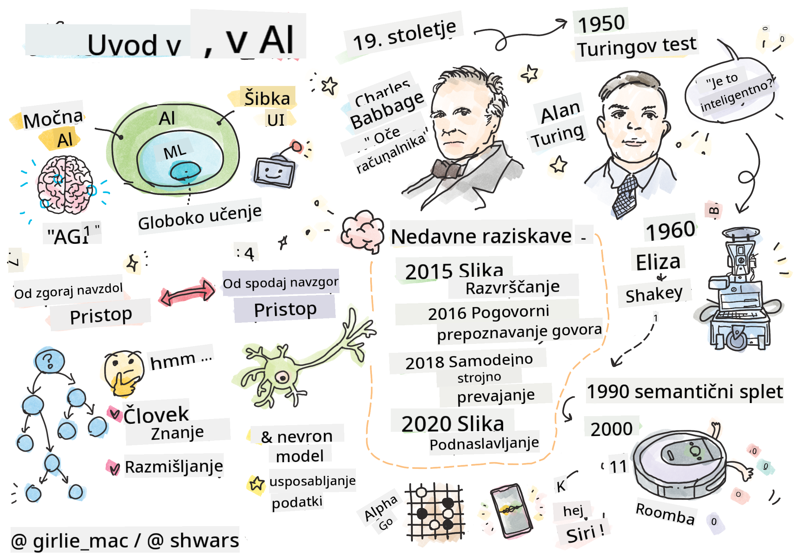
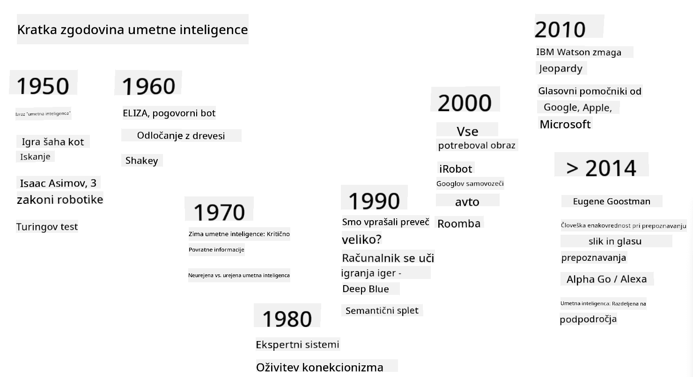

<!--
CO_OP_TRANSLATOR_METADATA:
{
  "original_hash": "06ca1b0138e65b964481ae83275b270e",
  "translation_date": "2025-10-03T09:02:44+00:00",
  "source_file": "lessons/1-Intro/README.md",
  "language_code": "sl"
}
-->
# Uvod v umetno inteligenco

> Skica avtorja [Tomomi Imura](https://twitter.com/girlie_mac)

## [Predhodni kviz pred predavanjem](https://ff-quizzes.netlify.app/en/ai/quiz/1)

**Umetna inteligenca** je vznemirljiva znanstvena disciplina, ki preučuje, kako lahko računalnikom omogočimo inteligentno vedenje, npr. izvajanje nalog, v katerih so ljudje dobri.

Računalnike je prvotno izumil [Charles Babbage](https://en.wikipedia.org/wiki/Charles_Babbage) za obdelavo številk po natančno določenem postopku – algoritmu. Sodobni računalniki, čeprav bistveno naprednejši od prvotnega modela iz 19. stoletja, še vedno sledijo isti ideji nadzorovanih izračunov. Tako je mogoče programirati računalnik za izvajanje nalog, če poznamo natančen zaporedje korakov, ki jih moramo opraviti, da dosežemo cilj.

> Fotografija avtorja [Vickie Soshnikova](http://twitter.com/vickievalerie)

> ✅ Določanje starosti osebe na podlagi njene fotografije je naloga, ki je ni mogoče eksplicitno programirati, saj ne vemo, kako v glavi pridemo do številke, ko to počnemo.

---

Obstajajo pa naloge, za katere ne vemo, kako jih eksplicitno rešiti. Na primer, določanje starosti osebe na podlagi njene fotografije. Nekako se naučimo to početi, ker smo videli veliko primerov ljudi različnih starosti, vendar ne moremo natančno razložiti, kako to počnemo, niti ne moremo programirati računalnika, da to počne. To so točno tiste vrste nalog, ki zanimajo **umetno inteligenco** (AI).

✅ Pomislite na nekaj nalog, ki bi jih lahko prenesli na računalnik in bi koristile umetni inteligenci. Razmislite o področjih financ, medicine in umetnosti – kako ta področja danes koristijo umetni inteligenci?

## Šibka AI proti močni AI

Šibka AI | Močna AI
---------------------------------------|-------------------------------------
Šibka AI se nanaša na sisteme umetne inteligence, ki so zasnovani in usposobljeni za določeno nalogo ali ozek nabor nalog.|Močna AI, ali splošna umetna inteligenca (AGI), se nanaša na sisteme umetne inteligence s človeško stopnjo inteligence in razumevanja.
Ti sistemi umetne inteligence niso splošno inteligentni; odlično opravljajo vnaprej določeno nalogo, vendar jim primanjkuje pravega razumevanja ali zavesti.|Ti sistemi umetne inteligence imajo sposobnost izvajanja vseh intelektualnih nalog, ki jih lahko opravi človek, prilagajanja različnim področjem in posedovanja oblike zavesti ali samozavedanja.
Primeri šibke AI vključujejo virtualne asistente, kot so Siri ali Alexa, algoritme za priporočila, ki jih uporabljajo storitve pretakanja, in klepetalne bote, zasnovane za specifične naloge v podpori strankam.|Doseganje močne AI je dolgoročni cilj raziskav umetne inteligence in bi zahtevalo razvoj sistemov umetne inteligence, ki lahko razmišljajo, se učijo, razumejo in prilagajajo širokemu spektru nalog in kontekstov.
Šibka AI je zelo specializirana in nima človeških kognitivnih sposobnosti ali splošnih sposobnosti reševanja problemov zunaj svojega ozkega področja.|Močna AI je trenutno teoretični koncept, in noben sistem umetne inteligence še ni dosegel te stopnje splošne inteligence.

Za več informacij glejte **[Splošna umetna inteligenca](https://en.wikipedia.org/wiki/Artificial_general_intelligence)** (AGI).

## Definicija inteligence in Turingov test

Ena od težav pri obravnavi izraza **[inteligenca](https://en.wikipedia.org/wiki/Intelligence)** je, da ni jasne definicije tega pojma. Lahko bi trdili, da je inteligenca povezana z **abstraktnim razmišljanjem** ali **samozavedanjem**, vendar je ne moremo ustrezno opredeliti.

> [Fotografija](https://unsplash.com/photos/75715CVEJhI) avtorja [Amber Kipp](https://unsplash.com/@sadmax) z Unsplash

Da bi videli dvoumnost izraza *inteligenca*, poskusite odgovoriti na vprašanje: "Ali je mačka inteligentna?". Različni ljudje ponavadi dajejo različne odgovore na to vprašanje, saj ni univerzalno sprejetega testa, ki bi dokazal, da je trditev resnična ali ne. In če mislite, da obstaja – poskusite svojo mačko spraviti skozi test IQ...

✅ Razmislite za trenutek, kako definirate inteligenco. Ali je vrana, ki lahko reši labirint in pride do hrane, inteligentna? Ali je otrok inteligenten?

---

Ko govorimo o AGI, moramo imeti način, kako ugotoviti, ali smo ustvarili resnično inteligenten sistem. [Alan Turing](https://en.wikipedia.org/wiki/Alan_Turing) je predlagal način, imenovan **[Turingov test](https://en.wikipedia.org/wiki/Turing_test)**, ki deluje tudi kot definicija inteligence. Test primerja dani sistem z nečim, kar je inherentno inteligentno – resničnim človekom, in ker lahko vsak samodejni primerjalni test računalniški program zaobide, uporabimo človeškega spraševalca. Če človek ne more ločiti med resnično osebo in računalniškim sistemom v dialogu na podlagi besedila – se sistem šteje za inteligentnega.

> Klepetalni bot, imenovan [Eugene Goostman](https://en.wikipedia.org/wiki/Eugene_Goostman), razvit v Sankt Peterburgu, se je leta 2014 približal uspešnemu prestajanju Turingovega testa z uporabo pametnega osebnostnega trika. Vnaprej je napovedal, da je 13-letni ukrajinski deček, kar bi pojasnilo pomanjkanje znanja in nekatere neskladnosti v besedilu. Bot je prepričal 30 % sodnikov, da je človek, po 5-minutnem dialogu, kar je metrika, za katero je Turing verjel, da jo bo stroj lahko dosegel do leta 2000. Vendar je treba razumeti, da to ne pomeni, da smo ustvarili inteligenten sistem ali da je računalniški sistem zavedel človeškega spraševalca – sistem ni zavedel ljudi, temveč so to storili ustvarjalci bota!

✅ Ste že kdaj mislili, da se pogovarjate s človekom, ko ste v resnici govorili s klepetalnim botom? Kako vas je prepričal?

## Različni pristopi k umetni inteligenci

Če želimo, da se računalnik obnaša kot človek, moramo nekako modelirati naš način razmišljanja znotraj računalnika. Posledično moramo poskusiti razumeti, kaj človeka naredi inteligentnega.

> Da bi lahko programirali inteligenco v stroj, moramo razumeti, kako delujejo naši lastni procesi odločanja. Če se malo poglobite vase, boste ugotovili, da nekateri procesi potekajo podzavestno – npr. lahko ločimo mačko od psa, ne da bi o tem razmišljali – medtem ko drugi vključujejo razmišljanje.

Obstajata dva možna pristopa k tej težavi:

Pristop od zgoraj navzdol (simbolno sklepanje) | Pristop od spodaj navzgor (nevronske mreže)
---------------------------------------|-------------------------------------
Pristop od zgoraj navzdol modelira način, kako oseba razmišlja pri reševanju problema. Vključuje pridobivanje **znanja** od človeka in njegovo predstavitev v obliki, ki jo računalnik lahko bere. Prav tako moramo razviti način modeliranja **sklepanja** znotraj računalnika. | Pristop od spodaj navzgor modelira strukturo človeških možganov, ki jih sestavlja ogromno število preprostih enot, imenovanih **nevroni**. Vsak nevron deluje kot tehtano povprečje svojih vhodov, mrežo nevronov pa lahko naučimo reševati koristne probleme z zagotavljanjem **učnih podatkov**.

Obstajajo tudi nekateri drugi možni pristopi k inteligenci:

* **Emergentni**, **sinergijski** ali **večagentni pristop** temelji na dejstvu, da je kompleksno inteligentno vedenje mogoče doseči z interakcijo velikega števila preprostih agentov. Po [evolucijski kibernetiki](https://en.wikipedia.org/wiki/Global_brain#Evolutionary_cybernetics) lahko inteligenca *nastane* iz bolj preprostega, reaktivnega vedenja v procesu *prehoda metasistema*.

* **Evolucijski pristop** ali **genetski algoritem** je optimizacijski proces, ki temelji na načelih evolucije.

Te pristope bomo obravnavali kasneje v tečaju, trenutno pa se bomo osredotočili na dve glavni smeri: od zgoraj navzdol in od spodaj navzgor.

### Pristop od zgoraj navzdol

Pri **pristopu od zgoraj navzdol** poskušamo modelirati naše razmišljanje. Ker lahko sledimo svojim mislim, ko razmišljamo, lahko poskusimo formalizirati ta proces in ga programirati znotraj računalnika. To se imenuje **simbolno sklepanje**.

Ljudje imajo v glavi določena pravila, ki usmerjajo njihove procese odločanja. Na primer, ko zdravnik postavlja diagnozo pacientu, lahko ugotovi, da ima oseba vročino, kar pomeni, da se v telesu morda dogaja vnetje. Z uporabo velikega nabora pravil za določen problem lahko zdravnik pride do končne diagnoze.

Ta pristop močno temelji na **predstavitvi znanja** in **sklepanju**. Pridobivanje znanja od človeškega strokovnjaka je lahko najtežji del, saj zdravnik v mnogih primerih ne ve natančno, zakaj pride do določene diagnoze. Včasih se rešitev preprosto pojavi v njegovi glavi brez eksplicitnega razmišljanja. Nekaterih nalog, kot je določanje starosti osebe na podlagi fotografije, sploh ni mogoče zmanjšati na manipulacijo z znanjem.

### Pristop od spodaj navzgor

Alternativno lahko poskusimo modelirati najpreprostejše elemente znotraj naših možganov – nevron. Znotraj računalnika lahko zgradimo tako imenovano **umetno nevronsko mrežo** in jo nato poskusimo naučiti reševanja problemov z dajanjem primerov. Ta proces je podoben temu, kako se novorojenček uči o svojem okolju z opazovanjem.

✅ Raziskujte, kako se dojenčki učijo. Kateri so osnovni elementi dojenčkovih možganov?

> | Kaj pa ML?         |      |
> |--------------|-----------|
> | Del umetne inteligence, ki temelji na učenju računalnika za reševanje problema na podlagi nekaterih podatkov, se imenuje **strojno učenje**. Klasičnega strojnega učenja v tem tečaju ne bomo obravnavali – napotimo vas na ločen [Strojno učenje za začetnike](http://aka.ms/ml-beginners) učni načrt. |       |

## Kratek zgodovinski pregled umetne inteligence

Umetna inteligenca se je kot področje začela razvijati sredi dvajsetega stoletja. Sprva je bil simbolni pristop prevladujoč, kar je privedlo do številnih pomembnih uspehov, kot so ekspertni sistemi – računalniški programi, ki so lahko delovali kot strokovnjaki na nekaterih omejenih problematičnih področjih. Vendar se je kmalu izkazalo, da takšen pristop ni dobro skalabilen. Pridobivanje znanja od strokovnjaka, njegova predstavitev v računalniku in ohranjanje točnosti baze znanja se je izkazalo za zelo zapleteno nalogo, ki je bila v mnogih primerih predraga za praktično uporabo. To je privedlo do tako imenovane [AI zime](https://en.wikipedia.org/wiki/AI_winter) v 70. letih.

> Slika avtorja [Dmitry Soshnikov](http://soshnikov.com)

Sčasoma so računalniški viri postali cenejši, na voljo je bilo več podatkov, zato so pristopi z nevronskimi mrežami začeli kazati odlične rezultate pri tekmovanju z ljudmi na številnih področjih, kot sta računalniški vid ali razumevanje govora. V zadnjem desetletju se izraz umetna inteligenca večinoma uporablja kot sinonim za nevronske mreže, saj večina uspehov umetne inteligence, o katerih slišimo, temelji na njih.

Opazimo lahko, kako so se pristopi spreminjali, na primer pri ustvarjanju računalniškega programa za igranje šaha:

* Zgodnji šahovski programi so temeljili na iskanju – program je eksplicitno poskušal oceniti možne poteze nasprotnika za določeno število naslednjih potez in izbral optimalno potezo na podlagi optimalne pozicije, ki jo je mogoče doseči v nekaj potezah. To je privedlo do razvoja tako imenovanega [alpha-beta obrezovanja](https://en.wikipedia.org/wiki/Alpha%E2%80%93beta_pruning) algoritma iskanja.
* Strategije iskanja dobro delujejo proti koncu igre, kjer je iskalni prostor omejen z majhnim številom možnih potez. Vendar pa je na začetku igre iskalni prostor ogromen, algoritem pa je mogoče izboljšati z učenjem iz obstoječih tekem med človeškimi igralci. Kasnejši eksperimenti so uporabljali tako imenovano [sklepanje na podlagi primerov](https://en.wikipedia.org/wiki/Case-based_reasoning), kjer je program iskal primere v bazi znanja, ki so zelo podobni trenutni poziciji v igri.
* Sodobni programi, ki premagujejo človeške igralce, temeljijo na nevronskih mrežah in [okrepljenem učenju](https://en.wikipedia.org/wiki/Reinforcement_learning), kjer se programi učijo igrati izključno z igranjem proti sebi in učenjem iz lastnih napak – podobno kot ljudje, ko se učijo igrati šah. Vendar pa lahko računalniški program odigra veliko več iger v veliko krajšem času in se tako uči veliko hitreje.

✅ Raziskujte druge igre, ki jih je igrala umetna inteligenca.

Podobno lahko opazimo, kako se je spreminjal pristop k ustvarjanju "govorečih programov" (ki bi lahko prestali Turingov test):

* Zgodnji programi te vrste, kot je [Eliza](https://en.wikipedia.org/wiki/ELIZA), so temeljili na zelo preprostih slovničnih pravilih in preoblikovanju vhodnega stavka v vprašanje.
* Sodobni asistenti, kot so Cortana, Siri ali Google Assistant, so vsi hibridni sistemi, ki uporabljajo nevronske mreže za pretvorbo govora v besedilo in prepoznavanje našega namena, nato pa uporabljajo nekaj sklepanja ali eksplicitnih algoritmov za izvedbo zahtevanih dejanj.
* V prihodnosti lahko pričakujemo popoln model, ki temelji na nevronskih mrežah, za samostojno obravnavo dialoga. Družina nevronskih mrež GPT in [Turing-NLG](https://www.microsoft.com/research/blog/turing-nlg-a-17-billion-parameter-language-model-by-microsoft) kaže velik uspeh pri tem.

> Slika Dmitry Soshnikov, [fotografija](https://unsplash.com/photos/r8LmVbUKgns) avtorja [Marina Abrosimova](https://unsplash.com/@abrosimova_marina_foto), Unsplash

## Nedavne raziskave na področju umetne inteligence

Ogromen porast raziskav na področju nevronskih mrež se je začel okoli leta 2010, ko so postali na voljo veliki javni podatkovni nizi. Velika zbirka slik, imenovana [ImageNet](https://en.wikipedia.org/wiki/ImageNet), ki vsebuje približno 14 milijonov označenih slik, je dala zagon [ImageNet Large Scale Visual Recognition Challenge](https://image-net.org/challenges/LSVRC/).

> Slika avtorja [Dmitry Soshnikov](http://soshnikov.com)

Leta 2012 so bile [konvolucijske nevronske mreže](../4-ComputerVision/07-ConvNets/README.md) prvič uporabljene pri razvrščanju slik, kar je povzročilo znatno zmanjšanje napak pri razvrščanju (s skoraj 30 % na 16,4 %). Leta 2015 je arhitektura ResNet iz Microsoft Research [dosegla natančnost na ravni človeka](https://doi.org/10.1109/ICCV.2015.123).

Od takrat so nevronske mreže pokazale zelo uspešno delovanje pri številnih nalogah:

---

Leto | Dosežena enakovrednost človeku
-----|--------
2015 | [Razvrščanje slik](https://doi.org/10.1109/ICCV.2015.123)
2016 | [Prepoznavanje govora v pogovoru](https://arxiv.org/abs/1610.05256)
2018 | [Samodejno strojno prevajanje](https://arxiv.org/abs/1803.05567) (kitajščina v angleščino)
2020 | [Opisovanje slik](https://arxiv.org/abs/2009.13682)

V zadnjih nekaj letih smo bili priča velikim uspehom velikih jezikovnih modelov, kot sta BERT in GPT-3. To se je zgodilo predvsem zaradi dejstva, da je na voljo veliko splošnih besedilnih podatkov, ki omogočajo treniranje modelov za zajemanje strukture in pomena besedil, njihovo predhodno usposabljanje na splošnih zbirkah besedil ter nato specializacijo teh modelov za bolj specifične naloge. Več o [obdelavi naravnega jezika](../5-NLP/README.md) bomo izvedeli kasneje v tem tečaju.

## 🚀 Izziv

Raziskujte po internetu in ugotovite, kje se po vašem mnenju umetna inteligenca najbolj učinkovito uporablja. Je to v aplikaciji za kartiranje, storitvi za pretvorbo govora v besedilo ali v videoigri? Raziščite, kako je bil sistem zgrajen.

## [Kvizi po predavanju](https://ff-quizzes.netlify.app/en/ai/quiz/2)

## Pregled in samostojno učenje

Preglejte zgodovino umetne inteligence in strojnega učenja z branjem [te lekcije](https://github.com/microsoft/ML-For-Beginners/tree/main/1-Introduction/2-history-of-ML). Izberite element iz sketchnote na vrhu te lekcije ali te in ga raziščite bolj podrobno, da bi razumeli kulturni kontekst, ki je vplival na njegov razvoj.

**Naloga**: [Game Jam](assignment.md)

---

**Omejitev odgovornosti**:  
Ta dokument je bil preveden z uporabo storitve AI za prevajanje [Co-op Translator](https://github.com/Azure/co-op-translator). Čeprav si prizadevamo za natančnost, vas prosimo, da upoštevate, da lahko avtomatizirani prevodi vsebujejo napake ali netočnosti. Izvirni dokument v njegovem maternem jeziku je treba obravnavati kot avtoritativni vir. Za ključne informacije priporočamo profesionalni človeški prevod. Ne prevzemamo odgovornosti za morebitna nesporazumevanja ali napačne razlage, ki izhajajo iz uporabe tega prevoda.