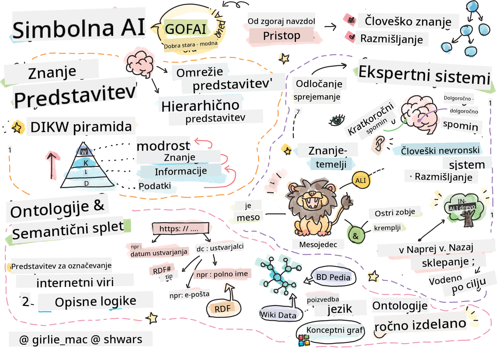
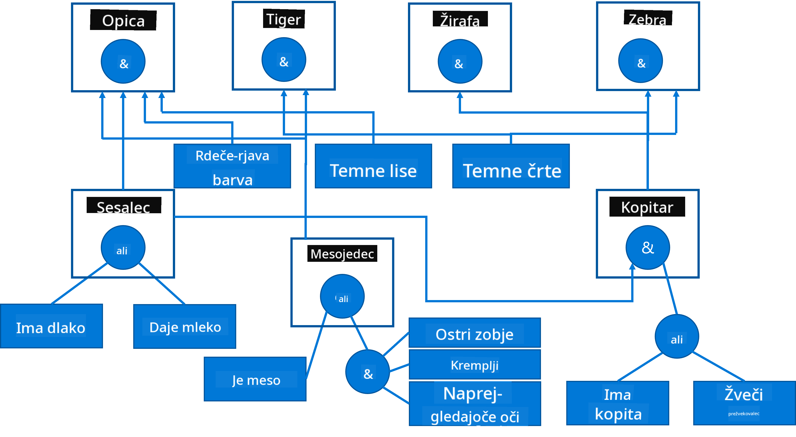

<!--
CO_OP_TRANSLATOR_METADATA:
{
  "original_hash": "7d097f7fda9166ead615e4c34552381b",
  "translation_date": "2025-09-23T15:05:42+00:00",
  "source_file": "lessons/2-Symbolic/README.md",
  "language_code": "sl"
}
-->
# Predstavitev znanja in ekspertni sistemi



> Sketchnote avtorja [Tomomi Imura](https://twitter.com/girlie_mac)

Iskanje umetne inteligence temelji na iskanju znanja, da bi razumeli svet na podoben način, kot to počnejo ljudje. Toda kako to doseči?

## [Predhodni kviz pred predavanjem](https://ff-quizzes.netlify.app/en/ai/quiz/3)

V zgodnjih dneh umetne inteligence je bil priljubljen pristop od zgoraj navzdol za ustvarjanje inteligentnih sistemov (o katerem smo govorili v prejšnji lekciji). Ideja je bila, da se znanje pridobi od ljudi v obliki, ki jo lahko berejo stroji, in nato uporabi za samodejno reševanje problemov. Ta pristop je temeljil na dveh velikih idejah:

* Predstavitev znanja
* Razmišljanje

## Predstavitev znanja

Eden pomembnih konceptov v simbolni umetni inteligenci je **znanje**. Pomembno je razlikovati znanje od *informacij* ali *podatkov*. Na primer, lahko rečemo, da knjige vsebujejo znanje, ker jih lahko preučujemo in postanemo strokovnjaki. Vendar pa tisto, kar knjige dejansko vsebujejo, imenujemo *podatki*, in z branjem knjig ter vključevanjem teh podatkov v naš model sveta te podatke pretvorimo v znanje.

> ✅ **Znanje** je nekaj, kar je v naši glavi in predstavlja naše razumevanje sveta. Pridobljeno je z aktivnim procesom **učenja**, ki vključuje koščke informacij, ki jih prejmemo, v naš aktivni model sveta.

Najpogosteje znanja ne definiramo strogo, ampak ga uskladimo z drugimi povezanimi koncepti z uporabo [DIKW piramide](https://en.wikipedia.org/wiki/DIKW_pyramid). Vsebuje naslednje koncepte:

* **Podatki** so nekaj, kar je predstavljeno na fizičnih medijih, kot so pisano besedilo ali govorjene besede. Podatki obstajajo neodvisno od ljudi in se lahko prenašajo med njimi.
* **Informacije** so način, kako interpretiramo podatke v naši glavi. Na primer, ko slišimo besedo *računalnik*, imamo neko razumevanje, kaj to je.
* **Znanje** je informacija, ki je vključena v naš model sveta. Na primer, ko se naučimo, kaj je računalnik, začnemo imeti ideje o tem, kako deluje, koliko stane in za kaj se lahko uporablja. Ta mreža medsebojno povezanih konceptov tvori naše znanje.
* **Modrost** je še ena raven našega razumevanja sveta in predstavlja *meta-znanje*, npr. neko idejo o tem, kako in kdaj naj se znanje uporabi.


*Slika [iz Wikipedije](https://commons.wikimedia.org/w/index.php?curid=37705247), avtor Longlivetheux - lastno delo, CC BY-SA 4.0*

Tako je problem **predstavitve znanja** najti učinkovit način za predstavitev znanja znotraj računalnika v obliki podatkov, da bi bilo samodejno uporabno. To lahko vidimo kot spekter:


> Slika avtorja [Dmitry Soshnikov](http://soshnikov.com)

* Na levi strani so zelo preproste vrste predstavitev znanja, ki jih računalniki lahko učinkovito uporabljajo. Najpreprostejša je algoritmična, kjer je znanje predstavljeno z računalniškim programom. To pa ni najboljši način za predstavitev znanja, ker ni prilagodljiv. Znanje v naši glavi je pogosto nealgoritmično.
* Na desni strani so predstavitve, kot je naravno besedilo. To je najmočnejše, vendar ga ni mogoče uporabiti za samodejno razmišljanje.

> ✅ Premislite za trenutek, kako predstavljate znanje v svoji glavi in ga pretvarjate v zapiske. Ali obstaja določen format, ki vam pomaga pri pomnjenju?

## Razvrščanje računalniških predstavitev znanja

Različne metode predstavitve znanja v računalnikih lahko razvrstimo v naslednje kategorije:

* **Omrežne predstavitve** temeljijo na dejstvu, da imamo v glavi mrežo medsebojno povezanih konceptov. Poskusimo lahko reproducirati iste mreže kot graf znotraj računalnika - tako imenovano **semantično omrežje**.

1. **Trojice objekt-lastnost-vrednost** ali **pari lastnost-vrednost**. Ker je graf mogoče predstaviti znotraj računalnika kot seznam vozlišč in povezav, lahko semantično omrežje predstavimo s seznamom trojic, ki vsebujejo objekte, lastnosti in vrednosti. Na primer, zgradimo naslednje trojice o programskih jezikih:

Objekt | Lastnost | Vrednost
-------|----------|---------
Python | je | Ne-tipiziran jezik
Python | izumil | Guido van Rossum
Python | blok-sintaksa | zamik
Ne-tipiziran jezik | nima | definicij tipov

> ✅ Premislite, kako lahko trojice uporabite za predstavitev drugih vrst znanja.

2. **Hierarhične predstavitve** poudarjajo dejstvo, da pogosto ustvarimo hierarhijo objektov v naši glavi. Na primer, vemo, da je kanarček ptica, in vse ptice imajo krila. Prav tako imamo neko idejo o tem, kakšne barve je običajno kanarček in kakšna je njegova hitrost letenja.

   - **Predstavitev okvirjev** temelji na predstavitvi vsakega objekta ali razreda objektov kot **okvirja**, ki vsebuje **reže**. Reže imajo možne privzete vrednosti, omejitve vrednosti ali shranjene postopke, ki jih je mogoče poklicati za pridobitev vrednosti reže. Vsi okvirji tvorijo hierarhijo, podobno hierarhiji objektov v objektno usmerjenih programskih jezikih.
   - **Scenariji** so posebna vrsta okvirjev, ki predstavljajo kompleksne situacije, ki se lahko odvijajo skozi čas.

**Python**

Reža | Vrednost | Privzeta vrednost | Interval |
-----|----------|-------------------|----------|
Ime | Python | | |
Je | Ne-tipiziran jezik | | |
Primer spremenljivke | | CamelCase | |
Dolžina programa | | | 5-5000 vrstic |
Blok-sintaksa | Zamik | | |

3. **Postopkovne predstavitve** temeljijo na predstavitvi znanja s seznamom dejanj, ki jih je mogoče izvesti, ko se pojavi določen pogoj.
   - Pravila produkcije so if-then izjave, ki nam omogočajo sklepanje. Na primer, zdravnik lahko ima pravilo, ki pravi, da **ČE** ima pacient visoko vročino **ALI** visoko raven C-reaktivnega proteina v krvnem testu **POTEM** ima vnetje. Ko naletimo na enega od pogojev, lahko sklepamo o vnetju in nato uporabimo to v nadaljnjem razmišljanju.
   - Algoritmi se lahko štejejo za drugo obliko postopkovne predstavitve, čeprav se skoraj nikoli ne uporabljajo neposredno v sistemih, ki temeljijo na znanju.

4. **Logika** je bila prvotno predlagana s strani Aristotela kot način za predstavitev univerzalnega človeškega znanja.
   - Predikatna logika kot matematična teorija je prebogata, da bi bila računalniško izvedljiva, zato se običajno uporablja njen podmnožek, kot so Hornove klavzule, uporabljene v Prologu.
   - Opisna logika je družina logičnih sistemov, ki se uporabljajo za predstavitev in razmišljanje o hierarhijah objektov ter razdeljenih predstavitvah znanja, kot je *semantični splet*.

## Ekspertni sistemi

Eden zgodnjih uspehov simbolne umetne inteligence so bili tako imenovani **ekspertni sistemi** - računalniški sistemi, zasnovani za delovanje kot strokovnjak na omejenem področju problemov. Temeljili so na **bazi znanja**, pridobljeni od enega ali več človeških strokovnjakov, in vsebovali **inferenčni mehanizem**, ki je izvajal razmišljanje na podlagi te baze.

 | 
---------------------------------------------|------------------------------------------------
Poenostavljena struktura človeškega nevronskega sistema | Arhitektura sistema, ki temelji na znanju

Ekspertni sistemi so zgrajeni podobno kot človeški sistem razmišljanja, ki vsebuje **kratkoročni spomin** in **dolgoročni spomin**. Podobno v sistemih, ki temeljijo na znanju, razlikujemo naslednje komponente:

* **Spomin problema**: vsebuje znanje o problemu, ki se trenutno rešuje, npr. temperaturo ali krvni tlak pacienta, ali ima vnetje ali ne itd. To znanje se imenuje tudi **statično znanje**, ker vsebuje posnetek tega, kar trenutno vemo o problemu - tako imenovano *stanje problema*.
* **Baza znanja**: predstavlja dolgoročno znanje o področju problema. Ročno se pridobi od človeških strokovnjakov in se ne spreminja od posvetovanja do posvetovanja. Ker nam omogoča navigacijo od enega stanja problema do drugega, se imenuje tudi **dinamično znanje**.
* **Inferenčni mehanizem**: usklajuje celoten proces iskanja v prostoru stanja problema, postavlja vprašanja uporabniku, kadar je to potrebno. Prav tako je odgovoren za iskanje pravil, ki jih je treba uporabiti v vsakem stanju.

Kot primer si poglejmo naslednji ekspertni sistem za določanje živali na podlagi njihovih fizičnih značilnosti:



> Slika avtorja [Dmitry Soshnikov](http://soshnikov.com)

Ta diagram se imenuje **AND-OR drevo** in je grafična predstavitev nabora produkcijskih pravil. Risanje drevesa je koristno na začetku pridobivanja znanja od strokovnjaka. Za predstavitev znanja znotraj računalnika je bolj priročno uporabiti pravila:

```
IF the animal eats meat
OR (animal has sharp teeth
    AND animal has claws
    AND animal has forward-looking eyes
) 
THEN the animal is a carnivore
```

Opazite lahko, da vsak pogoj na levi strani pravila in dejanje v bistvu predstavljata trojice objekt-lastnost-vrednost (OAV). **Delovni spomin** vsebuje nabor OAV trojic, ki ustrezajo problemu, ki se trenutno rešuje. **Pravilni mehanizem** išče pravila, za katera je pogoj izpolnjen, in jih uporabi, pri čemer doda novo trojico v delovni spomin.

> ✅ Narišite svoje AND-OR drevo na temo, ki vam je všeč!

### Naprej proti nazaj sklepanje

Proces, opisan zgoraj, se imenuje **naprej sklepanje**. Začne se z nekaterimi začetnimi podatki o problemu, ki so na voljo v delovnem spominu, nato pa izvede naslednjo zanko razmišljanja:

1. Če je ciljna lastnost prisotna v delovnem spominu - ustavi in poda rezultat
2. Poišči vsa pravila, katerih pogoj je trenutno izpolnjen - pridobi **konfliktni nabor** pravil.
3. Izvedi **reševanje konflikta** - izberi eno pravilo, ki bo izvedeno v tem koraku. Obstajajo različne strategije reševanja konfliktov:
   - Izberi prvo uporabno pravilo v bazi znanja
   - Izberi naključno pravilo
   - Izberi *bolj specifično* pravilo, tj. tisto, ki izpolnjuje največ pogojev na "levi strani" (LHS)
4. Uporabi izbrano pravilo in vstavi nov del znanja v stanje problema
5. Ponovi od koraka 1.

V nekaterih primerih pa želimo začeti z praznim znanjem o problemu in postavljati vprašanja, ki nam bodo pomagala priti do zaključka. Na primer, pri medicinski diagnozi običajno ne izvajamo vseh medicinskih analiz vnaprej, preden začnemo diagnosticirati pacienta. Raje želimo opraviti analize, ko je treba sprejeti odločitev.

Ta proces lahko modeliramo z uporabo **nazaj sklepanje**. Vodeno je z **ciljem** - vrednostjo lastnosti, ki jo iščemo:

1. Izberi vsa pravila, ki nam lahko dajo vrednost cilja (tj. s ciljem na RHS ("desni strani")) - konfliktni nabor
1. Če ni pravil za to lastnost ali obstaja pravilo, ki pravi, da moramo vrednost vprašati uporabnika - vprašaj za to, sicer:
1. Uporabi strategijo reševanja konflikta za izbiro enega pravila, ki ga bomo uporabili kot *hipotezo* - poskusili jo bomo dokazati
1. Rekurzivno ponovi proces za vse lastnosti na LHS pravila, poskušajoč jih dokazati kot cilje
1. Če proces kadarkoli ne uspe - uporabi drugo pravilo v koraku 3.

> ✅ V katerih situacijah je naprej sklepanje bolj primerno? Kaj pa nazaj sklepanje?

### Implementacija ekspertnih sistemov

Ekspertni sistemi se lahko implementirajo z različnimi orodji:

* Neposredno programiranje v nekem visokonivojskem programskem jeziku. To ni najboljša ideja, ker je glavna prednost sistema, ki temelji na znanju, da je znanje ločeno od sklepanja, in potencialno bi moral strokovnjak za področje problema biti sposoben pisati pravila brez razumevanja podrobnosti procesa sklepanja.
* Uporaba **lupine ekspertnih sistemov**, tj. sistema, posebej zasnovanega za polnjenje z znanjem z uporabo nekega jezika za predstavitev znanja.

## ✍️ Naloga: sklepanje o živalih

Oglejte si [Animals.ipynb](https://github.com/microsoft/AI-For-Beginners/blob/main/lessons/2-Symbolic/Animals.ipynb) za primer implementacije ekspertnega sistema za naprej in nazaj sklepanje.

> **Opomba**: Ta primer je precej preprost in daje le idejo, kako izgleda ekspertni sistem. Ko začnete ustvarjati tak sistem, boste opazili neko *inteligentno* vedenje šele, ko dosežete določeno število pravil, okoli 200+. Na neki točki postanejo pravila preveč zapletena, da bi jih lahko vse imeli v mislih, in takrat se lahko začnete spraševati, zakaj sistem sprejema določene odločitve. Vendar pa je pomembna značilnost sistemov, ki temeljijo na znanju, da lahko vedno *pojasnite*, kako je bila sprejeta katera koli odločitev.

## Ontologije in semantični splet

Ob koncu 20. stoletja je bila pobuda za uporabo predstavitve znanja za označevanje internetnih virov, da bi bilo mogoče najti vire, ki ustrezajo zelo specifičnim poizvedbam. Ta gibanje se je imenovalo **semantični splet**, in temeljilo je na več konceptih:

- Posebna predstavitev znanja, ki temelji na **[opisni logiki](https://en.wikipedia.org/wiki/Description_logic)** (DL). Podobna je predstavitvi znanja z okvirji, ker gradi hierarhijo objektov z lastnostmi, vendar ima formalno logično semantiko in sklepanje. Obstaja cela družina DL-jev, ki uravnotežijo med izraznostjo in algoritmično kompleksnostjo sklepanja.
- Razdeljena predstavitev znanja, kjer so vsi koncepti predstavljeni z globalnim URI identifikatorjem, kar omogoča ustvarjanje hierarhij znanja, ki se raztezajo po internetu.
- Družina jezikov, ki temeljijo na XML za opis znanja: RDF (Resource Description Framework), RDFS (RDF Schema), OWL (Ontology Web Language).

Osrednji koncept v semantičnem spletu je koncept **ontologije**. Nanaša se na eksplicitno specifikacijo problematičnega področja z uporabo formalne predstavitve znanja. Najenostavnejša ontologija je lahko zgolj hierarhija objektov v problematičnem področju, bolj kompleksne ontologije pa vključujejo pravila, ki jih je mogoče uporabiti za sklepanje.

V semantičnem spletu so vse predstavitve osnovane na trojicah. Vsak objekt in vsaka relacija sta enolično identificirana z URI. Na primer, če želimo navesti dejstvo, da je ta učni načrt umetne inteligence razvil Dmitry Soshnikov 1. januarja 2022, lahko uporabimo naslednje trojice:


```
http://github.com/microsoft/ai-for-beginners http://www.example.com/terms/creation-date “Jan 13, 2007”
http://github.com/microsoft/ai-for-beginners http://purl.org/dc/elements/1.1/creator http://soshnikov.com
```

> ✅ Tukaj sta `http://www.example.com/terms/creation-date` in `http://purl.org/dc/elements/1.1/creator` dobro poznana in splošno sprejeta URI-ja za izražanje konceptov *ustvarjalec* in *datum ustvarjanja*.

V bolj kompleksnem primeru, če želimo definirati seznam ustvarjalcev, lahko uporabimo nekatere podatkovne strukture, definirane v RDF.


> Zgornji diagrami avtorja [Dmitry Soshnikov](http://soshnikov.com)

Napredek pri gradnji semantičnega spleta je bil nekoliko upočasnjen zaradi uspeha iskalnikov in tehnik obdelave naravnega jezika, ki omogočajo pridobivanje strukturiranih podatkov iz besedila. Vendar pa na nekaterih področjih še vedno obstajajo pomembna prizadevanja za vzdrževanje ontologij in baz znanja. Nekaj projektov, ki jih je vredno omeniti:

* [WikiData](https://wikidata.org/) je zbirka strojno berljivih baz znanja, povezanih z Wikipedijo. Večina podatkov je pridobljena iz Wikipedijinih *InfoBoxov*, delov strukturirane vsebine znotraj strani Wikipedije. Wikidata lahko [poizvedujete](https://query.wikidata.org/) v SPARQL, posebnem jeziku za poizvedbe v semantičnem spletu. Tukaj je primer poizvedbe, ki prikazuje najbolj priljubljene barve oči med ljudmi:

```sparql
#defaultView:BubbleChart
SELECT ?eyeColorLabel (COUNT(?human) AS ?count)
WHERE
{
  ?human wdt:P31 wd:Q5.       # human instance-of homo sapiens
  ?human wdt:P1340 ?eyeColor. # human eye-color ?eyeColor
  SERVICE wikibase:label { bd:serviceParam wikibase:language "en". }
}
GROUP BY ?eyeColorLabel
```

* [DBpedia](https://www.dbpedia.org/) je še en projekt, podoben WikiData.

> ✅ Če želite eksperimentirati z gradnjo lastnih ontologij ali odpiranjem obstoječih, obstaja odličen vizualni urejevalnik ontologij, imenovan [Protégé](https://protege.stanford.edu/). Prenesite ga ali ga uporabite na spletu.


*Spletni urejevalnik Protégé odprt z ontologijo družine Romanov. Posnetek zaslona avtorja Dmitry Soshnikov*

## ✍️ Naloga: Ontologija družine

Oglejte si [FamilyOntology.ipynb](https://github.com/Ezana135/AI-For-Beginners/blob/main/lessons/2-Symbolic/FamilyOntology.ipynb) za primer uporabe tehnik semantičnega spleta za sklepanje o družinskih odnosih. Vzeli bomo družinsko drevo, predstavljeno v običajnem formatu GEDCOM, in ontologijo družinskih odnosov ter zgradili graf vseh družinskih odnosov za določen nabor posameznikov.

## Microsoft Concept Graph

V večini primerov so ontologije skrbno ustvarjene ročno. Vendar pa je mogoče ontologije tudi **pridobiti** iz nestrukturiranih podatkov, na primer iz besedil v naravnem jeziku.

Eden takšnih poskusov je bil izveden s strani Microsoft Research in je privedel do [Microsoft Concept Graph](https://blogs.microsoft.com/ai/microsoft-researchers-release-graph-that-helps-machines-conceptualize/?WT.mc_id=academic-77998-cacaste).

Gre za veliko zbirko entitet, združenih z dedno relacijo `is-a`. Omogoča odgovarjanje na vprašanja, kot je "Kaj je Microsoft?" - odgovor pa je nekaj takega: "podjetje s verjetnostjo 0,87 in blagovna znamka s verjetnostjo 0,75".

Graf je na voljo bodisi kot REST API bodisi kot velik prenosljiv besedilni dokument, ki navaja vse pare entitet.

## ✍️ Naloga: Graf konceptov

Preizkusite zvezek [MSConceptGraph.ipynb](https://github.com/microsoft/AI-For-Beginners/blob/main/lessons/2-Symbolic/MSConceptGraph.ipynb), da vidite, kako lahko uporabimo Microsoft Concept Graph za razvrščanje novic v več kategorij.

## Zaključek

Danes se umetna inteligenca pogosto obravnava kot sinonim za *strojno učenje* ali *nevronske mreže*. Vendar pa človek izkazuje tudi eksplicitno sklepanje, kar trenutno ne obravnavajo nevronske mreže. Pri projektih v resničnem svetu se eksplicitno sklepanje še vedno uporablja za izvajanje nalog, ki zahtevajo razlage ali možnost nadzorovanega spreminjanja vedenja sistema.

## 🚀 Izziv

V zvezku Ontologija družine, povezanem s to lekcijo, je priložnost za eksperimentiranje z drugimi družinskimi odnosi. Poskusite odkriti nove povezave med ljudmi v družinskem drevesu.

## [Kvizi po predavanju](https://ff-quizzes.netlify.app/en/ai/quiz/4)

## Pregled in samostojno učenje

Raziskujte na internetu, da odkrijete področja, kjer so ljudje poskušali kvantificirati in kodificirati znanje. Oglejte si Bloomovo taksonomijo in se vrnite v zgodovino, da se naučite, kako so ljudje poskušali razumeti svoj svet. Raziščite delo Linnaeusa pri ustvarjanju taksonomije organizmov in opazujte način, kako je Dmitri Mendeleev ustvaril način za opisovanje in razvrščanje kemijskih elementov. Katere druge zanimive primere lahko najdete?

**Naloga**: [Zgradite ontologijo](assignment.md)

---

