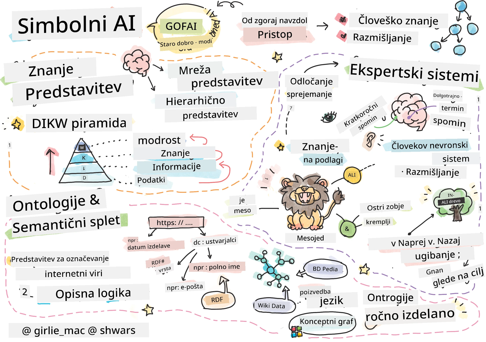
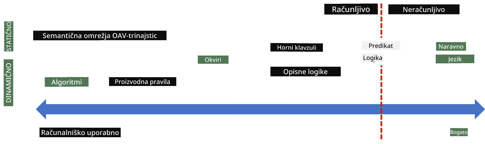
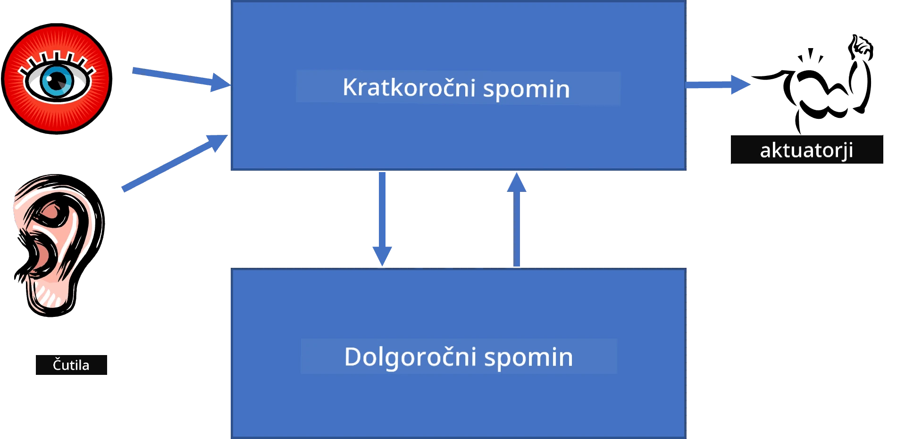
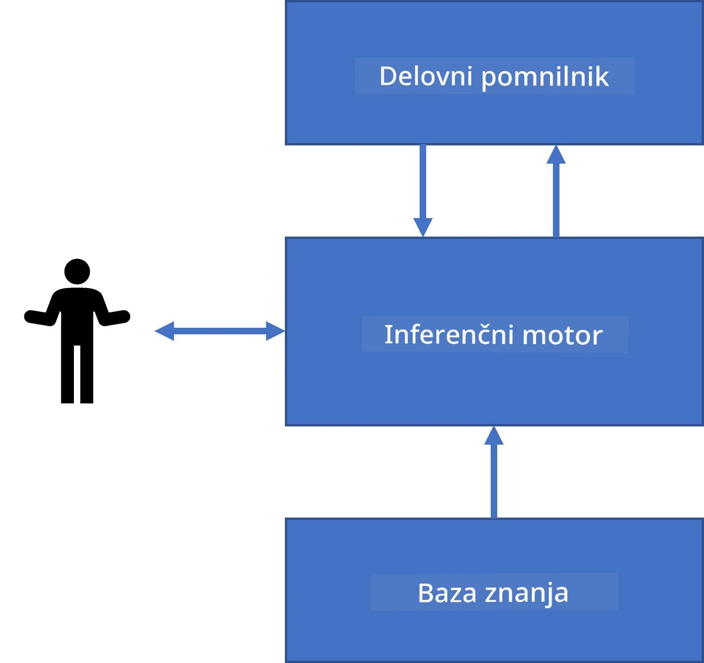
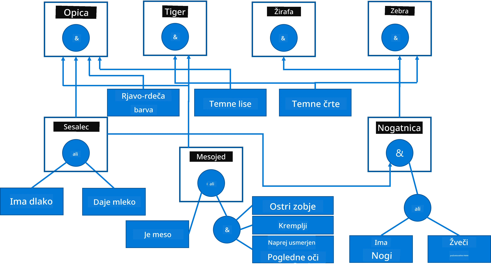
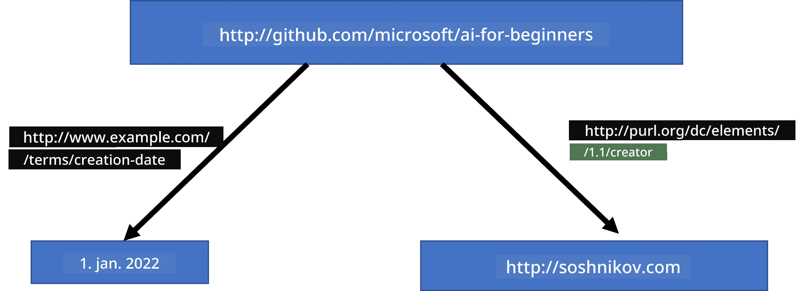
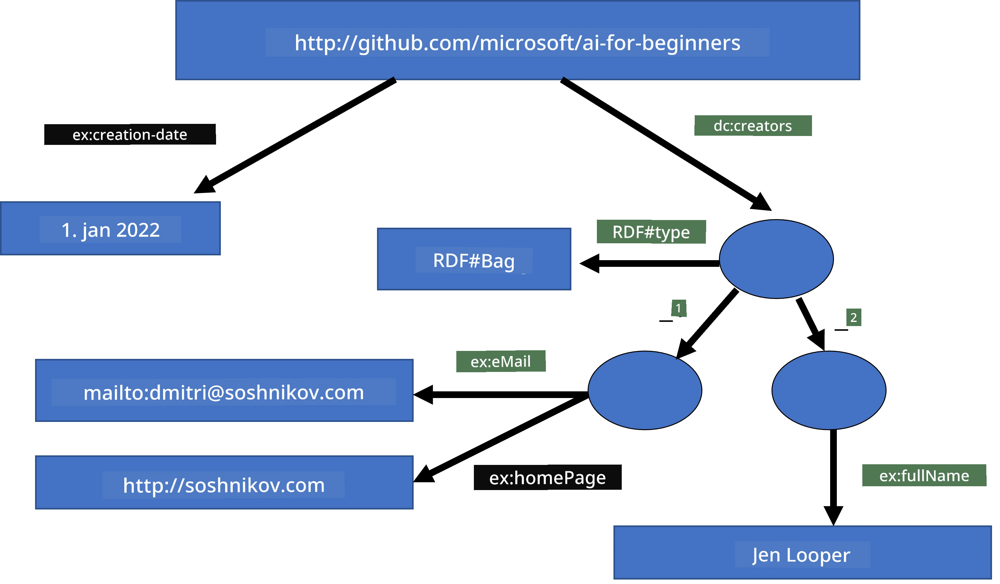
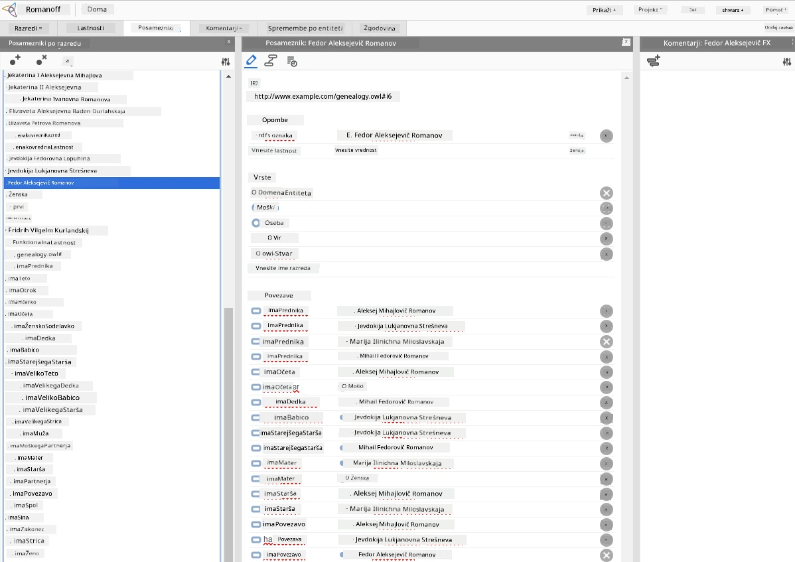

# Predstavitev znanja in ekspertni sistemi



> Sketchnote avtorice [Tomomi Imura](https://twitter.com/girlie_mac)

Iskanje umetne inteligence temelji na iskanju znanja, da bi razumeli svet podobno kot ljudje. Kako pa se lahko tega lotimo?

## [Predpredavanje kviz](https://ff-quizzes.netlify.app/en/ai/quiz/3)

V zgodnjih dneh umetne inteligence je bil priljubljen pristop od zgoraj navzdol za ustvarjanje inteligentnih sistemov (obravnavan v prejšnji lekciji). Ideja je bila pridobiti znanje od ljudi v neko obliko, ki jo lahko računalnik prebere, nato pa ga uporabiti za samodejno reševanje problemov. Ta pristop temelji na dveh velikih idejah:

* Predstavitev znanja
* Logično sklepanje

## Predstavitev znanja

Eden pomembnih konceptov v simbolični umetni inteligenci je **znanje**. Pomembno je razlikovati med znanjem in *informacijami* ali *podatki*. Na primer, lahko rečemo, da knjige vsebujejo znanje, ker jih lahko preučimo in postanemo strokovnjaki. Vendar pa knjige dejansko vsebujejo *podatke*, in s branjem knjig ter vključevanjem teh podatkov v naš svetovni model te podatke pretvarjamo v znanje.

> ✅ **Znanje** je nekaj, kar imamo v glavi in predstavlja naše razumevanje sveta. Pridobimo ga z aktivnim **učenjem**, ki integrira informacije, ki jih prejmemo, v naš aktiven svetovni model.

Večinoma znanja ne definiramo strogo, temveč ga povežemo z drugimi sorodnimi pojmi s pomočjo [piramide DIKW](https://en.wikipedia.org/wiki/DIKW_pyramid). Ta vsebuje naslednje pojme:

* **Podatki** so nekaj, kar je predstavljeno v fizičnih medijih, kot so pisni tekst ali izgovorjene besede. Podatki obstajajo neodvisno od ljudi in jih je mogoče prenašati med ljudmi.
* **Informacije** so kako interpretiramo podatke v naši glavi. Na primer, ko slišimo besedo *računalnik*, imamo nek vpogled, kaj je to.
* **Znanje** so informacije, integrirane v naš svetovni model. Na primer, ko se naučimo, kaj je računalnik, začnemo imeti predstave, kako deluje, koliko stane in za kaj se lahko uporablja. Ta mreža medsebojno povezanih pojmov tvori naše znanje.
* **Modrost** je še ena raven našega razumevanja sveta in predstavlja *meta-znanje*, npr. neko predstavo o tem, kako in kdaj naj se znanje uporabi.


*Slika [iz Wikipedije](https://commons.wikimedia.org/w/index.php?curid=37705247), avtor Longlivetheux - Lastno delo, CC BY-SA 4.0*

Torej je problem **predstavitve znanja** najti učinkovit način predstavljanja znanja znotraj računalnika v obliki podatkov, da bo samodejno uporabno. To lahko vidimo kot spekter:



> Slika avtorja [Dmitry Soshnikov](http://soshnikov.com)

* Na levi strani so zelo preprosti tipi predstavitev znanja, ki jih lahko računalniki učinkovito uporabljajo. Najenostavnejša je algoritemska predstavitev, ko je znanje predstavljeno z računalniškim programom. Vendar to ni najboljši način predstavljanja znanja, ker ni prilagodljiv. Znanje v naši glavi je pogosto nealgoritemsko.
* Na desni strani so predstavitve, kot je naravni tekst. To je najmočnejše, vendar ne uporabno za avtomatsko sklepanje.

> ✅ Razmislite za trenutek, kako znanje predstavljate v svoji glavi in ga pretvarjate v zapiske. Ali obstaja kakšen poseben format, ki vam dobro služi pri pomnjenju?

## Klasifikacija računalniških predstavitev znanja

Različne metode predstavitve znanja lahko uvrstimo v naslednje kategorije:

* **Mrežne predstavitve** temeljijo na dejstvu, da imamo v glavi mrežo medsebojno povezanih pojmov. Poskušamo ustvariti enake mreže kot graf znotraj računalnika – tako imenovano **semantično mrežo**.

1. **Objekt-Atribut-Vrednost trojčki** ali **par atribut-vrednost**. Ker lahko graf predstavimo v računalniku kot seznam vozlišč in povezav, lahko semantično mrežo predstavimo s seznamom trojčkov, ki vsebujejo objekte, atribute in vrednosti. Na primer, ustvarimo naslednje trojčke o programskih jezikih:

Objekt | Atribut | Vrednost
-------|---------|---------
Python | je | Nepojasnjen-Jezik
Python | izumil | Guido van Rossum
Python | sintaksa-bloka | zamik
Nepojasnjen-Jezik | nima | definicij tipov

> ✅ Premislite, kako bi lahko trojčke uporabili za predstavitev drugih vrst znanja.

2. **Hierarhične predstavitve** poudarjajo, da pogosto ustvarjamo hierarhijo objektov v naši glavi. Na primer, vemo, da je kanarček ptica, in vse ptice imajo krila. Prav tako imamo predstavo, katere barve je kanarček in kakšna je njegova hitrost letenja.

   - **Predstavitev okvirjev** temelji na predstavljanju vsakega objekta ali razreda objektov kot **okvirja**, ki vsebuje **reže**. Reže imajo privzete vrednosti, omejitve vrednosti ali shranjene procese, ki jih lahko pokličemo za pridobitev vrednosti reže. Vsi okvirji tvorijo hierarhijo, podobno hierarhiji objektov v objektno usmerjenih programskih jezikih.
   - **Scenariji** so posebna vrsta okvirjev, ki predstavljajo kompleksne situacije, ki se lahko razpletejo skozi čas.

**Python**

Reža | Vrednost | Privzeta vrednost | Interval
------|----------|-------------------|---------
Ime | Python | | |
Je-Kot | Nepojasnjen-Jezik | | |
Velikost Spremenljivke | | CamelCase | |
Dolžina programa | | | 5-5000 vrstic |
Sintaksa bloka | Zamik | | |

3. **Proceduralne predstavitve** temeljijo na predstavljanju znanja kot seznama dejanj, ki se izvajajo v določenih pogojih.
   - Produkcijska pravila so izjave če-potem, ki nam omogočajo sklepanje. Na primer, zdravnik ima pravilo, če ima pacient visoko vročino **ALI** visoko raven C-reaktivnega proteina v krvnem testu, **POTEM** ima vnetje. Ko je pogoj izpolnjen, naredimo sklep o vnetju in ga nato uporabimo v nadaljnjem sklepanju.
   - Algoritmi so lahko obravnavani kot druga oblika proceduralnih predstavitev, čeprav jih skoraj nikoli ne uporabljamo neposredno v sistemih, ki temeljijo na znanju.

4. **Logika** je bila prvotno predlagana od Aristotela kot način za predstavljanje univerzalnega človeškega znanja.
   - Predikatna logika kot matematična teorija je prebogata, da bi bila računsko obvladljiva, zato se navadno uporablja neki podnabor, kot so Hornove klavzule uporabljene v Prologu.
   - Deskriptivna logika je družina logičnih sistemov za predstavljanje in sklepanje o hierarhijah objektov in porazdeljenih predstavitvah znanja, kot je *semantični splet*.

## Ekspertni sistemi

Eden od zgodnjih uspehov simbolične umetne inteligence so bili tako imenovani **ekspertni sistemi** – računalniški sistemi, oblikovani za delovanje kot strokovnjak na omejenem področju. Temeljili so na **bazi znanja**, pridobljeni od enega ali več človeških strokovnjakov, in so vsebovali **inferenzni mehanizem**, ki je izvajal sklepanje na osnovi tega.

 | 
---------------------------------------------|------------------------------------------------
Poenostavljena struktura človeškega živčnega sistema | Arhitektura sistema na podlagi znanja

Ekspertni sistemi so zgrajeni podobno kot človeški sistem sklepanja, ki vsebuje **kratkoročni spomin** in **dolgoročni spomin**. Prav tako v sistemih na podlagi znanja ločimo naslednje komponente:

* **Spomin problema**: vsebuje znanje o problemu, ki se trenutno rešuje, npr. temperatura ali krvni tlak pacienta, ali ima vnetje ali ne itd. To znanje imenujemo tudi **statično znanje**, ker vsebuje trenutni posnetek tega, kar vemo o problemu – tako imenovano *stanje problema*.
* **Baza znanja**: predstavlja dolgoročno znanje o problemu. Je ročno pridobljena od strokovnjakov in se ne spreminja med posameznimi posveti. Ker omogoča premikanje med stanji problema, jo imenujemo tudi **dinamično znanje**.
* **Inferenzni mehanizem**: vodi celoten proces iskanja v prostoru stanj problema in postavlja vprašanja uporabniku po potrebi. Prav tako je odgovoren za izbiro pravil, ki se uporabijo v posameznih stanjih.

Kot primer si poglejmo ekspertni sistem za določanje živali na podlagi fizičnih lastnosti:



> Slika avtorja [Dmitry Soshnikov](http://soshnikov.com)

Ta diagram imenujemo **AND-OR drevo**, in je grafična predstavitev nabora produkcijskih pravil. Risanje drevesa je koristno na začetku procesa pridobivanja znanja od strokovnjaka. Za predstavitev znanja znotraj računalnika pa je bolj priročno uporabiti pravila:

```
IF the animal eats meat
OR (animal has sharp teeth
    AND animal has claws
    AND animal has forward-looking eyes
) 
THEN the animal is a carnivore
```

Opazimo lahko, da so vsak pogoj na levi strani pravila in ukrep v bistvu trojčki objekt-atribut-vrednost (OAV). **Delovni spomin** vsebuje množico OAV trojčkov, ki ustrezajo problemu, ki se trenutno rešuje. **Stroj pravil** išče pravila, katerih pogoj je izpolnjen, in jih uporabi, dodajajoč nov trojček v delovni spomin.

> ✅ Napišite svoje AND-OR drevo na katerokoli temo, ki vas zanima!

### Napredno (forward) proti nazadnjemu (backward) sklepanju

Opisani proces imenujemo **napredno sklepanja**. Začne se z začetnimi podatki o problemu v delovnem spominu in izvaja naslednjo zanko sklepanja:

1. Če je ciljna lastnost prisotna v delovnem spominu – ustavi se in da rezultat
2. Poišči vsa pravila, katerih pogoj je trenutno izpolnjen – dobljen je **množica konfliktov** pravil.
3. Izvedi **reševanje konflikta** – izberi eno pravilo, ki bo izvršeno v tej iteraciji. Obstaja več strategij za reševanje konflikta:
   - Izberi prvo pravilo, ki se lahko uporabi iz baze znanja
   - Izberi naključno pravilo
   - Izberi *bolj specifično* pravilo, torej tisto, ki izpolnjuje največ pogojev na levi strani (LHS)
4. Uporabi izbrano pravilo in vstavi nov del znanja v stanje problema
5. Ponovi od koraka 1.

Vendar pa v nekaterih primerih želimo začeti z mankom znanja o problemu in zastavljati vprašanja, ki nam pomagajo priti do zaključka. Na primer, pri medicinski diagnozi običajno ne opravimo vseh analiz vnaprej, ampak jih opravimo postopoma, ko je treba sprejeti odločitev.

Ta proces lahko modeliramo s **nazadnjim sklepanjem**. To se vodi z **ciljem** – atributno vrednostjo, ki jo želimo najti:

1. Izberi vsa pravila, ki nam lahko dajo vrednost cilja (torej tista, kjer je cilj na desni strani pravila, RHS) – množica konfliktov
1. Če ni pravila za ta atribut ali obstaja pravilo, ki določa, da na vrednost vprašamo uporabnika – vprašaj uporabnika, sicer:
1. Uporabi strategijo reševanja konfliktov in izberi eno pravilo, ki ga bomo uporabili kot *hipotezo* – skušali jo bomo dokazati
1. Rekurzivno ponovi postopek za vse atribute na levi strani pravila, skušajoč jih dokazati kot cilje
1. Če proces kje zatakne – uporabi drugo pravilo v koraku 3.

> ✅ V katerih primerih je napredno sklepanje primernejše? Kakšno vlogo ima nazadnje sklepanje?

### Implementacija ekspertnih sistemov

Ekspertni sistemi se lahko implementirajo z različnimi orodji:

* Programiranje neposredno v visokoraven programski jezik. To ni najboljša ideja, ker glavna prednost sistema na podlagi znanja je ločitev znanja od sklepanja, in strokovnjak bi moral lahko pisati pravila brez razumevanja podrobnosti sklepanja.
* Uporaba **shell-a za ekspertne sisteme**, tj. sistema, posebej zasnovanega za vnos znanja z uporabo nekega jezika za predstavitev znanja.

## ✍️ Vaja: Sklepanje o živalih

Oglejte si [Animals.ipynb](https://github.com/microsoft/AI-For-Beginners/blob/main/lessons/2-Symbolic/Animals.ipynb) za primer implementacije ekspertnega sistema s naprednim in nazadnjim sklepanjem.

> **Opomba**: Ta primer je dokaj enostaven in daje zgolj idejo, kako izgleda ekspertni sistem. Ko začnete ustvarjati tak sistem, boste opazili *inteligentno* vedenje šele, ko dosežete določeno število pravil, nekje več kot 200+. V neki točki pravila postanejo preveč zapletena, da bi jih vse shranili v spomin, in v tem trenutku se boste morda spraševali, zakaj sistem sprejema določene odločitve. Vendar pa je pomembna lastnost sistemov na podlagi znanja, da vedno lahko *razložite*, kako so bile sprejete odločitve.

## Ontologije in Semantični splet

Ob koncu 20. stoletja je bila pobuda uporabe predstavitve znanja za označevanje internetnih virov, da bi bilo mogoče najti vire, ki ustrezajo zelo specifičnim poizvedbam. Ta pobuda se imenuje **Semantični splet** in temelji na več konceptih:

- Posebna predstavitev znanja, ki temelji na **[deskriptivni logiki](https://en.wikipedia.org/wiki/Description_logic)** (DL). Podobna je predstavitvi okvirjev, ker gradi hierarhijo objektov s lastnostmi, vendar ima formalno logično semantiko in sklepanje. Obstaja cela družina DL-jev, ki uravnotežujejo med izraznostjo in algoritmično kompleksnostjo sklepanja.
- Porazdeljena predstavitev znanja, kjer so vsi pojmi predstavljeni z globalnim URI identifikatorjem, kar omogoča ustvarjanje hierarhij znanja, ki segajo čez internet.
- Družina jezikov, temelječih na XML za opis znanja: RDF (Resource Description Framework), RDFS (RDF shema), OWL (Ontology Web Language).

Osrednji koncept v Semantičnem spletu je koncept **ontologije**. Nanaša se na eksplicitno specifikacijo problematičnega področja z uporabo formalne predstavitve znanja. Najpreprostejša ontologija je lahko le hierarhija objektov znotraj problematičnega področja, vendar kompleksnejše ontologije vključujejo pravila, ki jih lahko uporabimo za sklepanja.

V semantičnem spletu so vse predstavitve osnovane na trojicah. Vsak objekt in vsak odnos sta enolično določena z URI. Na primer, če želimo navesti dejstvo, da je bil ta AI kurikulum razvit s strani Dmitryja Soshnikova 1. januarja 2022, lahko uporabimo naslednje trojice:



```
http://github.com/microsoft/ai-for-beginners http://www.example.com/terms/creation-date “Jan 1, 2022”
http://github.com/microsoft/ai-for-beginners http://purl.org/dc/elements/1.1/creator http://soshnikov.com
```

> ✅ Tukaj sta `http://www.example.com/terms/creation-date` in `http://purl.org/dc/elements/1.1/creator` dobro znana in univerzalno sprejeta URI za izražanje pojmov *ustvarjalec* in *datum nastanka*.

V bolj zapletenem primeru, če želimo definirati seznam ustvarjalcev, lahko uporabimo nekatere podatkovne strukture, definirane v RDF.



> Diagrami zgoraj avtorja [Dmitry Soshnikov](http://soshnikov.com)

Napredek pri gradnji Semantičnega spleta je bil nekako upočasnjen zaradi uspeha iskalnikov in tehnik za obdelavo naravnega jezika, ki omogočajo izluščitev strukturiranih podatkov iz besedil. Kljub temu na nekaterih področjih še vedno potekajo pomembna prizadevanja za vzdrževanje ontologij in baz znanja. Nekaj projektov, vrednih omembe:

* [WikiData](https://wikidata.org/) je zbirka strojno berljivih baz znanja, povezanih z Wikipedijo. Večina podatkov je izkopanih iz *InfoBoxov* v Wikipediji, kosov strukturirane vsebine na straneh Wikipedije. S wikidatami lahko [poizvedujete](https://query.wikidata.org/) v SPARQL, posebnem poizvedbenem jeziku za Semantični splet. Tukaj je vzorčna poizvedba, ki prikaže najbolj priljubljene barve oči med ljudmi:

```sparql
#defaultView:BubbleChart
SELECT ?eyeColorLabel (COUNT(?human) AS ?count)
WHERE
{
  ?human wdt:P31 wd:Q5.       # human instance-of homo sapiens
  ?human wdt:P1340 ?eyeColor. # human eye-color ?eyeColor
  SERVICE wikibase:label { bd:serviceParam wikibase:language "en". }
}
GROUP BY ?eyeColorLabel
```

* [DBpedia](https://www.dbpedia.org/) je še eno podobno prizadevanje kot WikiData.

> ✅ Če želite eksperimentirati z gradnjo lastnih ontologij ali odpiranjem obstoječih, obstaja odličen vizualni urejevalnik ontologij, imenovan [Protégé](https://protege.stanford.edu/). Prenesite ga ali uporabite na spletu.



*Web urejevalnik Protégé odprt z ontologijo družine Romanovih. Posnetek zaslona avtor Dmitry Soshnikov*

## ✍️ Vaja: Ontologija družine


Oglejte si [FamilyOntology.ipynb](https://github.com/Ezana135/AI-For-Beginners/blob/main/lessons/2-Symbolic/FamilyOntology.ipynb) za primer uporabe tehnik Semantičnega spleta za sklepanja o družinskih odnosih. Vzeli bomo družinsko drevo, predstavljeno v običajnem formatu GEDCOM, in ontologijo družinskih odnosov ter zgradili graf vseh družinskih povezav za dano množico posameznikov.

## Microsoft Concept Graph

V večini primerov so ontologije skrbno ročno ustvarjene. Vendar pa je tudi možno **izluščiti** ontologije iz nestrukturiranih podatkov, na primer iz besedil naravnega jezika.

Tak poskus je izvedel Microsoft Research, ki je rezultiral v [Microsoft Concept Graph](https://blogs.microsoft.com/ai/microsoft-researchers-release-graph-that-helps-machines-conceptualize/?WT.mc_id=academic-77998-cacaste).

To je velika zbirka entitet, združenih skupaj z uporabo dednega odnosa `je vrstniški` (is-a). Omogoča odgovore na vprašanja, kot je "Kaj je Microsoft?" - odgovor pa je nekaj v smislu "podjetje s pripadnostjo verjetnosti 0.87 in blagovna znamka s pripadnostjo verjetnosti 0.75".

Graf je na voljo bodisi kot REST API, bodisi kot velika prenosljiva besedilna datoteka, ki navaja vse pare entitet.

## ✍️ Vaja: Konceptualni graf

Preizkusite beležko [MSConceptGraph.ipynb](https://github.com/microsoft/AI-For-Beginners/blob/main/lessons/2-Symbolic/MSConceptGraph.ipynb) in si oglejte, kako lahko uporabimo Microsoft Concept Graph za združevanje novičarskih člankov v več kategorij.

## Zaključek

Danes se AI pogosto obravnava kot sopomenka za *strojno učenje* ali *nevralne mreže*. Vendar pa tudi človek izvaja eksplicitno sklepanje, ki ga trenutno nevralne mreže ne obdelujejo. V resničnih projektih se eksplicitno sklepanje še vedno uporablja za izvajanje nalog, ki zahtevajo razlage ali možnost nadzorovane spremembe vedenja sistema.

## 🚀 Izziv

V beležki Ontologija družine, povezani s to lekcijo, je možnost eksperimentiranja z drugimi družinskimi povezavami. Poskusite odkriti nove povezave med ljudmi v družinskem drevesu.

## [Preizkus po predavanju](https://ff-quizzes.netlify.app/en/ai/quiz/4)

## Pregled in samostojno učenje

Raziskujte po internetu, da odkrijete področja, kjer so ljudje poskušali kvantificirati in kodificirati znanje. Oglejte si Bloomovo taksonomijo in se vrnite nazaj v zgodovino, da spoznate, kako so ljudje poskušali razumeti svoj svet. Raziščite delo Linnaeusa pri ustvarjanju taksonomije organizmov in opazujte, kako je Dmitrij Mendelejev ustvaril način za opisovanje in razvrščanje kemičnih elementov. Katere druge zanimive primere lahko najdete?

**Naloga**: [Izdelajte ontologijo](assignment.md)

---

<!-- CO-OP TRANSLATOR DISCLAIMER START -->
**Izjava o omejitvi odgovornosti**:
Ta dokument je bil preveden z uporabo storitve za strojno prevajanje [Co-op Translator](https://github.com/Azure/co-op-translator). Čeprav si prizadevamo za natančnost, vas prosimo, da upoštevate, da lahko avtomatizirani prevodi vsebujejo napake ali netočnosti. Izvirni dokument v njegovem izvirnem jeziku šteje kot avtoritativni vir. Za kritične informacije priporočamo strokovni človeški prevod. Ne odgovarjamo za morebitne nesporazume ali napačne razlage, ki izhajajo iz uporabe tega prevoda.
<!-- CO-OP TRANSLATOR DISCLAIMER END -->