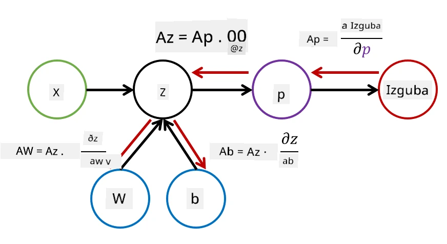

# Uvod v nevronske mreže. Večplastni perceptron

V prejšnjem poglavju ste spoznali najpreprostejši model nevronske mreže - enoplastni perceptron, linearen model za klasifikacijo dveh razredov.

V tem poglavju bomo ta model razširili v bolj prilagodljiv okvir, ki nam omogoča:

* izvajanje **klasifikacije več razredov** poleg klasifikacije dveh razredov
* reševanje **regresijskih problemov** poleg klasifikacije
* ločevanje razredov, ki niso linearno ločljivi

Prav tako bomo razvili svoj modularni okvir v Pythonu, ki nam bo omogočil sestavljanje različnih arhitektur nevronskih mrež.

## [Predavanje kviz](https://ff-quizzes.netlify.app/en/ai/quiz/7)

## Formalizacija strojnega učenja

Začnimo s formalizacijo problema strojnega učenja. Predpostavimo, da imamo učni podatkovni niz **X** z oznakami **Y**, in moramo zgraditi model *f*, ki bo zagotavljal najbolj natančne napovedi. Kakovost napovedi merimo z **funkcijo izgube** &lagran;. Pogosto uporabljene funkcije izgube so:

* Pri regresijskem problemu, ko moramo napovedati število, lahko uporabimo **absolutno napako** &sum;i|f(x(i))-y(i)| ali **kvadratno napako** &sum;i(f(x(i))-y(i))2
* Pri klasifikaciji uporabljamo **0-1 izgubo** (ki je v bistvu enaka **natančnosti** modela) ali **logistično izgubo**.

Pri enoplastnem perceptronu je bila funkcija *f* definirana kot linearna funkcija *f(x)=wx+b* (kjer je *w* matrika uteži, *x* je vektor vhodnih značilnosti, in *b* je vektor pristranskosti). Pri različnih arhitekturah nevronskih mrež lahko ta funkcija prevzame bolj zapleteno obliko.

> Pri klasifikaciji je pogosto zaželeno, da kot izhod mreže dobimo verjetnosti ustreznih razredov. Za pretvorbo poljubnih števil v verjetnosti (npr. za normalizacijo izhoda) pogosto uporabljamo funkcijo **softmax** &sigma;, in funkcija *f* postane *f(x)=&sigma;(wx+b)*.

V zgornji definiciji *f* sta *w* in *b* imenovana **parametra** &theta;=⟨*w,b*⟩. Glede na podatkovni niz ⟨**X**,**Y**⟩ lahko izračunamo skupno napako na celotnem podatkovnem nizu kot funkcijo parametrov &theta;.

> ✅ **Cilj učenja nevronske mreže je zmanjšati napako z variiranjem parametrov &theta;**

## Optimizacija z gradientnim spustom

Obstaja dobro poznana metoda optimizacije funkcij, imenovana **gradientni spust**. Ideja je, da lahko izračunamo odvod (v večdimenzionalnem primeru imenovan **gradient**) funkcije izgube glede na parametre in spreminjamo parametre tako, da se napaka zmanjša. To lahko formaliziramo na naslednji način:

* Inicializiramo parametre z naključnimi vrednostmi w(0), b(0)
* Večkrat ponovimo naslednji korak:
    - w(i+1) = w(i)-&eta;&part;&lagran;/&part;w
    - b(i+1) = b(i)-&eta;&part;&lagran;/&part;b

Med učenjem naj bi se koraki optimizacije izračunavali glede na celoten podatkovni niz (spomnite se, da se izguba izračuna kot vsota skozi vse učne vzorce). V praksi pa vzamemo majhne dele podatkovnega niza, imenovane **minibatchi**, in izračunamo gradiente na podlagi podmnožice podatkov. Ker je podmnožica vsakič izbrana naključno, se takšna metoda imenuje **stohastični gradientni spust** (SGD).

## Večplastni perceptroni in povratno razširjanje

Enoplastna mreža, kot smo videli zgoraj, je sposobna klasificirati linearno ločljive razrede. Za gradnjo bogatejšega modela lahko združimo več plasti mreže. Matematično to pomeni, da bo funkcija *f* imela bolj zapleteno obliko in bo izračunana v več korakih:
* z1=w1x+b1
* z2=w2&alpha;(z1)+b2
* f = &sigma;(z2)

Tu je &alpha; **nelinearna aktivacijska funkcija**, &sigma; je funkcija softmax, in parametri &theta;=<*w1,b1,w2,b2*>.

Algoritem gradientnega spusta ostane enak, vendar je izračun gradientov bolj zahteven. Glede na pravilo verižnega diferenciiranja lahko izračunamo odvode kot:

* &part;&lagran;/&part;w2 = (&part;&lagran;/&part;&sigma;)(&part;&sigma;/&part;z2)(&part;z2/&part;w2)
* &part;&lagran;/&part;w1 = (&part;&lagran;/&part;&sigma;)(&part;&sigma;/&part;z2)(&part;z2/&part;&alpha;)(&part;&alpha;/&part;z1)(&part;z1/&part;w1)

> ✅ Pravilo verižnega diferenciiranja se uporablja za izračun odvoda funkcije izgube glede na parametre.

Opazite, da je skrajno levi del vseh teh izrazov enak, zato lahko učinkovito izračunamo odvode, začenši s funkcijo izgube in gremo "nazaj" skozi računski graf. Zato se metoda učenja večplastnega perceptrona imenuje **povratno razširjanje** ali 'backprop'.

> TODO: navedba vira slike

> ✅ Povratno razširjanje bomo podrobneje obravnavali v našem zvezku z zgledom.  

## Zaključek

V tej lekciji smo zgradili svojo knjižnico nevronskih mrež in jo uporabili za preprosto nalogo klasifikacije v dveh dimenzijah.

## 🚀 Izziv

V priloženem zvezku boste implementirali svoj okvir za gradnjo in učenje večplastnih perceptronov. Podrobno boste lahko videli, kako delujejo sodobne nevronske mreže.

Nadaljujte z zvezkom [OwnFramework](OwnFramework.ipynb) in ga preučite.

## [Kviz po predavanju](https://ff-quizzes.netlify.app/en/ai/quiz/8)

## Pregled in samostojno učenje

Povratno razširjanje je pogost algoritem, ki se uporablja v AI in ML, vredno ga je [podrobneje preučiti](https://wikipedia.org/wiki/Backpropagation).

## [Naloga](lab/README.md)

V tej laboratorijski nalogi boste uporabili okvir, ki ste ga zgradili v tej lekciji, za reševanje klasifikacije ročno napisanih številk MNIST.

* [Navodila](lab/README.md)
* [Zvezek](lab/MyFW_MNIST.ipynb)

---

