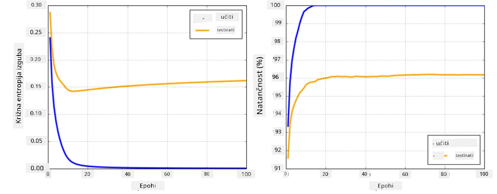

# Okvirji za nevronske mreže

Kot smo že spoznali, za učinkovito učenje nevronskih mrež moramo narediti dve stvari:

* Operirati na tenzorjih, npr. množiti, seštevati in izračunavati funkcije, kot sta sigmoid ali softmax
* Izračunati gradient vseh izrazov, da lahko izvedemo optimizacijo z gradientnim spustom

## [Predhodni kviz](https://ff-quizzes.netlify.app/en/ai/quiz/9)

Medtem ko knjižnica `numpy` omogoča prvo nalogo, potrebujemo mehanizem za izračun gradientov. V [našem okviru](../04-OwnFramework/OwnFramework.ipynb), ki smo ga razvili v prejšnjem poglavju, smo morali ročno programirati vse funkcije za odvode znotraj metode `backward`, ki izvaja povratno propagacijo. Idealno bi bilo, da nam okvir omogoča izračun gradientov *kateregakoli izraza*, ki ga lahko definiramo.

Druga pomembna stvar je možnost izvajanja izračunov na GPU ali drugih specializiranih enotah, kot je [TPU](https://en.wikipedia.org/wiki/Tensor_Processing_Unit). Učenje globokih nevronskih mrež zahteva *zelo veliko* izračunov, zato je sposobnost paralelizacije teh izračunov na GPU-jih zelo pomembna.

> ✅ Izraz 'paralelizacija' pomeni razdelitev izračunov na več naprav.

Trenutno sta najbolj priljubljena okvira za nevronske mreže: [TensorFlow](http://TensorFlow.org) in [PyTorch](https://pytorch.org/). Oba ponujata nizkonivojski API za delo s tenzorji na CPU in GPU. Poleg nizkonivojskega API-ja obstaja tudi visok nivojski API, imenovan [Keras](https://keras.io/) in [PyTorch Lightning](https://pytorchlightning.ai/).

Nizkonivojski API | [TensorFlow](http://TensorFlow.org) | [PyTorch](https://pytorch.org/)
------------------|-------------------------------------|--------------------------------
Visokonivojski API| [Keras](https://keras.io/) | [PyTorch Lightning](https://pytorchlightning.ai/)

**Nizkonivojski API-ji** v obeh okvirjih omogočajo gradnjo tako imenovanih **računalniških grafov**. Ta graf definira, kako izračunati rezultat (običajno funkcijo izgube) z danimi vhodnimi parametri, in ga je mogoče prenesti na GPU za izračun, če je na voljo. Obstajajo funkcije za diferenciacijo tega računalniškega grafa in izračun gradientov, ki jih je nato mogoče uporabiti za optimizacijo parametrov modela.

**Visokonivojski API-ji** obravnavajo nevronske mreže kot **zaporedje slojev** in omogočajo enostavnejšo konstrukcijo večine nevronskih mrež. Učenje modela običajno zahteva pripravo podatkov in nato klic funkcije `fit`, ki opravi delo.

Visokonivojski API omogoča hitro konstrukcijo tipičnih nevronskih mrež brez skrbi za številne podrobnosti. Hkrati pa nizkonivojski API ponuja veliko več nadzora nad procesom učenja, zato se pogosto uporablja v raziskavah, ko se ukvarjamo z novimi arhitekturami nevronskih mrež.

Pomembno je tudi razumeti, da lahko oba API-ja uporabljamo skupaj, npr. lahko razvijemo svojo arhitekturo sloja mreže z nizkonivojskim API-jem in jo nato uporabimo znotraj večje mreže, ki je bila zgrajena in naučena z visokonivojskim API-jem. Lahko pa definiramo mrežo z visokonivojskim API-jem kot zaporedje slojev in nato uporabimo svoj nizkonivojski učni zanki za optimizacijo. Oba API-ja uporabljata iste osnovne koncepte in sta zasnovana tako, da dobro sodelujeta.

## Učenje

V tem tečaju ponujamo večino vsebine tako za PyTorch kot za TensorFlow. Izberete lahko svoj najljubši okvir in se osredotočite le na ustrezne zvezke. Če niste prepričani, kateri okvir izbrati, preberite nekaj razprav na internetu o **PyTorch vs. TensorFlow**. Lahko si tudi ogledate oba okvira, da pridobite boljše razumevanje.

Kjer je mogoče, bomo za enostavnost uporabljali visokonivojske API-je. Vendar pa verjamemo, da je pomembno razumeti, kako nevronske mreže delujejo od temeljev naprej, zato na začetku začnemo z nizkonivojskim API-jem in tenzorji. Če pa želite hitro začeti in ne želite porabiti veliko časa za učenje teh podrobnosti, lahko te preskočite in se takoj osredotočite na zvezke z visokonivojskim API-jem.

## ✍️ Naloge: Okvirji

Nadaljujte z učenjem v naslednjih zvezkih:

Nizkonivojski API | [TensorFlow+Keras Notebook](IntroKerasTF.ipynb) | [PyTorch](IntroPyTorch.ipynb)
------------------|-------------------------------------|--------------------------------
Visokonivojski API| [Keras](IntroKeras.ipynb) | *PyTorch Lightning*

Ko obvladate okvirje, si poglejmo koncept prenaučenja.

# Prenaučenje

Prenaučenje je izjemno pomemben koncept v strojnem učenju, zato je zelo pomembno, da ga pravilno razumemo!

Razmislimo o naslednjem problemu približevanja 5 točk (predstavljenih z `x` na spodnjih grafih):

 | 
-------------------------|--------------------------
**Linearen model, 2 parametra** | **Nelinearen model, 7 parametrov**
Napaka pri učenju = 5.3 | Napaka pri učenju = 0
Napaka pri validaciji = 5.1 | Napaka pri validaciji = 20

* Na levi vidimo dobro približanje s premico. Ker je število parametrov ustrezno, model pravilno razume razporeditev točk.
* Na desni je model preveč zmogljiv. Ker imamo le 5 točk in model ima 7 parametrov, se lahko prilagodi tako, da gre skozi vse točke, kar povzroči, da je napaka pri učenju 0. Vendar pa to preprečuje modelu, da bi razumel pravilni vzorec podatkov, zato je napaka pri validaciji zelo visoka.

Zelo pomembno je najti pravo ravnovesje med kompleksnostjo modela (številom parametrov) in številom učnih vzorcev.

## Zakaj pride do prenaučenja

  * Premalo učnih podatkov
  * Preveč zmogljiv model
  * Preveč šuma v vhodnih podatkih

## Kako zaznati prenaučenje

Kot lahko vidite na zgornjem grafu, lahko prenaučenje zaznamo z zelo nizko napako pri učenju in visoko napako pri validaciji. Običajno med učenjem vidimo, da se napake pri učenju in validaciji zmanjšujejo, nato pa se v nekem trenutku napaka pri validaciji preneha zmanjševati in začne naraščati. To bo znak prenaučenja in indikator, da bi morali verjetno ustaviti učenje (ali vsaj narediti posnetek modela).

## Kako preprečiti prenaučenje

Če opazite, da pride do prenaučenja, lahko storite naslednje:

 * Povečajte količino učnih podatkov
 * Zmanjšajte kompleksnost modela
 * Uporabite kakšno [tehniko regularizacije](../../4-ComputerVision/08-TransferLearning/TrainingTricks.md), kot je [Dropout](../../4-ComputerVision/08-TransferLearning/TrainingTricks.md#Dropout), ki jo bomo obravnavali kasneje.

## Prenaučenje in kompromis med pristranskostjo in varianco

Prenaučenje je pravzaprav primer bolj splošnega problema v statistiki, imenovanega [kompromis med pristranskostjo in varianco](https://en.wikipedia.org/wiki/Bias%E2%80%93variance_tradeoff). Če razmislimo o možnih virih napak v našem modelu, lahko vidimo dva tipa napak:

* **Napake zaradi pristranskosti** nastanejo, ker naš algoritem ne more pravilno zajeti odnosa med učnimi podatki. To je lahko posledica dejstva, da naš model ni dovolj zmogljiv (**podnaučenje**).
* **Napake zaradi variance**, ki nastanejo, ker model približuje šum v vhodnih podatkih namesto smiselnega odnosa (**prenaučenje**).

Med učenjem se napake zaradi pristranskosti zmanjšujejo (ker se naš model uči približevati podatke), medtem ko se napake zaradi variance povečujejo. Pomembno je ustaviti učenje - bodisi ročno (ko zaznamo prenaučenje) bodisi samodejno (z uvedbo regularizacije) - da preprečimo prenaučenje.

## Zaključek

V tej lekciji ste spoznali razlike med različnimi API-ji za dva najbolj priljubljena AI okvirja, TensorFlow in PyTorch. Poleg tega ste spoznali zelo pomembno temo, prenaučenje.

## 🚀 Izziv

V priloženih zvezkih boste našli 'naloge' na dnu; preglejte zvezke in dokončajte naloge.

## [Kviz po predavanju](https://ff-quizzes.netlify.app/en/ai/quiz/10)

## Pregled in samostojno učenje

Raziskujte naslednje teme:

- TensorFlow
- PyTorch
- Prenaučenje

Vprašajte se naslednja vprašanja:

- Kakšna je razlika med TensorFlow in PyTorch?
- Kakšna je razlika med prenaučenjem in podnaučenjem?

## [Naloga](lab/README.md)

V tej nalogi boste reševali dve klasifikacijski nalogi z uporabo enoslojnih in večslojnih popolnoma povezanih mrež z uporabo PyTorch ali TensorFlow.

* [Navodila](lab/README.md)
* [Zvezek](lab/LabFrameworks.ipynb)

---

