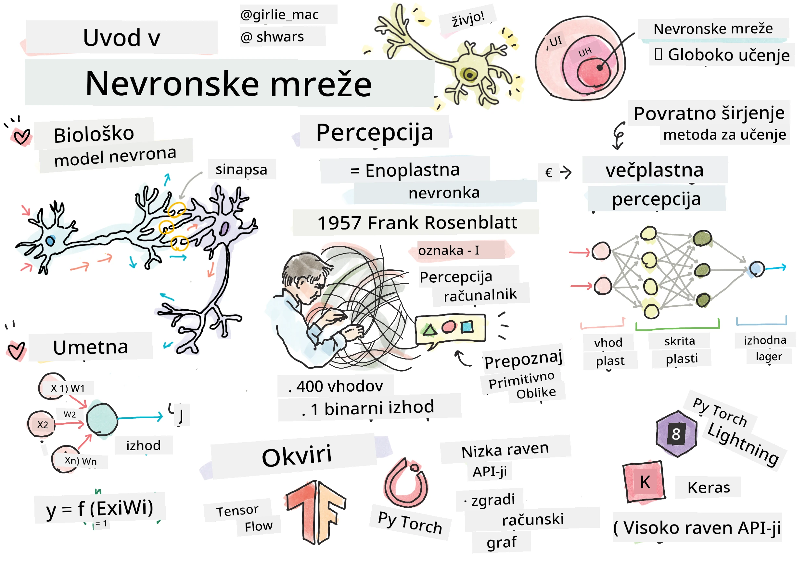
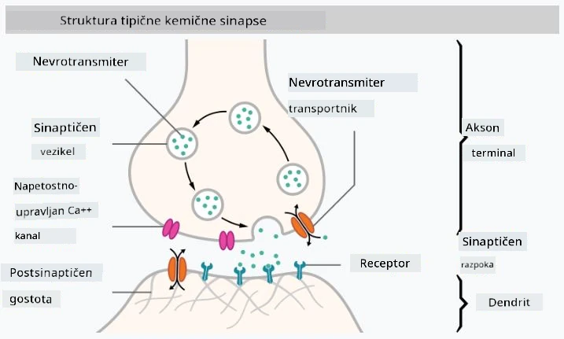

# Uvod v nevronske mreže

Kot smo razpravljali v uvodu, je eden od načinov za dosego inteligence treniranje **računalniškega modela** ali **umetnih možganov**. Od sredine 20. stoletja so raziskovalci preizkušali različne matematične modele, dokler se v zadnjih letih ta smer ni izkazala za izjemno uspešno. Takšni matematični modeli možganov se imenujejo **nevronske mreže**.

> Včasih se nevronske mreže imenujejo *Umetne nevronske mreže* (Artificial Neural Networks, ANNs), da bi poudarili, da govorimo o modelih, ne o pravih mrežah nevronov.

## Strojno učenje

Nevronske mreže so del širše discipline, imenovane **Strojno učenje**, katere cilj je uporaba podatkov za treniranje računalniških modelov, ki so sposobni reševati probleme. Strojno učenje predstavlja velik del umetne inteligence, vendar v tem učnem načrtu ne pokrivamo klasičnega strojnega učenja.

> Obiščite naš ločen učni načrt **[Strojno učenje za začetnike](http://github.com/microsoft/ml-for-beginners)**, da se naučite več o klasičnem strojnem učenju.

Pri strojnem učenju predpostavljamo, da imamo nek nabor podatkov primerov **X** in ustrezne izhodne vrednosti **Y**. Primeri so pogosto N-dimenzionalni vektorji, ki vsebujejo **značilnosti**, izhodi pa se imenujejo **oznake**.

Obravnavali bomo dve najpogostejši težavi strojnega učenja:

* **Klasifikacija**, kjer moramo razvrstiti vhodni objekt v dva ali več razredov.
* **Regresija**, kjer moramo za vsak vhodni vzorec napovedati številčno vrednost.

> Pri predstavljanju vhodov in izhodov kot tenzorjev je vhodni nabor podatkov matrika velikosti M&times;N, kjer je M število vzorcev, N pa število značilnosti. Izhodne oznake Y so vektor velikosti M.

V tem učnem načrtu se bomo osredotočili le na modele nevronskih mrež.

## Model nevrona

Iz biologije vemo, da naši možgani sestojijo iz nevralnih celic (nevronov), od katerih ima vsaka več "vhodov" (dendritov) in en "izhod" (akson). Tako dendriti kot aksoni lahko prenašajo električne signale, povezave med njimi — znane kot sinapse — pa lahko kažejo različne stopnje prevodnosti, ki jih uravnavajo nevrotransmiterji.

 | 
----|----
Pravi nevron *([Slika](https://en.wikipedia.org/wiki/Synapse#/media/File:SynapseSchematic_lines.svg) iz Wikipedije)* | Umetni nevron *(Slika avtorja)*

Tako najpreprostejši matematični model nevrona vsebuje več vhodov X1, ..., XN in en izhod Y ter vrsto uteži W1, ..., WN. Izhod se izračuna kot:

kjer je f neka nelinearna **aktivacijska funkcija**.

> Zgodnji modeli nevrona so bili opisani v klasičnem članku [A logical calculus of the ideas immanent in nervous activity](https://www.cs.cmu.edu/~./epxing/Class/10715/reading/McCulloch.and.Pitts.pdf) avtorjev Warrena McCullocka in Walterja Pittsa leta 1943. Donald Hebb je v svoji knjigi "[The Organization of Behavior: A Neuropsychological Theory](https://books.google.com/books?id=VNetYrB8EBoC)" predlagal način, kako bi te mreže lahko trenirali.

## V tem poglavju

V tem poglavju se bomo naučili o:
* [Perceptronu](03-Perceptron/README.md), enem najzgodnejših modelov nevronskih mrež za klasifikacijo z dvema razredoma
* [Večplastnih mrežah](04-OwnFramework/README.md) z dodatnim zvezkom [kako zgraditi svoj okvir](04-OwnFramework/OwnFramework.ipynb)
* [Okvirih nevronskih mrež](05-Frameworks/README.md), z naslednjimi zvezki: [PyTorch](05-Frameworks/IntroPyTorch.ipynb) in [Keras/Tensorflow](05-Frameworks/IntroKerasTF.ipynb)
* [Prenaučenju](../../../../lessons/3-NeuralNetworks/05-Frameworks)

---

**Izjava o omejitvi odgovornosti**:  
Ta dokument je bil preveden z uporabo storitve za strojno prevajanje [Co-op Translator](https://github.com/Azure/co-op-translator). Čeprav si prizadevamo za natančnost, vas prosimo, da upoštevate, da lahko avtomatizirani prevodi vsebujejo napake ali netočnosti. Izvirni dokument v njegovem izvirnem jeziku je treba obravnavati kot avtoritativni vir. Za ključne informacije priporočamo strokovno človeško prevajanje. Ne prevzemamo odgovornosti za morebitna nesporazumevanja ali napačne razlage, ki bi nastale zaradi uporabe tega prevoda.