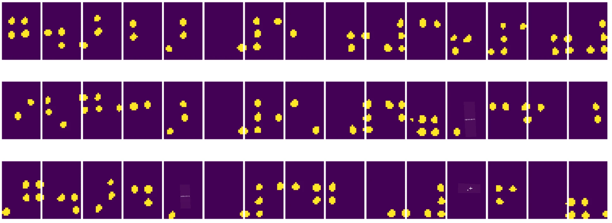

# Uvod v računalniški vid

[Računalniški vid](https://wikipedia.org/wiki/Computer_vision) je področje, katerega cilj je omogočiti računalnikom, da pridobijo visok nivo razumevanja digitalnih slik. To je precej široka definicija, saj lahko *razumevanje* pomeni veliko različnih stvari, vključno z iskanjem objekta na sliki (**prepoznavanje objektov**), razumevanjem dogajanja (**prepoznavanje dogodkov**), opisovanjem slike z besedilom ali rekonstrukcijo prizora v 3D. Obstajajo tudi posebne naloge, povezane s človeškimi slikami: ocenjevanje starosti in čustev, prepoznavanje obrazov ter določanje 3D drže, če naštejemo le nekaj primerov.

## [Predhodni kviz](https://ff-quizzes.netlify.app/en/ai/quiz/11)

Ena najpreprostejših nalog računalniškega vida je **klasifikacija slik**.

Računalniški vid pogosto velja za vejo umetne inteligence. Danes se večina nalog računalniškega vida rešuje z uporabo nevronskih mrež. Več o posebni vrsti nevronskih mrež, ki se uporabljajo za računalniški vid, [konvolucijskih nevronskih mrežah](../07-ConvNets/README.md), bomo spoznali v tem poglavju.

Vendar pa je v mnogih primerih smiselno, da pred obdelavo slike z nevronsko mrežo uporabimo nekatere algoritmične tehnike za izboljšanje slike.

Na voljo je več Python knjižnic za obdelavo slik:

* **[imageio](https://imageio.readthedocs.io/en/stable/)** se lahko uporablja za branje/pisanje različnih formatov slik. Podpira tudi ffmpeg, uporabno orodje za pretvorbo video posnetkov v slike.
* **[Pillow](https://pillow.readthedocs.io/en/stable/index.html)** (znan tudi kot PIL) je nekoliko zmogljivejši in podpira nekatere manipulacije s slikami, kot so morfiranje, prilagoditve palete in drugo.
* **[OpenCV](https://opencv.org/)** je zmogljiva knjižnica za obdelavo slik, napisana v C++, ki je postala *de facto* standard za obdelavo slik. Ima priročen Python vmesnik.
* **[dlib](http://dlib.net/)** je knjižnica v C++, ki implementira številne algoritme strojnega učenja, vključno z nekaterimi algoritmi računalniškega vida. Ima tudi Python vmesnik in se lahko uporablja za zahtevne naloge, kot so prepoznavanje obrazov in določanje obraznih značilnosti.

## OpenCV

[OpenCV](https://opencv.org/) velja za *de facto* standard za obdelavo slik. Vsebuje veliko uporabnih algoritmov, implementiranih v C++. OpenCV lahko uporabljate tudi v Pythonu.

Dober vir za učenje OpenCV je [ta tečaj Learn OpenCV](https://learnopencv.com/getting-started-with-opencv/). V našem učnem načrtu ni cilj, da se naučite OpenCV, ampak da vam pokažemo nekaj primerov, kdaj ga lahko uporabite in kako.

### Nalaganje slik

Slike v Pythonu lahko priročno predstavimo z NumPy polji. Na primer, sivinske slike velikosti 320x200 pik bi bile shranjene v polju velikosti 200x320, barvne slike enakih dimenzij pa bi imele obliko 200x320x3 (za 3 barvne kanale). Za nalaganje slike lahko uporabite naslednjo kodo:

```python
import cv2
import matplotlib.pyplot as plt

im = cv2.imread('image.jpeg')
plt.imshow(im)
```

Tradicionalno OpenCV uporablja kodiranje BGR (modro-zelena-rdeča) za barvne slike, medtem ko ostala Python orodja uporabljajo bolj tradicionalno RGB (rdeča-zelena-modra). Da bo slika videti pravilno, jo morate pretvoriti v barvni prostor RGB, bodisi z zamenjavo dimenzij v NumPy polju bodisi z uporabo funkcije OpenCV:

```python
im = cv2.cvtColor(im,cv2.COLOR_BGR2RGB)
```

Ista funkcija `cvtColor` se lahko uporablja za izvajanje drugih transformacij barvnega prostora, kot je pretvorba slike v sivinsko ali v HSV (odtenek-nasičenost-vrednost) barvni prostor.

OpenCV lahko uporabite tudi za nalaganje videoposnetkov po posameznih okvirjih - primer je podan v vajah [OpenCV Notebook](OpenCV.ipynb).

### Obdelava slik

Preden sliko posredujete nevronski mreži, boste morda želeli uporabiti več korakov predobdelave. OpenCV omogoča številne funkcije, vključno z:

* **Spreminjanjem velikosti** slike z `im = cv2.resize(im, (320,200),interpolation=cv2.INTER_LANCZOS)`
* **Zamegljevanjem** slike z `im = cv2.medianBlur(im,3)` ali `im = cv2.GaussianBlur(im, (3,3), 0)`
* Spreminjanje **svetlosti in kontrasta** slike je mogoče z manipulacijami NumPy polja, kot je opisano [v tej opombi na Stackoverflow](https://stackoverflow.com/questions/39308030/how-do-i-increase-the-contrast-of-an-image-in-python-opencv).
* Uporaba [pragovne obdelave](https://docs.opencv.org/4.x/d7/d4d/tutorial_py_thresholding.html) z uporabo funkcij `cv2.threshold`/`cv2.adaptiveThreshold`, kar je pogosto boljše od prilagajanja svetlosti ali kontrasta.
* Uporaba različnih [transformacij](https://docs.opencv.org/4.5.5/da/d6e/tutorial_py_geometric_transformations.html) na sliki:
    - **[Afine transformacije](https://docs.opencv.org/4.5.5/d4/d61/tutorial_warp_affine.html)** so uporabne, če morate kombinirati rotacijo, spreminjanje velikosti in nagib slike ter poznate izvorno in ciljno lokacijo treh točk na sliki. Afine transformacije ohranjajo vzporedne črte vzporedne.
    - **[Perspektivne transformacije](https://medium.com/analytics-vidhya/opencv-perspective-transformation-9edffefb2143)** so uporabne, ko poznate izvorne in ciljne položaje 4 točk na sliki. Na primer, če posnamete sliko pravokotnega dokumenta s pametnim telefonom pod kotom in želite narediti pravokotno sliko samega dokumenta.
* Razumevanje gibanja znotraj slike z uporabo **[optičnega toka](https://docs.opencv.org/4.5.5/d4/dee/tutorial_optical_flow.html)**.

## Primeri uporabe računalniškega vida

V našem [OpenCV Notebook](OpenCV.ipynb) podajamo nekaj primerov, kdaj se računalniški vid lahko uporablja za izvajanje specifičnih nalog:

* **Predobdelava fotografije Braillove knjige**. Osredotočamo se na to, kako lahko uporabimo pragovno obdelavo, zaznavanje značilnosti, perspektivno transformacijo in manipulacije z NumPy za ločevanje posameznih Braillovih simbolov za nadaljnjo klasifikacijo z nevronsko mrežo.

 |  | 
----|-----|-----

> Slika iz [OpenCV.ipynb](OpenCV.ipynb)

* **Zaznavanje gibanja v videu z razliko med okvirji**. Če je kamera fiksna, bi morali biti okvirji iz kamere med seboj precej podobni. Ker so okvirji predstavljeni kot polja, bomo z odštevanjem teh polj za dva zaporedna okvirja dobili razliko med piksli, ki bi morala biti nizka za statične okvirje in postati višja, ko je v sliki zaznano večje gibanje.


> Slika iz [OpenCV.ipynb](OpenCV.ipynb)

* **Zaznavanje gibanja z uporabo optičnega toka**. [Optični tok](https://docs.opencv.org/3.4/d4/dee/tutorial_optical_flow.html) nam omogoča razumevanje, kako se posamezni piksli na video okvirjih premikajo. Obstajata dve vrsti optičnega toka:

   - **Gost optični tok** izračuna vektorsko polje, ki kaže, kam se premika vsak piksel.
   - **Redek optični tok** temelji na zaznavanju nekaterih značilnih značilnosti slike (npr. robov) in gradnji njihove trajektorije od okvirja do okvirja.


> Slika iz [OpenCV.ipynb](OpenCV.ipynb)

## ✍️ Primeri zvezkov: OpenCV [preizkusite OpenCV v akciji](OpenCV.ipynb)

Izvedimo nekaj eksperimentov z OpenCV z raziskovanjem [OpenCV Notebook](OpenCV.ipynb)

## Zaključek

Včasih je mogoče relativno kompleksne naloge, kot so zaznavanje gibanja ali zaznavanje konic prstov, rešiti zgolj z računalniškim vidom. Zato je zelo koristno poznati osnovne tehnike računalniškega vida in kaj knjižnice, kot je OpenCV, omogočajo.

## 🚀 Izziv

Oglejte si [ta video](https://docs.microsoft.com/shows/ai-show/ai-show--2021-opencv-ai-competition--grand-prize-winners--cortic-tigers--episode-32?WT.mc_id=academic-77998-cacaste) iz oddaje AI show, da se naučite o projektu Cortic Tigers in kako so zgradili rešitev na osnovi blokov za demokratizacijo nalog računalniškega vida prek robota. Raziskujte podobne projekte, ki pomagajo novim učencem pri vstopu na področje.

## [Kviz po predavanju](https://ff-quizzes.netlify.app/en/ai/quiz/12)

## Pregled in samostojno učenje

Preberite več o optičnem toku [v tem odličnem vodiču](https://learnopencv.com/optical-flow-in-opencv/).

## [Naloga](lab/README.md)

V tej nalogi boste posneli video s preprostimi gestami, vaš cilj pa bo izluščiti premike gor/dol/levo/desno z uporabo optičnega toka.


---

