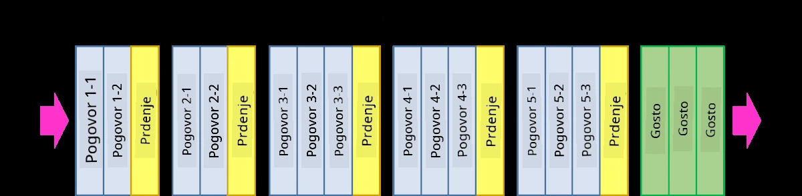
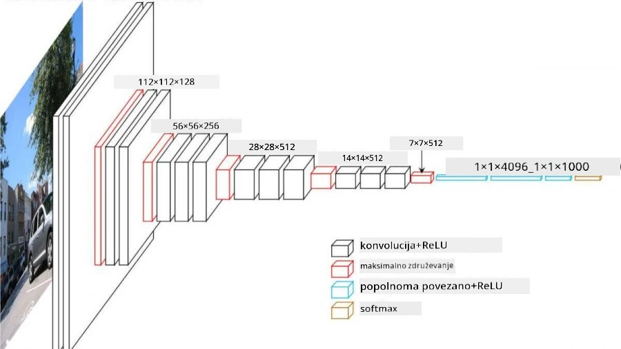
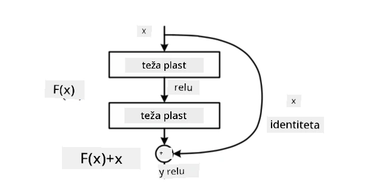
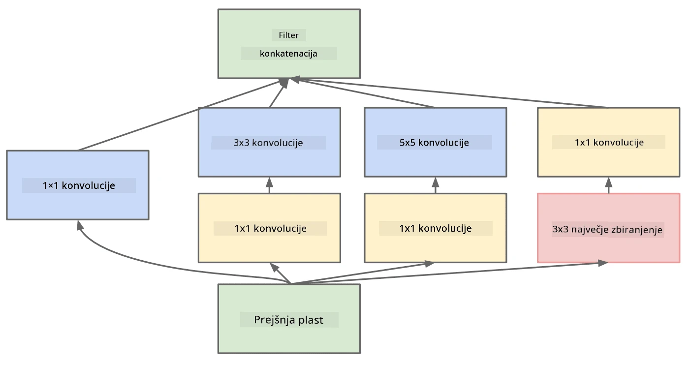

# Dobro poznane arhitekture CNN

### VGG-16

VGG-16 je mreža, ki je leta 2014 dosegla 92,7 % natančnost pri razvrščanju ImageNet top-5. Ima naslednjo strukturo slojev:

Kot lahko vidite, VGG sledi tradicionalni piramidni arhitekturi, ki je zaporedje slojev konvolucije in združevanja.

> Slika iz [Researchgate](https://www.researchgate.net/figure/Vgg16-model-structure-To-get-the-VGG-NIN-model-we-replace-the-2-nd-4-th-6-th-7-th_fig2_335194493)

### ResNet

ResNet je družina modelov, ki jih je leta 2015 predlagal Microsoft Research. Glavna ideja ResNet-a je uporaba **rezidualnih blokov**:

> Slika iz [tega članka](https://arxiv.org/pdf/1512.03385.pdf)

Razlog za uporabo identitetnega prehoda je, da sloj napove **razliko** med rezultatom prejšnjega sloja in izhodom rezidualnega bloka - od tod ime *rezidual*. Ti bloki so veliko lažji za treniranje, kar omogoča gradnjo mrež s stotinami teh blokov (najpogostejše različice so ResNet-52, ResNet-101 in ResNet-152).

Mrežo si lahko predstavljate tudi kot sposobno prilagajanja svoje kompleksnosti podatkovnemu naboru. Na začetku, ko začnete trenirati mrežo, so vrednosti uteži majhne, večina signala pa gre skozi identitetne sloje. Ko se trening nadaljuje in uteži postanejo večje, se poveča pomen parametrov mreže, mreža pa se prilagodi, da doseže potrebno izrazno moč za pravilno razvrščanje slik za trening.

### Google Inception

Arhitektura Google Inception to idejo nadgradi in zgradi vsak sloj mreže kot kombinacijo več različnih poti:

> Slika iz [Researchgate](https://www.researchgate.net/figure/Inception-module-with-dimension-reductions-left-and-schema-for-Inception-ResNet-v1_fig2_355547454)

Tukaj je treba poudariti vlogo konvolucij 1x1, saj na prvi pogled nimajo smisla. Zakaj bi potrebovali filter velikosti 1x1 za obdelavo slike? Vendar pa morate upoštevati, da konvolucijski filtri delujejo tudi z več globinskimi kanali (sprva - RGB barve, v naslednjih slojih - kanali za različne filtre), konvolucija 1x1 pa se uporablja za mešanje teh vhodnih kanalov z različnimi učljivimi utežmi. Lahko jo obravnavamo tudi kot združevanje (pooling) po dimenziji kanalov.

Tukaj je [dober blog prispevek](https://medium.com/analytics-vidhya/talented-mr-1x1-comprehensive-look-at-1x1-convolution-in-deep-learning-f6b355825578) na to temo in [izvirni članek](https://arxiv.org/pdf/1312.4400.pdf).

### MobileNet

MobileNet je družina modelov z zmanjšano velikostjo, primernih za mobilne naprave. Uporabite jih, če imate omejene vire in lahko žrtvujete nekaj natančnosti. Glavna ideja teh modelov je tako imenovana **globinsko ločljiva konvolucija**, ki omogoča predstavitev konvolucijskih filtrov kot sestavo prostorskih konvolucij in konvolucije 1x1 po globinskih kanalih. To bistveno zmanjša število parametrov, kar naredi mrežo manjšo in tudi lažjo za treniranje z manj podatki.

Tukaj je [dober blog prispevek o MobileNet](https://medium.com/analytics-vidhya/image-classification-with-mobilenet-cc6fbb2cd470).

## Zaključek

V tej enoti ste spoznali glavni koncept nevronskih mrež za računalniški vid - konvolucijske mreže. Arhitekture iz resničnega sveta, ki poganjajo razvrščanje slik, zaznavanje objektov in celo mreže za generiranje slik, so vse osnovane na CNN-jih, le z več sloji in nekaterimi dodatnimi triki pri treniranju.

## 🚀 Izziv

V priloženih zvezkih so na dnu zapiski o tem, kako doseči večjo natančnost. Naredite nekaj eksperimentov, da preverite, ali lahko dosežete višjo natančnost.

## [Kvizi po predavanju](https://ff-quizzes.netlify.app/en/ai/quiz/14)

## Pregled in samostojno učenje

Čeprav se CNN-ji najpogosteje uporabljajo za naloge računalniškega vida, so na splošno dobri za ekstrakcijo vzorcev fiksne velikosti. Na primer, če obravnavamo zvoke, lahko uporabimo CNN-je za iskanje specifičnih vzorcev v avdio signalu - v tem primeru bi bili filtri enodimenzionalni (in ta CNN bi se imenoval 1D-CNN). Prav tako se včasih uporablja 3D-CNN za ekstrakcijo značilnosti v večdimenzionalnem prostoru, kot so določeni dogodki, ki se pojavljajo na videu - CNN lahko zajame določene vzorce spreminjanja značilnosti skozi čas. Naredite pregled in samostojno učenje o drugih nalogah, ki jih je mogoče opraviti s CNN-ji.

## [Naloga](lab/README.md)

V tej laboratorijski nalogi boste razvrščali različne pasme mačk in psov. Te slike so bolj kompleksne kot podatkovni nabor MNIST, imajo višje dimenzije in več kot 10 razredov.

---

