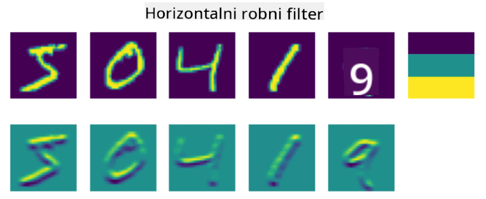
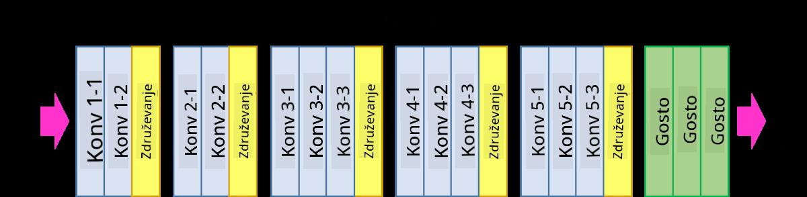

<!--
CO_OP_TRANSLATOR_METADATA:
{
  "original_hash": "a560d5b845962cf33dc102266e409568",
  "translation_date": "2025-09-23T15:01:57+00:00",
  "source_file": "lessons/4-ComputerVision/07-ConvNets/README.md",
  "language_code": "sl"
}
-->
# Konvolucijske nevronske mreže

Že prej smo videli, da so nevronske mreže precej dobre pri obdelavi slik, in celo enoslojni perceptron je sposoben prepoznati ročno napisane številke iz podatkovne zbirke MNIST z razumno natančnostjo. Vendar pa je podatkovna zbirka MNIST zelo posebna, saj so vse številke centrirane znotraj slike, kar nalogo poenostavi.

## [Predavanje kviz](https://ff-quizzes.netlify.app/en/ai/quiz/13)

V resničnem življenju želimo prepoznati predmete na sliki ne glede na njihov točen položaj na sliki. Računalniški vid se razlikuje od splošne klasifikacije, saj pri iskanju določenega predmeta na sliki pregledujemo sliko in iščemo specifične **vzorce** in njihove kombinacije. Na primer, ko iščemo mačko, najprej morda iščemo vodoravne črte, ki lahko tvorijo brke, nato pa določena kombinacija brkov lahko pokaže, da gre dejansko za sliko mačke. Relativni položaj in prisotnost določenih vzorcev sta pomembna, ne pa njihov točen položaj na sliki.

Za ekstrakcijo vzorcev bomo uporabili koncept **konvolucijskih filtrov**. Kot veste, je slika predstavljena z 2D-matriko ali 3D-tenzorjem z barvno globino. Uporaba filtra pomeni, da vzamemo relativno majhno matriko **jedra filtra** in za vsak piksel v izvirni sliki izračunamo uteženo povprečje z okoliškimi točkami. To si lahko predstavljamo kot majhno okno, ki drsi čez celotno sliko in povpreči vse piksle glede na uteži v matriki jedra filtra.

 | 
----|----

> Slika: Dmitry Soshnikov

Na primer, če uporabimo 3x3 filtre za navpične in vodoravne robove na številkah iz MNIST, lahko dobimo poudarke (npr. visoke vrednosti) tam, kjer so v izvirni sliki navpični in vodoravni robovi. Tako lahko ta dva filtra uporabimo za "iskanje" robov. Podobno lahko oblikujemo različne filtre za iskanje drugih nizkoročnih vzorcev:

> Slika: [Leung-Malik Filter Bank](https://www.robots.ox.ac.uk/~vgg/research/texclass/filters.html)

Čeprav lahko filtre za ekstrakcijo določenih vzorcev oblikujemo ročno, lahko mrežo zasnujemo tudi tako, da se vzorci učijo samodejno. To je ena glavnih idej za CNN.

## Glavne ideje za CNN

Delovanje CNN temelji na naslednjih pomembnih idejah:

* Konvolucijski filtri lahko izločijo vzorce
* Mrežo lahko zasnujemo tako, da se filtri učijo samodejno
* Enak pristop lahko uporabimo za iskanje vzorcev v visokih značilnostih, ne le v izvirni sliki. Tako ekstrakcija značilnosti v CNN deluje na hierarhiji značilnosti, začenši z nizkoročnimi kombinacijami pikslov do višjih kombinacij delov slike.

> Slika iz [članka Hislop-Lynch](https://www.semanticscholar.org/paper/Computer-vision-based-pedestrian-trajectory-Hislop-Lynch/26e6f74853fc9bbb7487b06dc2cf095d36c9021d), na podlagi [njihove raziskave](https://dl.acm.org/doi/abs/10.1145/1553374.1553453)

## ✍️ Vaje: Konvolucijske nevronske mreže

Nadaljujmo z raziskovanjem, kako delujejo konvolucijske nevronske mreže in kako lahko dosežemo učljive filtre, tako da preučimo ustrezne zvezke:

* [Konvolucijske nevronske mreže - PyTorch](ConvNetsPyTorch.ipynb)
* [Konvolucijske nevronske mreže - TensorFlow](ConvNetsTF.ipynb)

## Piramidna arhitektura

Večina CNN-jev, ki se uporabljajo za obdelavo slik, sledi tako imenovani piramidni arhitekturi. Prva konvolucijska plast, uporabljena na izvirnih slikah, ima običajno relativno majhno število filtrov (8-16), ki ustrezajo različnim kombinacijam pikslov, kot so vodoravne/navpične črte ali poteze. Na naslednji ravni zmanjšamo prostorsko dimenzijo mreže in povečamo število filtrov, kar ustreza več možnim kombinacijam preprostih značilnosti. Z vsako plastjo, ko se premikamo proti končnemu klasifikatorju, se prostorske dimenzije slike zmanjšujejo, število filtrov pa narašča.

Na primer, poglejmo arhitekturo VGG-16, mreže, ki je leta 2014 dosegla 92,7 % natančnost v top-5 klasifikaciji na ImageNet:

> Slika iz [Researchgate](https://www.researchgate.net/figure/Vgg16-model-structure-To-get-the-VGG-NIN-model-we-replace-the-2-nd-4-th-6-th-7-th_fig2_335194493)

## Najbolj znane arhitekture CNN

[Nadaljujte z učenjem o najbolj znanih arhitekturah CNN](CNN_Architectures.md)

---

