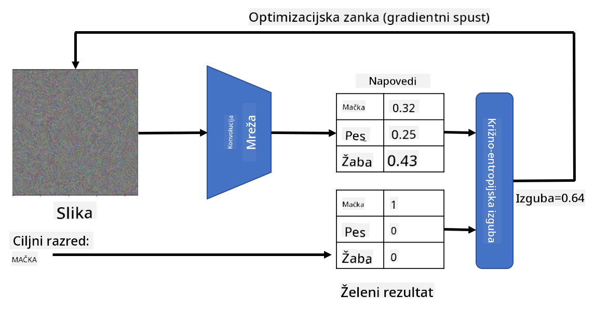

<!--
CO_OP_TRANSLATOR_METADATA:
{
  "original_hash": "717775c4050ccbffbe0c961ad8bf7bf7",
  "translation_date": "2025-08-25T23:09:23+00:00",
  "source_file": "lessons/4-ComputerVision/08-TransferLearning/README.md",
  "language_code": "sl"
}
-->
# Vnaprej naučena omrežja in prenos učenja

Učenje konvolucijskih nevronskih omrežij (CNN) lahko zahteva veliko časa in podatkov. Velik del časa se porabi za učenje najboljših nizkofrekvenčnih filtrov, ki jih omrežje lahko uporabi za prepoznavanje vzorcev iz slik. Naravno se pojavi vprašanje – ali lahko uporabimo nevronsko omrežje, naučeno na enem naboru podatkov, in ga prilagodimo za razvrščanje drugih slik, ne da bi morali izvesti celoten proces učenja?

## [Predhodni kviz](https://red-field-0a6ddfd03.1.azurestaticapps.net/quiz/108)

Ta pristop se imenuje **prenos učenja**, saj prenesemo določeno znanje iz enega modela nevronskega omrežja na drugega. Pri prenosu učenja običajno začnemo z vnaprej naučenim modelom, ki je bil naučen na velikem naboru slik, kot je **ImageNet**. Ti modeli že dobro prepoznavajo različne značilnosti iz splošnih slik, in v mnogih primerih lahko že samo zgraditev klasifikatorja na podlagi teh značilnosti prinese dobre rezultate.

> ✅ Prenos učenja je izraz, ki ga najdemo tudi na drugih akademskih področjih, kot je izobraževanje. Nanaša se na proces prenosa znanja iz enega področja na drugo.

## Vnaprej naučeni modeli kot ekstraktorji značilnosti

Konvolucijska omrežja, o katerih smo govorili v prejšnjem poglavju, vsebujejo več plasti, od katerih vsaka iz slike izlušči določene značilnosti – od nizkofrekvenčnih kombinacij pikslov (kot so horizontalne/vertikalne črte ali poteze) do višjefrekvenčnih kombinacij značilnosti, ki ustrezajo stvarem, kot je oko plamena. Če CNN naučimo na dovolj velikem naboru splošnih in raznolikih slik, bi se moralo omrežje naučiti prepoznavati te skupne značilnosti.

Tako Keras kot PyTorch vsebujeta funkcije za enostavno nalaganje vnaprej naučenih uteži nevronskih omrežij za nekatere pogoste arhitekture, večina katerih je bila naučena na slikah iz ImageNet. Najpogosteje uporabljene so opisane na strani [Arhitekture CNN](../07-ConvNets/CNN_Architectures.md) iz prejšnje lekcije. Še posebej lahko razmislite o uporabi enega od naslednjih:

* **VGG-16/VGG-19**, ki sta relativno preprosta modela, a še vedno zagotavljata dobro natančnost. Pogosto je uporaba VGG kot prvi poskus dobra izbira za preverjanje delovanja prenosa učenja.
* **ResNet** je družina modelov, ki jih je predlagal Microsoft Research leta 2015. Imajo več plasti in zato zahtevajo več virov.
* **MobileNet** je družina modelov z zmanjšano velikostjo, primernih za mobilne naprave. Uporabite jih, če imate omejene vire in lahko žrtvujete nekaj natančnosti.

Tukaj so primeri značilnosti, izluščenih iz slike mačke z omrežjem VGG-16:

## Nabor podatkov Mačke proti psom

V tem primeru bomo uporabili nabor podatkov [Mačke in psi](https://www.microsoft.com/download/details.aspx?id=54765&WT.mc_id=academic-77998-cacaste), ki je zelo podoben resničnemu scenariju razvrščanja slik.

## ✍️ Vaja: Prenos učenja

Poglejmo prenos učenja v praksi v ustreznih beležnicah:

* [Prenos učenja - PyTorch](../../../../../lessons/4-ComputerVision/08-TransferLearning/TransferLearningPyTorch.ipynb)
* [Prenos učenja - TensorFlow](../../../../../lessons/4-ComputerVision/08-TransferLearning/TransferLearningTF.ipynb)

## Vizualizacija nasprotne mačke

Vnaprej naučeno nevronsko omrežje vsebuje različne vzorce v svojem *"možganu"*, vključno s pojmi, kot je **idealna mačka** (pa tudi idealen pes, idealna zebra itd.). Zanimivo bi bilo nekako **vizualizirati to sliko**. Vendar to ni preprosto, saj so vzorci razpršeni po utežeh omrežja in organizirani v hierarhično strukturo.

Eden od pristopov, ki ga lahko uporabimo, je začeti z naključno sliko in nato uporabiti tehniko **optimizacije z gradientnim spustom**, da prilagodimo to sliko tako, da omrežje začne misliti, da gre za mačko.

Če to storimo, bomo dobili nekaj, kar je zelo podobno naključnemu šumu. To je zato, ker *obstaja veliko načinov, kako omrežje prepričati, da je vhodna slika mačka*, vključno z nekaterimi, ki vizualno nimajo smisla. Čeprav te slike vsebujejo veliko vzorcev, značilnih za mačko, jih nič ne omejuje, da bi bile vizualno prepoznavne.

Za izboljšanje rezultata lahko v funkcijo izgube dodamo še en člen, imenovan **izguba variacije**. To je metrika, ki prikazuje, kako podobni so sosednji piksli slike. Zmanjšanje izgube variacije naredi sliko bolj gladko in odstrani šum – s tem razkrije bolj vizualno privlačne vzorce. Tukaj je primer takšnih "idealnih" slik, ki so z visoko verjetnostjo razvrščene kot mačka in kot zebra:

 | 
-----|-----
*Idealna mačka* | *Idealna zebra*

Podoben pristop lahko uporabimo za izvajanje tako imenovanih **nasprotnih napadov** na nevronsko omrežje. Recimo, da želimo prevarati nevronsko omrežje in narediti, da pes izgleda kot mačka. Če vzamemo sliko psa, ki jo omrežje prepozna kot psa, jo lahko nato nekoliko prilagodimo z uporabo optimizacije z gradientnim spustom, dokler omrežje ne začne razvrščati slike kot mačko:

 | 
-----|-----
*Izvirna slika psa* | *Slika psa, razvrščena kot mačka*

Kodo za reproduciranje zgornjih rezultatov si oglejte v naslednji beležnici:

* [Idealna in nasprotna mačka - TensorFlow](../../../../../lessons/4-ComputerVision/08-TransferLearning/AdversarialCat_TF.ipynb)

## Zaključek

S prenosom učenja lahko hitro sestavite klasifikator za nalogo razvrščanja prilagojenih objektov in dosežete visoko natančnost. Vidite lahko, da bolj zapletene naloge, ki jih zdaj rešujemo, zahtevajo večjo računsko moč in jih ni mogoče enostavno rešiti na CPU. V naslednji enoti bomo poskusili uporabiti lažjo implementacijo za učenje istega modela z nižjimi računalniškimi viri, kar bo prineslo le nekoliko nižjo natančnost.

## 🚀 Izziv

V priloženih beležnicah so na dnu zapiski o tem, kako prenos znanja najbolje deluje s sorodnimi učnimi podatki (na primer nova vrsta živali). Naredite nekaj eksperimentov s popolnoma novimi vrstami slik, da vidite, kako dobro ali slabo delujejo vaši modeli za prenos znanja.

## [Kviz po predavanju](https://red-field-0a6ddfd03.1.azurestaticapps.net/quiz/208)

## Pregled in samostojno učenje

Preberite [TrainingTricks.md](TrainingTricks.md), da poglobite svoje znanje o drugih načinih učenja vaših modelov.

## [Naloga](lab/README.md)

V tem laboratoriju bomo uporabili resnični nabor podatkov [Oxford-IIIT](https://www.robots.ox.ac.uk/~vgg/data/pets/) z 35 pasmami mačk in psov ter zgradili klasifikator s prenosom učenja.

**Omejitev odgovornosti**:  
Ta dokument je bil preveden z uporabo storitve AI za prevajanje [Co-op Translator](https://github.com/Azure/co-op-translator). Čeprav si prizadevamo za natančnost, vas prosimo, da upoštevate, da lahko avtomatizirani prevodi vsebujejo napake ali netočnosti. Izvirni dokument v njegovem maternem jeziku je treba obravnavati kot avtoritativni vir. Za ključne informacije priporočamo profesionalni človeški prevod. Ne prevzemamo odgovornosti za morebitne nesporazume ali napačne razlage, ki izhajajo iz uporabe tega prevoda.