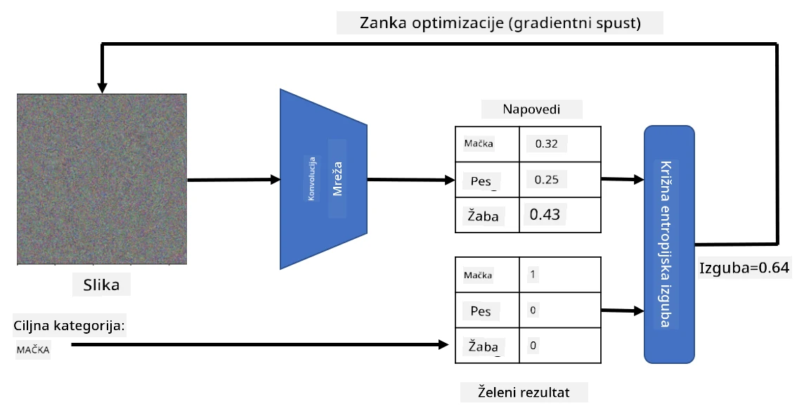

# Vnaprej naučeni modeli in prenos učenja

Učenje CNN-jev lahko zahteva veliko časa, poleg tega pa je za to nalogo potrebnih veliko podatkov. Velik del časa se porabi za učenje najboljših nizkoročnih filtrov, ki jih mreža lahko uporabi za prepoznavanje vzorcev iz slik. Pojavi se naravno vprašanje – ali lahko uporabimo nevronsko mrežo, naučeno na enem naboru podatkov, in jo prilagodimo za razvrščanje drugih slik, ne da bi morali izvesti celoten proces učenja?

## [Predhodni kviz](https://ff-quizzes.netlify.app/en/ai/quiz/15)

Ta pristop se imenuje **prenos učenja**, ker prenesemo določeno znanje iz enega modela nevronske mreže na drugega. Pri prenosu učenja običajno začnemo z vnaprej naučenim modelom, ki je bil naučen na velikem naboru slik, kot je **ImageNet**. Ti modeli že dobro prepoznavajo različne značilnosti iz splošnih slik, in v mnogih primerih lahko že samo z gradnjo klasifikatorja na podlagi teh značilnosti dosežemo dobre rezultate.

> ✅ Prenos učenja je izraz, ki ga najdemo tudi v drugih akademskih področjih, kot je izobraževanje. Nanaša se na proces prenosa znanja iz enega področja na drugo.

## Vnaprej naučeni modeli kot ekstraktorji značilnosti

Konvolucijske mreže, o katerih smo govorili v prejšnjem poglavju, vsebujejo več plasti, od katerih vsaka izvleče določene značilnosti iz slike, začenši z nizkoročnimi kombinacijami pikslov (kot so horizontalne/vertikalne črte ali poteze), do višjih kombinacij značilnosti, ki ustrezajo stvarem, kot je oko plamena. Če CNN naučimo na dovolj velikem naboru splošnih in raznolikih slik, bi morala mreža naučiti prepoznavati te skupne značilnosti.

Tako Keras kot PyTorch vsebujeta funkcije za enostavno nalaganje vnaprej naučenih uteži nevronske mreže za nekatere pogoste arhitekture, večina katerih je bila naučena na slikah iz ImageNet. Najpogosteje uporabljene so opisane na strani [Arhitekture CNN](../07-ConvNets/CNN_Architectures.md) iz prejšnje lekcije. Zlasti lahko razmislite o uporabi enega od naslednjih:

* **VGG-16/VGG-19**, ki sta relativno preprosta modela, a še vedno zagotavljata dobro natančnost. Pogosto je uporaba VGG kot prvi poskus dobra izbira za preverjanje delovanja prenosa učenja.
* **ResNet** je družina modelov, ki jih je predlagal Microsoft Research leta 2015. Imajo več plasti, zato zahtevajo več virov.
* **MobileNet** je družina modelov z zmanjšano velikostjo, primernih za mobilne naprave. Uporabite jih, če imate omejene vire in lahko žrtvujete malo natančnosti.

Tukaj so primeri značilnosti, izvlečenih iz slike mačke z mrežo VGG-16:

## Nabor podatkov Mačke proti psom

V tem primeru bomo uporabili nabor podatkov [Mačke in psi](https://www.microsoft.com/download/details.aspx?id=54765&WT.mc_id=academic-77998-cacaste), ki je zelo blizu resničnemu scenariju razvrščanja slik.

## ✍️ Naloga: Prenos učenja

Poglejmo prenos učenja v praksi v ustreznih zvezkih:

* [Prenos učenja - PyTorch](TransferLearningPyTorch.ipynb)
* [Prenos učenja - TensorFlow](TransferLearningTF.ipynb)

## Vizualizacija idealne mačke

Vnaprej naučena nevronska mreža vsebuje različne vzorce v svojem *možganu*, vključno z idejami o **idealni mački** (pa tudi idealnem psu, idealni zebri itd.). Zanimivo bi bilo nekako **vizualizirati to sliko**. Vendar to ni preprosto, saj so vzorci razpršeni po utežeh mreže in organizirani v hierarhično strukturo.

Eden od pristopov, ki ga lahko uporabimo, je začeti z naključno sliko in nato poskusiti uporabiti tehniko **optimizacije z gradientnim spustom**, da prilagodimo to sliko tako, da mreža začne misliti, da je to mačka.

Če to storimo, bomo dobili nekaj, kar je zelo podobno naključnemu šumu. To je zato, ker *obstaja veliko načinov, kako mreži narediti vtis, da je vhodna slika mačka*, vključno z nekaterimi, ki vizualno nimajo smisla. Čeprav te slike vsebujejo veliko vzorcev, značilnih za mačko, ni ničesar, kar bi jih omejevalo, da bi bile vizualno prepoznavne.

Za izboljšanje rezultata lahko v funkcijo izgube dodamo še en člen, imenovan **izguba variacije**. To je metrika, ki kaže, kako podobni so sosednji piksli slike. Zmanjšanje izgube variacije naredi sliko bolj gladko in odstrani šum – s tem razkrije bolj vizualno privlačne vzorce. Tukaj je primer takšnih "idealnih" slik, ki so z visoko verjetnostjo razvrščene kot mačka in zebra:

 | 
-----|-----
 *Idealna mačka* | *Idealna zebra*

Podoben pristop lahko uporabimo za izvajanje tako imenovanih **adversarnih napadov** na nevronsko mrežo. Recimo, da želimo zavajati nevronsko mrežo in narediti, da pes izgleda kot mačka. Če vzamemo sliko psa, ki jo mreža prepozna kot psa, jo lahko nato nekoliko prilagodimo z optimizacijo gradientnega spusta, dokler mreža ne začne razvrščati slike kot mačko:

 | 
-----|-----
*Izvirna slika psa* | *Slika psa, razvrščena kot mačka*

Oglejte si kodo za reprodukcijo zgornjih rezultatov v naslednjem zvezku:

* [Idealna in adversarna mačka - TensorFlow](AdversarialCat_TF.ipynb)

## Zaključek

S prenosom učenja lahko hitro sestavite klasifikator za nalogo razvrščanja prilagojenih objektov in dosežete visoko natančnost. Vidite lahko, da bolj zapletene naloge, ki jih zdaj rešujemo, zahtevajo večjo računsko moč in jih ni mogoče enostavno rešiti na CPU. V naslednji enoti bomo poskusili uporabiti bolj lahkotno implementacijo za učenje istega modela z nižjimi računalniškimi viri, kar bo prineslo le nekoliko nižjo natančnost.

## 🚀 Izziv

V priloženih zvezkih so opombe na dnu o tem, kako prenos znanja najbolje deluje s podobnimi učnimi podatki (morda nov tip živali). Izvedite nekaj eksperimentov s popolnoma novimi vrstami slik, da vidite, kako dobro ali slabo delujejo vaši modeli prenosa znanja.

## [Kviz po predavanju](https://ff-quizzes.netlify.app/en/ai/quiz/16)

## Pregled in samostojno učenje

Preberite [TrainingTricks.md](TrainingTricks.md), da poglobite svoje znanje o drugih načinih učenja vaših modelov.

## [Naloga](lab/README.md)

V tem laboratoriju bomo uporabili resnični nabor podatkov [Oxford-IIIT](https://www.robots.ox.ac.uk/~vgg/data/pets/) o hišnih ljubljenčkih z 35 pasmami mačk in psov ter zgradili klasifikator s prenosom učenja.

---

