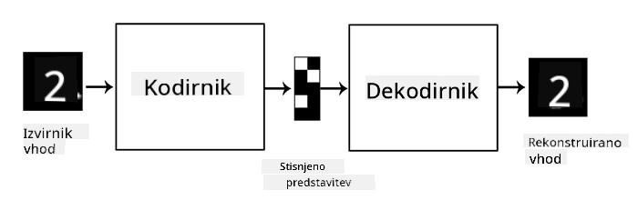

<!--
CO_OP_TRANSLATOR_METADATA:
{
  "original_hash": "0b306c04f5337b6e7430e5c0b16bb5c0",
  "translation_date": "2025-08-25T22:32:01+00:00",
  "source_file": "lessons/4-ComputerVision/09-Autoencoders/README.md",
  "language_code": "sl"
}
-->
# Avtoenkoderji

Pri treniranju CNN-jev je ena izmed težav, da potrebujemo veliko označenih podatkov. Pri klasifikaciji slik moramo slike razvrstiti v različne razrede, kar zahteva ročno delo.

## [Pre-učni kviz](https://red-field-0a6ddfd03.1.azurestaticapps.net/quiz/109)

Vendar pa bi morda želeli uporabiti surove (neoznačene) podatke za treniranje CNN ekstraktorjev značilnosti, kar imenujemo **samostojno učenje**. Namesto oznak bomo uporabili slike za treniranje kot vhod in izhod mreže. Glavna ideja **avtoenkoderja** je, da imamo **kodirno mrežo**, ki vhodno sliko pretvori v nek **latentni prostor** (običajno je to vektor manjših dimenzij), nato pa **dekodirno mrežo**, katere cilj je rekonstruirati izvirno sliko.

> ✅ [Avtoenkoder](https://wikipedia.org/wiki/Autoencoder) je "vrsta umetne nevronske mreže, ki se uporablja za učenje učinkovitega kodiranja neoznačenih podatkov."

Ker treniramo avtoenkoder, da zajame čim več informacij iz izvirne slike za natančno rekonstrukcijo, mreža poskuša najti najboljšo **vgradnjo** vhodnih slik, da zajame njihov pomen.

> Slika iz [Keras bloga](https://blog.keras.io/building-autoencoders-in-keras.html)

## Scenariji uporabe avtoenkoderjev

Čeprav rekonstrukcija izvirnih slik sama po sebi morda ne zveni uporabno, obstaja nekaj scenarijev, kjer so avtoenkoderji še posebej koristni:

* **Zmanjšanje dimenzije slik za vizualizacijo** ali **treniranje vgradnje slik**. Običajno avtoenkoderji dajejo boljše rezultate kot PCA, ker upoštevajo prostorsko naravo slik in hierarhične značilnosti.
* **Odstranjevanje šuma**, tj. odstranjevanje šuma s slike. Ker šum vsebuje veliko nepotrebnih informacij, avtoenkoder ne more vsega vključiti v relativno majhen latentni prostor, zato zajame le pomemben del slike. Pri treniranju odstranjevalcev šuma začnemo z izvirnimi slikami in uporabimo slike z umetno dodanim šumom kot vhod za avtoenkoder.
* **Super-resolucija**, povečanje ločljivosti slike. Začnemo z visokoločljivostnimi slikami in uporabimo sliko z nižjo ločljivostjo kot vhod za avtoenkoder.
* **Generativni modeli**. Ko treniramo avtoenkoder, lahko dekodirni del uporabimo za ustvarjanje novih objektov, ki izhajajo iz naključnih latentnih vektorjev.

## Variacijski avtoenkoderji (VAE)

Tradicionalni avtoenkoderji nekako zmanjšajo dimenzijo vhodnih podatkov in ugotovijo pomembne značilnosti vhodnih slik. Vendar pa latentni vektorji pogosto nimajo veliko smisla. Z drugimi besedami, če vzamemo MNIST podatkovno zbirko kot primer, ugotoviti, katere številke ustrezajo različnim latentnim vektorjem, ni enostavna naloga, saj bližnji latentni vektorji ne ustrezajo nujno istim številkam.

Po drugi strani pa je za treniranje *generativnih* modelov bolje imeti neko razumevanje latentnega prostora. Ta ideja nas pripelje do **variacijskega avtoenkoderja** (VAE).

VAE je avtoenkoder, ki se nauči napovedovati *statistično porazdelitev* latentnih parametrov, tako imenovano **latentno porazdelitev**. Na primer, morda želimo, da so latentni vektorji normalno porazdeljeni z nekim povprečjem zmean in standardnim odklonom zsigma (obe vrednosti sta vektorja neke dimenzionalnosti d). Kodirnik v VAE se nauči napovedovati te parametre, nato pa dekodirnik vzame naključni vektor iz te porazdelitve za rekonstrukcijo objekta.

Povzetek:

* Iz vhodnega vektorja napovemo `z_mean` in `z_log_sigma` (namesto da napovemo standardni odklon, napovemo njegov logaritem)
* Vzamemo vzorec `sample` iz porazdelitve N(zmean,exp(zlog\_sigma))
* Dekodirnik poskuša dekodirati izvirno sliko z uporabo `sample` kot vhodnega vektorja

> Slika iz [tega bloga](https://ijdykeman.github.io/ml/2016/12/21/cvae.html) avtorja Isaaka Dykemana

Variacijski avtoenkoderji uporabljajo kompleksno funkcijo izgube, ki je sestavljena iz dveh delov:

* **Izguba rekonstrukcije** je funkcija izgube, ki prikazuje, kako blizu je rekonstruirana slika ciljni (lahko je povprečna kvadratna napaka ali MSE). To je ista funkcija izgube kot pri običajnih avtoenkoderjih.
* **KL izguba**, ki zagotavlja, da porazdelitev latentnih spremenljivk ostane blizu normalni porazdelitvi. Temelji na konceptu [Kullback-Leiblerjeve divergence](https://www.countbayesie.com/blog/2017/5/9/kullback-leibler-divergence-explained) - merilu za oceno podobnosti dveh statističnih porazdelitev.

Ena pomembna prednost VAE-jev je, da omogočajo relativno enostavno generiranje novih slik, ker vemo, iz katere porazdelitve vzeti latentne vektorje. Na primer, če treniramo VAE z 2D latentnim vektorjem na MNIST, lahko nato spreminjamo komponente latentnega vektorja, da dobimo različne številke:

> Slika avtorja [Dmitry Soshnikov](http://soshnikov.com)

Opazite, kako se slike prelivajo ena v drugo, ko začnemo jemati latentne vektorje iz različnih delov latentnega prostora parametrov. Ta prostor lahko vizualiziramo tudi v 2D:

 

> Slika avtorja [Dmitry Soshnikov](http://soshnikov.com)

## ✍️ Vaje: Avtoenkoderji

Več o avtoenkoderjih se naučite v teh priloženih zvezkih:

* [Avtoenkoderji v TensorFlow](../../../../../lessons/4-ComputerVision/09-Autoencoders/AutoencodersTF.ipynb)
* [Avtoenkoderji v PyTorch](../../../../../lessons/4-ComputerVision/09-Autoencoders/AutoEncodersPyTorch.ipynb)

## Lastnosti avtoenkoderjev

* **Specifični za podatke** - dobro delujejo le s tipom slik, na katerih so bili trenirani. Na primer, če treniramo mrežo za super-resolucijo na rožah, ne bo dobro delovala na portretih. To je zato, ker mreža lahko ustvari sliko z višjo ločljivostjo tako, da vzame fine podrobnosti iz značilnosti, naučenih iz podatkovne zbirke za treniranje.
* **Izgubni** - rekonstruirana slika ni enaka izvirni sliki. Narava izgube je določena z *funkcijo izgube*, uporabljeno med treniranjem.
* Deluje na **neoznačenih podatkih**

## [Post-učni kviz](https://red-field-0a6ddfd03.1.azurestaticapps.net/quiz/209)

## Zaključek

V tej lekciji ste se naučili o različnih vrstah avtoenkoderjev, ki so na voljo AI znanstveniku. Naučili ste se, kako jih zgraditi in kako jih uporabiti za rekonstrukcijo slik. Prav tako ste se naučili o VAE in kako ga uporabiti za generiranje novih slik.

## 🚀 Izziv

V tej lekciji ste se naučili o uporabi avtoenkoderjev za slike. Vendar pa jih lahko uporabimo tudi za glasbo! Oglejte si projekt Magenta [MusicVAE](https://magenta.tensorflow.org/music-vae), ki uporablja avtoenkoderje za učenje rekonstrukcije glasbe. Izvedite nekaj [eksperimentov](https://colab.research.google.com/github/magenta/magenta-demos/blob/master/colab-notebooks/Multitrack_MusicVAE.ipynb) s to knjižnico, da vidite, kaj lahko ustvarite.

## [Post-učni kviz](https://red-field-0a6ddfd03.1.azurestaticapps.net/quiz/208)

## Pregled in samostojno učenje

Za referenco preberite več o avtoenkoderjih v teh virih:

* [Gradnja avtoenkoderjev v Keras](https://blog.keras.io/building-autoencoders-in-keras.html)
* [Blog objava na NeuroHive](https://neurohive.io/ru/osnovy-data-science/variacionnyj-avtojenkoder-vae/)
* [Razlaga variacijskih avtoenkoderjev](https://kvfrans.com/variational-autoencoders-explained/)
* [Pogojni variacijski avtoenkoderji](https://ijdykeman.github.io/ml/2016/12/21/cvae.html)

## Naloga

Na koncu [tega zvezka z uporabo TensorFlow](../../../../../lessons/4-ComputerVision/09-Autoencoders/AutoencodersTF.ipynb) boste našli 'nalogo' - uporabite jo kot svojo nalogo.

**Omejitev odgovornosti**:  
Ta dokument je bil preveden z uporabo storitve AI za prevajanje [Co-op Translator](https://github.com/Azure/co-op-translator). Čeprav si prizadevamo za natančnost, vas prosimo, da upoštevate, da lahko avtomatizirani prevodi vsebujejo napake ali netočnosti. Izvirni dokument v njegovem izvirnem jeziku je treba obravnavati kot avtoritativni vir. Za ključne informacije priporočamo profesionalni človeški prevod. Ne prevzemamo odgovornosti za morebitna nesporazumevanja ali napačne razlage, ki bi nastale zaradi uporabe tega prevoda.