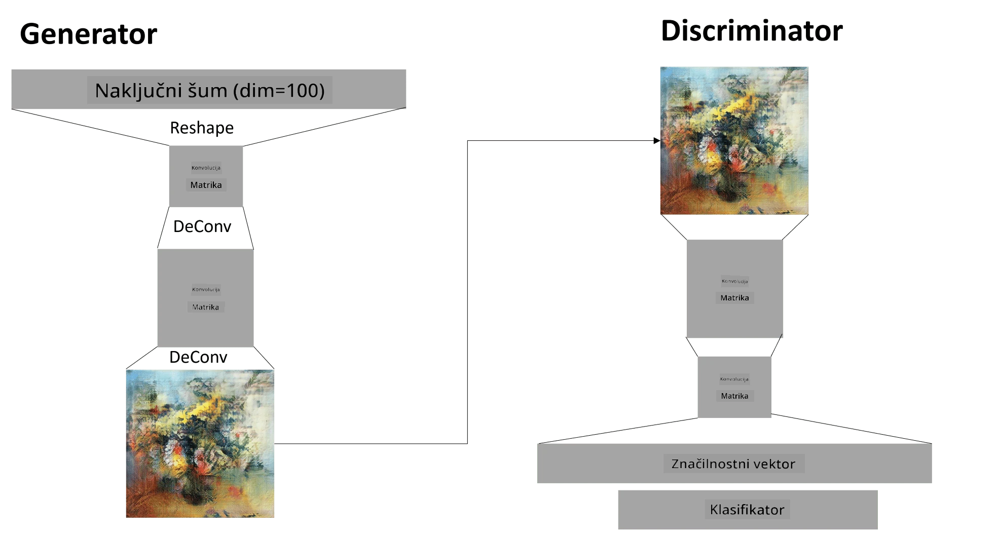

# Generativne nasprotujoče si mreže

V prejšnjem poglavju smo spoznali **generativne modele**: modele, ki lahko ustvarijo nove slike, podobne tistim v učnem naboru podatkov. VAE je bil dober primer generativnega modela.

## [Predhodni kviz](https://ff-quizzes.netlify.app/en/ai/quiz/19)

Če pa poskušamo ustvariti nekaj resnično smiselnega, na primer sliko z razumno ločljivostjo, z VAE, bomo opazili, da se učenje ne konvergira dobro. Za ta primer uporabe se moramo naučiti o drugi arhitekturi, ki je posebej namenjena generativnim modelom - **Generativne nasprotujoče si mreže**, ali GAN-i.

Glavna ideja GAN-a je, da imamo dve nevronski mreži, ki se učita ena proti drugi:

> Slika avtorja [Dmitry Soshnikov](http://soshnikov.com)

> ✅ Malo besedišča:
> * **Generator** je mreža, ki vzame naključni vektor in kot rezultat ustvari sliko.
> * **Diskriminator** je mreža, ki vzame sliko in mora ugotoviti, ali je to prava slika (iz učnega nabora podatkov) ali pa jo je ustvaril generator. V bistvu gre za klasifikator slik.

### Diskriminator

Arhitektura diskriminatorja se ne razlikuje od običajne mreže za klasifikacijo slik. V najpreprostejšem primeru je lahko popolnoma povezan klasifikator, najverjetneje pa bo to [konvolucijska mreža](../07-ConvNets/README.md).

> ✅ GAN, ki temelji na konvolucijskih mrežah, se imenuje [DCGAN](https://arxiv.org/pdf/1511.06434.pdf)

CNN diskriminator je sestavljen iz naslednjih slojev: več konvolucij+poolingov (z zmanjšanjem prostorske velikosti) in enega ali več popolnoma povezanih slojev za pridobitev "vektorskih značilnosti", končnega binarnega klasifikatorja.

> ✅ 'Pooling' v tem kontekstu je tehnika, ki zmanjša velikost slike. "Pooling sloji zmanjšajo dimenzije podatkov tako, da združijo izhode skupin nevronov na enem sloju v en nevron na naslednjem sloju." - [vir](https://wikipedia.org/wiki/Convolutional_neural_network#Pooling_layers)

### Generator

Generator je nekoliko bolj zahteven. Lahko si ga predstavljate kot obrnjenega diskriminatorja. Začne se z latentnim vektorjem (namesto vektorskih značilnosti), ima popolnoma povezan sloj, ki ga pretvori v zahtevano velikost/obliko, nato pa sledi dekonvolucija+povečevanje. To je podobno *dekoderju* v [avtoenkoderju](../09-Autoencoders/README.md).

> ✅ Ker je konvolucijski sloj implementiran kot linearni filter, ki prehaja skozi sliko, je dekonvolucija v bistvu podobna konvoluciji in jo je mogoče implementirati z isto logiko sloja.

> Slika avtorja [Dmitry Soshnikov](http://soshnikov.com)

### Učenje GAN-a

GAN-i se imenujejo **nasprotujoči si**, ker med generatorjem in diskriminatorjem poteka stalno tekmovanje. Med tem tekmovanjem se oba, generator in diskriminator, izboljšujeta, kar omogoča mreži, da se nauči ustvarjati vedno boljše slike.

Učenje poteka v dveh fazah:

* **Učenje diskriminatorja**. Ta naloga je precej preprosta: ustvarimo serijo slik z generatorjem, jih označimo z 0, kar pomeni lažna slika, in vzamemo serijo slik iz vhodnega nabora podatkov (z oznako 1, prava slika). Dobimo *izgubo diskriminatorja* in izvedemo povratno propagacijo.
* **Učenje generatorja**. To je nekoliko bolj zapleteno, ker neposredno ne poznamo pričakovanega izhoda za generator. Vzamemo celotno GAN mrežo, ki jo sestavljata generator in diskriminator, jo napolnimo z naključnimi vektorji in pričakujemo, da bo rezultat 1 (kar ustreza pravim slikam). Nato zamrznemo parametre diskriminatorja (ne želimo, da se uči v tem koraku) in izvedemo povratno propagacijo.

Med tem procesom izgube generatorja in diskriminatorja ne upadata bistveno. V idealnem primeru bi se morale oscilirati, kar ustreza izboljšanju zmogljivosti obeh mrež.

## ✍️ Vaje: GAN-i

* [GAN zvezek v TensorFlow/Keras](GANTF.ipynb)
* [GAN zvezek v PyTorch](GANPyTorch.ipynb)

### Težave pri učenju GAN-ov

GAN-i so znani po tem, da jih je še posebej težko učiti. Tukaj je nekaj težav:

* **Kolaps načina**. S tem izrazom mislimo, da se generator nauči ustvariti eno uspešno sliko, ki zavaja diskriminator, in ne raznolikosti različnih slik.
* **Občutljivost na hiperparametre**. Pogosto lahko opazimo, da GAN sploh ne konvergira, nato pa nenadna sprememba hitrosti učenja vodi v konvergenco.
* Ohranjanje **ravnotežja** med generatorjem in diskriminatorjem. V mnogih primerih lahko izguba diskriminatorja relativno hitro pade na nič, kar povzroči, da generator ne more nadalje učiti. Da bi to premagali, lahko poskusimo nastaviti različne hitrosti učenja za generator in diskriminator ali preskočimo učenje diskriminatorja, če je izguba že prenizka.
* Učenje za **visoko ločljivost**. Odraža isti problem kot pri avtoenkoderjih, ta težava se pojavi, ker rekonstrukcija preveč slojev konvolucijske mreže vodi do artefaktov. Ta težava se običajno reši s tako imenovano **progresivno rastjo**, ko se najprej nekaj slojev uči na slikah z nizko ločljivostjo, nato pa se sloji "odblokirajo" ali dodajo. Druga rešitev bi bila dodajanje dodatnih povezav med sloji in učenje več ločljivosti hkrati - podrobnosti si oglejte v tem [Multi-Scale Gradient GANs članku](https://arxiv.org/abs/1903.06048).

## Prenos sloga

GAN-i so odličen način za ustvarjanje umetniških slik. Druga zanimiva tehnika je tako imenovani **prenos sloga**, ki vzame eno **vsebinsko sliko** in jo ponovno nariše v drugačnem slogu, pri čemer uporabi filtre iz **slogovne slike**.

Kako deluje:
* Začnemo z naključno šumno sliko (ali z vsebinsko sliko, vendar je za razumevanje lažje začeti z naključnim šumom).
* Naš cilj je ustvariti takšno sliko, ki bo blizu tako vsebinski sliki kot slogovni sliki. To določata dve funkciji izgube:
   - **Izguba vsebine** se izračuna na podlagi značilnosti, ki jih CNN izlušči na nekaterih slojih iz trenutne slike in vsebinske slike.
   - **Izguba sloga** se izračuna med trenutno sliko in slogovno sliko na pameten način z uporabo Gramovih matrik (več podrobnosti v [primeru zvezka](StyleTransfer.ipynb)).
* Da bi sliko naredili bolj gladko in odstranili šum, uvedemo tudi **izgubo variacije**, ki izračuna povprečno razdaljo med sosednjimi piksli.
* Glavna optimizacijska zanka prilagaja trenutno sliko z uporabo gradientnega spusta (ali kakšnega drugega optimizacijskega algoritma), da minimizira skupno izgubo, ki je utežena vsota vseh treh izgub.

## ✍️ Primer: [Prenos sloga](StyleTransfer.ipynb)

## [Naknadni kviz](https://ff-quizzes.netlify.app/en/ai/quiz/20)

## Zaključek

V tej lekciji ste se naučili o GAN-ih in kako jih učiti. Prav tako ste spoznali posebne izzive, s katerimi se lahko sooča ta vrsta nevronske mreže, ter nekatere strategije, kako jih premagati.

## 🚀 Izziv

Preizkusite [zvezek za prenos sloga](StyleTransfer.ipynb) z uporabo svojih slik.

## Pregled in samostojno učenje

Za referenco preberite več o GAN-ih v teh virih:

* Marco Pasini, [10 lekcij, ki sem se jih naučil pri učenju GAN-ov eno leto](https://towardsdatascience.com/10-lessons-i-learned-training-generative-adversarial-networks-gans-for-a-year-c9071159628)
* [StyleGAN](https://en.wikipedia.org/wiki/StyleGAN), *de facto* GAN arhitektura, ki jo je vredno upoštevati
* [Ustvarjanje generativne umetnosti z uporabo GAN-ov na Azure ML](https://soshnikov.com/scienceart/creating-generative-art-using-gan-on-azureml/)

## Naloga

Ponovno preglejte enega od dveh zvezkov, povezanih s to lekcijo, in ponovno naučite GAN na svojih slikah. Kaj lahko ustvarite?

---

