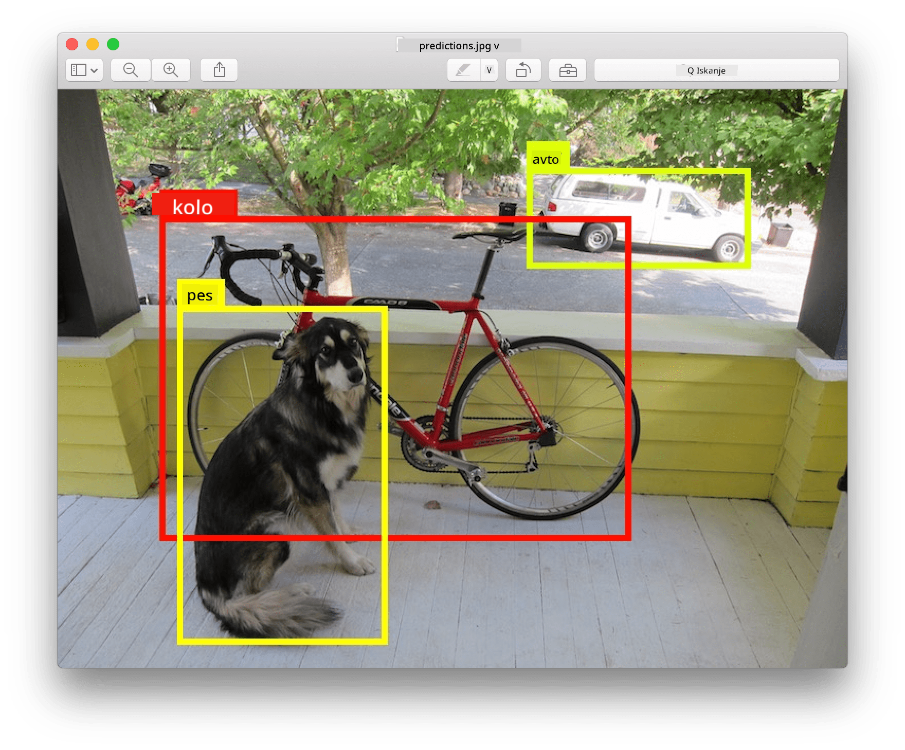
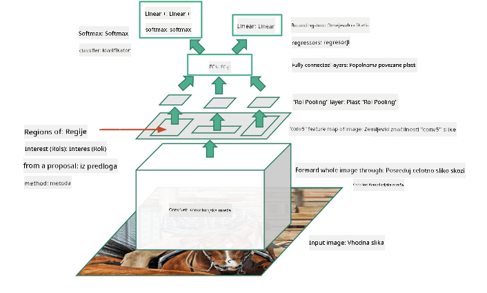
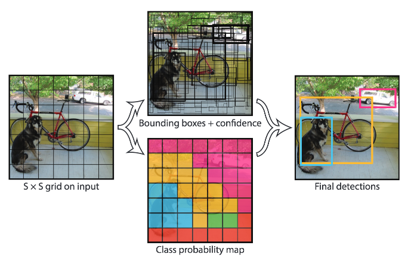

<!--
CO_OP_TRANSLATOR_METADATA:
{
  "original_hash": "d76a7eda28de5210c8b1ba50a6216c69",
  "translation_date": "2025-09-23T15:03:45+00:00",
  "source_file": "lessons/4-ComputerVision/11-ObjectDetection/README.md",
  "language_code": "sl"
}
-->
# Zaznavanje objektov

Modeli za klasifikacijo slik, s katerimi smo se doslej ukvarjali, so vzeli sliko in podali kategorialni rezultat, na primer razred 'številka' v problemu MNIST. Vendar pa v mnogih primerih ne želimo le vedeti, da slika prikazuje objekte – želimo določiti njihovo natančno lokacijo. To je pravzaprav bistvo **zaznavanja objektov**.

## [Predhodni kviz](https://ff-quizzes.netlify.app/en/ai/quiz/21)

> Slika s [spletne strani YOLO v2](https://pjreddie.com/darknet/yolov2/)

## Naiven pristop k zaznavanju objektov

Če bi želeli na sliki najti mačko, bi bil zelo naiven pristop k zaznavanju objektov naslednji:

1. Razdelimo sliko na več ploščic.
2. Na vsaki ploščici izvedemo klasifikacijo slik.
3. Tiste ploščice, ki imajo dovolj visoko aktivacijo, lahko štejemo, da vsebujejo iskani objekt.

> *Slika iz [zvezka z vajami](ObjectDetection-TF.ipynb)*

Vendar pa ta pristop ni idealen, saj algoritmu omogoča le zelo nenatančno določanje okvirja objekta. Za bolj natančno lokacijo moramo izvesti nekakšno **regresijo**, da napovemo koordinate okvirjev – za to pa potrebujemo specifične podatkovne nabore.

## Regresija za zaznavanje objektov

[Ta blog objava](https://towardsdatascience.com/object-detection-with-neural-networks-a4e2c46b4491) ponuja odličen uvod v zaznavanje oblik.

## Podatkovni nabori za zaznavanje objektov

Pri tej nalogi lahko naletite na naslednje podatkovne nabore:

* [PASCAL VOC](http://host.robots.ox.ac.uk/pascal/VOC/) – 20 razredov
* [COCO](http://cocodataset.org/#home) – Pogosti objekti v kontekstu. 80 razredov, okvirji in maske za segmentacijo

## Merila za zaznavanje objektov

### Presek nad unijo

Medtem ko je za klasifikacijo slik enostavno meriti, kako dobro deluje algoritem, moramo pri zaznavanju objektov meriti tako pravilnost razreda kot tudi natančnost določene lokacije okvirja. Za slednje uporabljamo tako imenovani **Presek nad unijo** (IoU), ki meri, kako dobro se dve škatli (ali dve poljubni območji) prekrivata.

> *Slika 2 iz [te odlične blog objave o IoU](https://pyimagesearch.com/2016/11/07/intersection-over-union-iou-for-object-detection/)*

Ideja je preprosta – površino preseka med dvema figurama delimo s površino njune unije. Za dve identični območji bi bil IoU enak 1, medtem ko bi bil za popolnoma nepovezana območja enak 0. Sicer pa se vrednost giblje med 0 in 1. Običajno upoštevamo le tiste okvirje, za katere je IoU nad določeno vrednostjo.

### Povprečna natančnost

Recimo, da želimo izmeriti, kako dobro je prepoznan določen razred objektov $C$. Za merjenje tega uporabljamo merilo **Povprečna natančnost**, ki se izračuna na naslednji način:

1. Krivulja natančnost-pokritost prikazuje natančnost glede na vrednost praga zaznavanja (od 0 do 1).
2. Glede na prag bomo zaznali več ali manj objektov na sliki ter dobili različne vrednosti natančnosti in pokritosti.
3. Krivulja bo videti takole:

> *Slika iz [NeuroWorkshop](http://github.com/shwars/NeuroWorkshop)*

Povprečna natančnost za določen razred $C$ je površina pod to krivuljo. Natančneje, os pokritosti je običajno razdeljena na 10 delov, natančnost pa se povpreči čez vse te točke:

$$
AP = {1\over11}\sum_{i=0}^{10}\mbox{Precision}(\mbox{Recall}={i\over10})
$$

### AP in IoU

Upoštevali bomo le tista zaznavanja, za katera je IoU nad določeno vrednostjo. Na primer, v podatkovnem naboru PASCAL VOC je običajno $\mbox{IoU Threshold} = 0.5$, medtem ko se v COCO AP meri za različne vrednosti $\mbox{IoU Threshold}$.

> *Slika iz [NeuroWorkshop](http://github.com/shwars/NeuroWorkshop)*

### Povprečna povprečna natančnost – mAP

Glavno merilo za zaznavanje objektov se imenuje **Povprečna povprečna natančnost** ali **mAP**. To je vrednost povprečne natančnosti, povprečena čez vse razrede objektov, včasih pa tudi čez $\mbox{IoU Threshold}$. Podrobnejši opis postopka izračuna **mAP** najdete
[v tej blog objavi](https://medium.com/@timothycarlen/understanding-the-map-evaluation-metric-for-object-detection-a07fe6962cf3)), pa tudi [tukaj s primeri kode](https://gist.github.com/tarlen5/008809c3decf19313de216b9208f3734).

## Različni pristopi k zaznavanju objektov

Obstajata dve glavni skupini algoritmov za zaznavanje objektov:

* **Mreže za predlaganje regij** (R-CNN, Fast R-CNN, Faster R-CNN). Glavna ideja je generiranje **regij interesa** (ROI) in izvajanje CNN nad njimi, da poiščemo največjo aktivacijo. To je nekoliko podobno naivnemu pristopu, z izjemo, da se ROI generirajo na bolj pameten način. Ena glavnih pomanjkljivosti takšnih metod je, da so počasne, saj potrebujemo veliko prehodov CNN klasifikatorja čez sliko.
* **Enoprehodne** (YOLO, SSD, RetinaNet) metode. Pri teh arhitekturah zasnujemo mrežo tako, da v enem prehodu napove tako razrede kot ROI.

### R-CNN: CNN, ki temelji na regijah

[R-CNN](http://islab.ulsan.ac.kr/files/announcement/513/rcnn_pami.pdf) uporablja [Selektivno iskanje](http://www.huppelen.nl/publications/selectiveSearchDraft.pdf) za generiranje hierarhične strukture regij ROI, ki se nato prenesejo skozi CNN ekstraktorje značilnosti in SVM-klasifikatorje za določanje razreda objekta ter linearno regresijo za določanje koordinat *okvirja*. [Uradni članek](https://arxiv.org/pdf/1506.01497v1.pdf)

> *Slika iz van de Sande et al. ICCV’11*

> *Slike iz [tega bloga](https://towardsdatascience.com/r-cnn-fast-r-cnn-faster-r-cnn-yolo-object-detection-algorithms-36d53571365e)*

### F-RCNN – Hitri R-CNN

Ta pristop je podoben R-CNN, vendar se regije določijo po tem, ko so bile uporabljene konvolucijske plasti.

> Slika iz [uradnega članka](https://www.cv-foundation.org/openaccess/content_iccv_2015/papers/Girshick_Fast_R-CNN_ICCV_2015_paper.pdf), [arXiv](https://arxiv.org/pdf/1504.08083.pdf), 2015

### Faster R-CNN

Glavna ideja tega pristopa je uporaba nevronske mreže za napovedovanje ROI – tako imenovane *Mreže za predlaganje regij*. [Članek](https://arxiv.org/pdf/1506.01497.pdf), 2016

> Slika iz [uradnega članka](https://arxiv.org/pdf/1506.01497.pdf)

### R-FCN: Popolnoma konvolucijska mreža, ki temelji na regijah

Ta algoritem je še hitrejši od Faster R-CNN. Glavna ideja je naslednja:

1. Značilnosti pridobimo z uporabo ResNet-101.
1. Značilnosti obdelamo z **Zemljevidom občutljivih na položaj**. Vsak objekt iz $C$ razredov je razdeljen na $k\times k$ regij, in treniramo za napovedovanje delov objektov.
1. Za vsak del iz $k\times k$ regij vse mreže glasujejo za razrede objektov, in izbran je razred objekta z največ glasovi.

> Slika iz [uradnega članka](https://arxiv.org/abs/1605.06409)

### YOLO – Pogledaš samo enkrat

YOLO je algoritem za zaznavanje v realnem času z enim prehodom. Glavna ideja je naslednja:

 * Slika je razdeljena na $S\times S$ regij.
 * Za vsako regijo **CNN** napove $n$ možnih objektov, koordinate *okvirja* in *zaupanje*=*verjetnost* * IoU.

 

> Slika iz [uradnega članka](https://arxiv.org/abs/1506.02640)

### Drugi algoritmi

* RetinaNet: [uradni članek](https://arxiv.org/abs/1708.02002)
   - [PyTorch implementacija v Torchvision](https://pytorch.org/vision/stable/_modules/torchvision/models/detection/retinanet.html)
   - [Keras implementacija](https://github.com/fizyr/keras-retinanet)
   - [Zaznavanje objektov z RetinaNet](https://keras.io/examples/vision/retinanet/) v Keras vzorcih
* SSD (Single Shot Detector): [uradni članek](https://arxiv.org/abs/1512.02325)

## ✍️ Vaje: Zaznavanje objektov

Nadaljujte z učenjem v naslednjem zvezku:

[ObjectDetection.ipynb](ObjectDetection.ipynb)

## Zaključek

V tej lekciji ste si ogledali različne načine, kako lahko izvedemo zaznavanje objektov!

## 🚀 Izziv

Preberite te članke in zvezke o YOLO ter jih preizkusite sami:

* [Dober blog](https://www.analyticsvidhya.com/blog/2018/12/practical-guide-object-detection-yolo-framewor-python/) o YOLO
 * [Uradna stran](https://pjreddie.com/darknet/yolo/)
 * Yolo: [Keras implementacija](https://github.com/experiencor/keras-yolo2), [zvezek korak za korakom](https://github.com/experiencor/basic-yolo-keras/blob/master/Yolo%20Step-by-Step.ipynb)
 * Yolo v2: [Keras implementacija](https://github.com/experiencor/keras-yolo2), [zvezek korak za korakom](https://github.com/experiencor/keras-yolo2/blob/master/Yolo%20Step-by-Step.ipynb)

## [Kviz po predavanju](https://ff-quizzes.netlify.app/en/ai/quiz/22)

## Pregled in samostojno učenje

* [Zaznavanje objektov](https://tjmachinelearning.com/lectures/1718/obj/) avtorja Nikhila Sardane
* [Dobra primerjava algoritmov za zaznavanje objektov](https://lilianweng.github.io/lil-log/2018/12/27/object-detection-part-4.html)
* [Pregled algoritmov globokega učenja za zaznavanje objektov](https://medium.com/comet-app/review-of-deep-learning-algorithms-for-object-detection-c1f3d437b852)
* [Uvod v osnovne algoritme za zaznavanje objektov korak za korakom](https://www.analyticsvidhya.com/blog/2018/10/a-step-by-step-introduction-to-the-basic-object-detection-algorithms-part-1/)
* [Implementacija Faster R-CNN v Pythonu za zaznavanje objektov](https://www.analyticsvidhya.com/blog/2018/11/implementation-faster-r-cnn-python-object-detection/)

## [Naloga: Zaznavanje objektov](lab/README.md)

---

