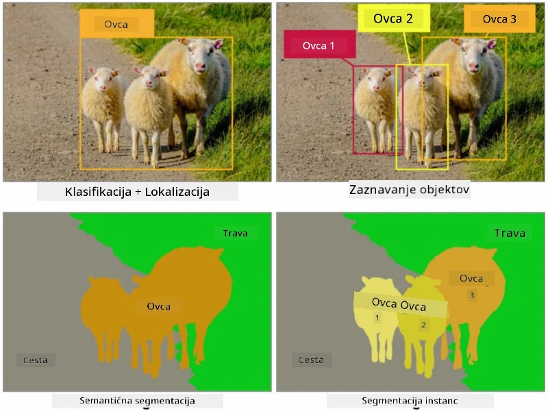
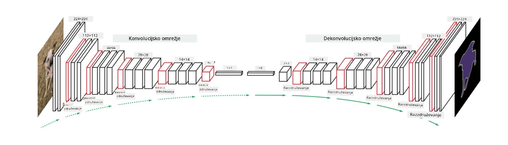

# Segmentacija

Prej smo se učili o zaznavanju objektov, ki nam omogoča lociranje objektov na sliki z napovedovanjem njihovih *omejevalnih okvirjev*. Vendar pa za nekatere naloge ne potrebujemo le omejevalnih okvirjev, temveč tudi bolj natančno lokalizacijo objektov. Ta naloga se imenuje **segmentacija**.

## [Predhodni kviz](https://ff-quizzes.netlify.app/en/ai/quiz/23)

Segmentacijo lahko obravnavamo kot **klasifikacijo pikslov**, kjer moramo za **vsak** piksel slike napovedati njegov razred (*ozadje* je eden od razredov). Obstajata dva glavna algoritma za segmentacijo:

* **Semantična segmentacija** določa le razred pikslov in ne razlikuje med različnimi objekti istega razreda.
* **Segmentacija instanc** razdeli razrede na različne instance.

Pri segmentaciji instanc so te ovce različni objekti, medtem ko pri semantični segmentaciji vse ovce predstavljajo en razred.

> Slika iz [tega bloga](https://nirmalamurali.medium.com/image-classification-vs-semantic-segmentation-vs-instance-segmentation-625c33a08d50)

Obstajajo različne nevronske arhitekture za segmentacijo, vendar imajo vse enako strukturo. Na nek način je podobno avtoenkoderju, o katerem ste se učili prej, vendar namesto razgradnje izvirne slike naš cilj je razgradnja **maske**. Tako ima segmentacijsko omrežje naslednje dele:

* **Kodirnik** izlušči značilnosti iz vhodne slike.
* **Dekodirnik** pretvori te značilnosti v **sliko maske**, ki ima enako velikost in število kanalov, ki ustrezajo številu razredov.

> Slika iz [tega prispevka](https://arxiv.org/pdf/2001.05566.pdf)

Posebej moramo omeniti funkcijo izgube, ki se uporablja za segmentacijo. Pri uporabi klasičnih avtoenkoderjev moramo meriti podobnost med dvema slikama, za kar lahko uporabimo povprečno kvadratno napako (MSE). Pri segmentaciji vsak piksel v ciljni sliki maske predstavlja številko razreda (ena-vroča kodirana po tretji dimenziji), zato moramo uporabiti funkcije izgube, specifične za klasifikacijo - funkcijo izgube križne entropije, povprečeno čez vse piksle. Če je maska binarna, se uporablja **funkcija izgube binarne križne entropije** (BCE).

> ✅ Ena-vroča kodiranje je način kodiranja oznake razreda v vektor dolžine, ki ustreza številu razredov. Oglejte si [ta članek](https://datagy.io/sklearn-one-hot-encode/) o tej tehniki.

## Segmentacija v medicinskem slikanju

V tej lekciji bomo videli segmentacijo v praksi, ko bomo trenirali omrežje za prepoznavanje človeških nevusov (znanih tudi kot znamenja) na medicinskih slikah. Uporabili bomo <a href="https://www.fc.up.pt/addi/ph2%20database.html">PH2 bazo podatkov</a> dermoskopskih slik kot vir slik. Ta podatkovna zbirka vsebuje 200 slik treh razredov: tipični nevus, atipični nevus in melanom. Vse slike vsebujejo tudi ustrezno **masko**, ki označuje nevus.

> ✅ Ta tehnika je še posebej primerna za tovrstno medicinsko slikanje, vendar katere druge aplikacije v resničnem svetu si lahko zamislite?

> Slika iz PH2 baze podatkov

Trenirali bomo model za segmentacijo nevusa iz ozadja.

## ✍️ Vaje: Semantična segmentacija

Odprite spodnje zvezke, da se naučite več o različnih arhitekturah semantične segmentacije, vadite delo z njimi in jih vidite v praksi.

* [Semantična segmentacija Pytorch](SemanticSegmentationPytorch.ipynb)
* [Semantična segmentacija TensorFlow](SemanticSegmentationTF.ipynb)

## [Naknadni kviz](https://ff-quizzes.netlify.app/en/ai/quiz/24)

## Zaključek

Segmentacija je zelo močna tehnika za klasifikacijo slik, ki presega omejevalne okvirje in omogoča klasifikacijo na ravni pikslov. To je tehnika, ki se uporablja v medicinskem slikanju in drugih aplikacijah.

## 🚀 Izziv

Segmentacija telesa je le ena izmed pogostih nalog, ki jih lahko izvedemo s slikami ljudi. Druge pomembne naloge vključujejo **zaznavanje skeleta** in **zaznavanje drže**. Preizkusite knjižnico [OpenPose](https://github.com/CMU-Perceptual-Computing-Lab/openpose), da vidite, kako se lahko uporablja zaznavanje drže.

## Pregled in samostojno učenje

Ta [članek na Wikipediji](https://wikipedia.org/wiki/Image_segmentation) ponuja dober pregled različnih aplikacij te tehnike. Naučite se več o podpodročjih segmentacije instanc in panoptične segmentacije na tem področju raziskovanja.

## [Naloga](lab/README.md)

V tem laboratoriju poskusite **segmentacijo človeškega telesa** z uporabo [Segmentation Full Body MADS Dataset](https://www.kaggle.com/datasets/tapakah68/segmentation-full-body-mads-dataset) iz Kaggle.

---

