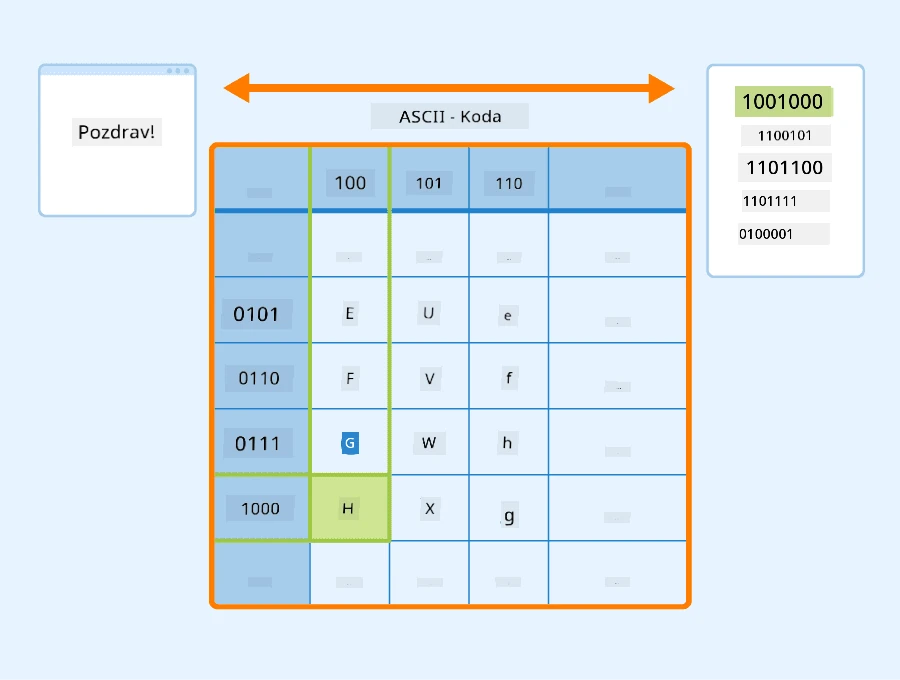
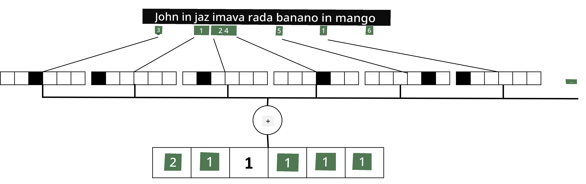

# Predstavljanje besedila kot tenzorjev

## [Predhodni kviz](https://ff-quizzes.netlify.app/en/ai/quiz/25)

## Razvrščanje besedila

V prvem delu tega poglavja se bomo osredotočili na nalogo **razvrščanja besedila**. Uporabili bomo [AG News](https://www.kaggle.com/amananandrai/ag-news-classification-dataset) podatkovni niz, ki vsebuje novice, kot je naslednja:

* Kategorija: Znanost/Tehnologija
* Naslov: Ky. podjetje prejme subvencijo za raziskovanje peptidov (AP)
* Telo: AP - Podjetje, ki ga je ustanovil raziskovalec kemije na Univerzi v Louisvilleu, je prejelo subvencijo za razvoj...

Naš cilj bo razvrstiti novico v eno od kategorij na podlagi besedila.

## Predstavljanje besedila

Če želimo reševati naloge obdelave naravnega jezika (NLP) z nevronskimi mrežami, potrebujemo način za predstavljanje besedila kot tenzorjev. Računalniki že predstavljajo besedilne znake kot številke, ki se preslikajo v pisave na vašem zaslonu z uporabo kodiranj, kot sta ASCII ali UTF-8.

> [Vir slike](https://www.seobility.net/en/wiki/ASCII)

Kot ljudje razumemo, kaj vsak posamezen znak **predstavlja** in kako se vsi znaki združijo v besede stavka. Računalniki pa sami po sebi nimajo takšnega razumevanja, zato mora nevronska mreža pomen naučiti med treningom.

Zato lahko uporabimo različne pristope pri predstavljanju besedila:

* **Predstavitev na ravni znakov**, kjer besedilo predstavljamo tako, da vsak znak obravnavamo kot številko. Če imamo *C* različnih znakov v našem korpusu besedila, bi bila beseda *Hello* predstavljena kot 5x*C* tenzor. Vsaka črka bi ustrezala stolpcu tenzorja v enovrstični kodiranju.
* **Predstavitev na ravni besed**, kjer ustvarimo **besednjak** vseh besed v našem besedilu in nato besede predstavimo z enovrstičnim kodiranjem. Ta pristop je nekoliko boljši, saj posamezna črka sama po sebi nima velikega pomena, zato z uporabo višjih semantičnih konceptov - besed - poenostavimo nalogo za nevronsko mrežo. Vendar pa moramo zaradi velikega slovarja obravnavati visoko-dimenzionalne redke tenzorje.

Ne glede na predstavitev moramo najprej pretvoriti besedilo v zaporedje **tokenov**, pri čemer je en token lahko znak, beseda ali včasih celo del besede. Nato token pretvorimo v številko, običajno z uporabo **besednjaka**, in to številko lahko vnesemo v nevronsko mrežo z enovrstičnim kodiranjem.

## N-Grami

V naravnem jeziku je natančen pomen besed mogoče določiti le v kontekstu. Na primer, pomena *nevronska mreža* in *ribiška mreža* sta popolnoma različna. Eden od načinov, kako to upoštevati, je, da naš model zgradimo na parih besed in obravnavamo pare besed kot ločene token-e besednjaka. Na ta način bo stavek *Rad grem na ribolov* predstavljen z naslednjim zaporedjem tokenov: *Rad grem*, *grem na*, *na ribolov*. Težava pri tem pristopu je, da se velikost slovarja znatno poveča, kombinacije, kot sta *na ribolov* in *na nakupovanje*, pa so predstavljene z različnimi tokeni, ki ne delijo nobene semantične podobnosti kljub istemu glagolu.

V nekaterih primerih lahko razmislimo o uporabi tri-gramov -- kombinacij treh besed -- prav tako. Zato se takšen pristop pogosto imenuje **n-grami**. Smiselno je tudi uporabljati n-grame pri predstavitvi na ravni znakov, pri čemer n-grame približno ustrezajo različnim zlogom.

## Vreča besed in TF/IDF

Pri reševanju nalog, kot je razvrščanje besedila, moramo biti sposobni predstaviti besedilo z enim vektorjem fiksne velikosti, ki ga bomo uporabili kot vhod za končni gosti klasifikator. Eden najpreprostejših načinov za to je združiti vse posamezne predstavitve besed, npr. z njihovim seštevanjem. Če seštejemo enovrstične kodiranja vsake besede, bomo dobili vektor frekvenc, ki prikazuje, kolikokrat se vsaka beseda pojavi v besedilu. Takšna predstavitev besedila se imenuje **vreča besed** (BoW).

> Slika avtorja

BoW v bistvu predstavlja, katere besede se pojavijo v besedilu in v kakšnih količinah, kar je lahko dober pokazatelj, o čem govori besedilo. Na primer, novica o politiki bo verjetno vsebovala besede, kot sta *predsednik* in *država*, medtem ko bo znanstvena publikacija imela nekaj, kot sta *trkalnik*, *odkritje* itd. Tako so frekvence besed v mnogih primerih lahko dober pokazatelj vsebine besedila.

Težava pri BoW je, da se določene pogoste besede, kot sta *in*, *je* itd., pojavljajo v večini besedil in imajo najvišje frekvence, kar zakrije besede, ki so resnično pomembne. Pomembnost teh besed lahko zmanjšamo tako, da upoštevamo frekvenco, s katero se besede pojavljajo v celotni zbirki dokumentov. To je glavna ideja pristopa TF/IDF, ki je podrobneje obravnavan v priloženih zvezkih k tej lekciji.

Vendar pa noben od teh pristopov ne more v celoti upoštevati **semantike** besedila. Za to potrebujemo močnejše modele nevronskih mrež, o katerih bomo razpravljali kasneje v tem poglavju.

## ✍️ Vaje: Predstavitev besedila

Nadaljujte z učenjem v naslednjih zvezkih:

* [Predstavitev besedila s PyTorch](TextRepresentationPyTorch.ipynb)
* [Predstavitev besedila s TensorFlow](TextRepresentationTF.ipynb)

## Zaključek

Doslej smo preučili tehnike, ki lahko dodajo težo frekvencam različnih besed. Vendar pa te tehnike ne morejo predstaviti pomena ali vrstnega reda. Kot je slavni lingvist J. R. Firth dejal leta 1935: "Popolni pomen besede je vedno kontekstualen, in nobena študija pomena brez konteksta ne more biti resna." Kasneje v tečaju se bomo naučili, kako zajeti kontekstualne informacije iz besedila z uporabo jezikovnega modeliranja.

## 🚀 Izziv

Preizkusite nekaj drugih vaj z uporabo vreče besed in različnih podatkovnih modelov. Navdih lahko najdete v tem [tekmovanju na Kaggle](https://www.kaggle.com/competitions/word2vec-nlp-tutorial/overview/part-1-for-beginners-bag-of-words)

## [Kviz po predavanju](https://ff-quizzes.netlify.app/en/ai/quiz/26)

## Pregled in samostojno učenje

Vadite svoje veščine z vgrajevanjem besedila in tehnikami vreče besed na [Microsoft Learn](https://docs.microsoft.com/learn/modules/intro-natural-language-processing-pytorch/?WT.mc_id=academic-77998-cacaste)

## [Naloga: Zvezki](assignment.md)

---

