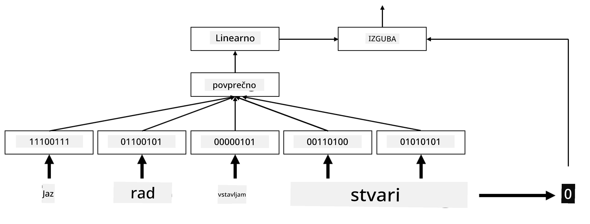
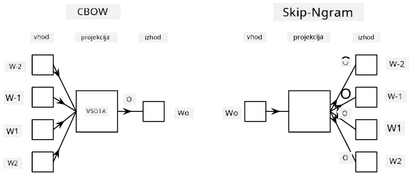

# Vdelave

## [Predhodni kviz](https://ff-quizzes.netlify.app/en/ai/quiz/27)

Pri treniranju klasifikatorjev na osnovi BoW ali TF/IDF smo delali z visoko-dimenzionalnimi vektorji vreče besed dolžine `vocab_size`, pri čemer smo izrecno pretvarjali nizko-dimenzionalne vektorje pozicijske reprezentacije v redke enovročne reprezentacije. Ta enovročna reprezentacija pa ni učinkovita glede porabe pomnilnika. Poleg tega se vsaka beseda obravnava neodvisno od drugih, tj. enovročno kodirani vektorji ne izražajo nobene semantične podobnosti med besedami.

Ideja **vdelave** je, da besede predstavimo z nizko-dimenzionalnimi gostimi vektorji, ki nekako odražajo semantični pomen besede. Kasneje bomo razpravljali o tem, kako zgraditi smiselne vdelave besed, za zdaj pa si vdelave predstavljajmo kot način za zmanjšanje dimenzionalnosti vektorja besede.

Tako bi plast vdelave sprejela besedo kot vhod in ustvarila izhodni vektor določene velikosti `embedding_size`. Na nek način je to zelo podobno plasti `Linear`, vendar namesto da bi sprejela enovročno kodiran vektor, lahko sprejme številko besede kot vhod, kar nam omogoča, da se izognemo ustvarjanju velikih enovročno kodiranih vektorjev.

Z uporabo plasti vdelave kot prve plasti v našem klasifikacijskem omrežju lahko preklopimo iz modela vreče besed na model **vreče vdelav**, kjer najprej vsako besedo v našem besedilu pretvorimo v ustrezno vdelavo, nato pa izračunamo neko agregatno funkcijo nad vsemi temi vdelavami, kot so `sum`, `average` ali `max`.  

> Slika avtorja

## ✍️ Vaje: Vdelave

Nadaljujte z učenjem v naslednjih zvezkih:
* [Vdelave s PyTorch](EmbeddingsPyTorch.ipynb)
* [Vdelave s TensorFlow](EmbeddingsTF.ipynb)

## Semantične vdelave: Word2Vec

Medtem ko se je plast vdelave naučila preslikati besede v vektorsko reprezentacijo, ta reprezentacija ni nujno imela veliko semantičnega pomena. Lepo bi bilo naučiti vektorsko reprezentacijo, pri kateri so podobne besede ali sopomenke predstavljene z vektorji, ki so si blizu glede na neko vektorsko razdaljo (npr. Evklidsko razdaljo).

Da bi to dosegli, moramo naš model vdelave predhodno trenirati na veliki zbirki besedil na specifičen način. Eden od načinov za treniranje semantičnih vdelav se imenuje [Word2Vec](https://en.wikipedia.org/wiki/Word2vec). Temelji na dveh glavnih arhitekturah, ki se uporabljata za ustvarjanje porazdeljene reprezentacije besed:

 - **Neprekinjena vreča besed** (CBoW) — pri tej arhitekturi treniramo model, da napove besedo iz okoliškega konteksta. Glede na ngram $(W_{-2},W_{-1},W_0,W_1,W_2)$ je cilj modela napovedati $W_0$ iz $(W_{-2},W_{-1},W_1,W_2)$.
 - **Neprekinjeni preskok-gram** je nasproten CBoW. Model uporablja okoliško okno kontekstnih besed za napoved trenutne besede.

CBoW je hitrejši, medtem ko je preskok-gram počasnejši, vendar bolje predstavlja redke besede.

> Slika iz [tega članka](https://arxiv.org/pdf/1301.3781.pdf)

Predhodno trenirane vdelave Word2Vec (kot tudi drugi podobni modeli, kot je GloVe) se lahko uporabljajo namesto plasti vdelave v nevronskih omrežjih. Vendar pa se moramo ukvarjati z besedišči, saj se besedišče, uporabljeno za predhodno treniranje Word2Vec/GloVe, verjetno razlikuje od besedišča v naši zbirki besedil. Oglejte si zgornje zvezke, da vidite, kako se ta problem lahko reši.

## Kontekstualne vdelave

Ena ključna omejitev tradicionalnih predhodno treniranih vdelav, kot je Word2Vec, je problem razločevanja pomenov besed. Medtem ko predhodno trenirane vdelave lahko zajamejo nekaj pomena besed v kontekstu, je vsak možen pomen besede kodiran v isto vdelavo. To lahko povzroči težave v nadaljnjih modelih, saj imajo mnoge besede, kot je beseda 'play', različne pomene glede na kontekst, v katerem se uporabljajo.

Na primer, beseda 'play' v teh dveh stavkih ima precej različne pomene:

- Šel sem na **igro** v gledališče.
- Janez želi **igrati** s svojimi prijatelji.

Predhodno trenirane vdelave zgoraj predstavljajo oba pomena besede 'play' v isti vdelavi. Da bi premagali to omejitev, moramo zgraditi vdelave na osnovi **jezikovnega modela**, ki je treniran na veliki zbirki besedil in *ve*, kako se besede lahko povezujejo v različnih kontekstih. Razprava o kontekstualnih vdelavah presega obseg tega tečaja, vendar se bomo k njim vrnili, ko bomo govorili o jezikovnih modelih kasneje v tečaju.

## Zaključek

V tej lekciji ste odkrili, kako zgraditi in uporabljati plasti vdelave v TensorFlow in Pytorch za boljše odražanje semantičnih pomenov besed.

## 🚀 Izziv

Word2Vec je bil uporabljen za nekaj zanimivih aplikacij, vključno z generiranjem besedil pesmi in poezije. Oglejte si [ta članek](https://www.politetype.com/blog/word2vec-color-poems), ki opisuje, kako je avtor uporabil Word2Vec za generiranje poezije. Oglejte si tudi [ta video Dana Shiffmanna](https://www.youtube.com/watch?v=LSS_bos_TPI&ab_channel=TheCodingTrain), da odkrijete drugačno razlago te tehnike. Nato poskusite te tehnike uporabiti na svoji zbirki besedil, morda pridobljeni iz Kaggle.

## [Naknadni kviz](https://ff-quizzes.netlify.app/en/ai/quiz/28)

## Pregled in samostojno učenje

Preberite ta članek o Word2Vec: [Efficient Estimation of Word Representations in Vector Space](https://arxiv.org/pdf/1301.3781.pdf)

## [Naloga: Zvezki](assignment.md)

---

