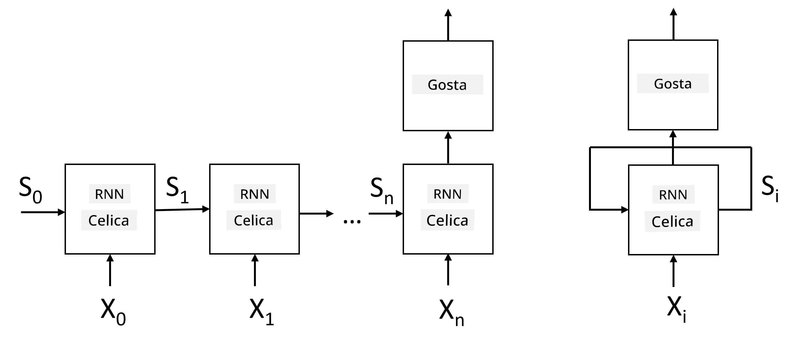
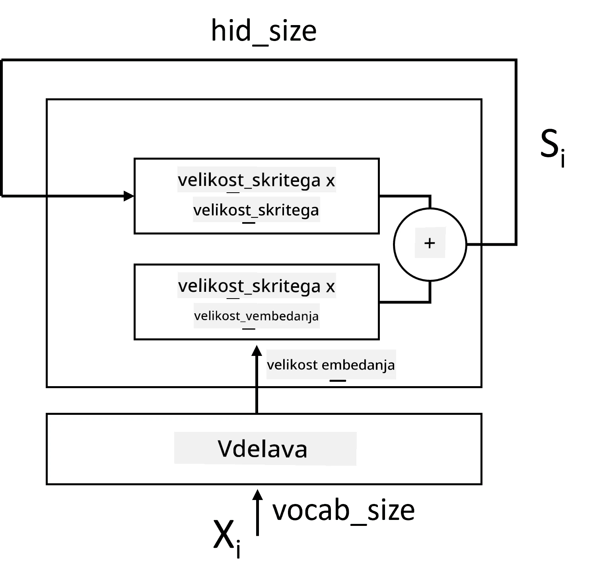
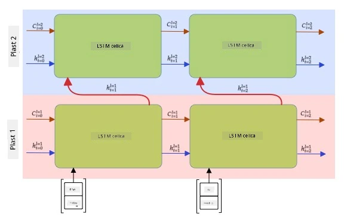

# Rekurentne nevronske mreže

## [Predhodni kviz](https://ff-quizzes.netlify.app/en/ai/quiz/31)

V prejšnjih poglavjih smo uporabljali bogate semantične reprezentacije besedila in preprost linearni klasifikator na vrhu vgrajenih predstavitev. Ta arhitektura zajame združeni pomen besed v stavku, vendar ne upošteva **vrstnega reda** besed, saj operacija združevanja na vrhu vgrajenih predstavitev odstrani to informacijo iz izvirnega besedila. Ker ti modeli ne morejo modelirati vrstnega reda besed, ne morejo rešiti bolj zapletenih ali dvoumnih nalog, kot so generiranje besedila ali odgovarjanje na vprašanja.

Da bi zajeli pomen zaporedja besedila, moramo uporabiti drugo arhitekturo nevronske mreže, imenovano **rekurentna nevronska mreža** ali RNN. Pri RNN stavke pošiljamo skozi mrežo en simbol naenkrat, mreža pa ustvari neko **stanje**, ki ga nato ponovno pošljemo v mrežo skupaj z naslednjim simbolom.

> Slika avtorja

Glede na vhodno zaporedje simbolov X0,...,Xn, RNN ustvari zaporedje blokov nevronske mreže in to zaporedje trenira od začetka do konca z uporabo povratnega razširjanja napake. Vsak blok mreže sprejme par (Xi,Si) kot vhod in ustvari Si+1 kot rezultat. Končno stanje Sn ali (izhod Yn) gre v linearni klasifikator, da ustvari rezultat. Vsi bloki mreže delijo iste uteži in se trenirajo od začetka do konca z enim prehodom povratnega razširjanja napake.

Ker se vektorska stanja S0,...,Sn prenašajo skozi mrežo, lahko ta model uči zaporedne odvisnosti med besedami. Na primer, ko se beseda *ne* pojavi nekje v zaporedju, se lahko nauči negirati določene elemente znotraj vektorskega stanja, kar vodi do negacije.

> ✅ Ker so uteži vseh blokov RNN na zgornji sliki enake, lahko isto sliko predstavimo kot en blok (na desni) z rekurenčno povratno zanko, ki prenaša izhodno stanje mreže nazaj na vhod.

## Anatomija RNN celice

Poglejmo, kako je organizirana preprosta RNN celica. Sprejme prejšnje stanje Si-1 in trenutni simbol Xi kot vhoda ter mora ustvariti izhodno stanje Si (včasih nas zanima tudi kakšen drug izhod Yi, kot v primeru generativnih mrež).

Preprosta RNN celica ima znotraj dve matriki uteži: ena transformira vhodni simbol (imenujmo jo W), druga pa transformira vhodno stanje (H). V tem primeru se izhod mreže izračuna kot &sigma;(W&times;Xi+H&times;Si-1+b), kjer je &sigma; aktivacijska funkcija, b pa dodatna pristranskost.

> Slika avtorja

V mnogih primerih se vhodni simboli pošljejo skozi plast vgrajenih predstavitev, preden vstopijo v RNN, da se zmanjša dimenzionalnost. V tem primeru, če je dimenzija vhodnih vektorjev *emb_size*, dimenzija vektorskega stanja pa *hid_size*, je velikost W *emb_size*&times;*hid_size*, velikost H pa *hid_size*&times;*hid_size*.

## Dolgoročni kratkoročni spomin (LSTM)

Ena glavnih težav klasičnih RNN je tako imenovana težava **izginjajočih gradientov**. Ker se RNN trenirajo od začetka do konca z enim prehodom povratnega razširjanja napake, imajo težave pri prenašanju napake do prvih slojev mreže, zato mreža ne more učiti odnosov med oddaljenimi simboli. Eden od načinov za izogibanje tej težavi je uvedba **eksplicitnega upravljanja stanja** z uporabo tako imenovanih **vrat**. Obstajata dve dobro znani arhitekturi te vrste: **Dolgoročni kratkoročni spomin** (LSTM) in **Enota z vrati za prenos** (GRU).

> Vir slike TBD

LSTM mreža je organizirana podobno kot RNN, vendar se iz sloja v sloj prenašata dve stanji: dejansko stanje C in skriti vektor H. Pri vsaki enoti se skriti vektor Hi združi z vhodom Xi, in skupaj nadzorujeta, kaj se zgodi s stanjem C prek **vrat**. Vsaka vrata so nevronska mreža s sigmoidno aktivacijo (izhod v območju [0,1]), ki jih lahko obravnavamo kot bitno masko, ko jih pomnožimo z vektorskim stanjem. Na sliki zgoraj so naslednja vrata (od leve proti desni):

* **Vrata za pozabo** sprejmejo skriti vektor in določijo, katere komponente vektorja C moramo pozabiti in katere prenesti naprej.
* **Vrata za vnos** vzamejo nekaj informacij iz vhodnih in skritih vektorjev ter jih vstavijo v stanje.
* **Vrata za izhod** transformirajo stanje prek linearne plasti z aktivacijo *tanh*, nato pa izberejo nekatere njegove komponente z uporabo skritega vektorja Hi, da ustvarijo novo stanje Ci+1.

Komponente stanja C lahko obravnavamo kot neke vrste zastavice, ki jih lahko vklopimo ali izklopimo. Na primer, ko v zaporedju naletimo na ime *Alice*, lahko domnevamo, da gre za ženski lik, in dvignemo zastavico v stanju, da imamo v stavku ženski samostalnik. Ko kasneje naletimo na frazo *in Tom*, dvignemo zastavico, da imamo množinski samostalnik. Tako lahko z manipulacijo stanja sledimo slovničnim lastnostim delov stavka.

> ✅ Odličen vir za razumevanje notranjosti LSTM je ta odličen članek [Razumevanje LSTM mrež](https://colah.github.io/posts/2015-08-Understanding-LSTMs/) avtorja Christopherja Olaha.

## Dvosmerne in večslojne RNN

Razpravljali smo o rekurentnih mrežah, ki delujejo v eno smer, od začetka zaporedja do konca. To se zdi naravno, saj spominja na način, kako beremo in poslušamo govor. Vendar pa, ker imamo v mnogih praktičnih primerih naključni dostop do vhodnega zaporedja, bi bilo smiselno izvajati rekurenčno računanje v obeh smereh. Takšne mreže imenujemo **dvosmerne** RNN. Pri delu z dvosmerno mrežo bi potrebovali dva skrita vektorska stanja, po enega za vsako smer.

Rekurentna mreža, bodisi enosmerna ali dvosmerna, zajame določene vzorce znotraj zaporedja in jih lahko shrani v vektorsko stanje ali prenese v izhod. Tako kot pri konvolucijskih mrežah lahko na prvo plast zgradimo drugo rekurentno plast, da zajamemo vzorce višje ravni in gradimo na nizkoročnih vzorcih, ki jih je zajela prva plast. To nas pripelje do pojma **večslojne RNN**, ki je sestavljena iz dveh ali več rekurentnih mrež, kjer se izhod prejšnje plasti prenese v naslednjo plast kot vhod.

*Slika iz [tega čudovitega prispevka](https://towardsdatascience.com/from-a-lstm-cell-to-a-multilayer-lstm-network-with-pytorch-2899eb5696f3) avtorja Fernanda Lópeza*

## ✍️ Vaje: Vgrajene predstavitve

Nadaljujte z učenjem v naslednjih zvezkih:

* [RNN z uporabo PyTorch](RNNPyTorch.ipynb)
* [RNN z uporabo TensorFlow](RNNTF.ipynb)

## Zaključek

V tej enoti smo videli, da lahko RNN uporabimo za klasifikacijo zaporedij, vendar lahko dejansko obravnavajo še veliko več nalog, kot so generiranje besedila, strojno prevajanje in drugo. Te naloge bomo obravnavali v naslednji enoti.

## 🚀 Izziv

Preberite nekaj literature o LSTM in razmislite o njihovih aplikacijah:

- [Grid Long Short-Term Memory](https://arxiv.org/pdf/1507.01526v1.pdf)
- [Show, Attend and Tell: Neural Image Caption
Generation with Visual Attention](https://arxiv.org/pdf/1502.03044v2.pdf)

## [Kviz po predavanju](https://ff-quizzes.netlify.app/en/ai/quiz/32)

## Pregled in samostojno učenje

- [Razumevanje LSTM mrež](https://colah.github.io/posts/2015-08-Understanding-LSTMs/) avtorja Christopherja Olaha.

## [Naloga: Zvezki](assignment.md)

---

