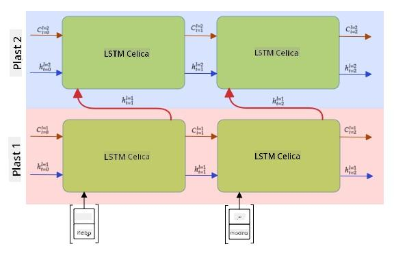

<!--
CO_OP_TRANSLATOR_METADATA:
{
  "original_hash": "58bf4adb210aab53e8f78c8082040e7c",
  "translation_date": "2025-08-25T21:35:06+00:00",
  "source_file": "lessons/5-NLP/16-RNN/README.md",
  "language_code": "sl"
}
-->
# Rekurentne nevronske mreže

## [Predhodni kviz](https://ff-quizzes.netlify.app/en/ai/quiz/31)

V prejšnjih poglavjih smo uporabljali bogate semantične reprezentacije besedila in preprost linearni klasifikator na vrhu vgrajenih predstavitev. Ta arhitektura zajame združeni pomen besed v stavku, vendar ne upošteva **zaporedja** besed, saj operacija združevanja na vrhu vgrajenih predstavitev odstrani te informacije iz izvirnega besedila. Ker ti modeli ne morejo modelirati vrstnega reda besed, ne morejo reševati bolj zapletenih ali dvoumnih nalog, kot so generiranje besedila ali odgovarjanje na vprašanja.

Za zajemanje pomena zaporedja besedila moramo uporabiti drugo arhitekturo nevronske mreže, imenovano **rekurentna nevronska mreža** ali RNN. Pri RNN stavek pošiljamo skozi mrežo en simbol naenkrat, mreža pa ustvari neko **stanje**, ki ga nato skupaj z naslednjim simbolom ponovno pošljemo v mrežo.

> Slika avtorja

Glede na vhodno zaporedje simbolov X0,...,Xn, RNN ustvari zaporedje blokov nevronske mreže in to zaporedje trenira od začetka do konca z uporabo povratnega razširjanja napake. Vsak blok mreže sprejme par (Xi,Si) kot vhod in ustvari Si+1 kot rezultat. Končno stanje Sn (ali izhod Yn) gre v linearni klasifikator za ustvarjanje rezultata. Vsi bloki mreže delijo iste uteži in se trenirajo od začetka do konca z enim prehodom povratnega razširjanja napake.

Ker se vektorska stanja S0,...,Sn prenašajo skozi mrežo, lahko ta modelira zaporedne odvisnosti med besedami. Na primer, ko se v zaporedju pojavi beseda *ne*, se lahko nauči negirati določene elemente v vektorskem stanju, kar povzroči negacijo.

> ✅ Ker so uteži vseh RNN blokov na zgornji sliki enake, lahko isto sliko predstavimo kot en blok (na desni) z rekurzivno povratno zanko, ki izhodno stanje mreže pošlje nazaj na vhod.

## Anatomija RNN celice

Poglejmo, kako je organizirana preprosta RNN celica. Sprejme prejšnje stanje Si-1 in trenutni simbol Xi kot vhoda ter mora ustvariti izhodno stanje Si (včasih nas zanima tudi kakšen drug izhod Yi, kot v primeru generativnih mrež).

Preprosta RNN celica ima znotraj dve matriki uteži: ena transformira vhodni simbol (poimenujmo jo W), druga pa transformira vhodno stanje (H). V tem primeru se izhod mreže izračuna kot σ(W×Xi+H×Si-1+b), kjer je σ aktivacijska funkcija, b pa dodatni pristranski člen.

> Slika avtorja

V mnogih primerih se vhodni simboli pred vstopom v RNN pošljejo skozi plast vgrajenih predstavitev, da se zmanjša dimenzionalnost. V tem primeru, če je dimenzija vhodnih vektorjev *emb_size* in dimenzija stanja *hid_size*, je velikost W *emb_size*×*hid_size*, velikost H pa *hid_size*×*hid_size*.

## Dolgoročni kratkoročni spomin (LSTM)

Ena glavnih težav klasičnih RNN je tako imenovana težava **izginjajočih gradientov**. Ker se RNN trenirajo od začetka do konca z enim prehodom povratnega razširjanja napake, imajo težave s prenašanjem napake na prve plasti mreže, zato se mreža ne more naučiti odnosov med oddaljenimi simboli. Ena od rešitev te težave je uvedba **eksplicitnega upravljanja stanja** z uporabo tako imenovanih **vrat**. Obstajata dve dobro znani arhitekturi te vrste: **dolgoročni kratkoročni spomin** (LSTM) in **enota z vrati za posredovanje** (GRU).

> Vir slike TBD

LSTM mreža je organizirana podobno kot RNN, vendar se iz plasti v plast prenašata dve stanji: dejansko stanje C in skriti vektor H. Pri vsaki enoti se skriti vektor Hi združi z vhodom Xi, nato pa nadzorujeta, kaj se zgodi s stanjem C prek **vrat**. Vsaka vrata so nevronska mreža s sigmoidno aktivacijo (izhod v območju [0,1]), ki jih lahko razumemo kot bitno masko, ko jih pomnožimo z vektorskim stanjem. Na sliki zgoraj so naslednja vrata (od leve proti desni):

* **Vrata za pozabo** sprejmejo skriti vektor in določijo, katere komponente vektorja C je treba pozabiti in katere prenesti naprej.
* **Vhodna vrata** vzamejo nekaj informacij iz vhodnega in skritega vektorja ter jih vstavijo v stanje.
* **Izhodna vrata** transformirajo stanje prek linearne plasti s *tanh* aktivacijo, nato pa izberejo nekatere njegove komponente z uporabo skritega vektorja Hi, da ustvarijo novo stanje Ci+1.

Komponente stanja C lahko razumemo kot zastavice, ki jih lahko vklopimo in izklopimo. Na primer, ko v zaporedju naletimo na ime *Alice*, lahko predpostavimo, da se nanaša na ženski lik, in dvignemo zastavico v stanju, da imamo v stavku ženski samostalnik. Ko kasneje naletimo na frazo *in Tom*, dvignemo zastavico, da imamo množinski samostalnik. Tako lahko z manipulacijo stanja sledimo slovničnim lastnostim delov stavka.

> ✅ Odličen vir za razumevanje notranjega delovanja LSTM je ta odličen članek [Understanding LSTM Networks](https://colah.github.io/posts/2015-08-Understanding-LSTMs/) avtorja Christopherja Olaha.

## Dvosmerni in večplastni RNN

Razpravljali smo o rekurzivnih mrežah, ki delujejo v eno smer, od začetka zaporedja do konca. To se zdi naravno, saj posnema način, kako beremo in poslušamo govor. Vendar pa ima v mnogih praktičnih primerih smisel izvajati rekurzivno računanje v obe smeri. Takšne mreže imenujemo **dvosmerne** RNN. Pri delu z dvosmerno mrežo potrebujemo dva skrita vektorska stanja, enega za vsako smer.

Rekurzivna mreža, bodisi enosmerna bodisi dvosmerna, zajame določene vzorce znotraj zaporedja in jih lahko shrani v vektorsko stanje ali prenese v izhod. Tako kot pri konvolucijskih mrežah lahko na prvo plast zgradimo drugo rekurzivno plast, da zajamemo vzorce višje ravni in gradimo na nizkonivojskih vzorcih, ki jih je izločila prva plast. To nas pripelje do pojma **večplastnega RNN**, ki je sestavljen iz dveh ali več rekurzivnih mrež, kjer se izhod prejšnje plasti prenese v naslednjo plast kot vhod.

*Slika iz [tega čudovitega prispevka](https://towardsdatascience.com/from-a-lstm-cell-to-a-multilayer-lstm-network-with-pytorch-2899eb5696f3) avtorja Fernanda Lópeza*

## ✍️ Vaje: Vgrajene predstavitve

Nadaljujte z učenjem v naslednjih zvezkih:

* [RNN-ji s PyTorch](../../../../../lessons/5-NLP/16-RNN/RNNPyTorch.ipynb)
* [RNN-ji s TensorFlow](../../../../../lessons/5-NLP/16-RNN/RNNTF.ipynb)

## Zaključek

V tej enoti smo videli, da lahko RNN uporabljamo za klasifikacijo zaporedij, vendar lahko v resnici obravnavajo še veliko več nalog, kot so generiranje besedila, strojno prevajanje in drugo. Te naloge bomo obravnavali v naslednji enoti.

## 🚀 Izziv

Preberite nekaj literature o LSTM-jih in razmislite o njihovih aplikacijah:

- [Grid Long Short-Term Memory](https://arxiv.org/pdf/1507.01526v1.pdf)
- [Show, Attend and Tell: Neural Image Caption
Generation with Visual Attention](https://arxiv.org/pdf/1502.03044v2.pdf)

## [Kviz po predavanju](https://ff-quizzes.netlify.app/en/ai/quiz/32)

## Pregled in samostojno učenje

- [Understanding LSTM Networks](https://colah.github.io/posts/2015-08-Understanding-LSTMs/) avtorja Christopherja Olaha.

## [Naloga: Zvezki](assignment.md)

**Omejitev odgovornosti**:  
Ta dokument je bil preveden z uporabo storitve AI za prevajanje [Co-op Translator](https://github.com/Azure/co-op-translator). Čeprav si prizadevamo za natančnost, vas prosimo, da upoštevate, da lahko avtomatizirani prevodi vsebujejo napake ali netočnosti. Izvirni dokument v njegovem izvirnem jeziku je treba obravnavati kot avtoritativni vir. Za ključne informacije priporočamo profesionalni človeški prevod. Ne prevzemamo odgovornosti za morebitna nesporazumevanja ali napačne razlage, ki bi nastale zaradi uporabe tega prevoda.