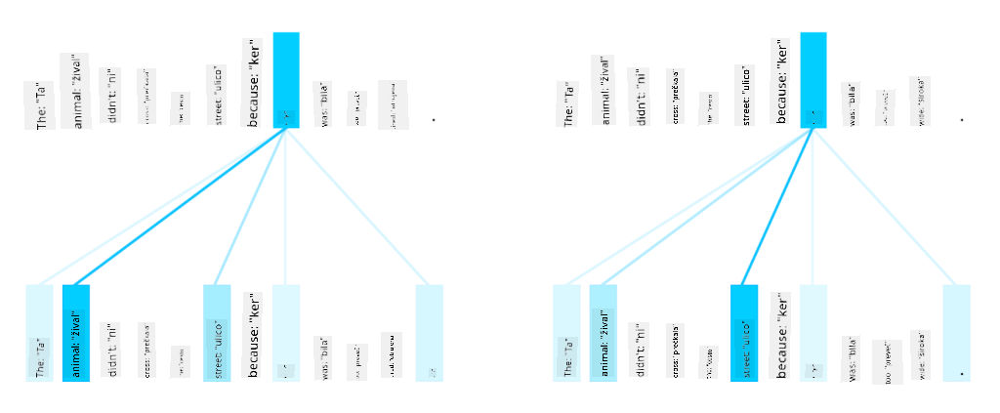
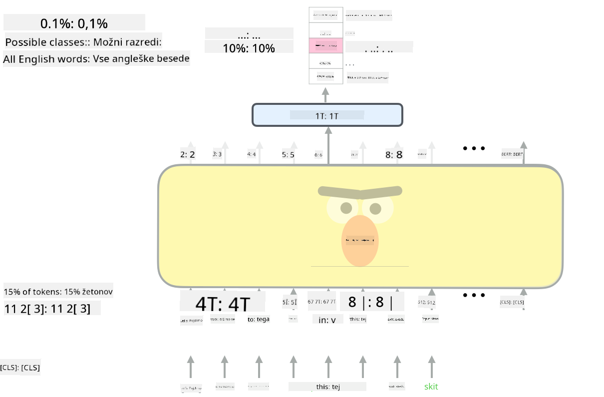

<!--
CO_OP_TRANSLATOR_METADATA:
{
  "original_hash": "7e617f0b8de85a43957a853aba09bfeb",
  "translation_date": "2025-08-25T22:03:30+00:00",
  "source_file": "lessons/5-NLP/18-Transformers/README.md",
  "language_code": "sl"
}
-->
# Mehanizmi pozornosti in transformatorji

## [Predavanje kviz](https://red-field-0a6ddfd03.1.azurestaticapps.net/quiz/118)

Eden najpomembnejših problemov na področju NLP je **strojno prevajanje**, ključna naloga, ki je osnova za orodja, kot je Google Translate. V tem poglavju se bomo osredotočili na strojno prevajanje oziroma bolj splošno na katerokoli nalogo *zaporedje-v-zaporedje* (imenovano tudi **pretvorba stavkov**).

Pri RNN-jih je zaporedje-v-zaporedje implementirano z dvema rekurzivnima omrežjema, kjer eno omrežje, **enkoder**, stisne vhodno zaporedje v skrito stanje, drugo omrežje, **dekoder**, pa to skrito stanje razširi v preveden rezultat. Ta pristop ima nekaj težav:

* Končno stanje enkoderskega omrežja težko ohrani spomin na začetek stavka, kar povzroči slabšo kakovost modela za dolge stavke.
* Vse besede v zaporedju imajo enak vpliv na rezultat. V resnici pa imajo določene besede v vhodnem zaporedju pogosto večji vpliv na izhod kot druge.

**Mehanizmi pozornosti** omogočajo tehtanje kontekstualnega vpliva vsakega vhodnega vektorja na vsako napoved izhoda RNN-ja. To se implementira z ustvarjanjem bližnjic med vmesnimi stanji vhodnega RNN-ja in izhodnega RNN-ja. Na ta način pri generiranju izhodnega simbola yt upoštevamo vsa vhodna skrita stanja hi z različnimi utežnimi koeficienti αt,i.

> Enkoder-dekoder model z aditivnim mehanizmom pozornosti v [Bahdanau et al., 2015](https://arxiv.org/pdf/1409.0473.pdf), citirano iz [tega bloga](https://lilianweng.github.io/lil-log/2018/06/24/attention-attention.html)

Matrika pozornosti {αi,j} predstavlja stopnjo, do katere določene vhodne besede vplivajo na generacijo določene besede v izhodnem zaporedju. Spodaj je primer takšne matrike:

> Slika iz [Bahdanau et al., 2015](https://arxiv.org/pdf/1409.0473.pdf) (Slika 3)

Mehanizmi pozornosti so odgovorni za velik del trenutnega ali skoraj trenutnega stanja umetnosti na področju NLP. Dodajanje pozornosti pa močno poveča število parametrov modela, kar je povzročilo težave pri skaliranju RNN-jev. Ključna omejitev skaliranja RNN-jev je, da rekurzivna narava modelov otežuje združevanje in paralelizacijo učenja. V RNN-ju je treba vsak element zaporedja obdelati po vrstnem redu, kar pomeni, da ga ni mogoče enostavno paralelizirati.

> Slika iz [Googlovega bloga](https://research.googleblog.com/2016/09/a-neural-network-for-machine.html)

Uporaba mehanizmov pozornosti v kombinaciji s to omejitvijo je privedla do nastanka zdajšnjih vrhunskih modelov transformatorjev, kot so BERT in Open-GPT3.

## Modeli transformatorjev

Ena glavnih idej transformatorjev je izogniti se zaporedni naravi RNN-jev in ustvariti model, ki je paraleliziran med učenjem. To se doseže z implementacijo dveh idej:

* kodiranje položaja
* uporaba mehanizma samopozornosti za zajemanje vzorcev namesto RNN-jev (ali CNN-jev) (zato se članek, ki uvaja transformatorje, imenuje *[Attention is all you need](https://arxiv.org/abs/1706.03762)*)

### Kodiranje/vdelava položaja

Ideja kodiranja položaja je naslednja.  
1. Pri uporabi RNN-jev je relativni položaj tokenov predstavljen s številom korakov, zato ga ni treba izrecno predstaviti.  
2. Ko pa preklopimo na pozornost, moramo poznati relativne položaje tokenov znotraj zaporedja.  
3. Za pridobitev kodiranja položaja dopolnimo naše zaporedje tokenov z zaporedjem položajev tokenov v zaporedju (tj. zaporedje števil 0, 1, ...).  
4. Nato zmešamo položaj tokena z vektorsko vdelavo tokena. Za pretvorbo položaja (cela števila) v vektor lahko uporabimo različne pristope:

* Učljiva vdelava, podobno kot vdelava tokenov. To je pristop, ki ga obravnavamo tukaj. Na vrhu tako tokenov kot njihovih položajev uporabimo sloje za vdelavo, kar rezultira v vektorskih vdelavah enakih dimenzij, ki jih nato seštejemo.
* Fiksna funkcija kodiranja položaja, kot je predlagano v izvirnem članku.

> Slika avtorja

Rezultat, ki ga dobimo z vdelavo položaja, vdeluje tako izvirni token kot njegov položaj znotraj zaporedja.

### Samopozornost z več glavami

Nato moramo zajeti nekatere vzorce znotraj našega zaporedja. Da bi to dosegli, transformatorji uporabljajo mehanizem **samopozornosti**, ki je v bistvu pozornost, uporabljena na istem zaporedju kot vhod in izhod. Uporaba samopozornosti nam omogoča, da upoštevamo **kontekst** znotraj stavka in vidimo, katere besede so medsebojno povezane. Na primer, omogoča nam, da vidimo, na katere besede se nanašajo zaimki, kot je *to*, in tudi upoštevamo kontekst:

> Slika iz [Googlovega bloga](https://research.googleblog.com/2017/08/transformer-novel-neural-network.html)

V transformatorjih uporabljamo **pozornost z več glavami**, da damo omrežju moč za zajemanje več različnih vrst odvisnosti, npr. dolgoročnih proti kratkoročnim odnosom med besedami, soodvisnosti proti nečemu drugemu itd.

[TensorFlow Notebook](../../../../../lessons/5-NLP/18-Transformers/TransformersTF.ipynb) vsebuje več podrobnosti o implementaciji slojev transformatorjev.

### Pozornost enkoder-dekoder

V transformatorjih se pozornost uporablja na dveh mestih:

* Za zajemanje vzorcev znotraj vhodnega besedila z uporabo samopozornosti
* Za izvajanje prevajanja zaporedij - to je plast pozornosti med enkoderjem in dekoderjem.

Pozornost enkoder-dekoder je zelo podobna mehanizmu pozornosti, uporabljenemu v RNN-jih, kot je opisano na začetku tega poglavja. Ta animirani diagram pojasnjuje vlogo pozornosti enkoder-dekoder.

Ker je vsak vhodni položaj neodvisno preslikan na vsak izhodni položaj, lahko transformatorji bolje paralelizirajo kot RNN-ji, kar omogoča veliko večje in izrazitejše jezikovne modele. Vsaka glava pozornosti se lahko uporablja za učenje različnih odnosov med besedami, kar izboljša naloge obdelave naravnega jezika.

## BERT

**BERT** (Bidirectional Encoder Representations from Transformers) je zelo veliko večplastno omrežje transformatorjev z 12 sloji za *BERT-base* in 24 za *BERT-large*. Model je najprej predhodno naučen na velikem korpusu besedilnih podatkov (WikiPedia + knjige) z uporabo nenadzorovanega učenja (napovedovanje zamaskiranih besed v stavku). Med predhodnim učenjem model absorbira pomembne ravni razumevanja jezika, ki jih je nato mogoče uporabiti z drugimi nabori podatkov z uporabo finega prilagajanja. Ta proces se imenuje **prenosno učenje**.

> Slika [vir](http://jalammar.github.io/illustrated-bert/)

## ✍️ Vaje: Transformatorji

Nadaljujte z učenjem v naslednjih beležnicah:

* [Transformatorji v PyTorch](../../../../../lessons/5-NLP/18-Transformers/TransformersPyTorch.ipynb)
* [Transformatorji v TensorFlow](../../../../../lessons/5-NLP/18-Transformers/TransformersTF.ipynb)

## Zaključek

V tej lekciji ste se naučili o transformatorjih in mehanizmih pozornosti, ki so ključna orodja v NLP. Obstaja veliko različic arhitektur transformatorjev, vključno z BERT, DistilBERT, BigBird, OpenGPT3 in drugimi, ki jih je mogoče fino prilagoditi. Paket [HuggingFace](https://github.com/huggingface/) ponuja repozitorij za učenje mnogih teh arhitektur z uporabo PyTorch in TensorFlow.

## 🚀 Izziv

## [Kviz po predavanju](https://red-field-0a6ddfd03.1.azurestaticapps.net/quiz/218)

## Pregled in samostojno učenje

* [Blog objava](https://mchromiak.github.io/articles/2017/Sep/12/Transformer-Attention-is-all-you-need/), ki pojasnjuje klasični članek [Attention is all you need](https://arxiv.org/abs/1706.03762) o transformatorjih.
* [Serija blog objav](https://towardsdatascience.com/transformers-explained-visually-part-1-overview-of-functionality-95a6dd460452) o transformatorjih, ki podrobno pojasnjuje arhitekturo.

## [Naloga](assignment.md)

**Omejitev odgovornosti**:  
Ta dokument je bil preveden z uporabo storitve AI za prevajanje [Co-op Translator](https://github.com/Azure/co-op-translator). Čeprav si prizadevamo za natančnost, vas prosimo, da upoštevate, da lahko avtomatizirani prevodi vsebujejo napake ali netočnosti. Izvirni dokument v njegovem maternem jeziku je treba obravnavati kot avtoritativni vir. Za ključne informacije priporočamo profesionalni človeški prevod. Ne prevzemamo odgovornosti za morebitne nesporazume ali napačne razlage, ki bi nastale zaradi uporabe tega prevoda.