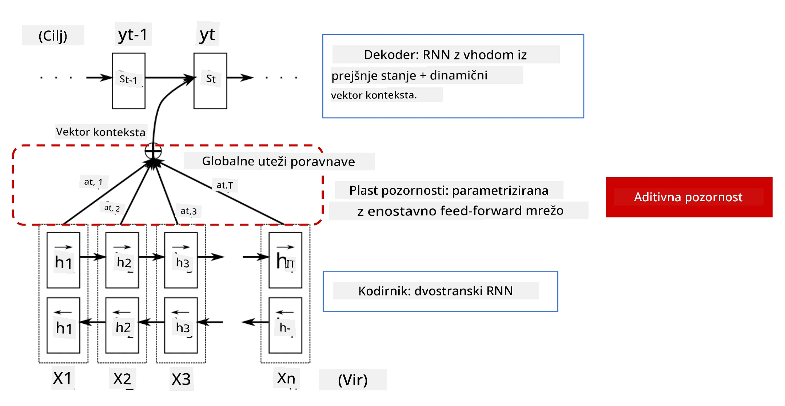
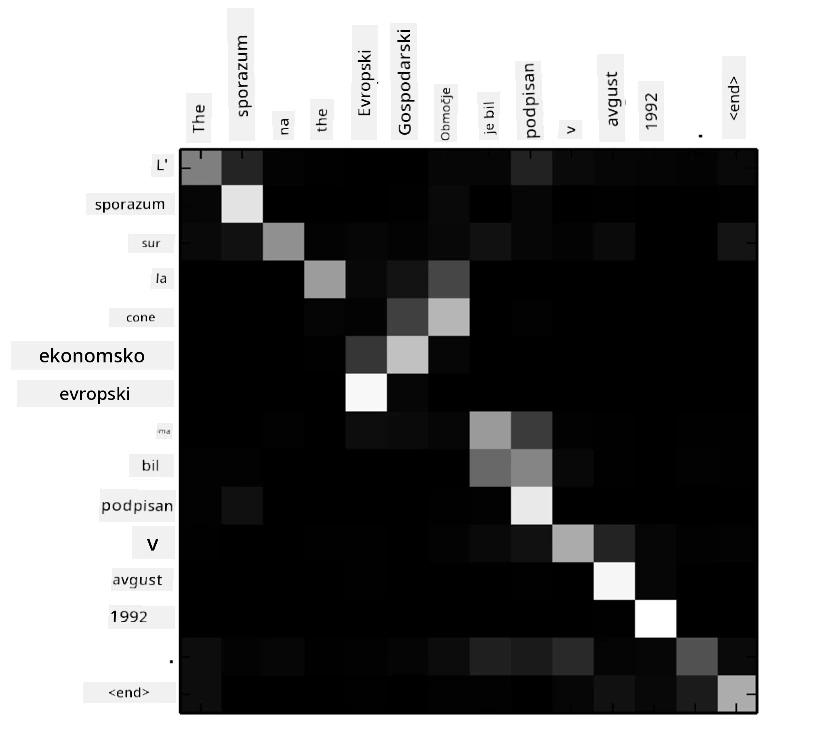
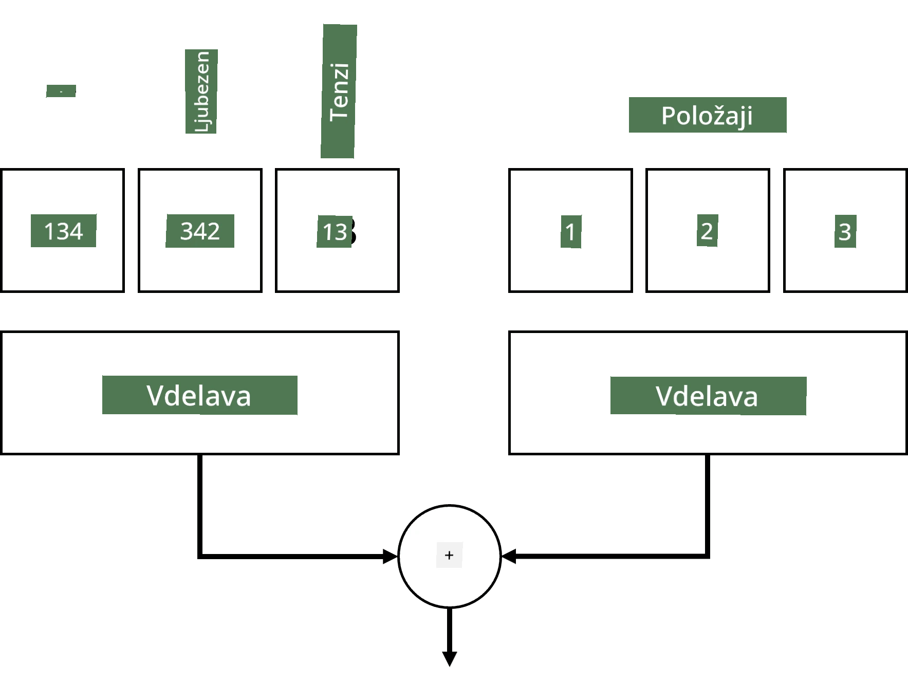
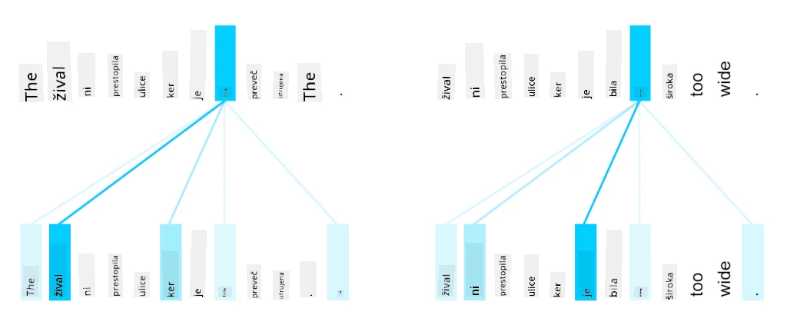
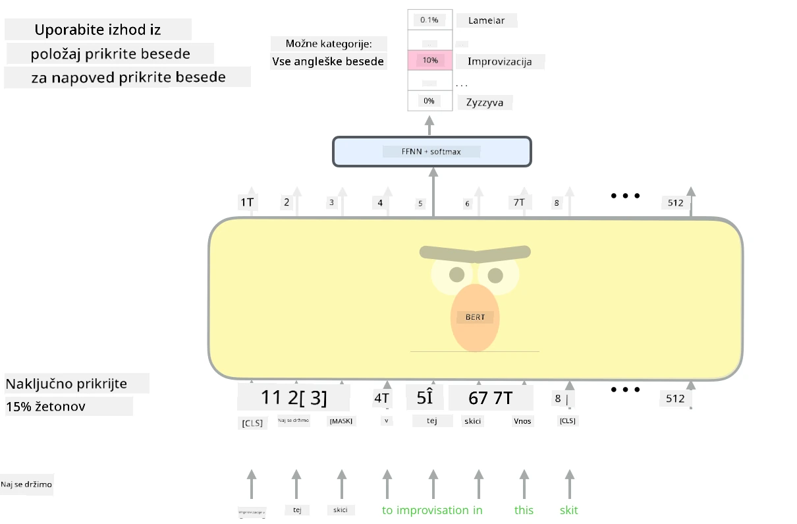

# Mehanizmi pozornosti in transformatorji

## [Predavanje kviz](https://ff-quizzes.netlify.app/en/ai/quiz/35)

Eden najpomembnejših problemov na področju NLP je **strojno prevajanje**, ključna naloga, ki je osnova za orodja, kot je Google Translate. V tem poglavju se bomo osredotočili na strojno prevajanje oziroma bolj splošno na katerokoli nalogo *zaporedje-v-zaporedje* (imenovano tudi **pretvorba stavkov**).

Pri RNN-jih je zaporedje-v-zaporedje implementirano z dvema rekurzivnima mrežama, kjer ena mreža, **enkoder**, stisne vhodno zaporedje v skrito stanje, medtem ko druga mreža, **dekoder**, to skrito stanje razširi v preveden rezultat. Ta pristop ima nekaj težav:

* Končno stanje enkoderske mreže težko ohranja spomin na začetek stavka, kar povzroča slabšo kakovost modela za dolge stavke.
* Vse besede v zaporedju imajo enak vpliv na rezultat. V resnici pa imajo določene besede v vhodnem zaporedju pogosto večji vpliv na izhodne rezultate kot druge.

**Mehanizmi pozornosti** omogočajo tehtanje kontekstualnega vpliva vsakega vhodnega vektorja na vsako napoved izhoda RNN. To se implementira z ustvarjanjem bližnjic med vmesnimi stanji vhodnega RNN in izhodnega RNN. Na ta način bomo pri generiranju izhodnega simbola yt upoštevali vsa vhodna skrita stanja hi, z različnimi utežnimi koeficienti &alpha;t,i.

> Model enkoder-dekoder z aditivnim mehanizmom pozornosti v [Bahdanau et al., 2015](https://arxiv.org/pdf/1409.0473.pdf), povzeto iz [tega bloga](https://lilianweng.github.io/lil-log/2018/06/24/attention-attention.html)

Matrika pozornosti {&alpha;i,j} predstavlja stopnjo, do katere določene vhodne besede vplivajo na generiranje določene besede v izhodnem zaporedju. Spodaj je primer takšne matrike:

> Slika iz [Bahdanau et al., 2015](https://arxiv.org/pdf/1409.0473.pdf) (Slika 3)

Mehanizmi pozornosti so odgovorni za velik del trenutnega ali skoraj trenutnega stanja umetnosti v NLP. Dodajanje pozornosti pa močno poveča število parametrov modela, kar je povzročilo težave pri skaliranju RNN-jev. Ključna omejitev pri skaliranju RNN-jev je, da rekurzivna narava modelov otežuje združevanje in paralelizacijo učenja. V RNN je treba vsak element zaporedja obdelati v zaporednem vrstnem redu, kar pomeni, da ga ni mogoče enostavno paralelizirati.

> Slika iz [Googlovega bloga](https://research.googleblog.com/2016/09/a-neural-network-for-machine.html)

Uporaba mehanizmov pozornosti v kombinaciji s to omejitvijo je privedla do nastanka zdajšnjih vrhunskih modelov transformatorjev, kot so BERT in Open-GPT3.

## Modeli transformatorjev

Ena glavnih idej za transformatorji je izogniti se zaporedni naravi RNN-jev in ustvariti model, ki je paraleliziran med učenjem. To se doseže z implementacijo dveh idej:

* kodiranje položaja
* uporaba mehanizma samopozornosti za zajemanje vzorcev namesto RNN-jev (ali CNN-jev) (zato se članek, ki uvaja transformatorje, imenuje *[Attention is all you need](https://arxiv.org/abs/1706.03762)*)

### Kodiranje/ugnezdenje položaja

Ideja kodiranja položaja je naslednja. 
1. Pri uporabi RNN-jev je relativni položaj tokenov predstavljen s številom korakov in zato ni treba, da je eksplicitno predstavljen. 
2. Ko pa preklopimo na pozornost, moramo poznati relativne položaje tokenov znotraj zaporedja. 
3. Za pridobitev kodiranja položaja dopolnimo naše zaporedje tokenov z zaporedjem položajev tokenov v zaporedju (tj. zaporedje števil 0,1, ...).
4. Nato zmešamo položaj tokena z vektorjem ugnezdenja tokena. Za pretvorbo položaja (cela števila) v vektor lahko uporabimo različne pristope:

* Učljivo ugnezdenje, podobno ugnezdenju tokenov. To je pristop, ki ga obravnavamo tukaj. Na vrhu tako tokenov kot njihovih položajev uporabimo plasti ugnezdenja, kar rezultira v vektorjih ugnezdenja enakih dimenzij, ki jih nato seštejemo.
* Fiksna funkcija kodiranja položaja, kot je predlagano v izvirnem članku.

> Slika avtorja

Rezultat, ki ga dobimo s kodiranjem položaja, ugnezdi tako izvirni token kot njegov položaj znotraj zaporedja.

### Večglava samopozornost

Nato moramo zajeti nekatere vzorce znotraj našega zaporedja. Da bi to dosegli, transformatorji uporabljajo mehanizem **samopozornosti**, ki je v bistvu pozornost, uporabljena na istem zaporedju kot vhod in izhod. Uporaba samopozornosti nam omogoča, da upoštevamo **kontekst** znotraj stavka in vidimo, katere besede so medsebojno povezane. Na primer, omogoča nam, da vidimo, na katere besede se nanašajo koreference, kot je *to*, in tudi upoštevamo kontekst:

> Slika iz [Googlovega bloga](https://research.googleblog.com/2017/08/transformer-novel-neural-network.html)

V transformatorjih uporabljamo **večglavo pozornost**, da damo mreži moč za zajemanje več različnih vrst odvisnosti, npr. dolgoročnih proti kratkoročnim odnosom med besedami, koreferenc proti nečemu drugemu itd.

[TensorFlow Notebook](TransformersTF.ipynb) vsebuje več podrobnosti o implementaciji plasti transformatorjev.

### Pozornost enkoder-dekoder

V transformatorjih se pozornost uporablja na dveh mestih:

* Za zajemanje vzorcev znotraj vhodnega besedila z uporabo samopozornosti
* Za izvajanje prevajanja zaporedij - to je plast pozornosti med enkoderjem in dekoderjem.

Pozornost enkoder-dekoder je zelo podobna mehanizmu pozornosti, uporabljenemu v RNN-jih, kot je opisano na začetku tega poglavja. Ta animirani diagram pojasnjuje vlogo pozornosti enkoder-dekoder.

Ker je vsak vhodni položaj neodvisno preslikan na vsak izhodni položaj, lahko transformatorji bolje paralelizirajo kot RNN-ji, kar omogoča veliko večje in bolj izrazne jezikovne modele. Vsaka glava pozornosti se lahko uporablja za učenje različnih odnosov med besedami, kar izboljša naloge obdelave naravnega jezika.

## BERT

**BERT** (Bidirectional Encoder Representations from Transformers) je zelo velika večplastna mreža transformatorjev z 12 plastmi za *BERT-base* in 24 za *BERT-large*. Model je najprej predhodno naučen na velikem korpusu besedilnih podatkov (WikiPedia + knjige) z uporabo nenadzorovanega učenja (napovedovanje zamaskiranih besed v stavku). Med predhodnim učenjem model absorbira pomembne ravni razumevanja jezika, ki jih je nato mogoče uporabiti z drugimi nabori podatkov z uporabo finega uglaševanja. Ta proces se imenuje **prenosno učenje**.

> Slika [vir](http://jalammar.github.io/illustrated-bert/)

## ✍️ Vaje: Transformatorji

Nadaljujte z učenjem v naslednjih beležnicah:

* [Transformatorji v PyTorch](TransformersPyTorch.ipynb)
* [Transformatorji v TensorFlow](TransformersTF.ipynb)

## Zaključek

V tej lekciji ste se naučili o transformatorjih in mehanizmih pozornosti, ki so ključna orodja v NLP. Obstaja veliko različic arhitektur transformatorjev, vključno z BERT, DistilBERT, BigBird, OpenGPT3 in drugimi, ki jih je mogoče fino uglaševati. Paket [HuggingFace](https://github.com/huggingface/) ponuja repozitorij za učenje mnogih teh arhitektur z uporabo PyTorch in TensorFlow.

## 🚀 Izziv

## [Kviz po predavanju](https://ff-quizzes.netlify.app/en/ai/quiz/36)

## Pregled in samostojno učenje

* [Blog objava](https://mchromiak.github.io/articles/2017/Sep/12/Transformer-Attention-is-all-you-need/), ki pojasnjuje klasični članek [Attention is all you need](https://arxiv.org/abs/1706.03762) o transformatorjih.
* [Serija blog objav](https://towardsdatascience.com/transformers-explained-visually-part-1-overview-of-functionality-95a6dd460452) o transformatorjih, ki podrobno pojasnjuje arhitekturo.

## [Naloga](assignment.md)

---

