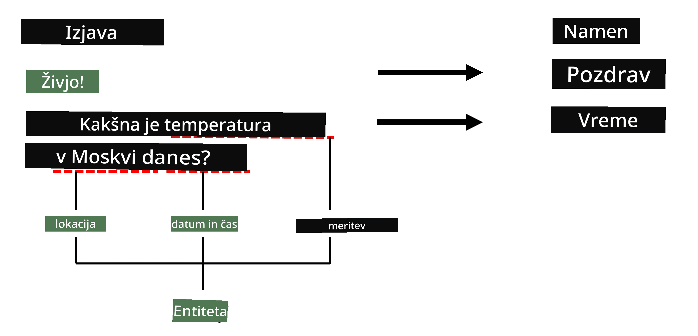

# Prepoznavanje imenovanih entitet

Do sedaj smo se večinoma osredotočali na eno nalogo NLP - klasifikacijo. Vendar pa obstajajo tudi druge naloge NLP, ki jih je mogoče doseči z nevronskimi mrežami. Ena od teh nalog je **[Prepoznavanje imenovanih entitet](https://wikipedia.org/wiki/Named-entity_recognition)** (NER), ki se ukvarja s prepoznavanjem specifičnih entitet v besedilu, kot so kraji, imena oseb, časovni intervali, kemijske formule in podobno.

## [Pred-predavanje kviz](https://ff-quizzes.netlify.app/en/ai/quiz/37)

## Primer uporabe NER

Recimo, da želite razviti klepetalni bot, podoben Amazon Alexa ali Google Assistant. Inteligentni klepetalni boti delujejo tako, da *razumejo*, kaj uporabnik želi, s klasifikacijo besedila vhodnega stavka. Rezultat te klasifikacije je tako imenovani **namen**, ki določa, kaj naj klepetalni bot naredi.

> Slika avtorja

Vendar pa lahko uporabnik kot del fraze poda nekatere parametre. Na primer, ko sprašuje za vreme, lahko določi lokacijo ali datum. Bot mora biti sposoben razumeti te entitete in ustrezno zapolniti parametrične reže, preden izvede dejanje. Tukaj pride v igro NER.

> ✅ Drug primer bi bil [analiza znanstvenih medicinskih člankov](https://soshnikov.com/science/analyzing-medical-papers-with-azure-and-text-analytics-for-health/). Ena glavnih stvari, ki jih moramo iskati, so specifični medicinski izrazi, kot so bolezni in medicinske snovi. Medtem ko lahko majhno število bolezni verjetno izluščimo z iskanjem podnizov, bolj kompleksne entitete, kot so kemijske spojine in imena zdravil, zahtevajo bolj zapleten pristop.

## NER kot klasifikacija tokenov

Modeli NER so v bistvu **modeli klasifikacije tokenov**, saj moramo za vsak vhodni token odločiti, ali pripada entiteti ali ne, in če pripada - kateri razred entitete.

Razmislimo o naslednjem naslovu članka:

**Regurgitacija trikuspidne zaklopke** in **litijev karbonat** **toksičnost** pri novorojenčku.

Entitete tukaj so:

* Regurgitacija trikuspidne zaklopke je bolezen (`DIS`)
* Litijev karbonat je kemijska snov (`CHEM`)
* Toksičnost je prav tako bolezen (`DIS`)

Opazite, da lahko ena entiteta obsega več tokenov. In, kot v tem primeru, moramo razlikovati med dvema zaporednima entitetama. Zato je običajno, da za vsako entiteto uporabimo dva razreda - enega, ki označuje prvi token entitete (pogosto se uporablja predpona `B-`, za **začetek**), in drugega - nadaljevanje entitete (`I-`, za **notranji token**). Uporabljamo tudi `O` kot razred za označevanje vseh **ostalih** tokenov. Takšno označevanje tokenov se imenuje [BIO označevanje](https://en.wikipedia.org/wiki/Inside%E2%80%93outside%E2%80%93beginning_(tagging)) (ali IOB). Ko je označeno, bo naš naslov videti takole:

Token | Oznaka
------|-----
Trikuspidna | B-DIS
zaklopka | I-DIS
regurgitacija | I-DIS
in | O
litijev | B-CHEM
karbonat | I-CHEM
toksičnost | B-DIS
pri | O
novorojenčku | O
. | O

Ker moramo vzpostaviti enako razmerje med tokeni in razredi, lahko iz te slike treniramo desno **mnogokratno-mnogokratno** nevronsko mrežo:

> *Slika iz [tega bloga](http://karpathy.github.io/2015/05/21/rnn-effectiveness/) avtorja [Andreja Karpathyja](http://karpathy.github.io/). Modeli klasifikacije tokenov NER ustrezajo desni arhitekturi mreže na tej sliki.*

## Treniranje modelov NER

Ker je model NER v bistvu model klasifikacije tokenov, lahko za to nalogo uporabimo RNN-je, s katerimi smo že seznanjeni. V tem primeru bo vsak blok rekurzivne mreže vrnil ID tokena. Naslednji primer zvezka prikazuje, kako trenirati LSTM za klasifikacijo tokenov.

## ✍️ Primeri zvezkov: NER

Nadaljujte z učenjem v naslednjem zvezku:

* [NER z TensorFlow](NER-TF.ipynb)

## Zaključek

Model NER je **model klasifikacije tokenov**, kar pomeni, da ga lahko uporabimo za izvajanje klasifikacije tokenov. To je zelo pogosta naloga v NLP, ki pomaga prepoznati specifične entitete v besedilu, vključno s kraji, imeni, datumi in več.

## 🚀 Izziv

Dokončajte nalogo, povezano spodaj, da trenirate model za prepoznavanje imenovanih entitet za medicinske izraze, nato pa ga preizkusite na drugem naboru podatkov.

## [Po-predavanje kviz](https://ff-quizzes.netlify.app/en/ai/quiz/38)

## Pregled & Samostojno učenje

Preberite blog [The Unreasonable Effectiveness of Recurrent Neural Networks](http://karpathy.github.io/2015/05/21/rnn-effectiveness/) in sledite razdelku Nadaljnje branje v tem članku, da poglobite svoje znanje.

## [Naloga](lab/README.md)

V nalogi za to lekcijo boste morali trenirati model za prepoznavanje medicinskih entitet. Začnete lahko s treniranjem LSTM modela, kot je opisano v tej lekciji, in nadaljujete z uporabo modela transformatorja BERT. Preberite [navodila](lab/README.md) za vse podrobnosti.

---

