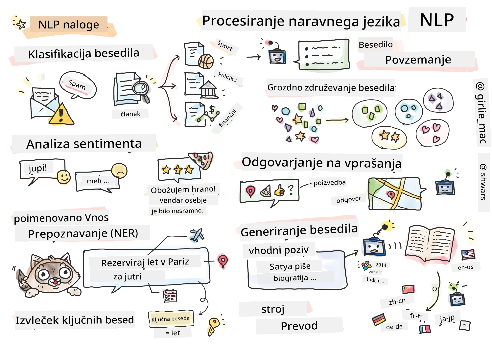

# Obdelava naravnega jezika



V tem poglavju se bomo osredotočili na uporabo nevronskih mrež za reševanje nalog, povezanih z **obdelavo naravnega jezika (NLP)**. Obstaja veliko NLP problemov, ki jih želimo, da jih računalniki rešujejo:

* **Razvrščanje besedil** je tipičen problem razvrščanja, ki se nanaša na zaporedja besedil. Primeri vključujejo razvrščanje e-poštnih sporočil kot spam ali ne-spam, ali kategorizacijo člankov kot šport, posel, politika itd. Prav tako pri razvoju klepetalnih robotov pogosto potrebujemo razumeti, kaj uporabnik želi povedati – v tem primeru gre za **razvrščanje namenov**. Pri razvrščanju namenov se pogosto soočamo z mnogimi kategorijami.
* **Analiza sentimenta** je tipičen regresijski problem, kjer moramo pripisati številko (sentiment), ki ustreza temu, kako pozitiven/negativen je pomen stavka. Naprednejša različica analize sentimenta je **analiza sentimenta po vidikih** (ABSA), kjer sentiment ne pripisujemo celotnemu stavku, temveč različnim delom (vidikom), npr. *V tej restavraciji mi je bila všeč kuhinja, vendar je bila atmosfera grozna*.
* **Prepoznavanje imenovanih entitet** (NER) se nanaša na problem izločanja določenih entitet iz besedila. Na primer, razumeti moramo, da v stavku *Jutri moram leteti v Pariz* beseda *jutri* pomeni DATUM, medtem ko je *Pariz* LOKACIJA.  
* **Izvleček ključnih besed** je podoben NER, vendar moramo samodejno izločiti besede, ki so pomembne za pomen stavka, brez predhodnega učenja za specifične tipe entitet.
* **Združevanje besedil** je uporabno, ko želimo združiti podobne stavke, na primer podobne zahteve v pogovorih tehnične podpore.
* **Odgovarjanje na vprašanja** se nanaša na sposobnost modela, da odgovori na specifično vprašanje. Model prejme besedilni odlomek in vprašanje kot vhod, nato pa mora zagotoviti mesto v besedilu, kjer je odgovor na vprašanje (ali včasih generirati besedilo odgovora).
* **Generiranje besedila** je sposobnost modela, da ustvari novo besedilo. To lahko obravnavamo kot nalogo razvrščanja, kjer model napoveduje naslednjo črko/besedo na podlagi nekega *besedilnega poziva*. Napredni modeli za generiranje besedila, kot je GPT-3, lahko rešujejo tudi druge NLP naloge, kot je razvrščanje, z uporabo tehnike, imenovane [programiranje s pozivi](https://towardsdatascience.com/software-3-0-how-prompting-will-change-the-rules-of-the-game-a982fbfe1e0) ali [inženiring pozivov](https://medium.com/swlh/openai-gpt-3-and-prompt-engineering-dcdc2c5fcd29).
* **Povzemanje besedila** je tehnika, pri kateri želimo, da računalnik "prebere" dolgo besedilo in ga povzame v nekaj stavkih.
* **Strojno prevajanje** lahko obravnavamo kot kombinacijo razumevanja besedila v enem jeziku in generiranja besedila v drugem jeziku.

Sprva so bile večina NLP nalog reševane z uporabo tradicionalnih metod, kot so slovnice. Na primer, pri strojnem prevajanju so se uporabljali analizatorji za pretvorbo začetnega stavka v sintaktično drevo, nato so se izločile višje ravni semantičnih struktur za predstavitev pomena stavka, na podlagi tega pomena in slovnice ciljnega jezika pa je bil ustvarjen rezultat. Danes se mnoge NLP naloge učinkoviteje rešujejo z uporabo nevronskih mrež.

> Veliko klasičnih NLP metod je implementiranih v Python knjižnici [Natural Language Processing Toolkit (NLTK)](https://www.nltk.org). Na voljo je odlična [NLTK knjiga](https://www.nltk.org/book/), ki pokriva, kako lahko različne NLP naloge rešujemo z uporabo NLTK.

V našem tečaju se bomo večinoma osredotočili na uporabo nevronskih mrež za NLP, NLTK pa bomo uporabili, kjer bo potrebno.

Že smo se naučili uporabljati nevronske mreže za delo s tabelarnimi podatki in slikami. Glavna razlika med temi vrstami podatkov in besedilom je, da je besedilo zaporedje spremenljive dolžine, medtem ko je velikost vhodnih podatkov pri slikah znana vnaprej. Čeprav konvolucijske mreže lahko izločajo vzorce iz vhodnih podatkov, so vzorci v besedilu bolj zapleteni. Na primer, zanikanje je lahko ločeno od subjekta z mnogimi besedami (npr. *Ne maram pomaranč* proti *Ne maram tistih velikih pisanih okusnih pomaranč*), kar bi moralo biti še vedno interpretirano kot en vzorec. Zato za obdelavo jezika potrebujemo nove vrste nevronskih mrež, kot so *rekurentne mreže* in *transformerji*.

## Namestitev knjižnic

Če uporabljate lokalno Python namestitev za izvajanje tega tečaja, boste morda morali namestiti vse potrebne knjižnice za NLP z naslednjimi ukazi:

**Za PyTorch**
```bash
pip install -r requirements-torch.txt
```
**Za TensorFlow**
```bash
pip install -r requirements-tf.txt
```

> NLP s TensorFlow lahko preizkusite na [Microsoft Learn](https://docs.microsoft.com/learn/modules/intro-natural-language-processing-tensorflow/?WT.mc_id=academic-77998-cacaste)

## Opozorilo glede GPU

V tem poglavju bomo v nekaterih primerih trenirali precej velike modele.
* **Uporabite računalnik z GPU**: Priporočljivo je, da svoje zapiske izvajate na računalniku z omogočenim GPU, da zmanjšate čakalne čase pri delu z velikimi modeli.
* **Omejitve pomnilnika GPU**: Uporaba GPU lahko privede do situacij, ko vam zmanjka pomnilnika GPU, še posebej pri treniranju velikih modelov.
* **Poraba pomnilnika GPU**: Količina pomnilnika GPU, porabljenega med treniranjem, je odvisna od različnih dejavnikov, vključno z velikostjo minibatcha.
* **Zmanjšajte velikost minibatcha**: Če naletite na težave s pomnilnikom GPU, razmislite o zmanjšanju velikosti minibatcha v svoji kodi kot možni rešitvi.
* **Sprostitev pomnilnika GPU v TensorFlow**: Starejše različice TensorFlow morda ne sprostijo pomnilnika GPU pravilno, ko trenirate več modelov znotraj enega Python jedra. Za učinkovito upravljanje porabe pomnilnika GPU lahko TensorFlow nastavite tako, da dodeli pomnilnik GPU le po potrebi.
* **Vključitev kode**: Če želite nastaviti TensorFlow, da raste dodelitev pomnilnika GPU le, ko je to potrebno, vključite naslednjo kodo v svoje zapiske:

```python
physical_devices = tf.config.list_physical_devices('GPU') 
if len(physical_devices)>0:
    tf.config.experimental.set_memory_growth(physical_devices[0], True) 
```

Če vas zanima učenje NLP z vidika klasičnega strojnega učenja, obiščite [to zbirko lekcij](https://github.com/microsoft/ML-For-Beginners/tree/main/6-NLP).

## V tem poglavju
V tem poglavju bomo spoznali:

* [Predstavljanje besedila kot tenzorjev](13-TextRep/README.md)
* [Vgrajevanje besed](14-Emdeddings/README.md)
* [Modeliranje jezika](15-LanguageModeling/README.md)
* [Rekurentne nevronske mreže](16-RNN/README.md)
* [Generativne mreže](17-GenerativeNetworks/README.md)
* [Transformerji](18-Transformers/README.md)

**Omejitev odgovornosti**:  
Ta dokument je bil preveden z uporabo storitve AI za prevajanje [Co-op Translator](https://github.com/Azure/co-op-translator). Čeprav si prizadevamo za natančnost, vas prosimo, da upoštevate, da lahko avtomatizirani prevodi vsebujejo napake ali netočnosti. Izvirni dokument v njegovem maternem jeziku je treba obravnavati kot avtoritativni vir. Za ključne informacije priporočamo profesionalni človeški prevod. Ne prevzemamo odgovornosti za morebitna nesporazumevanja ali napačne razlage, ki bi nastale zaradi uporabe tega prevoda.