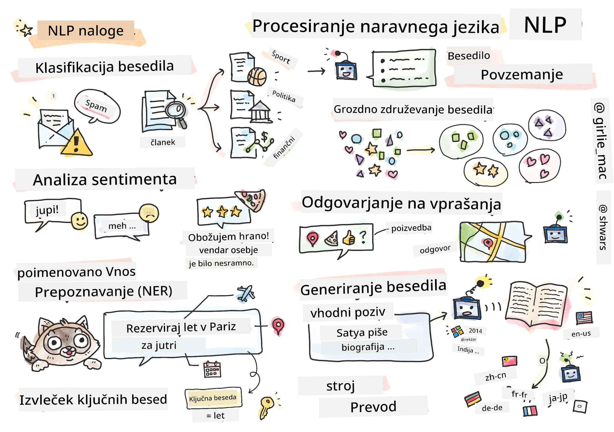

# Obdelava naravnega jezika



V tem poglavju se bomo osredotočili na uporabo nevronskih mrež za obdelavo nalog, povezanih z **obdelavo naravnega jezika (NLP)**. Obstaja veliko problemov NLP, ki jih želimo, da jih računalniki znajo rešiti:

* **Klasifikacija besedil** je tipičen problem klasifikacije, ki se nanaša na besedilne zaporedja. Primeri vključujejo klasifikacijo e-poštnih sporočil kot spam ali ne-spam, ali kategorizacijo člankov kot šport, poslovanje, politika itd. Prav tako, ko razvijamo klepetalne bote, pogosto želimo razumeti, kaj je uporabnik hotel povedati — v tem primeru se ukvarjamo z **klasifikacijo namena**. Pogosto moramo pri klasifikaciji namena obravnavati veliko kategorij.
* **Analiza sentimenta** je tipičen problem regresije, kjer moramo pripisati številko (sentiment), ki ustreza stopnji pozitivnosti/negativnosti pomena stavka. Bolj napredna različica analize sentimenta je **analiza sentimenta na osnovi vidikov** (ABSA), kjer sentiment pripisujemo ne celotnemu stavku, ampak različnim delom (vidikom), npr. *V tej restavraciji mi je bila všeč kulinarika, vendar je bila atmosfera grozna*.
* **Prepoznavanje imenovanih entitet** (NER) se nanaša na problem izvlečenja določenih entitet iz besedila. Na primer, morda moramo razumeti, da v frazi *Moram jutri poleteti v Pariz* beseda *jutri* označuje DATUM, *Pariz* pa LOKACIJO.  
* **Izvlečenje ključnih besed** je podobno kot NER, vendar moramo samodejno izluščiti besede, pomembne za pomen stavka, brez predhodnega treniranja za specifične tipe entitet.
* **Gručenje besedil** je uporabno, ko želimo združiti podobne stavke, na primer podobne zahteve v pogovorih tehnične podpore.
* **Odgovarjanje na vprašanja** pomeni sposobnost modela, da odgovori na specifično vprašanje. Model prejme besedilni odlomek in vprašanje kot vhod, ter mora zagotovi mesto v besedilu, kjer je odgovor na vprašanje vsebovan (ali pa včasih generirati besedilni odgovor).
* **Generiranje besedila** je sposobnost modela, da ustvari novo besedilo. Lahko ga obravnavamo kot nalogo klasifikacije, ki napove naslednjo črko/besedo na osnovi nekega *besedilnega poziva*. Napredni modeli generiranja besedila, kot je GPT-3, zmorejo reševati tudi druge naloge NLP, kot je klasifikacija, z uporabo tehnike, imenovane [prompt programming](https://towardsdatascience.com/software-3-0-how-prompting-will-change-the-rules-of-the-game-a982fbfe1e0) ali [prompt engineering](https://medium.com/swlh/openai-gpt-3-and-prompt-engineering-dcdc2c5fcd29)
* **Povzemanje besedil** je tehnika, ko želimo, da računalnik "prebere" dolgo besedilo in ga strne v nekaj stavkov.
* **Strojno prevajanje** lahko razumemo kot kombinacijo razumevanja besedila v enem jeziku in generiranja besedila v drugem jeziku.

Sprva so bile večina NLP nalog rešljive z uporabo tradicionalnih metod, kot so slovnice. Na primer, pri strojnih prevodih so parserji iskali transformacijo začetnega stavka v sintaktično drevo, nato so ekstrahirali višje semantične strukture, ki predstavljajo pomen stavka, in na osnovi tega pomena ter slovnice ciljanega jezika so ustvarili rezultat. Danes se številne naloge NLP učinkoviteje rešujejo z nevronskimi mrežami.

> Mnoge klasične metode NLP so implementirane v Python knjižnici [Natural Language Processing Toolkit (NLTK)](https://www.nltk.org). Na voljo je odlična [NLTK knjiga](https://www.nltk.org/book/), ki pojasnjuje, kako lahko z NLTK rešujemo različne NLP naloge.

V našem tečaju se bomo večinoma osredotočili na uporabo nevronskih mrež za NLP in uporabili bomo NLTK, kjer bo potrebno.

Že smo se naučili uporabljati nevronske mreže za delo s tabelaričnimi podatki in slikami. Glavna razlika med temi vrstami podatkov in besedilom je, da je besedilo zaporedje poljubne dolžine, medtem ko je vhodna velikost pri slikah vnaprej znana. Medtem ko konvolucijske mreže ekstrahirajo vzorce iz vhodnih podatkov, so vzorci v besedilu bolj kompleksni. Npr., negacija je lahko ločena od subjekta za poljubno število besed (npr. *Ne maram pomaranč*, v nasprotju z *Ne maram tistih velikih, pisanih, okusnih pomaranč*), in to je treba še vedno razumeti kot en vzorec. Zato moramo za obdelavo jezika uvesti nove vrste nevronskih mrež, kot so *rekurentne mreže* in *transformatorji*.

## Namestitev knjižnic

Če uporabljate lokalno Python namestitev za izvajanje tega tečaja, boste morda morali namestiti vse potrebne knjižnice za NLP z naslednjimi ukazi:

**Za PyTorch**
```bash
pip install -r requirements-pytorch.txt
```
**Za TensorFlow**
```bash
pip install -r requirements-tf.txt
```

> NLP lahko preizkusite z uporabo TensorFlow na [Microsoft Learn](https://docs.microsoft.com/learn/modules/intro-natural-language-processing-tensorflow/?WT.mc_id=academic-77998-cacaste)

## Opozorilo glede GPU

V tem poglavju bomo za nekatere primere trenirali precej velike modele.
* **Uporabljajte računalnik z omogočenim GPU**: priporočljivo je, da svoje zvezke izvajate na računalniku z omogočenim GPU, da zmanjšate čakanje pri delu z velikimi modeli.
* **Omejitve pomnilnika GPU**: izvajanje na GPU lahko povzroči primere, ko zmanjka pomnilnika na GPU, zlasti med treniranjem velikih modelov.
* **Poraba pomnilnika GPU**: količina pomnilnika GPU, ki se porabi med treniranjem, je odvisna od različnih dejavnikov, vključno z velikostjo minipaketa.
* **Zmanjšajte velikost minipaketa**: če se soočite s težavami z GPU pomnilnikom, razmislite o zmanjšanju velikosti minipaketa v vaši kodi kot možni rešitvi.
* **Prostost pomnilnika TensorFlow na GPU**: starejše različice TensorFlow morda ne sprostijo pravilno pomnilnika GPU, ko trenirate več modelov znotraj enega Pythona. Za učinkovito upravljanje rabe pomnilnika GPU lahko nastavite TensorFlow tako, da alocira pomnilnik GPU le po potrebi.
* **Vključitev kode**: da nastavite TensorFlow, da povečuje alokacijo pomnilnika GPU le, ko je potrebno, vključite naslednjo kodo v svoje zvezke:

```python
physical_devices = tf.config.list_physical_devices('GPU') 
if len(physical_devices)>0:
    tf.config.experimental.set_memory_growth(physical_devices[0], True) 
```

Če vas zanima učenje NLP z vidika klasičnega strojnega učenja, obiščite [ta sklop lekcij](https://github.com/microsoft/ML-For-Beginners/tree/main/6-NLP)

## V tem poglavju
V tem poglavju se bomo naučili o:

* [Predstavljanje besedila kot tenzorji](13-TextRep/README.md)
* [Vgradnje besed (Word Embeddings)](14-Embeddings/README.md)
* [Jezikovno modeliranje](15-LanguageModeling/README.md)
* [Rekurentne nevronske mreže](16-RNN/README.md)
* [Generativne mreže](17-GenerativeNetworks/README.md)
* [Transformatorji](18-Transformers/README.md)

---

<!-- CO-OP TRANSLATOR DISCLAIMER START -->
**Omejitev odgovornosti**:
Ta dokument je bil preveden z uporabo AI prevajalske storitve [Co-op Translator](https://github.com/Azure/co-op-translator). Čeprav si prizadevamo za natančnost, vas prosimo, da upoštevate, da avtomatizirani prevodi lahko vsebujejo napake ali netočnosti. Izvirni dokument v njegovem izvirnem jeziku je treba obravnavati kot avtoritativni vir. Za kritične informacije je priporočljiv strokovni človeški prevod. Ne odgovarjamo za morebitna nesporazume ali napačne interpretacije, ki izhajajo iz uporabe tega prevoda.
<!-- CO-OP TRANSLATOR DISCLAIMER END -->