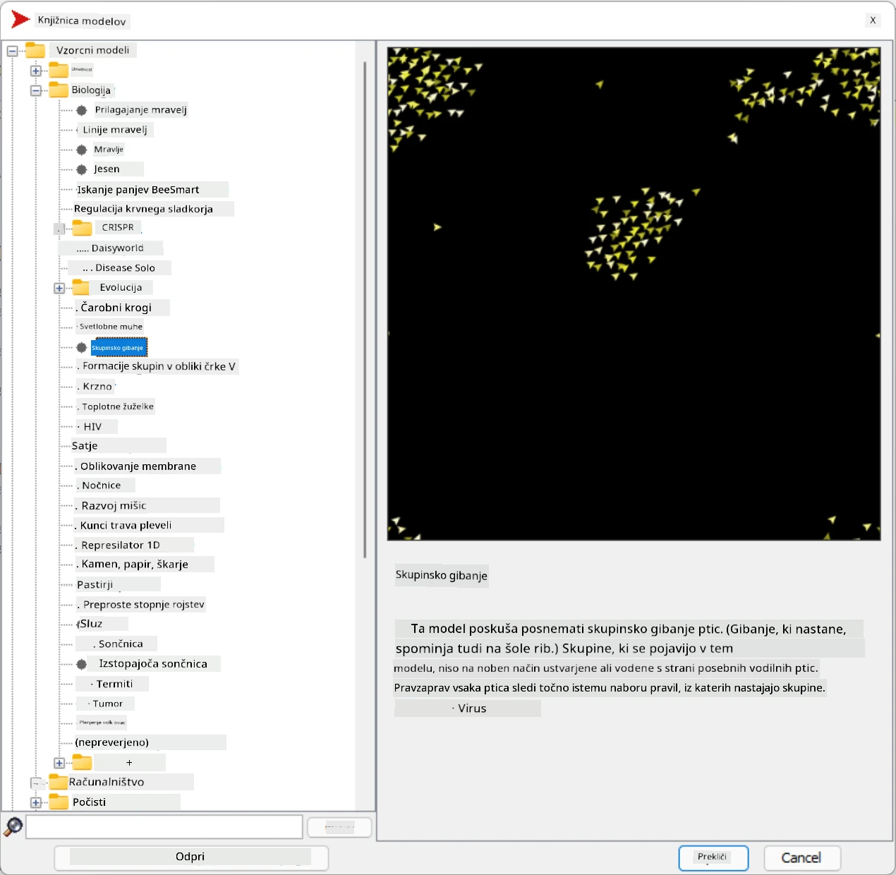
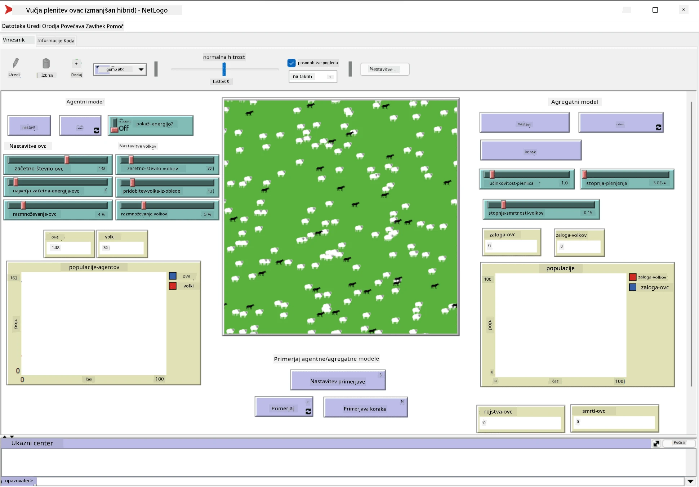

# Večagentni sistemi

Eden od možnih načinov doseganja inteligence je tako imenovani **emergentni** (ali **sinergijski**) pristop, ki temelji na dejstvu, da lahko kombinirano vedenje mnogih relativno preprostih agentov privede do bolj kompleksnega (ali inteligentnega) vedenja sistema kot celote. Teoretično to temelji na principih [kolektivne inteligence](https://en.wikipedia.org/wiki/Collective_intelligence), [emergentizma](https://en.wikipedia.org/wiki/Global_brain) in [evolucijske kibernetike](https://en.wikipedia.org/wiki/Global_brain), ki pravijo, da višjenivojski sistemi pridobijo določeno dodano vrednost, ko so pravilno sestavljeni iz nižjenivojskih sistemov (tako imenovani *princip prehoda metasistema*).

## [Predhodni kviz](https://ff-quizzes.netlify.app/en/ai/quiz/45)

Smer **večagentnih sistemov** se je v umetni inteligenci pojavila v 90. letih kot odgovor na rast interneta in porazdeljenih sistemov. Eden od klasičnih učbenikov o umetni inteligenci, [Artificial Intelligence: A Modern Approach](https://en.wikipedia.org/wiki/Artificial_Intelligence:_A_Modern_Approach), se osredotoča na pogled klasične umetne inteligence z vidika večagentnih sistemov.

Osrednji koncept večagentnega pristopa je **agent** - entiteta, ki živi v nekem **okolju**, ki ga lahko zaznava in nanj deluje. To je zelo široka definicija, zato obstaja veliko različnih vrst in klasifikacij agentov:

* Glede na sposobnost razmišljanja:
   - **Reaktivni** agenti običajno delujejo po principu zahteva-odziv
   - **Deliberativni** agenti uporabljajo neko obliko logičnega razmišljanja in/ali načrtovanja
* Glede na mesto izvajanja kode agenta:
   - **Statični** agenti delujejo na določenem omrežnem vozlišču
   - **Mobilni** agenti lahko premikajo svojo kodo med omrežnimi vozlišči
* Glede na vedenje:
   - **Pasivni agenti** nimajo specifičnih ciljev. Takšni agenti se lahko odzivajo na zunanje dražljaje, vendar sami ne sprožijo nobenih dejanj.
   - **Aktivni agenti** imajo določene cilje, ki jih zasledujejo
   - **Kognitivni agenti** vključujejo kompleksno načrtovanje in razmišljanje

Večagentni sistemi se danes uporabljajo v številnih aplikacijah:

* V igrah mnogi liki, ki jih ne upravlja igralec, uporabljajo neko obliko umetne inteligence in jih lahko štejemo za inteligentne agente
* Pri video produkciji se za upodabljanje kompleksnih 3D prizorov, ki vključujejo množice, običajno uporablja simulacija večagentnih sistemov
* Pri modeliranju sistemov se večagentni pristop uporablja za simulacijo vedenja kompleksnega modela. Na primer, večagentni pristop je bil uspešno uporabljen za napovedovanje širjenja bolezni COVID-19 po svetu. Podoben pristop se lahko uporabi za modeliranje prometa v mestu in opazovanje, kako se odziva na spremembe prometnih pravil.
* V kompleksnih avtomatizacijskih sistemih lahko vsaka naprava deluje kot neodvisen agent, kar naredi celoten sistem manj monoliten in bolj robusten.

Ne bomo se poglabljali v večagentne sisteme, ampak si bomo ogledali en primer **modeliranja večagentnih sistemov**.

## NetLogo

[NetLogo](https://ccl.northwestern.edu/netlogo/) je okolje za modeliranje večagentnih sistemov, ki temelji na prilagojeni različici programskega jezika [Logo](https://en.wikipedia.org/wiki/Logo_(programming_language)). Ta jezik je bil razvit za poučevanje konceptov programiranja otrokom in omogoča nadzor nad agentom, imenovanim **želva**, ki se lahko premika in za seboj pušča sled. To omogoča ustvarjanje kompleksnih geometrijskih oblik, kar je zelo vizualen način za razumevanje vedenja agenta.

V NetLogo lahko ustvarimo veliko želv z ukazom `create-turtles`. Nato lahko vsem želvam ukazujemo, naj izvedejo določena dejanja (v spodnjem primeru - premik naprej za 10 točk):

```
create-turtles 10
ask turtles [
  forward 10
]
```

Seveda ni zanimivo, če vse želve počnejo isto stvar, zato lahko `ask` uporabimo za skupine želv, npr. tiste, ki so v bližini določenega mesta. Prav tako lahko ustvarimo želve različnih *vrst* z ukazom `breed [cats cat]`. Tukaj je `cat` ime vrste, pri čemer moramo določiti tako edninsko kot množinsko obliko besede, saj različni ukazi uporabljajo različne oblike za jasnost.

> ✅ Ne bomo se učili jezika NetLogo, vendar lahko obiščete odličen vir [Beginner's Interactive NetLogo Dictionary](https://ccl.northwestern.edu/netlogo/bind/), če vas zanima več.

NetLogo lahko [prenesete](https://ccl.northwestern.edu/netlogo/download.shtml) in namestite, da ga preizkusite.

### Knjižnica modelov

Odlična stvar pri NetLogo je, da vsebuje knjižnico delujočih modelov, ki jih lahko preizkusite. Pojdite na **File &rightarrow; Models Library**, kjer imate na voljo številne kategorije modelov.



> Posnetek zaslona knjižnice modelov avtorja Dmitry Soshnikov

Odprite enega od modelov, na primer **Biology &rightarrow; Flocking**.

### Glavna načela

Ko odprete model, pridete na glavni zaslon NetLogo. Tukaj je primer modela, ki opisuje populacijo volkov in ovc ob omejenih virih (trava).



> Posnetek zaslona avtorja Dmitry Soshnikov

Na tem zaslonu lahko vidite:

* Odsek **Interface**, ki vsebuje:
  - Glavno polje, kjer živijo vsi agenti
  - Različne kontrole: gumbe, drsnike itd.
  - Grafe, ki jih lahko uporabite za prikaz parametrov simulacije
* Zavihek **Code**, ki vsebuje urejevalnik, kjer lahko napišete program v jeziku NetLogo

V večini primerov bo vmesnik imel gumb **Setup**, ki inicializira stanje simulacije, in gumb **Go**, ki začne izvajanje. Ti gumbi so obdelani z ustreznimi funkcijami v kodi, ki izgledajo takole:

```
to go [
...
]
```

Svet NetLogo sestavljajo naslednji objekti:

* **Agenti** (želve), ki se lahko premikajo po polju in nekaj počnejo. Agente ukazujete z uporabo sintakse `ask turtles [...]`, pri čemer se koda v oklepajih izvaja za vse agente v *načinu želv*.
* **Zaplate** so kvadratna območja polja, na katerih živijo agenti. Lahko se sklicujete na vse agente na isti zaplati ali spreminjate barve zaplat in nekatere druge lastnosti. Prav tako lahko `ask patches`, da nekaj naredijo.
* **Opazovalec** je edinstven agent, ki nadzoruje svet. Vse funkcije gumbov se izvajajo v *načinu opazovalca*.

> ✅ Lepota okolja večagentnih sistemov je v tem, da se koda, ki se izvaja v načinu želv ali zaplat, izvaja hkrati za vse agente vzporedno. Tako lahko z malo kode in programiranjem vedenja posameznega agenta ustvarite kompleksno vedenje simulacijskega sistema kot celote.

### Flocking

Kot primer večagentnega vedenja si oglejmo **[Flocking](https://en.wikipedia.org/wiki/Flocking_(behavior))**. Flocking je kompleksen vzorec, ki je zelo podoben načinu letenja jate ptic. Ko jih opazujete, lahko pomislite, da sledijo nekakšnemu kolektivnemu algoritmu ali da imajo neko obliko *kolektivne inteligence*. Vendar pa to kompleksno vedenje nastane, ko vsak posamezen agent (v tem primeru *ptica*) opazuje le nekatere druge agente v kratki razdalji od sebe in sledi trem preprostim pravilom:

* **Poravnava** - usmerja se proti povprečni smeri sosednjih agentov
* **Kohezija** - poskuša se usmeriti proti povprečnemu položaju sosedov (*dolgo razdaljna privlačnost*)
* **Ločitev** - ko se preveč približa drugim pticam, poskuša oditi stran (*kratko razdaljna odbojnost*)

Lahko zaženete primer flockinga in opazujete vedenje. Prav tako lahko prilagodite parametre, kot so *stopnja ločitve* ali *vidni razpon*, ki določa, kako daleč lahko vsaka ptica vidi. Opazite, da če zmanjšate vidni razpon na 0, vse ptice postanejo slepe in flocking preneha. Če zmanjšate ločitev na 0, se vse ptice zberejo v ravno črto.

> ✅ Preklopite na zavihek **Code** in si oglejte, kje so tri pravila flockinga (poravnava, kohezija in ločitev) implementirana v kodi. Opazite, kako se sklicujemo le na tiste agente, ki so v vidnem polju.

### Drugi modeli za ogled

Obstaja še nekaj zanimivih modelov, ki jih lahko preizkusite:

* **Art &rightarrow; Fireworks** prikazuje, kako lahko ognjemet štejemo za kolektivno vedenje posameznih ognjenih tokov
* **Social Science &rightarrow; Traffic Basic** in **Social Science &rightarrow; Traffic Grid** prikazujeta model mestnega prometa v 1D in 2D mreži z ali brez semaforjev. Vsak avto v simulaciji sledi naslednjim pravilom:
   - Če je prostor pred njim prazen - pospeši (do določene največje hitrosti)
   - Če vidi oviro pred seboj - zavira (in lahko prilagodite, kako daleč voznik vidi)
* **Social Science &rightarrow; Party** prikazuje, kako se ljudje združujejo med koktejl zabavo. Lahko najdete kombinacijo parametrov, ki vodi do najhitrejšega povečanja sreče skupine.

Kot vidite iz teh primerov, so simulacije večagentnih sistemov lahko zelo uporaben način za razumevanje vedenja kompleksnega sistema, sestavljenega iz posameznikov, ki sledijo enaki ali podobni logiki. Uporabljajo se lahko tudi za nadzor virtualnih agentov, kot so [NPC-ji](https://en.wikipedia.org/wiki/NPC) v računalniških igrah ali agenti v 3D animiranih svetovih.

## Deliberativni agenti

Zgoraj opisani agenti so zelo preprosti in se odzivajo na spremembe v okolju z uporabo nekega algoritma. Takšni agenti so **reaktivni agenti**. Vendar pa se včasih agenti lahko razmišljajo in načrtujejo svoja dejanja, v tem primeru jih imenujemo **deliberativni**.

Tipičen primer bi bil osebni agent, ki prejme navodilo od človeka, naj rezervira počitniški paket. Predpostavimo, da na internetu obstaja veliko agentov, ki mu lahko pomagajo. Nato mora kontaktirati druge agente, da preveri, kateri leti so na voljo, kakšne so cene hotelov za različne datume, in poskušati izpogajati najboljšo ceno. Ko je načrt počitnic dokončan in potrjen s strani lastnika, lahko nadaljuje z rezervacijo.

Da bi to lahko storili, morajo agenti **komunicirati**. Za uspešno komunikacijo potrebujejo:

* Nekatere **standardne jezike za izmenjavo znanja**, kot sta [Knowledge Interchange Format](https://en.wikipedia.org/wiki/Knowledge_Interchange_Format) (KIF) in [Knowledge Query and Manipulation Language](https://en.wikipedia.org/wiki/Knowledge_Query_and_Manipulation_Language) (KQML). Ti jeziki so zasnovani na [teoriji govornih aktov](https://en.wikipedia.org/wiki/Speech_act).
* Ti jeziki morajo vključevati tudi **protokole za pogajanja**, ki temeljijo na različnih **vrstah dražb**.
* **Skupno ontologijo**, ki jo uporabljajo, da se sklicujejo na iste koncepte in poznajo njihov pomen
* Način za **odkrivanje**, kaj lahko različni agenti storijo, prav tako na podlagi neke vrste ontologije

Deliberativni agenti so veliko bolj kompleksni kot reaktivni, saj se ne odzivajo le na spremembe v okolju, ampak morajo tudi *sprožiti* dejanja. Ena od predlaganih arhitektur za deliberativne agente je tako imenovani agent prepričanj-želja-namere (BDI):

* **Prepričanja** tvorijo niz znanja o okolju agenta. Lahko so strukturirana kot baza znanja ali niz pravil, ki jih agent lahko uporabi v določeni situaciji v okolju.
* **Želje** določajo, kaj agent želi doseči, tj. njegove cilje. Na primer, cilj osebnega asistenta zgoraj je rezervirati počitnice, cilj hotelskega agenta pa je maksimizirati dobiček.
* **Namere** so specifična dejanja, ki jih agent načrtuje za dosego svojih ciljev. Dejanja običajno spreminjajo okolje in povzročajo komunikacijo z drugimi agenti.

Na voljo so nekatere platforme za gradnjo večagentnih sistemov, kot je [JADE](https://jade.tilab.com/). [Ta članek](https://arxiv.org/ftp/arxiv/papers/2007/2007.08961.pdf) vsebuje pregled platform za večagentne sisteme, skupaj s kratko zgodovino večagentnih sistemov in njihovimi različnimi scenariji uporabe.

## Zaključek

Večagentni sistemi lahko zavzamejo zelo različne oblike in se uporabljajo v številnih aplikacijah. 
Vsi se osredotočajo na preprostejše vedenje posameznega agenta in dosežejo bolj kompleksno vedenje celotnega sistema zaradi **sinergijskega učinka**.

## 🚀 Izziv

Prenesite to lekcijo v resnični svet in poskusite zasnovati večagentni sistem, ki lahko reši problem. Kaj bi na primer moral večagentni sistem storiti za optimizacijo poti šolskega avtobusa? Kako bi lahko deloval v pekarni?

## [Naknadni kviz](https://ff-quizzes.netlify.app/en/ai/quiz/46)

## Pregled in samostojno učenje

Preglejte uporabo te vrste sistema v industriji. Izberite področje, kot je proizvodnja ali industrija video iger, in odkrijte, kako lahko večagentni sistemi rešujejo edinstvene probleme.

## [Naloga NetLogo](assignment.md)

---

