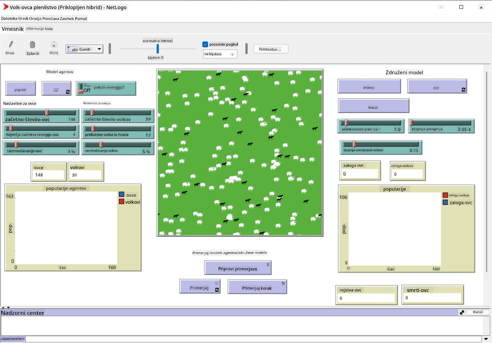

<!--
CO_OP_TRANSLATOR_METADATA:
{
  "original_hash": "1ddf651d7681b4449f9d09ea3b17911e",
  "translation_date": "2025-08-25T23:25:56+00:00",
  "source_file": "lessons/6-Other/23-MultiagentSystems/README.md",
  "language_code": "sl"
}
-->
# Večagentni sistemi

Eden od možnih načinov za doseganje inteligence je tako imenovani **emergentni** (ali **sinergijski**) pristop, ki temelji na dejstvu, da lahko združeno vedenje mnogih relativno preprostih agentov privede do bolj kompleksnega (ali inteligentnega) vedenja sistema kot celote. Teoretično to temelji na principih [kolektivne inteligence](https://en.wikipedia.org/wiki/Collective_intelligence), [emergentizma](https://en.wikipedia.org/wiki/Global_brain) in [evolucijske kibernetike](https://en.wikipedia.org/wiki/Global_brain), ki pravijo, da višjenivojski sistemi pridobijo neko dodano vrednost, ko so pravilno sestavljeni iz nižjenivojskih sistemov (tako imenovani *princip prehoda metasistema*).

## [Predavanje kviz](https://ff-quizzes.netlify.app/en/ai/quiz/45)

Smer **večagentnih sistemov** se je v umetni inteligenci pojavila v 90. letih prejšnjega stoletja kot odgovor na rast interneta in porazdeljenih sistemov. Ena od klasičnih učbenikov umetne inteligence, [Artificial Intelligence: A Modern Approach](https://en.wikipedia.org/wiki/Artificial_Intelligence:_A_Modern_Approach), se osredotoča na pogled klasične umetne inteligence z vidika večagentnih sistemov.

Osrednji pojem večagentnega pristopa je **agent** - entiteta, ki živi v nekem **okolju**, ki ga lahko zaznava in nanj vpliva. To je zelo široka definicija, zato obstaja veliko različnih vrst in klasifikacij agentov:

* Glede na njihovo sposobnost razmišljanja:
   - **Reaktivni** agenti običajno delujejo po principu preprostega odziva na zahtevo
   - **Deliberativni** agenti uporabljajo neko obliko logičnega razmišljanja in/ali načrtovanja
* Glede na mesto izvajanja kode agenta:
   - **Statični** agenti delujejo na določenem omrežnem vozlišču
   - **Mobilni** agenti lahko premikajo svojo kodo med omrežnimi vozlišči
* Glede na njihovo vedenje:
   - **Pasivni agenti** nimajo specifičnih ciljev. Takšni agenti se lahko odzivajo na zunanje dražljaje, vendar sami ne bodo sprožili nobenih dejanj.
   - **Aktivni agenti** imajo določene cilje, ki jih zasledujejo
   - **Kognitivni agenti** vključujejo kompleksno načrtovanje in razmišljanje

Večagentni sistemi se danes uporabljajo v številnih aplikacijah:

* V igrah mnogi liki, ki niso igralci, uporabljajo neko obliko umetne inteligence in jih lahko štejemo za inteligentne agente
* Pri video produkciji se za upodabljanje kompleksnih 3D prizorov, ki vključujejo množice, običajno uporablja večagentna simulacija
* Pri modeliranju sistemov se večagentni pristop uporablja za simulacijo vedenja kompleksnega modela. Na primer, večagentni pristop je bil uspešno uporabljen za napovedovanje širjenja bolezni COVID-19 po svetu. Podoben pristop se lahko uporabi za modeliranje prometa v mestu in opazovanje, kako se odziva na spremembe prometnih pravil.
* V kompleksnih avtomatizacijskih sistemih lahko vsaka naprava deluje kot neodvisen agent, kar naredi celoten sistem manj monoliten in bolj robusten.

Ne bomo se poglabljali v večagentne sisteme, ampak bomo obravnavali en primer **večagentnega modeliranja**.

## NetLogo

[NetLogo](https://ccl.northwestern.edu/netlogo/) je okolje za večagentno modeliranje, ki temelji na prilagojeni različici programskega jezika [Logo](https://en.wikipedia.org/wiki/Logo_(programming_language)). Ta jezik je bil razvit za poučevanje programskih konceptov otrokom in omogoča nadzor agenta, imenovanega **želva**, ki se lahko premika in za seboj pušča sled. To omogoča ustvarjanje kompleksnih geometrijskih oblik, kar je zelo vizualen način za razumevanje vedenja agenta.

V NetLogu lahko ustvarimo veliko želv z ukazom `create-turtles`. Nato lahko vsem želvam ukazujemo, naj izvedejo določena dejanja (v spodnjem primeru - premik za 10 točk naprej):

```
create-turtles 10
ask turtles [
  forward 10
]
```

Seveda ni zanimivo, če vse želve počnejo isto stvar, zato lahko `ask` uporabimo za skupine želv, npr. tiste, ki so v bližini določene točke. Prav tako lahko ustvarimo želve različnih *vrst* z ukazom `breed [cats cat]`. Tukaj je `cat` ime vrste, pri čemer moramo določiti tako edninsko kot množinsko obliko, saj različni ukazi uporabljajo različne oblike za jasnost.

> ✅ Ne bomo se učili jezika NetLogo - če vas zanima več, obiščite odličen [Interaktivni slovar za začetnike NetLogo](https://ccl.northwestern.edu/netlogo/bind/).

NetLogo lahko [preneseš](https://ccl.northwestern.edu/netlogo/download.shtml) in namestiš, da ga preizkusiš.

### Knjižnica modelov

Odlična stvar pri NetLogu je, da vsebuje knjižnico delujočih modelov, ki jih lahko preizkusite. Pojdite na **File → Models Library**, kjer imate na voljo veliko kategorij modelov.


> Posnetek zaslona knjižnice modelov avtorja Dmitry Soshnikov

Odprite enega od modelov, na primer **Biology → Flocking**.

### Glavna načela

Ko odprete model, vas program pripelje na glavni zaslon NetLogo. Tukaj je primer modela, ki opisuje populacijo volkov in ovc ob omejenih virih (trava).



> Posnetek zaslona avtorja Dmitry Soshnikov

Na tem zaslonu lahko vidite:

* Odsek **Interface**, ki vsebuje:
  - Glavno polje, kjer živijo vsi agenti
  - Različne kontrole: gumbe, drsnike itd.
  - Grafe, ki jih lahko uporabite za prikaz parametrov simulacije
* Zavihek **Code**, ki vsebuje urejevalnik, kjer lahko pišete program NetLogo

V večini primerov ima vmesnik gumb **Setup**, ki inicializira stanje simulacije, in gumb **Go**, ki začne izvajanje. Ti gumbi so obdelani z ustreznimi obdelovalci v kodi, ki izgledajo takole:

```
to go [
...
]
```

Svet NetLogo sestavljajo naslednji objekti:

* **Agenti** (želve), ki se lahko premikajo po polju in nekaj počnejo. Agente ukazujete z uporabo sintakse `ask turtles [...]`, pri čemer se koda v oklepajih izvaja za vse agente v *načinu želve*.
* **Zaplate** so kvadratna območja polja, na katerih živijo agenti. Lahko se sklicujete na vse agente na isti zaplati ali spreminjate barve zaplat in nekatere druge lastnosti. Prav tako lahko `ask patches`, da nekaj naredijo.
* **Opazovalec** je edinstven agent, ki nadzoruje svet. Vsi obdelovalci gumbov se izvajajo v *načinu opazovalca*.

> ✅ Lepota večagentnega okolja je v tem, da se koda, ki se izvaja v načinu želve ali zaplate, izvaja hkrati za vse agente vzporedno. Tako lahko z malo kode in programiranjem vedenja posameznega agenta ustvarite kompleksno vedenje celotnega simulacijskega sistema.

### Jata

Kot primer večagentnega vedenja si oglejmo **[jato](https://en.wikipedia.org/wiki/Flocking_(behavior))**. Jata je kompleksen vzorec, ki je zelo podoben načinu letenja jate ptic. Ko jih opazujete, lahko pomislite, da sledijo nekakšnemu kolektivnemu algoritmu ali da imajo neko obliko *kolektivne inteligence*. Vendar pa to kompleksno vedenje nastane, ko vsak posamezen agent (v tem primeru *ptica*) opazuje le nekaj drugih agentov na kratki razdalji in sledi trem preprostim pravilom:

* **Poravnava** - usmerja se proti povprečni smeri sosednjih agentov
* **Kohezija** - poskuša se usmeriti proti povprečni poziciji sosedov (*dolgo razdaljna privlačnost*)
* **Ločitev** - ko se preveč približa drugim pticam, se poskuša oddaljiti (*kratko razdaljna odbojnost*)

Lahko zaženete primer jate in opazujete vedenje. Prav tako lahko prilagodite parametre, kot so *stopnja ločitve* ali *vidno polje*, ki določa, kako daleč lahko vsaka ptica vidi. Upoštevajte, da če zmanjšate vidno polje na 0, vse ptice postanejo slepe in jata preneha delovati. Če zmanjšate ločitev na 0, se vse ptice zberejo v ravno črto.

> ✅ Preklopite na zavihek **Code** in preverite, kje so v kodi implementirana tri pravila jate (poravnava, kohezija in ločitev). Opazite, kako se sklicujemo le na tiste agente, ki so v vidnem polju.

### Drugi modeli za ogled

Obstaja še nekaj zanimivih modelov, ki jih lahko preizkusite:

* **Art → Fireworks** prikazuje, kako lahko ognjemet štejemo za kolektivno vedenje posameznih ognjenih tokov
* **Social Science → Traffic Basic** in **Social Science → Traffic Grid** prikazujeta model mestnega prometa v 1D in 2D mreži z ali brez semaforjev. Vsak avto v simulaciji sledi naslednjim pravilom:
   - Če je prostor pred njim prazen - pospeši (do določene največje hitrosti)
   - Če vidi oviro pred seboj - zavira (in lahko prilagodite, kako daleč voznik vidi)
* **Social Science → Party** prikazuje, kako se ljudje združujejo na koktajl zabavi. Lahko najdete kombinacijo parametrov, ki vodi do najhitrejšega povečanja sreče skupine.

Kot lahko vidite iz teh primerov, so večagentne simulacije lahko zelo uporaben način za razumevanje vedenja kompleksnega sistema, sestavljenega iz posameznikov, ki sledijo enakim ali podobnim logikam. Uporabljajo se lahko tudi za nadzor virtualnih agentov, kot so [NPC-ji](https://en.wikipedia.org/wiki/NPC) v računalniških igrah ali agenti v 3D animiranih svetovih.

## Deliberativni agenti

Zgoraj opisani agenti so zelo preprosti in se odzivajo na spremembe v okolju z uporabo neke vrste algoritma. Takšni agenti so **reaktivni agenti**. Vendar pa lahko včasih agenti razmišljajo in načrtujejo svoja dejanja, v tem primeru jih imenujemo **deliberativni**.

Tipičen primer bi bil osebni agent, ki prejme navodilo od človeka, naj rezervira počitniški paket. Predpostavimo, da na internetu obstaja veliko agentov, ki mu lahko pomagajo. Moral bi stopiti v stik z drugimi agenti, da preveri, kateri leti so na voljo, kakšne so cene hotelov za različne datume, in poskusiti izpogajati najboljšo ceno. Ko je načrt počitnic dokončan in potrjen s strani lastnika, lahko nadaljuje z rezervacijo.

Za to potrebujejo agenti **komunikacijo**. Za uspešno komunikacijo potrebujejo:

* Nekatere **standardne jezike za izmenjavo znanja**, kot sta [Knowledge Interchange Format](https://en.wikipedia.org/wiki/Knowledge_Interchange_Format) (KIF) in [Knowledge Query and Manipulation Language](https://en.wikipedia.org/wiki/Knowledge_Query_and_Manipulation_Language) (KQML). Ti jeziki so zasnovani na podlagi [teorije govornih dejanj](https://en.wikipedia.org/wiki/Speech_act).
* Ti jeziki morajo vključevati tudi nekatere **protokole za pogajanja**, ki temeljijo na različnih **vrstah dražb**.
* **Skupno ontologijo**, ki jo uporabljajo, da se sklicujejo na iste koncepte in poznajo njihov pomen
* Način za **odkrivanje**, kaj lahko različni agenti naredijo, prav tako na podlagi neke vrste ontologije

Deliberativni agenti so veliko bolj kompleksni kot reaktivni, saj se ne odzivajo le na spremembe v okolju, ampak morajo tudi *sprožiti* dejanja. Ena od predlaganih arhitektur za deliberativne agente je tako imenovani agent Verovanje-Želja-Namera (BDI):

* **Verovanja** tvorijo niz znanja o agentovem okolju. Lahko so strukturirana kot baza znanja ali niz pravil, ki jih agent lahko uporabi v določeni situaciji v okolju.
* **Želje** določajo, kaj agent želi narediti, tj. njegove cilje. Na primer, cilj osebnega asistenta zgoraj je rezervirati počitnice, cilj hotelskega agenta pa je maksimirati dobiček.
* **Namere** so specifična dejanja, ki jih agent načrtuje za dosego svojih ciljev. Dejanja običajno spremenijo okolje in povzročijo komunikacijo z drugimi agenti.

Na voljo so nekatere platforme za gradnjo večagentnih sistemov, kot je [JADE](https://jade.tilab.com/). [Ta članek](https://arxiv.org/ftp/arxiv/papers/2007/2007.08961.pdf) vsebuje pregled večagentnih platform skupaj s kratko zgodovino večagentnih sistemov in njihovimi različnimi scenariji uporabe.

## Zaključek

Večagentni sistemi lahko zavzamejo zelo različne oblike in se uporabljajo v številnih različnih aplikacijah. 
Vsi se osredotočajo na preprostejše vedenje posameznega agenta in dosežejo bolj kompleksno vedenje celotnega sistema zaradi **sinergijskega učinka**.

## 🚀 Izziv

Prenesite to lekcijo v resnični svet in poskusite zasnovati večagentni sistem, ki lahko reši določen problem. Kaj bi na primer moral narediti večagentni sistem za optimizacijo poti šolskega avtobusa? Kako bi lahko deloval v pekarni?

## [Kviz po predavanju](https://ff-quizzes.netlify.app/en/ai/quiz/46)

## Pregled in samostojno učenje

Preglejte uporabo tovrstnih sistemov v industriji. Izberite področje, kot je proizvodnja ali industrija video iger, in odkrijte, kako se večagentni sistemi lahko uporabljajo za reševanje edinstvenih problemov.

## [Naloga NetLogo](assignment.md)

**Omejitev odgovornosti**:  
Ta dokument je bil preveden z uporabo storitve AI za prevajanje [Co-op Translator](https://github.com/Azure/co-op-translator). Čeprav si prizadevamo za natančnost, vas prosimo, da upoštevate, da lahko avtomatizirani prevodi vsebujejo napake ali netočnosti. Izvirni dokument v njegovem maternem jeziku je treba obravnavati kot avtoritativni vir. Za ključne informacije priporočamo profesionalni človeški prevod. Ne prevzemamo odgovornosti za morebitne nesporazume ali napačne razlage, ki bi nastale zaradi uporabe tega prevoda.