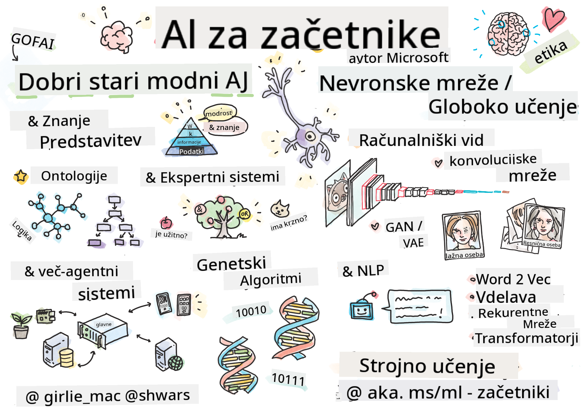

<!--
CO_OP_TRANSLATOR_METADATA:
{
  "original_hash": "5fef1a0b22498d7188959e2a2cb08af7",
  "translation_date": "2025-08-25T21:23:29+00:00",
  "source_file": "lessons/README.md",
  "language_code": "sl"
}
-->
# Pregled

> Skica avtorja [Tomomi Imura](https://twitter.com/girlie_mac)

**Omejitev odgovornosti**:  
Ta dokument je bil preveden z uporabo storitve AI za prevajanje [Co-op Translator](https://github.com/Azure/co-op-translator). Čeprav si prizadevamo za natančnost, vas prosimo, da upoštevate, da lahko avtomatizirani prevodi vsebujejo napake ali netočnosti. Izvirni dokument v njegovem maternem jeziku je treba obravnavati kot avtoritativni vir. Za ključne informacije priporočamo profesionalni človeški prevod. Ne prevzemamo odgovornosti za morebitna nesporazumevanja ali napačne razlage, ki izhajajo iz uporabe tega prevoda.