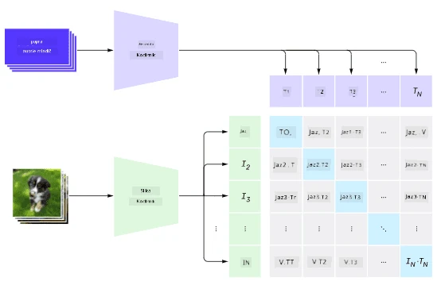
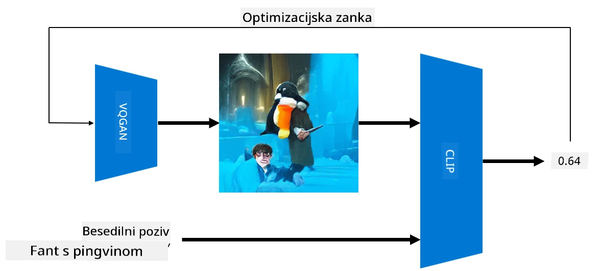

# Multi-modalna omrežja

Po uspehu modelov transformatorjev pri reševanju nalog NLP so bile iste ali podobne arhitekture uporabljene tudi za naloge računalniškega vida. Narašča zanimanje za gradnjo modelov, ki bi *združevali* sposobnosti vida in naravnega jezika. Eden takšnih poskusov je bil izveden s strani OpenAI, imenovan CLIP in DALL.E.

## Kontrastno predhodno učenje slik (CLIP)

Glavna ideja CLIP je primerjati besedilne pozive s sliko in ugotoviti, kako dobro slika ustreza pozivu.

> *Slika iz [tega blog prispevka](https://openai.com/blog/clip/)*

Model je treniran na slikah, pridobljenih z interneta, in njihovih napisih. Za vsak paket vzamemo N parov (slika, besedilo) in jih pretvorimo v vektorske reprezentacije I, ..., I / T, ..., T. Te reprezentacije se nato medsebojno ujemajo. Funkcija izgube je definirana tako, da maksimizira kosinusno podobnost med vektorji, ki ustrezajo enemu paru (npr. I in T), ter minimizira kosinusno podobnost med vsemi drugimi pari. Zaradi tega se ta pristop imenuje **kontrastni**.

Model/biblioteka CLIP je na voljo na [OpenAI GitHub](https://github.com/openai/CLIP). Pristop je opisan v [tem blog prispevku](https://openai.com/blog/clip/) in podrobneje v [tem članku](https://arxiv.org/pdf/2103.00020.pdf).

Ko je model predhodno treniran, mu lahko podamo paket slik in paket besedilnih pozivov, rezultat pa bo tenzor s verjetnostmi. CLIP se lahko uporablja za več nalog:

**Razvrščanje slik**

Recimo, da moramo razvrstiti slike med, na primer, mačke, pse in ljudi. V tem primeru lahko modelu podamo sliko in serijo besedilnih pozivov: "*slika mačke*", "*slika psa*", "*slika človeka*". V nastalem vektorju s tremi verjetnostmi moramo le izbrati indeks z najvišjo vrednostjo.

> *Slika iz [tega blog prispevka](https://openai.com/blog/clip/)*

**Iskanje slik na podlagi besedila**

Lahko naredimo tudi obratno. Če imamo zbirko slik, jo lahko posredujemo modelu skupaj z besedilnim pozivom - to nam bo dalo sliko, ki je najbolj podobna danemu pozivu.

## ✍️ Primer: [Uporaba CLIP za razvrščanje slik in iskanje slik](../../../../../lessons/X-Extras/X1-MultiModal/Clip.ipynb)

Odprite zvezek [Clip.ipynb](../../../../../lessons/X-Extras/X1-MultiModal/Clip.ipynb), da vidite CLIP v akciji.

## Generiranje slik z VQGAN+CLIP

CLIP se lahko uporablja tudi za **generiranje slik** na podlagi besedilnega poziva. Za to potrebujemo **generatorski model**, ki bo sposoben generirati slike na podlagi nekega vektorskega vnosa. Eden takšnih modelov se imenuje [VQGAN](https://compvis.github.io/taming-transformers/) (Vector-Quantized GAN).

Glavne ideje VQGAN, ki ga razlikujejo od običajnega [GAN](../../4-ComputerVision/10-GANs/README.md), so naslednje:
* Uporaba avto-regresivne arhitekture transformatorja za generiranje zaporedja vizualnih delov, bogatih s kontekstom, ki sestavljajo sliko. Ti vizualni deli se nato učijo z [CNN](../../4-ComputerVision/07-ConvNets/README.md).
* Uporaba diskriminatorja pod-slik, ki zazna, ali so deli slike "resnični" ali "ponarejeni" (za razliko od pristopa "vse ali nič" v tradicionalnem GAN).

Več o VQGAN si lahko preberete na spletni strani [Taming Transformers](https://compvis.github.io/taming-transformers/).

Ena pomembna razlika med VQGAN in tradicionalnim GAN je, da slednji lahko ustvari spodobno sliko iz katerega koli vhodnega vektorja, medtem ko VQGAN verjetno ustvari sliko, ki ni koherentna. Zato moramo dodatno usmerjati proces ustvarjanja slike, kar lahko storimo z uporabo CLIP.

Za generiranje slike, ki ustreza besedilnemu pozivu, začnemo z naključnim kodirnim vektorjem, ki ga posredujemo VQGAN za ustvarjanje slike. Nato uporabimo CLIP za ustvarjanje funkcije izgube, ki kaže, kako dobro slika ustreza besedilnemu pozivu. Cilj je nato minimizirati to izgubo z uporabo povratnega razširjanja za prilagoditev parametrov vhodnega vektorja.

Odlična knjižnica, ki implementira VQGAN+CLIP, je [Pixray](http://github.com/pixray/pixray).

 |   | 
----|----|----
Slika, ustvarjena iz poziva *bližnji akvarelni portret mladega učitelja književnosti z knjigo* | Slika, ustvarjena iz poziva *bližnji oljni portret mlade učiteljice računalništva z računalnikom* | Slika, ustvarjena iz poziva *bližnji oljni portret starega učitelja matematike pred tablo*

> Slike iz zbirke **Umetni učitelji** avtorja [Dmitry Soshnikov](http://soshnikov.com)

## DALL-E
### [DALL-E 1](https://openai.com/research/dall-e)
DALL-E je različica GPT-3, trenirana za generiranje slik na podlagi pozivov. Treniran je bil z 12 milijardami parametrov.

Za razliko od CLIP DALL-E prejme tako besedilo kot sliko kot enoten tok tokenov za slike in besedilo. Zato lahko iz več pozivov generirate slike na podlagi besedila.

### [DALL-E 2](https://openai.com/dall-e-2)
Glavna razlika med DALL.E 1 in 2 je, da generira bolj realistične slike in umetnost.

Primeri generiranja slik z DALL-E:
 |   | 
----|----|----
Slika, ustvarjena iz poziva *bližnji akvarelni portret mladega učitelja književnosti z knjigo* | Slika, ustvarjena iz poziva *bližnji oljni portret mlade učiteljice računalništva z računalnikom* | Slika, ustvarjena iz poziva *bližnji oljni portret starega učitelja matematike pred tablo*

## Reference

* Članek o VQGAN: [Taming Transformers for High-Resolution Image Synthesis](https://compvis.github.io/taming-transformers/paper/paper.pdf)
* Članek o CLIP: [Learning Transferable Visual Models From Natural Language Supervision](https://arxiv.org/pdf/2103.00020.pdf)

**Omejitev odgovornosti**:  
Ta dokument je bil preveden z uporabo storitve AI za prevajanje [Co-op Translator](https://github.com/Azure/co-op-translator). Čeprav si prizadevamo za natančnost, vas prosimo, da upoštevate, da lahko avtomatizirani prevodi vsebujejo napake ali netočnosti. Izvirni dokument v njegovem izvirnem jeziku je treba obravnavati kot avtoritativni vir. Za ključne informacije priporočamo profesionalni človeški prevod. Ne prevzemamo odgovornosti za morebitna nesporazumevanja ali napačne razlage, ki bi nastale zaradi uporabe tega prevoda.