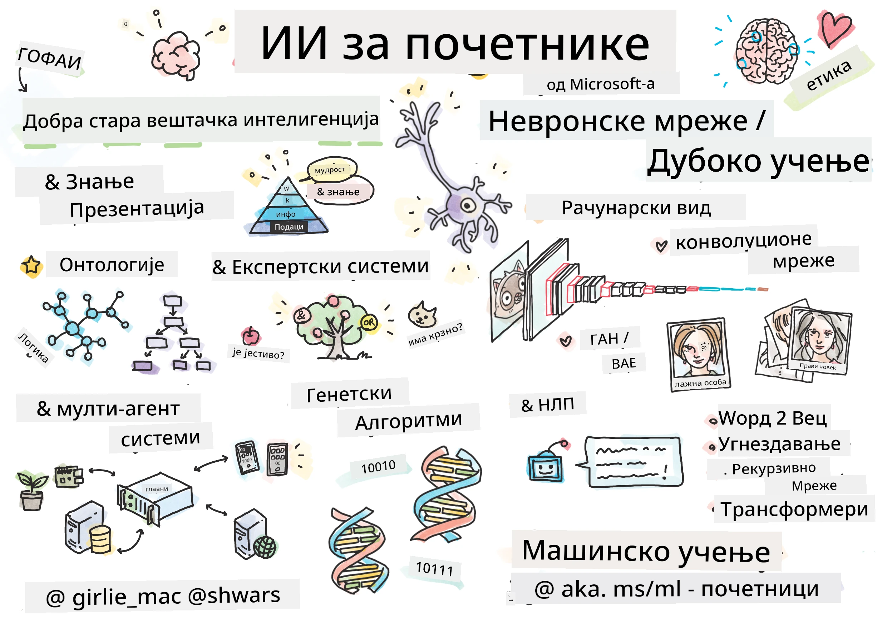

[](https://github.com/microsoft/AI-For-Beginners/blob/main/LICENSE)
[](https://GitHub.com/microsoft/AI-For-Beginners/graphs/contributors/)
[](https://GitHub.com/microsoft/AI-For-Beginners/issues/)
[](https://GitHub.com/microsoft/AI-For-Beginners/pulls/)
[](http://makeapullrequest.com)

[](https://GitHub.com/microsoft/AI-For-Beginners/watchers/)
[](https://GitHub.com/microsoft/AI-For-Beginners/network/)
[](https://GitHub.com/microsoft/AI-For-Beginners/stargazers/)
[](https://mybinder.org/v2/gh/microsoft/ai-for-beginners/HEAD)
[](https://gitter.im/Microsoft/ai-for-beginners?utm_source=badge&utm_medium=badge&utm_campaign=pr-badge)

[](https://discord.gg/nTYy5BXMWG)

# Вештачка интелигенција за почетнике - наставни план

||
|:---:|
| AI For Beginners - _Скетчнот од [@girlie_mac](https://twitter.com/girlie_mac)_ |

Истражите свет **Вештачке интелигенције** (AI) са нашим 12-недељним, 24-лекцијским наставним планом! Укључује практичне лекције, квизове и лабораторијске вежбе. Наставни план је прилагођен почетницима и обухвата алате као што су TensorFlow и PyTorch, као и етику у AI


### 🌐 Подршка за више језика

#### Подржано путем GitHub Action-а (аутоматски и увек ажурирано)

<!-- CO-OP TRANSLATOR LANGUAGES TABLE START -->
[Arabic](../ar/README.md) | [Bengali](../bn/README.md) | [Bulgarian](../bg/README.md) | [Burmese (Myanmar)](../my/README.md) | [Chinese (Simplified)](../zh-CN/README.md) | [Chinese (Traditional, Hong Kong)](../zh-HK/README.md) | [Chinese (Traditional, Macau)](../zh-MO/README.md) | [Chinese (Traditional, Taiwan)](../zh-TW/README.md) | [Croatian](../hr/README.md) | [Czech](../cs/README.md) | [Danish](../da/README.md) | [Dutch](../nl/README.md) | [Estonian](../et/README.md) | [Finnish](../fi/README.md) | [French](../fr/README.md) | [German](../de/README.md) | [Greek](../el/README.md) | [Hebrew](../he/README.md) | [Hindi](../hi/README.md) | [Hungarian](../hu/README.md) | [Indonesian](../id/README.md) | [Italian](../it/README.md) | [Japanese](../ja/README.md) | [Kannada](../kn/README.md) | [Korean](../ko/README.md) | [Lithuanian](../lt/README.md) | [Malay](../ms/README.md) | [Malayalam](../ml/README.md) | [Marathi](../mr/README.md) | [Nepali](../ne/README.md) | [Nigerian Pidgin](../pcm/README.md) | [Norwegian](../no/README.md) | [Persian (Farsi)](../fa/README.md) | [Polish](../pl/README.md) | [Portuguese (Brazil)](../pt-BR/README.md) | [Portuguese (Portugal)](../pt-PT/README.md) | [Punjabi (Gurmukhi)](../pa/README.md) | [Romanian](../ro/README.md) | [Russian](../ru/README.md) | [Serbian (Cyrillic)](./README.md) | [Slovak](../sk/README.md) | [Slovenian](../sl/README.md) | [Spanish](../es/README.md) | [Swahili](../sw/README.md) | [Swedish](../sv/README.md) | [Tagalog (Filipino)](../tl/README.md) | [Tamil](../ta/README.md) | [Telugu](../te/README.md) | [Thai](../th/README.md) | [Turkish](../tr/README.md) | [Ukrainian](../uk/README.md) | [Urdu](../ur/README.md) | [Vietnamese](../vi/README.md)

> **Можете ли да клонирате локално?**

> Ово складиште укључује преводе на преко 50 језика што значајно повећава величину за преузимање. Да бисте клонирали без превода, користите sparse checkout:
> ```bash
> git clone --filter=blob:none --sparse https://github.com/microsoft/AI-For-Beginners.git
> cd AI-For-Beginners
> git sparse-checkout set --no-cone '/*' '!translations' '!translated_images'
> ```
> Ово вам даје све што вам је потребно да завршите курс са много бржим преузимањем.
<!-- CO-OP TRANSLATOR LANGUAGES TABLE END -->

**Ако желите да подржимо додатне језике превода они су наведени [овде](https://github.com/Azure/co-op-translator/blob/main/getting_started/supported-languages.md)**

## Придружите се заједници
[](https://discord.gg/nTYy5BXMWG)

## Шта ћете научити

**[Ментална мапа курса](http://soshnikov.com/courses/ai-for-beginners/mindmap.html)**

У овом наставном плану ћете научити:

* Различите приступе Вештачкој интелигенцији, укључујући „стари добри“ симболички приступ са **презентацијом знања** и резоновањем ([GOFAI](https://en.wikipedia.org/wiki/Symbolic_artificial_intelligence)).
* **Неуронске мреже** и **дубоко учење**, које су у основи модерног AI. Илуструјемо концепте иза ових важних тема користећи код у два од најпопуларнијих фрејмворка - [TensorFlow](http://Tensorflow.org) и [PyTorch](http://pytorch.org).
* **Неуралне архитектуре** за рад са сликама и текстом. Покриваћемо новије моделе али можда мало заостајемо за најсавременијим достигнућима.
* Мање популарне AI приступе, као што су **генетски алгоритми** и **мулти-агентски системи**.

Шта нећемо обрађивати у овом наставном плану:

> [Пронађите све додатне ресурсе за овај курс у нашој Microsoft Learn колекцији](https://learn.microsoft.com/en-us/collections/7w28iy2xrqzdj0?WT.mc_id=academic-77998-bethanycheum)

* Пословне случајеве коришћења **AI у пословању**. Размотрите похађање [Увода у AI за пословне кориснике](https://docs.microsoft.com/learn/paths/introduction-ai-for-business-users/?WT.mc_id=academic-77998-bethanycheum) на Microsoft Learn или [AI пословне школе](https://www.microsoft.com/ai/ai-business-school/?WT.mc_id=academic-77998-bethanycheum), развијене у сарадњи са [INSEAD](https://www.insead.edu/).
* **Класично машинско учење**, које је подробно описано у нашем [Наставном плану за почетнике из машинског учења](http://github.com/Microsoft/ML-for-Beginners).
* Практичне AI апликације изграђене коришћењем **[Cognitive Services](https://azure.microsoft.com/services/cognitive-services/?WT.mc_id=academic-77998-bethanycheum)**. За ово препоручујемо да почнете са Microsoft Learn модулима за [вид](https://docs.microsoft.com/learn/paths/create-computer-vision-solutions-azure-cognitive-services/?WT.mc_id=academic-77998-bethanycheum), [обраду природног језика](https://docs.microsoft.com/learn/paths/explore-natural-language-processing/?WT.mc_id=academic-77998-bethanycheum), **[генеративни AI са Azure OpenAI сервиса](https://learn.microsoft.com/en-us/training/paths/develop-ai-solutions-azure-openai/?WT.mc_id=academic-77998-bethanycheum)** и друге.
* Специфичне ML **Cloud Framework-ове**, као што су [Azure Machine Learning](https://azure.microsoft.com/services/machine-learning/?WT.mc_id=academic-77998-bethanycheum), [Microsoft Fabric](https://learn.microsoft.com/en-us/training/paths/get-started-fabric/?WT.mc_id=academic-77998-bethanycheum) или [Azure Databricks](https://docs.microsoft.com/learn/paths/data-engineer-azure-databricks?WT.mc_id=academic-77998-bethanycheum). Размотрите коришћење путева учења [Изградите и управљајте решењима машинског учења са Azure Machine Learning](https://docs.microsoft.com/learn/paths/build-ai-solutions-with-azure-ml-service/?WT.mc_id=academic-77998-bethanycheum) и [Изградите и управљајте решењима машинског учења са Azure Databricks](https://docs.microsoft.com/learn/paths/build-operate-machine-learning-solutions-azure-databricks/?WT.mc_id=academic-77998-bethanycheum).
* **Конверзациони AI** и **Чат ботове**. Постоји посебан [Пут учења за креирање конверзационих AI решења](https://docs.microsoft.com/learn/paths/create-conversational-ai-solutions/?WT.mc_id=academic-77998-bethanycheum), а можете се упутити и на [овaj блог пост](https://soshnikov.com/azure/hello-bot-conversational-ai-on-microsoft-platform/) за детаљније информације.
* **Дубока математика** иза дубоког учења. За ово препоручујемо [Deep Learning](https://www.amazon.com/Deep-Learning-Adaptive-Computation-Machine/dp/0262035618) аутора Иана Гудфелова, Јошуа Бенџија и Аарона Коурвила, која је доступна и на мрежи на [https://www.deeplearningbook.org/](https://www.deeplearningbook.org/).

За благи увод у теме _AI у облаку_, можете размотрити похађање Пута учења [Започните са вештачком интелигенцијом на Azure-у](https://docs.microsoft.com/learn/paths/get-started-with-artificial-intelligence-on-azure/?WT.mc_id=academic-77998-bethanycheum).

# Садржај

|     |                                                                 Лекција                                                                 |                                           PyTorch/Keras/TensorFlow                                          | Лабораторија                                                    |
| :-: | :-------------------------------------------------------------------------------------------------------------------------------------: | :---------------------------------------------------------------------------------------------: | ------------------------------------------------------------------------------ |
| 0  |                                 [Постављање курса](./lessons/0-course-setup/setup.md)                                 |                      [Поставите своје развојно окружење](./lessons/0-course-setup/how-to-run.md)                       |   |
| I  |               [**Увод у AI**](./lessons/1-Intro/README.md)      | | |
| 01  |       [Увод и историја AI](./lessons/1-Intro/README.md)       |           -                            | -  |
| II |              **Симболички AI**              |
| 02  |       [Представљање знања и експертски системи](./lessons/2-Symbolic/README.md)       |            [Експертски системи](./lessons/2-Symbolic/Animals.ipynb) /  [Онтологија](./lessons/2-Symbolic/FamilyOntology.ipynb) /[Граф концепата](./lessons/2-Symbolic/MSConceptGraph.ipynb)                             |  |
| III |                        [**Увод у неуронске мреже**](./lessons/3-NeuralNetworks/README.md) |||
| 03  |                [Перцептрон](./lessons/3-NeuralNetworks/03-Perceptron/README.md)                 |                       [Бележница](./lessons/3-NeuralNetworks/03-Perceptron/Perceptron.ipynb)                      | [Лабораторија](./lessons/3-NeuralNetworks/03-Perceptron/lab/README.md) |
| 04  |                   [Вишеслојни перцептрон и креирање нашег властитог фрејмворка](./lessons/3-NeuralNetworks/04-OwnFramework/README.md)                   |        [Бележница](./lessons/3-NeuralNetworks/04-OwnFramework/OwnFramework.ipynb)        | [Лабораторија](./lessons/3-NeuralNetworks/04-OwnFramework/lab/README.md) |
| 05  |            [Увод у фрејмворке (PyTorch/TensorFlow) и претеривање](./lessons/3-NeuralNetworks/05-Frameworks/README.md)             |           [PyTorch](./lessons/3-NeuralNetworks/05-Frameworks/IntroPyTorch.ipynb) / [Keras](./lessons/3-NeuralNetworks/05-Frameworks/IntroKeras.ipynb) / [TensorFlow](./lessons/3-NeuralNetworks/05-Frameworks/IntroKerasTF.ipynb)             | [Лабораторија](./lessons/3-NeuralNetworks/05-Frameworks/lab/README.md) |
| IV  |            [**Рачунарски вид**](./lessons/4-ComputerVision/README.md)             | [PyTorch](https://docs.microsoft.com/learn/modules/intro-computer-vision-pytorch/?WT.mc_id=academic-77998-cacaste) / [TensorFlow](https://docs.microsoft.com/learn/modules/intro-computer-vision-TensorFlow/?WT.mc_id=academic-77998-cacaste)| [Истражите рачунарски вид на Microsoft Azure](https://learn.microsoft.com/en-us/collections/7w28iy2xrqzdj0?WT.mc_id=academic-77998-bethanycheum) |
| 06  |            [Увод у рачунарски вид. OpenCV](./lessons/4-ComputerVision/06-IntroCV/README.md)             |           [Бележница](./lessons/4-ComputerVision/06-IntroCV/OpenCV.ipynb)         | [Лабораторија](./lessons/4-ComputerVision/06-IntroCV/lab/README.md) |
| 07  |            [Конволуционе неуронске мреже](./lessons/4-ComputerVision/07-ConvNets/README.md) &  [CNN архитектуре](./lessons/4-ComputerVision/07-ConvNets/CNN_Architectures.md)             |           [PyTorch](./lessons/4-ComputerVision/07-ConvNets/ConvNetsPyTorch.ipynb) /[TensorFlow](./lessons/4-ComputerVision/07-ConvNets/ConvNetsTF.ipynb)             | [Лабораторија](./lessons/4-ComputerVision/07-ConvNets/lab/README.md) |
| 08  |            [Претходно обучене мреже и трансфер учење](./lessons/4-ComputerVision/08-TransferLearning/README.md) и [Трикови у обуци](./lessons/4-ComputerVision/08-TransferLearning/TrainingTricks.md)             |           [PyTorch](./lessons/4-ComputerVision/08-TransferLearning/TransferLearningPyTorch.ipynb) / [TensorFlow](./lessons/3-NeuralNetworks/05-Frameworks/IntroKerasTF.ipynb)             | [Лабораторија](./lessons/4-ComputerVision/08-TransferLearning/lab/README.md) |
| 09  |            [Аутокодери и VAE-ови](./lessons/4-ComputerVision/09-Autoencoders/README.md)             |           [PyTorch](./lessons/4-ComputerVision/09-Autoencoders/AutoEncodersPyTorch.ipynb) / [TensorFlow](./lessons/4-ComputerVision/09-Autoencoders/AutoencodersTF.ipynb)             |  |
| 10  |            [Генеративне адверзијалне мреже и пренос уметничког стила](./lessons/4-ComputerVision/10-GANs/README.md)             |           [PyTorch](./lessons/4-ComputerVision/10-GANs/GANPyTorch.ipynb) / [TensorFlow](./lessons/4-ComputerVision/10-GANs/GANTF.ipynb)             |  |
| 11  |            [Објектна детекција](./lessons/4-ComputerVision/11-ObjectDetection/README.md)             |         [TensorFlow](./lessons/4-ComputerVision/11-ObjectDetection/ObjectDetection.ipynb)             | [Лабораторија](./lessons/4-ComputerVision/11-ObjectDetection/lab/README.md) |
| 12  |            [Семантичка сегментација. У-Нет](./lessons/4-ComputerVision/12-Segmentation/README.md)             |           [PyTorch](./lessons/4-ComputerVision/12-Segmentation/SemanticSegmentationPytorch.ipynb) / [TensorFlow](./lessons/4-ComputerVision/12-Segmentation/SemanticSegmentationTF.ipynb)             |  |
| V  |            [**Обрада природног језика**](./lessons/5-NLP/README.md)             | [PyTorch](https://docs.microsoft.com/learn/modules/intro-natural-language-processing-pytorch/?WT.mc_id=academic-77998-cacaste) /[TensorFlow](https://docs.microsoft.com/learn/modules/intro-natural-language-processing-TensorFlow/?WT.mc_id=academic-77998-cacaste) | [Истражите обраду природног језика на Microsoft Azure](https://learn.microsoft.com/en-us/collections/7w28iy2xrqzdj0?WT.mc_id=academic-77998-bethanycheum)|
| 13  |            [Презентација текста. Боу/ТФ-ИДФ](./lessons/5-NLP/13-TextRep/README.md)             |           [PyTorch](https://github.com/microsoft/AI-For-Beginners/blob/main/lessons/5-NLP/13-TextRep/TextRepresentationPyTorch.ipynb) / [TensorFlow](https://github.com/microsoft/AI-For-Beginners/blob/main/lessons/5-NLP/13-TextRep/TextRepresentationTF.ipynb)             | |
| 14  |            [Семантички векторски уграњања речи. Word2Vec и GloVe](./lessons/5-NLP/14-Embeddings/README.md)             |           [PyTorch](https://github.com/microsoft/AI-For-Beginners/blob/main/lessons/5-NLP/14-Embeddings/EmbeddingsPyTorch.ipynb) / [TensorFlow](https://github.com/microsoft/AI-For-Beginners/blob/main/lessons/5-NLP/14-Embeddings/EmbeddingsTF.ipynb)             |  |
| 15  |            [Моделирање језика. Обука властитих уграњања](./lessons/5-NLP/15-LanguageModeling/README.md)             |           [PyTorch](https://github.com/microsoft/AI-For-Beginners/blob/main/lessons/5-NLP/15-LanguageModeling/CBoW-PyTorch.ipynb) / [TensorFlow](https://github.com/microsoft/AI-For-Beginners/blob/main/lessons/5-NLP/15-LanguageModeling/CBoW-TF.ipynb)             | [Лабораторија](./lessons/5-NLP/15-LanguageModeling/lab/README.md) |
| 16  |            [Рекурентне неуронске мреже](./lessons/5-NLP/16-RNN/README.md)             |           [PyTorch](https://github.com/microsoft/AI-For-Beginners/blob/main/lessons/5-NLP/16-RNN/RNNPyTorch.ipynb) / [TensorFlow](https://github.com/microsoft/AI-For-Beginners/blob/main/lessons/5-NLP/16-RNN/RNNTF.ipynb)             |  |
| 17  |            [Генеративне рекурентне мреже](./lessons/5-NLP/17-GenerativeNetworks/README.md)             |           [PyTorch](https://github.com/microsoft/AI-For-Beginners/blob/main/lessons/5-NLP/17-GenerativeNetworks/GenerativePyTorch.ipynb) / [TensorFlow](https://github.com/microsoft/AI-For-Beginners/blob/main/lessons/5-NLP/17-GenerativeNetworks/GenerativeTF.ipynb)             | [Лабораторија](./lessons/5-NLP/17-GenerativeNetworks/lab/README.md) |
| 18  |            [Трансформери. BERT.](./lessons/5-NLP/18-Transformers/README.md)             |           [PyTorch](https://github.com/microsoft/AI-For-Beginners/blob/main/lessons/5-NLP/18-Transformers/TransformersPyTorch.ipynb) /[TensorFlow](https://github.com/microsoft/AI-For-Beginners/blob/main/lessons/5-NLP/18-Transformers/TransformersTF.ipynb)             |  |
| 19  |            [Препознавање именованих ентитета](./lessons/5-NLP/19-NER/README.md)             |           [TensorFlow](https://microsoft.github.io/AI-For-Beginners/lessons/5-NLP/19-NER/NER-TF.ipynb)             | [Лабораторија](./lessons/5-NLP/19-NER/lab/README.md) |
| 20  |            [Велики језички модели, програмирање упита и уради са мало примера](./lessons/5-NLP/20-LangModels/README.md)             |           [PyTorch](https://microsoft.github.io/AI-For-Beginners/lessons/5-NLP/20-LangModels/GPT-PyTorch.ipynb) | |
| VI |            **Остале AI технике** || |
| 21  |            [Генетски алгоритми](./lessons/6-Other/21-GeneticAlgorithms/README.md)             |           [Бележница](./lessons/6-Other/21-GeneticAlgorithms/Genetic.ipynb) | |
| 22  |            [Дубоко учење уз ојачање](./lessons/6-Other/22-DeepRL/README.md)             |           [PyTorch](./lessons/6-Other/22-DeepRL/CartPole-RL-PyTorch.ipynb) /[TensorFlow](./lessons/6-Other/22-DeepRL/CartPole-RL-TF.ipynb)             | [Лабораторија](./lessons/6-Other/22-DeepRL/lab/README.md) |
| 23  |            [Системи са више агената](./lessons/6-Other/23-MultiagentSystems/README.md)             |  | |
| VII |            **AI етика** | | |
| 24  |            [Етика у AI и одговорни AI](./lessons/7-Ethics/README.md)             |           [Microsoft Learn: Одговорни принципи у AI](https://docs.microsoft.com/learn/paths/responsible-ai-business-principles/?WT.mc_id=academic-77998-cacaste) | |
| IX  |            **Додатак** | | |
| 25  |            [Мултимодалне мреже, CLIP и VQGAN](./lessons/X-Extras/X1-MultiModal/README.md)             |           [Бележница](./lessons/X-Extras/X1-MultiModal/Clip.ipynb)    | |

## Свака лекција садржи

* Материјал за претходно читање
* Извршне Јупитер бележнице, које су често специфичне за фрејмворк (**PyTorch** или **TensorFlow**). Извршна бележница такође садржи доста теоријског материјала, па да бисте разумели тему потребно је проћи кроз најмање једну верзију бележнице (или PyTorch или TensorFlow).
* **Лабораторије** доступне за неке теме, које вам пружају прилику да пробате примену наученог материјала на конкретном проблему.
* Неке секције садрже линкове ка [**MS Learn**](https://learn.microsoft.com/en-us/collections/7w28iy2xrqzdj0?WT.mc_id=academic-77998-bethanycheum) модулима који покривају сличне теме.

## Започните

### 🎯 Потпуно нови у AI? Почни овде!

Ако сте потпуно нови у AI и желите брзе, практичне примере, погледајте наше [**Примере прилагођене почетницима**](./examples/README.md)! Они укључују:

- 🌟 **Здраво AI свету** - Ваш први AI програм (препознавање шаблона)
- 🧠 **Једноставна неуронска мрежа** - Изградите неуронску мрежу од нуле  

- 🖼️ **Класификатор слика** - Класификујте слике са детаљним коментарима  
- 💬 **Текстуална сентимента** - Анализирајте позитиван/негативан текст  

Ови примери су направљени да вам помогну да разумете концепте вештачке интелигенције пре него што се упустите у цео курикулум.

### 📚 Подешавање целог курикулума

- Направили смо [лекцију за подешавање](./lessons/0-course-setup/setup.md) да вам помогнемо са подешавањем вашег развојног окружења. - За образовне раднике направили смо [лекцију за подешавање курикулума](./lessons/0-course-setup/for-teachers.md) и за вас!  
- Како [покренути код у VSCode или Codespace](./lessons/0-course-setup/how-to-run.md)  

Пратите ове кораке:  

Направите форк репозиторијума: Кликните на дугме "Fork" у горњем десном углу ове странице.  

Клонирајте репозиторијум: `git clone https://github.com/microsoft/AI-For-Beginners.git`  

Не заборавите да означите (🌟) овај репо да бисте га касније лакше нашли.

## Упознајте друге ученике  

Придружите се нашем [званичном AI Discord серверу](https://aka.ms/genai-discord?WT.mc_id=academic-105485-bethanycheum) да бисте упознали и повезали се са другим ученицима који похађају овај курс и добили подршку.

Ако имате повратне информације о производу или питања током рада посетите наш [Azure AI Foundry Developer Forum](https://aka.ms/foundry/forum)  

## Квизови  

> **Напомена о квизовима**: Сви квизови су смештени у фасциклу Quiz-app у etc\quiz-app, или [онлајн овде](https://ff-quizzes.netlify.app/) Они су повезани из унутар лекција; квиз апликација може бити покренута локално или постављена на Azure; пратите упутства у фасцикли `quiz-app`. Постепено се локализују.  

## Траже се помоћ  

Имате ли сугестије или сте пронашли грешке у правопису или коду? Отворите issue или направите pull request.  

## Посебна захвалност  

* **✍️ Главни аутор:** [Дмитриј Сошников](http://soshnikov.com), PhD  
* **🔥 Уредник:** [Џен Лупер](https://twitter.com/jenlooper), PhD  
* **🎨 Илустратор скичева:** [Томоми Имура](https://twitter.com/girlie_mac)  
* **✅ Креатор квизова:** [Латифа Белло](https://github.com/CinnamonXI), [MLSA](https://studentambassadors.microsoft.com/)  
* **🙏 Главни сарадници:** [Евгениј Пишчик](https://github.com/Pe4enIks)  

## Остали курикулуми  

Наш тим производи и друге курикулуме! Погледајте:  

<!-- CO-OP TRANSLATOR OTHER COURSES START -->  
### LangChain  
[](https://aka.ms/langchain4j-for-beginners)  
[](https://aka.ms/langchainjs-for-beginners?WT.mc_id=m365-94501-dwahlin)  
[](https://github.com/microsoft/langchain-for-beginners?WT.mc_id=m365-94501-dwahlin)  
---  

### Azure / Edge / MCP / Agents  
[](https://github.com/microsoft/AZD-for-beginners?WT.mc_id=academic-105485-koreyst)  
[](https://github.com/microsoft/edgeai-for-beginners?WT.mc_id=academic-105485-koreyst)  
[](https://github.com/microsoft/mcp-for-beginners?WT.mc_id=academic-105485-koreyst)  
[](https://github.com/microsoft/ai-agents-for-beginners?WT.mc_id=academic-105485-koreyst)  

---  

### Генеративни AI серијал  
[](https://github.com/microsoft/generative-ai-for-beginners?WT.mc_id=academic-105485-koreyst)  
[-9333EA?style=for-the-badge&labelColor=E5E7EB&color=9333EA)](https://github.com/microsoft/Generative-AI-for-beginners-dotnet?WT.mc_id=academic-105485-koreyst)  
[-C084FC?style=for-the-badge&labelColor=E5E7EB&color=C084FC)](https://github.com/microsoft/generative-ai-for-beginners-java?WT.mc_id=academic-105485-koreyst)  
[-E879F9?style=for-the-badge&labelColor=E5E7EB&color=E879F9)](https://github.com/microsoft/generative-ai-with-javascript?WT.mc_id=academic-105485-koreyst)  

---  

### Основно учење  
[](https://aka.ms/ml-beginners?WT.mc_id=academic-105485-koreyst)  
[](https://aka.ms/datascience-beginners?WT.mc_id=academic-105485-koreyst)  
[](https://aka.ms/ai-beginners?WT.mc_id=academic-105485-koreyst)  
[](https://github.com/microsoft/Security-101?WT.mc_id=academic-96948-sayoung)  
[](https://aka.ms/webdev-beginners?WT.mc_id=academic-105485-koreyst)  
[](https://aka.ms/iot-beginners?WT.mc_id=academic-105485-koreyst)  
[](https://github.com/microsoft/xr-development-for-beginners?WT.mc_id=academic-105485-koreyst)  

---  

### Copilot серијал  
[](https://aka.ms/GitHubCopilotAI?WT.mc_id=academic-105485-koreyst)  
[](https://github.com/microsoft/mastering-github-copilot-for-dotnet-csharp-developers?WT.mc_id=academic-105485-koreyst)  
[](https://github.com/microsoft/CopilotAdventures?WT.mc_id=academic-105485-koreyst)  
<!-- CO-OP TRANSLATOR OTHER COURSES END -->  

## Тражите помоћ  

Ако сте заглављени или имате питања о изради AI апликација. Придружите се другим ученицима и искусним програмерима у дискусијама о MCP. То је подржавајућа заједница у којој су питања добродошла и знање се слободно дели.

[](https://discord.gg/nTYy5BXMWG)

Ако имате повратне информације о производу или грешке током рада посетите:

[](https://aka.ms/foundry/forum)

---

<!-- CO-OP TRANSLATOR DISCLAIMER START -->
**Одрицање од одговорности**:  
Овај документ је преведен помоћу AI сервиса за превођење [Co-op Translator](https://github.com/Azure/co-op-translator). Иако се трудимо да превод буде тачан, имајте у виду да аутоматски преводи могу садржати грешке или нетачности. Оригинални документ на његовом изворном језику треба посматрати као ауторитет. За критичне информације препоручује се професионални превод од стране људског преводиоца. Не одговарамо за било какве неспоразуме или погрешна тумачења која могу настати употребом овог превода.
<!-- CO-OP TRANSLATOR DISCLAIMER END -->