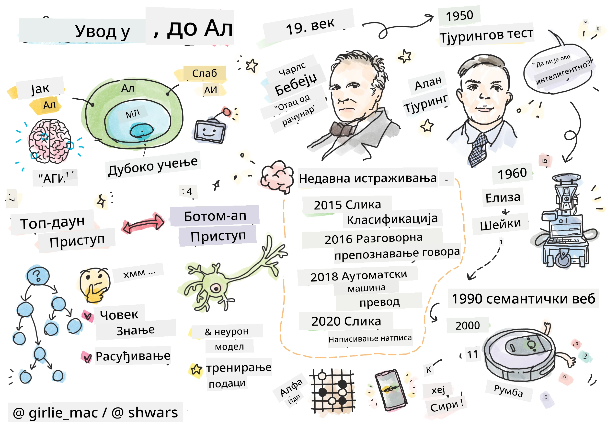
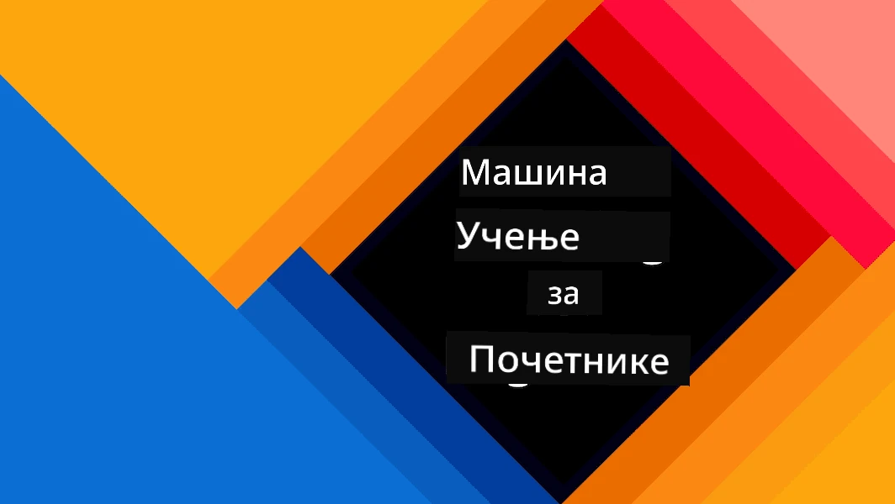
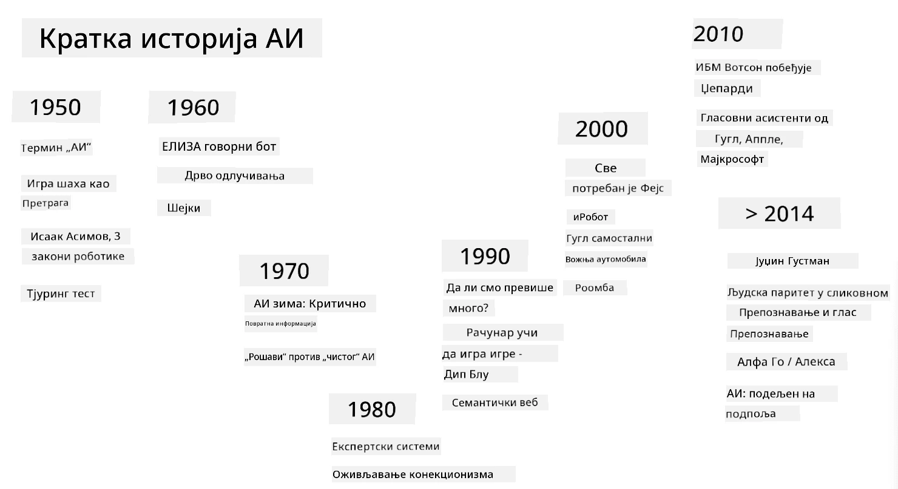

# Увод у вештачку интелигенцију

> Цртеж направио [Томоми Имура](https://twitter.com/girlie_mac)

## [Квиз пре предавања](https://ff-quizzes.netlify.app/en/ai/quiz/1)

**Вештачка интелигенција** је узбудљива научна дисциплина која проучава како можемо учинити да рачунари испољавају интелигентно понашање, тј. раде ствари у којима су људи добри.

Првобитно, рачунаре је изумео [Чарлс Бебиџ](https://en.wikipedia.org/wiki/Charles_Babbage) да би обрађивали бројеве пратећи добро дефинисану процедуру - алгоритам. Савремени рачунари, иако значајно напреднији од оригиналног модела предложеног у 19. веку, и даље следе исту идеју контролисаних рачунања. Због тога је могуће програмирати рачунар да ради нешто ако знамо тачан низ корака који треба да се изврше да би се постигао циљ.

> Фотографија од [Вики Сошникова](http://twitter.com/vickievalerie)

> ✅ Одређивање старости особе на основу њене фотографије је задатак који не може бити експлицитно програмиран, јер не знамо како долазимо до броја у нашој глави када то радимо.

---

Међутим, постоје задаци за које не знамо експлицитно како да их решимо. Размислите о одређивању старости особе на основу њене фотографије. Ми то некако научимо, јер смо видели много примера људи различитих година, али не можемо експлицитно објаснити како то радимо, нити можемо програмирати рачунар да то ради. Управо овакви задаци су интересантни за **вештачку интелигенцију** (скраћено ВИ).

✅ Размислите о неким задацима које бисте могли препустити рачунару и који би имали користи од ВИ. Размотрите области финансија, медицине и уметности - како ове области данас имају користи од ВИ?

## Слаба ВИ vs. Јака ВИ

Слаба ВИ | Јака ВИ
---------------------------------------|-------------------------------------
Слаба ВИ се односи на системе ВИ који су дизајнирани и обучени за одређени задатак или уски сет задатака.|Јака ВИ, или Вештачка општа интелигенција (AGI), односи се на системе ВИ са интелигенцијом и разумевањем на нивоу људи.
Ови системи ВИ нису генерално интелигентни; они су изузетни у извршавању унапред дефинисаног задатка, али им недостаје право разумевање или свест.|Ови системи ВИ имају способност да извршавају било који интелектуални задатак који човек може да уради, да се прилагоде различитим доменима и поседују облик свести или самосвести.
Примери слабе ВИ укључују виртуелне асистенте као што су Сири или Алекса, алгоритме препорука које користе стриминг сервиси и чет-ботове који су дизајнирани за специфичне задатке корисничке подршке.|Постизање Јаке ВИ је дугорочни циљ истраживања ВИ и захтевало би развој система ВИ који могу да резонују, уче, разумеју и прилагођавају се широком спектру задатака и контекста.
Слаба ВИ је високо специјализована и не поседује когнитивне способности налик људским или опште способности решавања проблема ван свог уског домена.|Јака ВИ је тренутно теоријски концепт, и ниједан систем ВИ није достигао овај ниво опште интелигенције.

За више информација погледајте **[Вештачка општа интелигенција](https://en.wikipedia.org/wiki/Artificial_general_intelligence)** (AGI).

## Дефиниција интелигенције и Тјурингов тест

Један од проблема када се бавимо термином **[интелигенција](https://en.wikipedia.org/wiki/Intelligence)** је то што не постоји јасна дефиниција овог термина. Може се тврдити да је интелигенција повезана са **апстрактним размишљањем**, или са **самосвешћу**, али не можемо је правилно дефинисати.

> [Фотографија](https://unsplash.com/photos/75715CVEJhI) од [Амбер Кип](https://unsplash.com/@sadmax) са Unsplash-а

Да бисте видели двосмисленост термина *интелигенција*, покушајте да одговорите на питање: "Да ли је мачка интелигентна?". Различити људи имају тенденцију да дају различите одговоре на ово питање, јер не постоји универзално прихваћен тест који доказује да је тврдња тачна или не. А ако мислите да постоји - покушајте да тестирате своју мачку на IQ тесту...

✅ Размислите минут о томе како дефинишете интелигенцију. Да ли је врана која може да реши лавиринт и дође до хране интелигентна? Да ли је дете интелигентно?

---

Када говоримо о AGI, потребно је да имамо неки начин да утврдимо да ли смо створили заиста интелигентан систем. [Алан Тјуринг](https://en.wikipedia.org/wiki/Alan_Turing) је предложио начин назван **[Тјурингов тест](https://en.wikipedia.org/wiki/Turing_test)**, који такође функционише као дефиниција интелигенције. Тест упоређује дати систем са нечим што је суштински интелигентно - стварним људским бићем, и пошто се било које аутоматско поређење може заобићи компјутерским програмом, користимо људског испитивача. Дакле, ако људско биће није у стању да разликује стварну особу од компјутерског система у текстуалном дијалогу - систем се сматра интелигентним.

> Чет-бот назван [Јуџин Густман](https://en.wikipedia.org/wiki/Eugene_Goostman), развијен у Санкт Петербургу, био је близу проласка Тјуринговог теста 2014. године користећи паметан трик са личношћу. Унапред је најавио да је тринаестогодишњи украјински дечак, што би објаснило недостатак знања и неке недоследности у тексту. Бот је убедио 30% судија да је човек након петоминутног дијалога, метрика коју је Тјуринг веровао да ће машина моћи да постигне до 2000. године. Међутим, треба разумети да ово не указује на то да смо створили интелигентан систем, или да је компјутерски систем преварио људског испитивача - систем није преварио људе, већ су то учинили креатори бота!

✅ Да ли вас је икада чет-бот преварио да мислите да разговарате са човеком? Како вас је убедио?

## Различити приступи ВИ

Ако желимо да рачунар функционише као човек, морамо некако да моделирамо наш начин размишљања унутар рачунара. Сходно томе, морамо покушати да разумемо шта чини људско биће интелигентним.

> Да бисмо могли да програмирамо интелигенцију у машину, морамо да разумемо како функционишу наши сопствени процеси доношења одлука. Ако мало размислите о себи, схватићете да постоје неки процеси који се дешавају подсвесно – нпр. можемо разликовати мачку од пса без размишљања о томе - док други укључују резоновање.

Постоје два могућа приступа овом проблему:

Приступ одозго (симболичко резоновање) | Приступ одоздо (неуронске мреже)
---------------------------------------|-------------------------------------
Приступ одозго моделира начин на који особа резонује да би решила проблем. Укључује извлачење **знања** од људског бића и представљање у облику који рачунар може да прочита. Такође морамо развити начин за моделирање **резоновања** унутар рачунара. | Приступ одоздо моделира структуру људског мозга, који се састоји од огромног броја једноставних јединица названих **неурони**. Сваки неурон делује као пондерисани просек својих улаза, и можемо обучити мрежу неурона да решава корисне проблеме пружајући **тренинг податке**.

Постоје и неки други могући приступи интелигенцији:

* **Емергентни**, **синергетски** или **мулти-агентни приступ** заснован је на чињеници да се сложено интелигентно понашање може добити интеракцијом великог броја једноставних агената. Према [еволуционој кибернетици](https://en.wikipedia.org/wiki/Global_brain#Evolutionary_cybernetics), интелигенција може *произаћи* из једноставнијег, реактивног понашања у процесу *метасистемске транзиције*.

* **Еволуциони приступ**, или **генетски алгоритам** је процес оптимизације заснован на принципима еволуције.

Ове приступе ћемо разматрати касније током курса, али тренутно ћемо се фокусирати на два главна правца: одозго и одоздо.

### Приступ одозго

У **приступу одозго**, покушавамо да моделирамо наше резоновање. Пошто можемо пратити своје мисли када резонујемо, можемо покушати да формализујемо овај процес и програмирамо га унутар рачунара. Ово се назива **симболичко резоновање**.

Људи имају тенденцију да имају нека правила у својој глави која воде њихове процесе доношења одлука. На пример, када лекар дијагностикује пацијента, он или она може схватити да особа има температуру, и стога може постојати нека упала у телу. Применом великог скупа правила на одређени проблем, лекар може доћи до коначне дијагнозе.

Овај приступ се у великој мери ослања на **репрезентацију знања** и **резоновање**. Извлачење знања од људског експерта може бити најтежи део, јер лекар у многим случајевима не би знао тачно зашто долази до одређене дијагнозе. Понекад решење једноставно искрсне у његовој или њеној глави без експлицитног размишљања. Неки задаци, као што је одређивање старости особе на основу фотографије, уопште не могу бити сведени на манипулисање знањем.

### Приступ одоздо

Алтернативно, можемо покушати да моделирамо најједноставније елементе унутар нашег мозга – неурон. Можемо конструисати такозвану **вештачку неуронску мрежу** унутар рачунара, а затим покушати да је научимо да решава проблеме давањем примера. Овај процес је сличан начину на који новорођено дете учи о својој околини посматрањем.

✅ Урадите мало истраживање о томе како бебе уче. Који су основни елементи мозга бебе?

> | Шта је са МЛ?         |      |
> |--------------|-----------|
> | Део Вештачке интелигенције који се заснива на томе да рачунар учи да реши проблем на основу неких података назива се **Машинско учење**. Нећемо разматрати класично машинско учење у овом курсу - упућујемо вас на посебан [Курс машинског учења за почетнике](http://aka.ms/ml-beginners). |       |

## Кратка историја ВИ

Вештачка интелигенција је започета као област средином двадесетог века. У почетку је симболичко резоновање било доминантан приступ, и довело је до бројних важних успеха, као што су експертски системи – компјутерски програми који су могли да делују као експерт у неким ограниченим проблемским доменима. Међутим, убрзо је постало јасно да се такав приступ не скалира добро. Извлачење знања од експерта, представљање у рачунару и одржавање те базе знања тачном испоставило се као веома сложен задатак, и превише скуп да би био практичан у многим случајевима. То је довело до такозване [зиме ВИ](https://en.wikipedia.org/wiki/AI_winter) 1970-их.

> Слика од [Дмитрија Сошникова](http://soshnikov.com)

Како је време пролазило, рачунарски ресурси су постали јефтинији, а више података је постало доступно, па су приступи неуронским мрежама почели да показују одличне резултате у такмичењу са људима у многим областима, као што су компјутерски вид или разумевање говора. У последњој деценији, термин Вештачка интелигенција се углавном користи као синоним за неуронске мреже, јер већина успеха ВИ о којима чујемо заснована је на њима.

Можемо посматрати како су се приступи мењали, на пример, у креирању компјутерског програма за играње шаха:

* Рани шаховски програми су се заснивали на претрази – програм је експлицитно покушавао да процени могуће потезе противника за одређени број наредних потеза, и изабрао оптималан потез на основу оптималне позиције која се може постићи у неколико потеза. То је довело до развоја такозваног [алфа-бета сечења](https://en.wikipedia.org/wiki/Alpha%E2%80%93beta_pruning) алгоритма претраге.
* Стратегије претраге добро функционишу према крају игре, где је простор претраге ограничен малим бројем могућих потеза. Међутим, на почетку игре, простор претраге је огроман, и алгоритам се може побољшати учењем из постојећих мечева између људских играча. Накнадни експерименти су користили такозвано [резоновање засновано на случајевима](https://en.wikipedia.org/wiki/Case-based_reasoning), где је програм тражио случајеве у бази знања веома сличне тренутној позицији у игри.
* Савремени програми који побеђују људске играче засновани су на неуронским мрежама и [учењу путем појачања](https://en.wikipedia.org/wiki/Reinforcement_learning), где програми уче да играју искључиво играјући дуго времена против себе и учећи из сопствених грешака – слично као што људи раде када уче да играју шах. Међутим, компјутерски програм може одиграти много више партија у много мање времена, и стога може учити много брже.

✅ Урадите мало истраживање о другим играма које су игране уз помоћ ВИ.

С
> Слика Дмитрија Сошњикова, [фотографија](https://unsplash.com/photos/r8LmVbUKgns) од [Марине Абросимове](https://unsplash.com/@abrosimova_marina_foto), Unsplash

## Недавна истраживања у области вештачке интелигенције

Велики раст истраживања неуронских мрежа започео је око 2010. године, када су велики јавни скупови података постали доступни. Огромна колекција слика под називом [ImageNet](https://en.wikipedia.org/wiki/ImageNet), која садржи око 14 милиона аннотираних слика, дала је подстрек [ImageNet Large Scale Visual Recognition Challenge](https://image-net.org/challenges/LSVRC/).

> Слика од [Дмитрија Сошњикова](http://soshnikov.com)

Године 2012, [Конволуционе неуронске мреже](../4-ComputerVision/07-ConvNets/README.md) су први пут коришћене за класификацију слика, што је довело до значајног пада грешака у класификацији (са скоро 30% на 16.4%). Године 2015, ResNet архитектура из Microsoft Research [постигла је тачност на нивоу људског](https://doi.org/10.1109/ICCV.2015.123).

Од тада, неуронске мреже су показале веома успешне резултате у многим задацима:

---

Година | Постигнут ниво људске тачности
-----|--------
2015 | [Класификација слика](https://doi.org/10.1109/ICCV.2015.123)
2016 | [Препознавање говорног разговора](https://arxiv.org/abs/1610.05256)
2018 | [Аутоматски машински превод](https://arxiv.org/abs/1803.05567) (кинески-енглески)
2020 | [Генерисање описа слика](https://arxiv.org/abs/2009.13682)

Током последњих неколико година били смо сведоци великих успеха са моделима великог језика, као што су BERT и GPT-3. Ово се углавном догодило због чињенице да постоји много општих текстуалних података који омогућавају да се модели обуче да схвате структуру и значење текстова, да се претходно обуче на општим текстуалним колекцијама, а затим специјализују за специфичније задатке. Више ћемо научити о [Обради природног језика](../5-NLP/README.md) касније у овом курсу.

## 🚀 Изазов

Истражите интернет да бисте утврдили где се, по вашем мишљењу, вештачка интелигенција најефикасније користи. Да ли је то у апликацији за мапирање, некој услузи за претварање говора у текст или видео игри? Истражите како је систем изграђен.

## [Квиз након предавања](https://ff-quizzes.netlify.app/en/ai/quiz/2)

## Преглед и самостално учење

Прегледајте историју вештачке интелигенције и машинског учења читајући [ову лекцију](https://github.com/microsoft/ML-For-Beginners/tree/main/1-Introduction/2-history-of-ML). Узмите један елемент из скетчноте на почетку те лекције или ове и истражите га детаљније како бисте разумели културни контекст који је утицао на његов развој.

**Задатак**: [Game Jam](assignment.md)

---

<!-- CO-OP TRANSLATOR DISCLAIMER START -->
**Одрицање од одговорности**:  
Овај документ је преведен помоћу услуге за превођење уз помоћ вештачке интелигенције [Co-op Translator](https://github.com/Azure/co-op-translator). Иако настојимо да обезбедимо тачност, молимо вас да имате у виду да аутоматизовани преводи могу садржати грешке или нетачности. Оригинални документ на његовом изворном језику треба сматрати ауторитативним извором. За критичне информације препоручује се професионални превод од стране људи. Не преузимамо одговорност за било каква погрешна тумачења или неспоразуме који могу настати услед коришћења овог превода.
<!-- CO-OP TRANSLATOR DISCLAIMER END -->