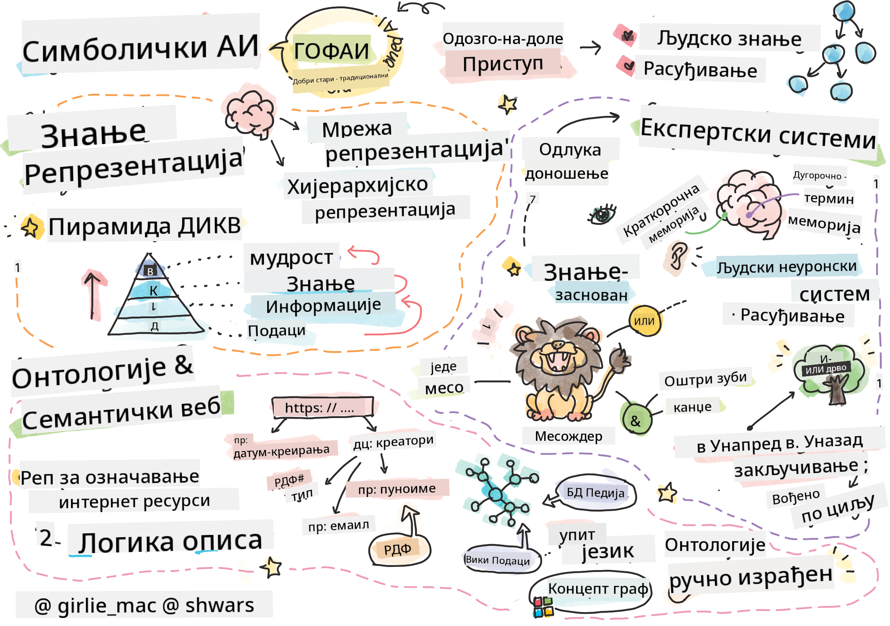

<!--
CO_OP_TRANSLATOR_METADATA:
{
  "original_hash": "7d097f7fda9166ead615e4c34552381b",
  "translation_date": "2025-09-23T14:42:19+00:00",
  "source_file": "lessons/2-Symbolic/README.md",
  "language_code": "sr"
}
-->
# Представљање знања и експертски системи



> Скетч од [Томоми Имура](https://twitter.com/girlie_mac)

Потрага за вештачком интелигенцијом заснива се на трагању за знањем, како би се свет разумео на начин сличан људском. Али како то постићи?

## [Квиз пре предавања](https://ff-quizzes.netlify.app/en/ai/quiz/3)

У раним данима развоја вештачке интелигенције, популаран је био приступ "одозго надоле" у креирању интелигентних система (о чему је било речи у претходном часу). Идеја је била да се знање извуче од људи у неки машински читљив облик, а затим искористи за аутоматско решавање проблема. Овај приступ се заснивао на две велике идеје:

* Представљање знања
* Закључивање

## Представљање знања

Један од важних концепата у симболичкој вештачкој интелигенцији је **знање**. Важно је разликовати знање од *информација* или *података*. На пример, може се рећи да књиге садрже знање, јер се њиховим проучавањем може постати стручњак. Међутим, оно што књиге заправо садрже назива се *подаци*, а читањем књига и интегрисањем тих података у наш модел света, претварамо те податке у знање.

> ✅ **Знање** је нешто што се налази у нашој глави и представља наше разумевање света. Оно се стиче активним процесом **учења**, који интегрише делове информација које добијамо у наш активни модел света.

Најчешће не дефинишемо строго знање, већ га повезујемо са другим сродним концептима користећи [DIKW пирамиду](https://en.wikipedia.org/wiki/DIKW_pyramid). Она садржи следеће концепте:

* **Подаци** су нешто што је представљено на физичким медијима, као што су писани текст или изговорене речи. Подаци постоје независно од људи и могу се преносити између њих.
* **Информације** су начин на који тумачимо податке у својој глави. На пример, када чујемо реч *рачунар*, имамо неко разумевање шта је то.
* **Знање** је информација интегрисана у наш модел света. На пример, када научимо шта је рачунар, почињемо да имамо идеје о томе како функционише, колико кошта и за шта се може користити. Ова мрежа међусобно повезаних концепата чини наше знање.
* **Мудрост** је још један ниво нашег разумевања света и представља *мета-знање*, односно неку представу о томе како и када треба користити знање.


*Слика [са Википедије](https://commons.wikimedia.org/w/index.php?curid=37705247), Аутор Longlivetheux - Лично дело, CC BY-SA 4.0*

Дакле, проблем **представљања знања** је у проналажењу ефикасног начина за представљање знања унутар рачунара у облику података, како би оно било аутоматски употребљиво. Ово се може посматрати као спектар:


> Слика од [Дмитрија Сошњикова](http://soshnikov.com)

* Са леве стране налазе се веома једноставни типови представљања знања који се могу ефикасно користити у рачунарима. Најједноставнији је алгоритамски, када је знање представљено рачунарским програмом. Међутим, ово није најбољи начин за представљање знања, јер није флексибилан. Знање у нашој глави често није алгоритамско.
* Са десне стране налазе се представљања као што је природни текст. То је најмоћније, али се не може користити за аутоматско закључивање.

> ✅ Размислите на тренутак како представљате знање у својој глави и претварате га у белешке. Да ли постоји одређени формат који вам помаже у памћењу?

## Класификација рачунарских представљања знања

Различите методе представљања знања у рачунарима можемо класификовати у следеће категорије:

* **Мрежна представљања** заснивају се на чињеници да у својој глави имамо мрежу међусобно повезаних концепата. Можемо покушати да исте мреже репродукујемо као граф унутар рачунара - такозвану **семантичку мрежу**.

1. **Триплети објекат-атрибут-вредност** или **парови атрибут-вредност**. Пошто се граф може представити у рачунару као листа чворова и ивица, семантичка мрежа се може представити листом триплета који садрже објекте, атрибуте и вредности. На пример, можемо изградити следеће триплете о програмским језицима:

Објекат | Атрибут | Вредност  
-------|---------|---------  
Python | је | Језик без типова  
Python | изумео | Гвидо ван Росум  
Python | блок-синтакса | увлачење  
Језик без типова | нема | дефиниције типова  

> ✅ Размислите како се триплети могу користити за представљање других врста знања.

2. **Хијерархијска представљања** наглашавају чињеницу да често у својој глави стварамо хијерархију објеката. На пример, знамо да је канаринац птица и да све птице имају крила. Такође имамо неку представу о томе које је боје канаринац и колика је његова брзина лета.

   - **Представљање оквирима** заснива се на представљању сваког објекта или класе објеката као **оквира** који садржи **слотове**. Слотови могу имати подразумеване вредности, ограничења вредности или процедуре које се могу позвати да би се добила вредност слота. Сви оквири формирају хијерархију сличну хијерархији објеката у објектно-оријентисаним програмским језицима.
   - **Сценарији** су посебна врста оквира који представљају сложене ситуације које се могу одвијати у времену.

**Python**

Слот | Вредност | Подразумевана вредност | Интервал  
-----|---------|-------------------------|---------  
Име | Python | |  
Је | Језик без типова | |  
Карактер променљиве | | CamelCase |  
Дужина програма | | | 5-5000 линија  
Блок-синтакса | Увлачење | |  

3. **Процедурална представљања** заснивају се на представљању знања листом акција које се могу извршити када се догоди одређени услов.  
   - Правила продукције су if-then изјаве које нам омогућавају да доносимо закључке. На пример, доктор може имати правило које каже да **АКО** пацијент има високу температуру **ИЛИ** висок ниво Ц-реактивног протеина у крвној анализи **ОНДА** има упалу. Када наиђемо на један од услова, можемо закључити да постоји упала и затим то користити у даљем закључивању.  
   - Алгоритми се могу сматрати другом формом процедуралног представљања, иако се скоро никада не користе директно у системима заснованим на знању.

4. **Логика** је првобитно предложена од стране Аристотела као начин за представљање универзалног људског знања.  
   - Предикатска логика као математичка теорија је превише богата да би била рачунарски обрадљива, па се обично користи неки њен подскуп, као што су Хорнове клаузе које се користе у Prolog-у.  
   - Дескриптивна логика је породица логичких система која се користи за представљање и закључивање о хијерархијама објеката у дистрибуираним представљањима знања као што је *семантички веб*.

## Експертски системи

Један од раних успеха симболичке вештачке интелигенције били су такозвани **експертски системи** - рачунарски системи дизајнирани да делују као стручњаци у некој ограниченој области проблема. Они су се заснивали на **бази знања** извученој од једног или више људских стручњака и садржали су **инференцијски механизам** који је вршио закључивање на основу те базе.

 |   
---------------------------------------------|------------------------------------------------  
Поједностављена структура људског нервног система | Архитектура система заснованог на знању  

Експертски системи су изграђени слично људском систему закључивања, који садржи **краткорочно памћење** и **дугорочно памћење**. Слично томе, у системима заснованим на знању разликујемо следеће компоненте:

* **Проблемска меморија**: садржи знање о проблему који се тренутно решава, нпр. температуру или крвни притисак пацијента, да ли има упалу или не. Ово знање се такође назива **статичко знање**, јер садржи снимак онога што тренутно знамо о проблему - такозвано *стање проблема*.  
* **База знања**: представља дугорочно знање о области проблема. Оно се ручно извлачи од људских стручњака и не мења се од једне консултације до друге. Пошто нам омогућава да се крећемо од једног стања проблема до другог, назива се и **динамичко знање**.  
* **Инференцијски механизам**: оркестрира цео процес претраге у простору стања проблема, постављајући питања кориснику када је то потребно. Такође је одговоран за проналажење правих правила која ће се применити у сваком стању.

Као пример, размотримо следећи експертски систем за одређивање животиње на основу њених физичких карактеристика:


> Слика од [Дмитрија Сошњикова](http://soshnikov.com)

Овај дијаграм се назива **AND-OR стабло**, и представља графички приказ скупа правила продукције. Цртање стабла је корисно на почетку извлачења знања од стручњака. За представљање знања унутар рачунара погодније је користити правила:

```
IF the animal eats meat
OR (animal has sharp teeth
    AND animal has claws
    AND animal has forward-looking eyes
) 
THEN the animal is a carnivore
```
  
Можете приметити да сваки услов на левој страни правила и акција суштински представљају триплете објекат-атрибут-вредност (OAV). **Радна меморија** садржи скуп OAV триплета који одговарају проблему који се тренутно решава. **Механизам правила** тражи правила чији је услов задовољен и примењује их, додајући нови триплет у радну меморију.

> ✅ Направите своје AND-OR стабло на тему која вас занима!

### Напредно и уназадно закључивање

Процес описан изнад назива се **напредно закључивање**. Он почиње са неким почетним подацима о проблему доступним у радној меморији, а затим извршава следећу петљу закључивања:

1. Ако је циљни атрибут присутан у радној меморији - зауставите се и дајте резултат  
2. Потражите сва правила чији је услов тренутно задовољен - добијте **конфликтни скуп** правила.  
3. Извршите **разрешење конфликта** - изаберите једно правило које ће бити извршено у овом кораку. Могу постојати различите стратегије за разрешење конфликта:  
   - Изаберите прво применљиво правило у бази знања  
   - Изаберите насумично правило  
   - Изаберите *специфичније* правило, тј. оно које задовољава највише услова на "левој страни" (LHS)  
4. Примените изабрано правило и унесите нови део знања у стање проблема  
5. Поновите од корака 1.  

Међутим, у неким случајевима можемо желети да почнемо са празним знањем о проблему и постављамо питања која ће нам помоћи да дођемо до закључка. На пример, приликом медицинске дијагнозе, обично не извршавамо све медицинске анализе унапред пре него што почнемо са дијагностиковањем пацијента. Радије желимо да извршимо анализе када је потребно донети одлуку.

Овај процес се може моделирати коришћењем **уназадног закључивања**. Оно је вођено **циљем** - вредношћу атрибута коју желимо да пронађемо:

1. Изаберите сва правила која могу дати вредност циља (тј. са циљем на RHS ("десној страни")) - конфликтни скуп  
1. Ако не постоје правила за овај атрибут, или постоји правило које каже да треба питати корисника за вредност - питајте, у супротном:  
1. Користите стратегију разрешења конфликта да изаберете једно правило које ћемо користити као *хипотезу* - покушаћемо да је докажемо  
1. Рекурзивно поновите процес за све атрибуте на LHS правила, покушавајући да их докажете као циљеве  
1. Ако процес у било ком тренутку не успе - користите друго правило у кораку 3.  

> ✅ У којим ситуацијама је напредно закључивање прикладније? А уназадно закључивање?

### Имплементација експертских система

Експертски системи се могу имплементирати коришћењем различитих алата:

* Програмирањем директно у неком програмском језику високог нивоа. Ово није најбоља идеја, јер је главна предност система заснованог на знању то што је знање одвојено од закључивања, и потенцијално стручњак за проблемску област треба да буде у могућности да пише правила без разумевања детаља процеса закључивања.  
* Коришћењем **оквира за експертске системе**, тј. система специјално дизајнираног да се попуни знањем коришћењем неког језика за представљање знања.

## ✍️ Вежба: Инференција о животињама

Погледајте [Animals.ipynb](https://github.com/microsoft/AI-For-Beginners/blob/main/lessons/2-Symbolic/Animals.ipynb) за пример имплементације експертског система са напредним и уназадним закључивањем.

> **Напомена**: Овај пример је прилично једноставан и само даје идеју како изгледа експертски систем. Када почнете да креирате такав систем, приметићете *интелигентно* понашање
- Породица XML-базираних језика за описивање знања: RDF (Resource Description Framework), RDFS (RDF Schema), OWL (Ontology Web Language).

Основни концепт у Семантичком вебу је концепт **Онтологије**. Онтологија се односи на експлицитну спецификацију домена проблема користећи неку формалну репрезентацију знања. Најједноставнија онтологија може бити само хијерархија објеката у домену проблема, али сложеније онтологије укључују правила која се могу користити за закључивање.

У семантичком вебу, све репрезентације се заснивају на триплетима. Сваки објекат и свака релација су јединствено идентификовани URI-јем. На пример, ако желимо да наведемо чињеницу да је овај AI Curriculum развио Дмитриј Сошњиков 1. јануара 2022. године, ево триплета које можемо користити:


```
http://github.com/microsoft/ai-for-beginners http://www.example.com/terms/creation-date “Jan 13, 2007”
http://github.com/microsoft/ai-for-beginners http://purl.org/dc/elements/1.1/creator http://soshnikov.com
```

> ✅ Овде су `http://www.example.com/terms/creation-date` и `http://purl.org/dc/elements/1.1/creator` неки добро познати и универзално прихваћени URI-ји за изражавање концепата *креатора* и *датума креирања*.

У сложенијем случају, ако желимо да дефинишемо листу креатора, можемо користити неке структуре података дефинисане у RDF-у.


> Дијаграми изнад од [Дмитрија Сошњикова](http://soshnikov.com)

Напредак у изградњи Семантичког веба је донекле успорен успехом претраживача и техника обраде природног језика, које омогућавају извлачење структурираних података из текста. Међутим, у неким областима и даље постоје значајни напори за одржавање онтологија и база знања. Неколико пројеката вредних пажње:

* [WikiData](https://wikidata.org/) је збирка машински читљивих база знања повезаних са Википедијом. Већина података је изведена из Википедијиних *InfoBox*-ова, делова структурисаног садржаја унутар страница Википедије. Можете [упитати](https://query.wikidata.org/) WikiData у SPARQL-у, посебном језику упита за Семантички веб. Ево примера упита који приказује најпопуларније боје очију међу људима:

```sparql
#defaultView:BubbleChart
SELECT ?eyeColorLabel (COUNT(?human) AS ?count)
WHERE
{
  ?human wdt:P31 wd:Q5.       # human instance-of homo sapiens
  ?human wdt:P1340 ?eyeColor. # human eye-color ?eyeColor
  SERVICE wikibase:label { bd:serviceParam wikibase:language "en". }
}
GROUP BY ?eyeColorLabel
```

* [DBpedia](https://www.dbpedia.org/) је још један пројекат сличан WikiData.

> ✅ Ако желите да експериментишете са изградњом сопствених онтологија или отварањем постојећих, постоји одличан визуелни уређивач онтологија зван [Protégé](https://protege.stanford.edu/). Преузмите га или га користите онлајн.


*Web Protégé уређивач отворен са онтологијом породице Романов. Снимак екрана од Дмитрија Сошњикова*

## ✍️ Вежба: Онтологија породице

Погледајте [FamilyOntology.ipynb](https://github.com/Ezana135/AI-For-Beginners/blob/main/lessons/2-Symbolic/FamilyOntology.ipynb) за пример коришћења техника Семантичког веба за закључивање о породичним односима. Узимамо породично стабло представљено у уобичајеном GEDCOM формату и онтологију породичних односа и градимо графикон свих породичних односа за дати скуп појединаца.

## Microsoft Concept Graph

У већини случајева, онтологије се пажљиво креирају ручно. Међутим, могуће је и **извлачити** онтологије из неструктурираних података, на пример, из текстова на природном језику.

Један такав покушај направљен је од стране Microsoft Research-а, и резултирао је [Microsoft Concept Graph](https://blogs.microsoft.com/ai/microsoft-researchers-release-graph-that-helps-machines-conceptualize/?WT.mc_id=academic-77998-cacaste).

То је велика збирка ентитета груписаних заједно користећи `is-a` релацију наслеђивања. Омогућава одговарање на питања попут "Шта је Microsoft?" - одговор би био нешто попут "компанија са вероватноћом 0.87, и бренд са вероватноћом 0.75".

Графикон је доступан или као REST API, или као велики текстуални фајл који наводи све парове ентитета.

## ✍️ Вежба: Графикон концепата

Испробајте [MSConceptGraph.ipynb](https://github.com/microsoft/AI-For-Beginners/blob/main/lessons/2-Symbolic/MSConceptGraph.ipynb) нотебук да видите како можемо користити Microsoft Concept Graph за груписање новинских чланака у неколико категорија.

## Закључак

Данас се AI често сматра синонимом за *машинско учење* или *неуронске мреже*. Међутим, људско биће такође показује експлицитно резоновање, што је нешто што тренутно не обрађују неуронске мреже. У стварним пројектима, експлицитно резоновање се и даље користи за обављање задатака који захтевају објашњења или могућност контролисане модификације понашања система.

## 🚀 Изазов

У нотебуку Онтологија породице повезаном са овом лекцијом, постоји прилика да експериментишете са другим породичним односима. Покушајте да откријете нове везе између људи у породичном стаблу.

## [Квиз након предавања](https://ff-quizzes.netlify.app/en/ai/quiz/4)

## Преглед и самостално учење

Истражите на интернету области у којима су људи покушали да квантификују и кодирају знање. Погледајте Блумову таксономију и вратите се у историју да бисте научили како су људи покушавали да схвате свој свет. Истражите рад Линеауса на креирању таксономије организама и посматрајте начин на који је Дмитриј Мендељејев створио начин за описивање и груписање хемијских елемената. Које друге занимљиве примере можете пронаћи?

**Задатак**: [Изградите онтологију](assignment.md)

---

