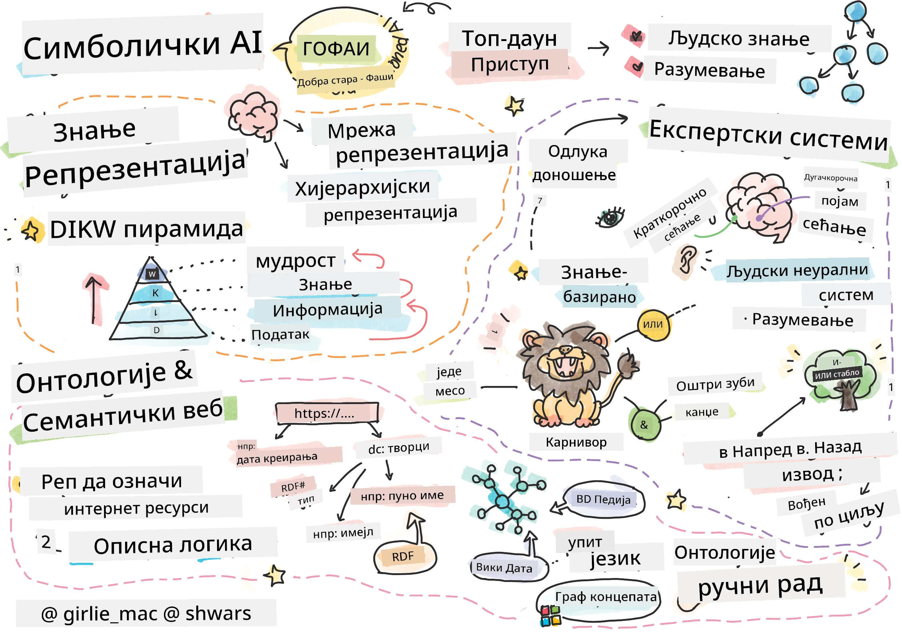
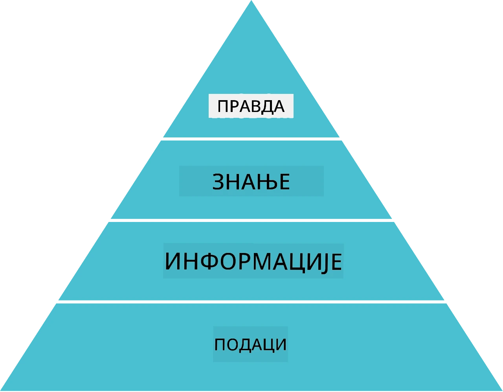
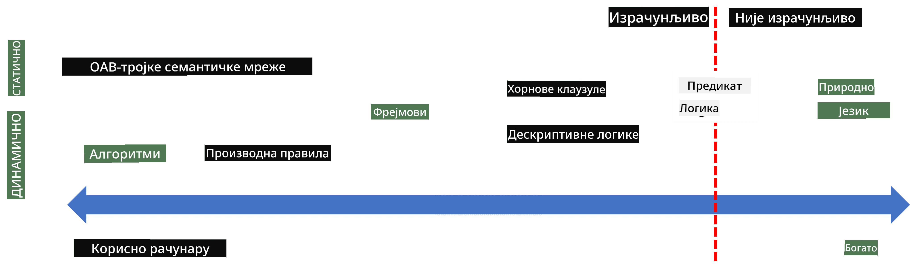
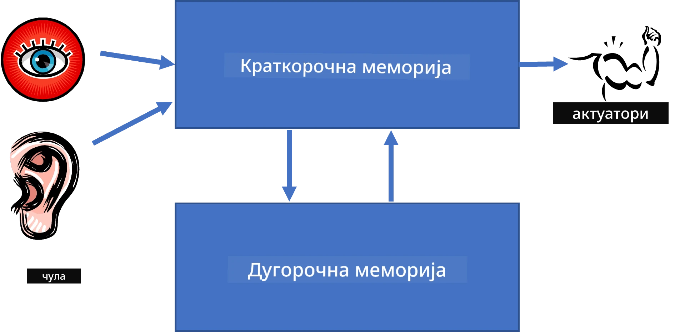
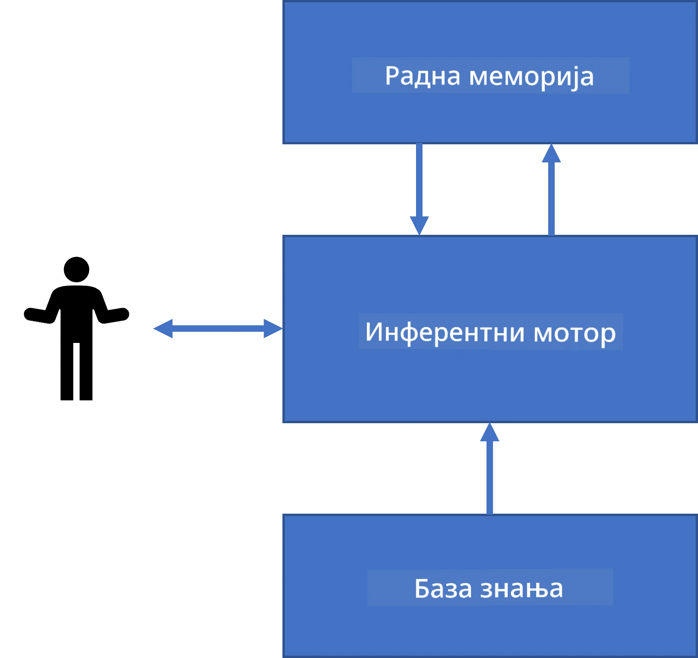
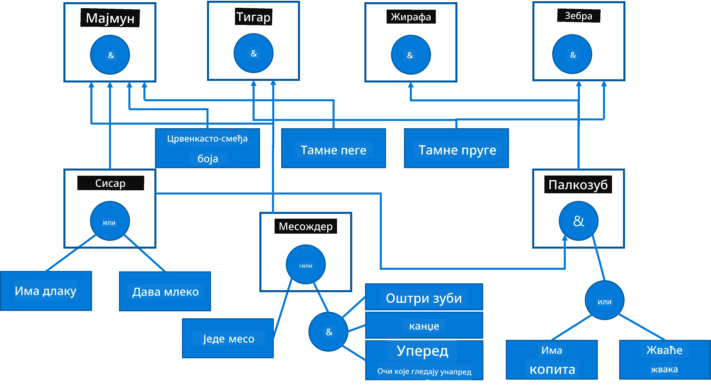
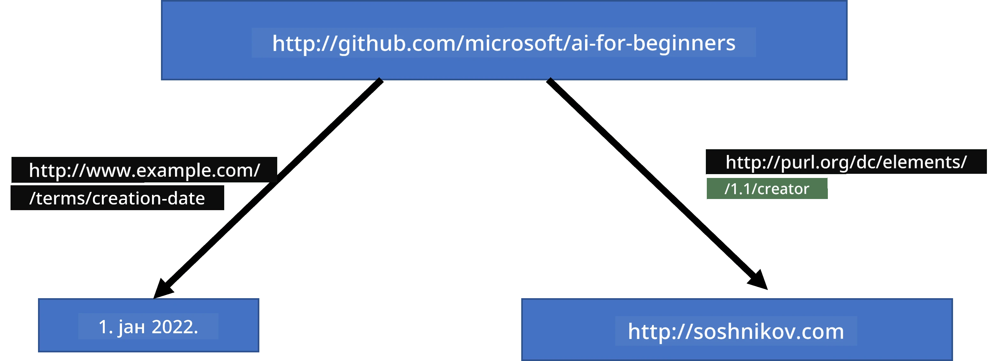
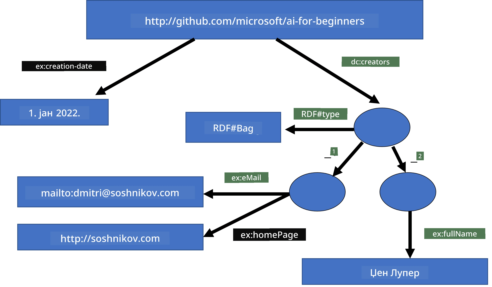
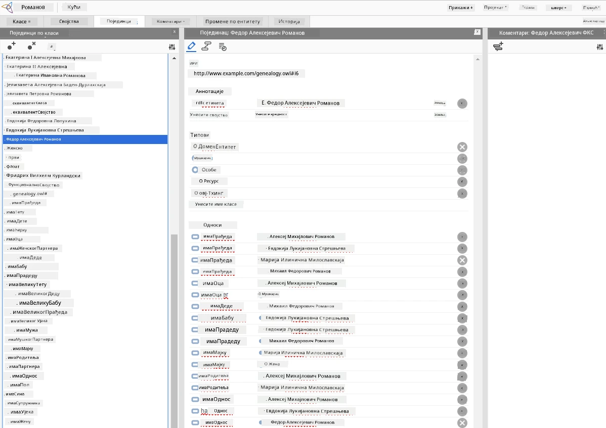

# Репрезентација Знања и Експертски Системи



> Скетчнот од [Tomomi Imura](https://twitter.com/girlie_mac)

Потрага за вештачком интелигенцијом заснива се на претраживању знања, да се свет разуме слично као што људи разумеју. Али како то можете урадити?

## [Квиз пре предавања](https://ff-quizzes.netlify.app/en/ai/quiz/3)

У раним данима вештачке интелигенције, приступ од горе ка доле за креирање интелигентних система (који је разматран у претходној лекцији) био је популаран. Идеја је била да се знање извуће од људи у неки облик читљив машини, а затим да се користи за аутоматско решавање проблема. Овај приступ заснован је на две велике идеје:

* Репрезентација знања
* Закључивање

## Репрезентација знања

Један од важних појмова у Симболичкој вештачкој интелигенцији је **знање**. Важно је направити разлику између знања и *информације* или *подака*. На пример, може се рећи да књиге садрже знање, јер их можете проучавати и постати експерт. Међутим, оно што књиге садрже заправо се зове *подаци*, и читањем књига и интеграцијом ових података у наш модел света претварамо ове податке у знање.

> ✅ **Знање** је нешто што се налази у нашој глави и представља наше разумевање света. Добија се активним процесом **учења**, који интегрише делове информација које добијамо у наш активни модел света.

Најчешће не дефинишемо знање строго, али га повезујемо са другим сродним појмовима коришћењем [DIKW пирамиде](https://en.wikipedia.org/wiki/DIKW_pyramid). Она садржи следеће појмове:

* **Подаци** су нешто што је представљено у физичком медијуму, као што је писани текст или изговорене речи. Подаци постоје независно од људи и могу бити преношени између људи.
* **Информација** је како тумачимо податке у својој глави. На пример, када чујемо реч *рачунар*, имамо неко разумевање шта је то.
* **Знање** је информација која је интегрисана у наш модел света. На пример, када сазнамо шта је рачунар, почињемо имати неке идеје о томе како ради, колико кошта и за шта се може користити. Та мрежа међусобно повезаних појмова чини наше знање.
* **Мудрост** је још један ниво нашег разумевања света, и представља *метазнање*, нпр. неку представу о томе како и када знање треба користити.



*Слика [са Википедије](https://commons.wikimedia.org/w/index.php?curid=37705247), Аутор Longlivetheux - властито дело, CC BY-SA 4.0*

Дакле, проблем **репрезентације знања** је како наћи неки ефикасан начин да се знање представи у рачунару у облику података, да би могло да се користи аутоматски. Ово се може посматрати као спектар:



> Слика од [Dmitry Soshnikov](http://soshnikov.com)

* Са леве стране се налазе веома једноставни типови репрезентације знања који се могу ефикасно користити у рачунарима. Најједноставнији је алгоритамски, када је знање представљено програмом. Међутим, ово није најбољи начин за представљање знања јер није флексибилан. Знање у нашој глави често није алгоритамско.
* Са десне стране се налазе репрезентације као што је природни текст. Он је најмоћнији, али се не може користити за аутоматско закључивање.

> ✅ Размислите минуту о томе како представљате знање у својој глави и претварате га у белешке. Постоји ли посебан формат који вам добро помаже у памћењу?

## Класификација рачунарских репрезентација знања

Различите рачунарске методе репрезентације знања можемо класификовати у следеће категорије:

* **Мрежне репрезентације** заснивају се на чињеници да у нашој глави имамо мрежу међусобно повезаних појмова. Можемо покушати да исте мреже урадимо као граф у рачунару – такозвана **семантичка мрежа**.

1. **Триплети Објекат-Атрибут-Вредност** или **парови атрибут-вредност**. Пошто се граф може представити у рачунару као листа чворова и ивица, можемо представити семантичку мрежу листом триплета која садрже објекте, атрибуте и вредности. На пример, градимо следеће триплете о програмским језицима:

Објекат | Атрибут | Вредност
-------|-----------|------
Python | је | Нетипизирани-Језик
Python | измислио | Guido van Rossum
Python | синтакса-блока | увученост
Нетипизирани-Језик | нема | дефиниције типа

> ✅ Размислите како се триплети могу користити за представљање других врста знања.

2. **Хијерархијске репрезентације** наглашавају чињеницу да често креирамо хијерархију објеката у нашој глави. На пример, знамо да је канаринац птица, и свака птица има крила. Такође имамо идеју о боји уобичајеног канаринца и брзини лета.

   - **Репрезентација у облику фрејмова** заснива се на представљању сваког објекта или класе објеката као **фрејма** који садржи **слотове**. Слотови могу имати подразумеване вредности, ограничења вредности или сачуване процедуре које можемо позвати да добијемо вредност слота. Сви фрејмови формирају хијерархију сличну објектној хијерархији у објектно оријентисаним програмским језицима.
   - **Сценарији** су посебна врста фрејмова која представљају сложене ситуације које се могу одвијати током времена.

**Python**

Слот | Вредност | Подразумевана вредност | Интервал |
-----|----------|------------------------|----------|
Име | Python | | |
Је-Тип | Нетипизирани-Језик | | |
Величина слова| | CamelCase | |
Дужина програма| | | 5-5000 линија |
Синтакса Блока | Увученост | | |

3. **Процедурне репрезентације** заснивају се на представљању знања као листе радњи које се могу извршити када се испуни одређени услов.
   - Правила продукције су ако-онда изјаве које нам омогућавају доношење закључака. На пример, доктор може имати правило да **АКО** пацијент има високу температуру **ИЛИ** високе нивое Ц-реактивног протеина у крвном тесту **ОНДА** има упалу. Када наиђемо на један од услова, можемо закључити о упали, и затим то користити у даљем закључивању.
   - Алгоритми се могу сматрати другим обликом процедуралне репрезентације, иако се скоро никада не користе директно у системима заснованим на знању.

4. **Логика** је првобитно предложена од стране Аристотела као начин представљања универзалног људског знања.
   - Предикатна логика као математичка теорија је прегушћа да би била компјутабилна, па се обично користи неки подскуп, као што су Horn клаузуле коришћене у Prolog-у.
   - Дескриптивна логика је породични систем логичких система који се користе за представљање и закључивање о хијерархијама објеката, дистрибуираним репрезентацијама знања као што је *семантички веб*.

## Експертски системи

Један од раних успеха симболичке вештачке интелигенције били су такозвани **експертски системи** – рачунарски системи дизајнирани да делују као експерт у некој ограниченој проблемској области. Они су засновани на **бази знања** коју су извели један или више људских експерата, и садрже **инференцијски мотор** који изводи закључивања на њој.

 | 
---------------------------------------------|------------------------------------------------
Поједностављена структура људског неуралног система | Архитектура система заснованог на знању

Експертски системи су изграђени по узору на људски систем резоновања, који садржи **краткорочну меморију** и **дугорочну меморију**. Слично томе, у системима заснованим на знању разликујемо следеће компоненте:

* **Меморија проблема**: садржи знање о проблему који се тренутно решава, нпр. температура или крвни притисак пацијента, да ли има упалу или не итд. Ово знање назива се и **статичким знањем**, јер садржи снимак онога што тренутно знамо о проблему – такозвани *статус проблема*.
* **База знања**: представља дугорочно знање о проблемској области. Ручно је изведена од људских експерата, и не мења се од консултације до консултације. Пошто нам омогућава навигацију од једног статуса проблема до другог, назива се и **динамичким знањем**.
* **Инференцијски мотор**: координише цео процес претраживања у простору статуса проблема, поставља питања кориснику када је потребно. Такође је одговоран за проналажење правих правила која ће се применити за сваки статус.

Као пример, размотримо следећи експертски систем за одређивање животиње на основу њених физичких особина:



> Слика од [Dmitry Soshnikov](http://soshnikov.com)

Овај дијаграм се зове **AND-OR стабло**, и графички представља скуп правила продукције. Цртање стабла је корисно на почетку издвајања знања од експерта. За представљање знања у рачунару згодније је користити правила:

```
IF the animal eats meat
OR (animal has sharp teeth
    AND animal has claws
    AND animal has forward-looking eyes
) 
THEN the animal is a carnivore
```

Можете приметити да је сваки услов на левој страни правила и акција у суштини триплет објекат-атрибут-вредност (ОАВ). **Радна меморија** садржи скуп ОАВ триплета који одговарају тренутно решаваном проблему. **Мотор правила** тражи правила за која је услов испуњен и примењује их, додајући још један триплет у радну меморију.

> ✅ Направите своје AND-OR стабло на тему која вас интересује!

### Напредно и назадно закључивање

Процес описан горе зове се **напредно закључивање**. Започиње неким почетним подацима о проблему које су доступне у радној меморији, а затим изводи следећу петљу резоновања:

1. Ако је циљни атрибут присутан у радној меморији – заустави се и дај резултат
2. Потражи сва правила чији је услов тренутно испуњен – добиј сет правила у конфликту.
3. Изврши **решавање конфликта** – изабери једно правило које ће се извршити у овом кораку. Постоје различите стратегије решавања конфликта:
   - Изабери прво правило која важи у бази знања
   - Изабери случајно правило
   - Изабери *специфичније* правило, тј. оно које испуњава највише услова у "левој страни" (LHS)
4. Примени изабрано правило и убаци нови део знања у статус проблема
5. Понови од корака 1.

Међутим, у неким случајевима желимо да започнемо са празним знањем о проблему и постављамо питања која ће нам помоћи да дођемо до закључка. На пример, када радимо медицнску дијагнозу, обично не радимо све медицинске анализе унапред пре почетка дијагнозе пацијента. Радије желимо радити анализе кад треба донети одлуку.

Овај процес може бити моделован коришћењем **назадног закључивања**. Њиме управља **циљ** – вредност атрибута коју желимо пронаћи:

1. Изабери сва правила која могу дати вредност циљу (нпр. са циљем на десној страни ("right-hand-side")) – сет у конфликту
1. Ако нема правила за овај атрибут или постоји правило које каже да треба питати корисника – питај, у супротном:
1. Користи стратегију решавања конфликта да изабереш једно правило које ћеш користити као *хипотезу* – покушаћемо да је докажемо
1. Понављај рекурзивно процес за све атрибуте у LHS правила, покушавајући да их докажеш као циљеве
1. Ако процес не успе у неком тренутку – користи друго правило на кораку 3.

> ✅ У којим ситуацијама је напредно закључивање прикладније? А како је са назадним закључивањем?

### Имплементација Експертских Система

Експертски системи могу бити имплементирани коришћењем различитих алата:

* Програмирањем директно у неком високо-нивоу програмском језику. Ово није најбоља идеја, јер је главна предност система заснованих на знању да је знање издвојено од закључивања, и потенцијално експерт из проблемске области треба да може писати правила без разумевања детаља закључивања
* Коришћењем **шкољке експертског система**, тј. система посебно дизајнираног да се пуни знањем користећи неки језик за репрезентацију знања.

## ✍️ Вежба: Закључивање о животињама

Погледајте [Animals.ipynb](https://github.com/microsoft/AI-For-Beginners/blob/main/lessons/2-Symbolic/Animals.ipynb) за пример имплементације експертског система са напредним и назадним закључивањем.

> **Напомена**: Овај пример је прилично једноставан и само представља идеју како експертски систем изгледа. Када почнете да креирате такав систем, тек када достигнете одређени број правила, око 200+, почињете примећивати неко *интелигентно* понашање система. У неком тренутку, правила постају превише сложена да се све упамте, и у том тренутку можете почети да се питате зашто систем доноси одређене одлуке. Међутим, важно својство система заснованих на знању је да увек можете *објаснити* тачно како су одлуке донете.

## Онтологије и Семантички Веб

Крајем 20. века постојала је иницијатива да се репрезентација знања користи за означавање интернет ресурса, тако да буде могуће проналажење ресурса који одговарају врло специфичним упитима. Та иницијатива се звала **Семантички Веб**, и заснивала се на неколико појмова:

- Посебна репрезентација знања заснована на **[дескриптивној логици](https://en.wikipedia.org/wiki/Description_logic)** (DL). Слична је репрезентацији у облику фрејмова, јер гради хијерархију објеката са својствима, али има формалну логичку семантику и могућност закључивања. Постоји цела породица DL система који балансирају између експресивности и алгоритамске сложености закључивања.
- Дистрибуирана репрезентација знања, где су сви појмови представљени глобалним URI идентификатором, што омогућава креирање хијерархија знања које се простиру по интернету.
- Породица XML-базираног језика за опис знања: RDF (Resource Description Framework), RDFS (RDF Schema), OWL (Ontology Web Language).

Кључни појам у Семантичком Вебу је појам **Онтологије**. То се односи на експлицитну спецификацију домена проблема помоћу неке формалне репрезентације знања. Најједноставнија онтологија може бити само хијерархија објеката у домену проблема, али сложеније онтологије укључују правила која се могу користити за извођење закључака.

У семантичком вебу, све репрезентације базиране су на триплетима. Сваки објекат и свака релација су једнозначно идентификовани URI-јем. На пример, ако желимо да наведемо чињеницу да је овај AI Курс развио Дмитриј Сошников 1. јануара 2022. године - ево триплета које можемо користити:



```
http://github.com/microsoft/ai-for-beginners http://www.example.com/terms/creation-date “Jan 1, 2022”
http://github.com/microsoft/ai-for-beginners http://purl.org/dc/elements/1.1/creator http://soshnikov.com
```

> ✅ Овде су `http://www.example.com/terms/creation-date` и `http://purl.org/dc/elements/1.1/creator` неки добро познати и универзално прихваћени URI-ји за изражавање појмова *творца* и *датума стварања*.

У сложенијем случају, ако желимо дефинисати списак твораца, можемо користити неке структуре података дефинисане у RDF-у.



> Дијаграми изнад, аутора [Дмитриј Сошников](http://soshnikov.com)

Напредак у изградњи Семантичког Веба је на неки начин био успорен успехом претраживача и техника обраде природног језика које омогућавају извлачење структурираних података из текста. Међутим, у неким областима и даље постоје значајни напори за одржавање онтологија и база знања. Неки пројекти вредни помена су:

* [WikiData](https://wikidata.org/) је збирка машински читљивих база знања повезаних са Википедијом. Већина података се вађе из Википедијиних *ИнфоБокова*, делова структурираног садржаја у страницама Википедије. Можете [упитати](https://query.wikidata.org/) викидати помоћу SPARQL, посебног језика за упите за Семантички Веб. Ево примера упита који приказује најпопуларније боје очију међу људима:

```sparql
#defaultView:BubbleChart
SELECT ?eyeColorLabel (COUNT(?human) AS ?count)
WHERE
{
  ?human wdt:P31 wd:Q5.       # human instance-of homo sapiens
  ?human wdt:P1340 ?eyeColor. # human eye-color ?eyeColor
  SERVICE wikibase:label { bd:serviceParam wikibase:language "en". }
}
GROUP BY ?eyeColorLabel
```

* [DBpedia](https://www.dbpedia.org/) је још један напор сличан WikiData.

> ✅ Ако желите да експериментишете са израдом својих онтологија или да отварате постојеће, постоји одличан визуелни едитор онтологија под називом [Protégé](https://protege.stanford.edu/). Преузмите га или користите онлайн.



*Web Protégé едитор отворен са онтологијом породице Романов. Скриншот Дмитриј Сошников*

## ✍️ Вежба: Онтологија породице

Погледајте [FamilyOntology.ipynb](https://github.com/Ezana135/AI-For-Beginners/blob/main/lessons/2-Symbolic/FamilyOntology.ipynb) за пример коришћења техника Семантичког Веба за закључивање о породичним везама. Узмемо породично стабло представљено у уобичајеном GEDCOM формату и онтологију породичних односа и изградићемо граф свих породичних веза за дат скуп појединаца.

## Microsoft Concept Graph

У већини случајева, онтологије се пажљиво израђују ручно. Међутим, могуће је и **вађење** онтологија из неструктурираних података, на пример из текстова природног језика.

Један такав покушај урадио је Microsoft Research, који је резултовао у [Microsoft Concept Graph](https://blogs.microsoft.com/ai/microsoft-researchers-release-graph-that-helps-machines-conceptualize/?WT.mc_id=academic-77998-cacaste).

То је велика колекција ентитета груписаних заједно коришћењем односа наследства `is-a`. Омогућава одговоре на питања као што је "Шта је Microsoft?" - одговор је нешто попут "компанија са вероватноћом 0.87, и бренд са вероватноћом 0.75".

Граф је доступан или као REST API, или као велика преузимајућа текстуална датотека која садржи све парове ентитета.

## ✍️ Вежба: Концептуални граф

Испробајте [MSConceptGraph.ipynb](https://github.com/microsoft/AI-For-Beginners/blob/main/lessons/2-Symbolic/MSConceptGraph.ipynb) нотебоок да видите како можемо користити Microsoft Concept Graph за груписање новинских чланака у неколико категорија.

## Закључак

Данас се AI често сматра синонимом за *машинско учење* или *неуронске мреже*. Међутим, човек такође показује експлицитно расуђивање, што тренутно не решавају неуронске мреже. У стварним пројектима, експлицитно расуђивање се и даље користи за извршавање задатака који захтевају објашњења или могућност контролисане измене понашања система.

## 🚀 Изазов

У нотебоок-у Онтологија породице везаном за ову лекцију постоји могућност експериментисања са другим породичним везама. Покушајте да откријете нове везе између људи у породичном стаблу.

## [Квиз након предавања](https://ff-quizzes.netlify.app/en/ai/quiz/4)

## Ревизија и самостално учење

Истражите на интернету области у којима су људи покушавали да квантитују и кодирају знање. Погледајте Блумову Таксономију и вратите се у прошлост да бисте видели како су људи покушавали да схвате свој свет. Истражите рад Линеауса на креирању таксономије организама и посматрајте како је Дмитриј Мендељејев створио начин за описивање и груписање хемијских елемената. Које друге занимљиве примере можете пронаћи?

**Задатак**: [Изградите онтологију](assignment.md)

---

<!-- CO-OP TRANSLATOR DISCLAIMER START -->
**Одрицање од одговорности**:  
Овај документ је преведен помоћу АИ услуге за превођење [Co-op Translator](https://github.com/Azure/co-op-translator). Иако тежимо тачности, молимо имајте у виду да аутоматизовани преводи могу садржати грешке или нетачности. Оригинални документ на његовом изворном језику треба сматрати ауторитетним извором. За критичне информације препоручује се професионални људски превод. Не можемо бити одговорни за било каква неспоразума или погрешна тумачења која произилазе из коришћења овог превода.
<!-- CO-OP TRANSLATOR DISCLAIMER END -->