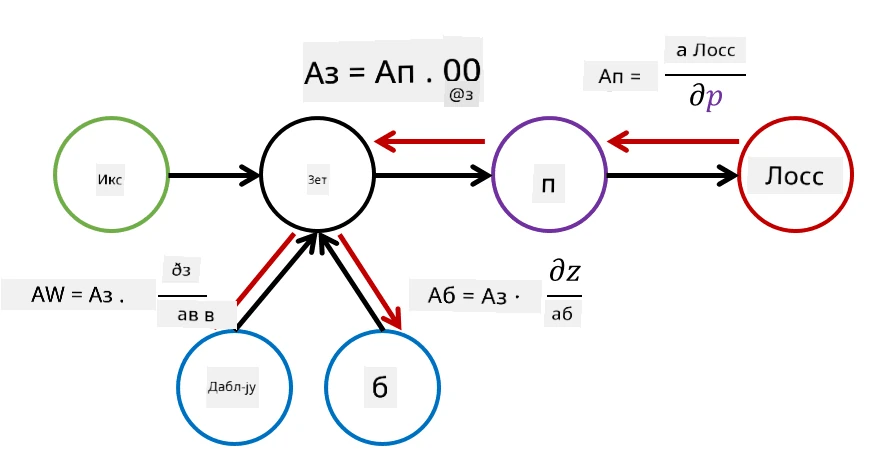

# Увод у неуронске мреже. Вишеслојни перцептрон

У претходном делу сте научили о најједноставнијем моделу неуронске мреже - једнослојном перцептрону, линеарном моделу за класификацију са две класе.

У овом делу проширићемо овај модел у флексибилнији оквир који нам омогућава:

* да извршимо **класификацију са више класа** поред класификације са две класе
* да решавамо **проблеме регресије** поред класификације
* да раздвајамо класе које нису линеарно раздвојиве

Такође ћемо развити сопствени модуларни оквир у Python-у који ће нам омогућити да конструишемо различите архитектуре неуронских мрежа.

## [Квиз пре предавања](https://ff-quizzes.netlify.app/en/ai/quiz/7)

## Формализација машинског учења

Почнимо са формализацијом проблема машинског учења. Претпоставимо да имамо тренинг скуп података **X** са ознакама **Y**, и да треба да изградимо модел *f* који ће давати најтачније предвиђања. Квалитет предвиђања се мери помоћу **функције губитка** &lagran;. Често коришћене функције губитка су:

* За проблем регресије, када треба да предвидимо број, можемо користити **апсолутну грешку** &sum;i|f(x(i))-y(i)|, или **квадратну грешку** &sum;i(f(x(i))-y(i))2
* За класификацију, користимо **0-1 губитак** (што је у суштини исто као **тачност** модела), или **логистички губитак**.

За једнослојни перцептрон, функција *f* је дефинисана као линеарна функција *f(x)=wx+b* (овде је *w* матрица тежина, *x* је вектор улазних карактеристика, а *b* је вектор пристрасности). За различите архитектуре неуронских мрежа, ова функција може имати сложенији облик.

> У случају класификације, често је пожељно добити вероватноће одговарајућих класа као излаз мреже. Да бисмо произвољне бројеве претворили у вероватноће (нпр. да нормализујемо излаз), често користимо функцију **softmax** &sigma;, па функција *f* постаје *f(x)=&sigma;(wx+b)*

У дефиницији *f* изнад, *w* и *b* се називају **параметри** &theta;=⟨*w,b*⟩. Дат скуп података ⟨**X**,**Y**⟩, можемо израчунати укупну грешку на целом скупу података као функцију параметара &theta;.

> ✅ **Циљ тренинга неуронске мреже је да минимизује грешку варирањем параметара &theta;**

## Оптимизација методом градијентског спуштања

Постоји добро познат метод оптимизације функција који се назива **градијентско спуштање**. Идеја је да можемо израчунати извод (у случају више димензија назван **градијент**) функције губитка у односу на параметре, и да варирамо параметре тако да се грешка смањује. Ово се може формализовати на следећи начин:

* Иницијализујте параметре неким случајним вредностима w(0), b(0)
* Понављајте следећи корак много пута:
    - w(i+1) = w(i)-&eta;&part;&lagran;/&part;w
    - b(i+1) = b(i)-&eta;&part;&lagran;/&part;b

Током тренинга, кораци оптимизације треба да се рачунају узимајући у обзир цео скуп података (запамтите да се губитак рачуна као збир кроз све узорке за тренинг). Међутим, у стварности узимамо мале делове скупа података који се називају **минибатчеви**, и рачунамо градијенте на основу подскупа података. Пошто се подскуп узима насумично сваки пут, овај метод се назива **стохастичко градијентско спуштање** (SGD).

## Вишеслојни перцептрони и назадно ширење

Једнослојна мрежа, као што смо видели, способна је да класификује линеарно раздвојиве класе. Да бисмо изградили богатији модел, можемо комбиновати неколико слојева мреже. Математички, то би значило да функција *f* има сложенији облик и да се рачуна у неколико корака:
* z1=w1x+b1
* z2=w2&alpha;(z1)+b2
* f = &sigma;(z2)

Овде је &alpha; **нелинеарна активациона функција**, &sigma; је softmax функција, а параметри су &theta;=<*w1,b1,w2,b2*>.

Алгоритам градијентског спуштања остаје исти, али је теже израчунати градијенте. Узимајући у обзир правило ланчаног диференцирања, можемо израчунати изводе као:

* &part;&lagran;/&part;w2 = (&part;&lagran;/&part;&sigma;)(&part;&sigma;/&part;z2)(&part;z2/&part;w2)
* &part;&lagran;/&part;w1 = (&part;&lagran;/&part;&sigma;)(&part;&sigma;/&part;z2)(&part;z2/&part;&alpha;)(&part;&alpha;/&part;z1)(&part;z1/&part;w1)

> ✅ Правило ланчаног диференцирања се користи за израчунавање извода функције губитка у односу на параметре.

Приметите да је леви део свих ових израза исти, и стога можемо ефикасно израчунати изводе почевши од функције губитка и идући "уназад" кроз граф рачунања. Због тога се метод тренинга вишеслојног перцептрона назива **назадно ширење**, или 'backprop'.

> TODO: цитирање слике

> ✅ У нашем примеру у нотебуку детаљније ћемо обрадити назадно ширење.  

## Закључак

У овом предавању, изградили смо сопствену библиотеку за неуронске мреже и користили је за једноставан задатак класификације у две димензије.

## 🚀 Изазов

У пратећем нотебуку, имплементираћете сопствени оквир за изградњу и тренинг вишеслојних перцептрона. Моћи ћете да видите детаљно како модерне неуронске мреже функционишу.

Прелазите на [OwnFramework](OwnFramework.ipynb) нотебук и радите кроз њега.

## [Квиз после предавања](https://ff-quizzes.netlify.app/en/ai/quiz/8)

## Преглед и самостално учење

Назадно ширење је уобичајен алгоритам који се користи у вештачкој интелигенцији и машинском учењу, вредан [детаљнијег проучавања](https://wikipedia.org/wiki/Backpropagation)

## [Задатак](lab/README.md)

У овом лабораторијском раду, од вас се тражи да користите оквир који сте конструисали у овом предавању за решавање класификације руком писаних цифара из MNIST скупа података.

* [Упутства](lab/README.md)
* [Нотебук](lab/MyFW_MNIST.ipynb)

---

