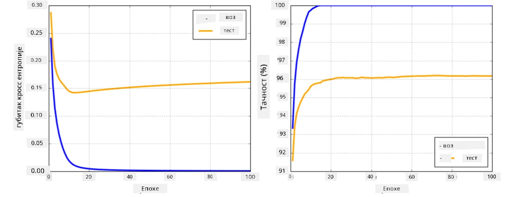

# Оквири за неуронске мреже

Као што смо већ научили, да бисмо ефикасно тренирали неуронске мреже, потребно је да урадимо две ствари:

* Да радимо са тензорима, на пример да множимо, сабирамо и рачунамо неке функције као што су сигмоид или софтмакс
* Да израчунамо градијенте свих израза, како бисмо извршили оптимизацију методом градијентног спуштања

## [Квиз пре предавања](https://ff-quizzes.netlify.app/en/ai/quiz/9)

Док библиотека `numpy` може да обави први део, потребан нам је механизам за израчунавање градијената. У [нашем оквиру](../04-OwnFramework/OwnFramework.ipynb) који смо развили у претходном делу, морали смо ручно да програмирамо све функције за изводе унутар методе `backward`, која врши назадно пропагацију. Идеално, оквир би нам требао омогућити да израчунамо градијенте *било ког израза* који можемо дефинисати.

Још једна важна ствар је могућност извршавања рачунања на GPU-у или било којој другој специјализованој јединици за рачунање, као што је [TPU](https://en.wikipedia.org/wiki/Tensor_Processing_Unit). Тренинг дубоких неуронских мрежа захтева *много* рачунања, и веома је важно да се та рачунања могу паралелизовати на GPU-у.

> ✅ Термин 'паралелизовати' значи расподелу рачунања на више уређаја.

Тренутно су два најпопуларнија оквира за неуронске мреже: [TensorFlow](http://TensorFlow.org) и [PyTorch](https://pytorch.org/). Оба пружају ниско-ниво API за рад са тензорима на CPU-у и GPU-у. Поред ниско-ниво API-ја, постоји и високо-ниво API, назван [Keras](https://keras.io/) и [PyTorch Lightning](https://pytorchlightning.ai/) одговарајуће.

Ниско-ниво API | [TensorFlow](http://TensorFlow.org) | [PyTorch](https://pytorch.org/)
--------------|-------------------------------------|--------------------------------
Високо-ниво API| [Keras](https://keras.io/) | [PyTorch Lightning](https://pytorchlightning.ai/)

**Ниско-ниво API-ји** у оба оквира омогућавају креирање такозваних **графова рачунања**. Овај граф дефинише како израчунати излаз (обично функцију губитка) са датим улазним параметрима и може се послати на GPU за рачунање, ако је доступан. Постоје функције за диференцирање овог графа рачунања и израчунавање градијената, који се затим могу користити за оптимизацију параметара модела.

**Високо-ниво API-ји** углавном третирају неуронске мреже као **секвенцу слојева**, и чине конструисање већине неуронских мрежа много лакшим. Тренинг модела обично захтева припрему података и затим позивање функције `fit` да обави посао.

Високо-ниво API омогућава брзо конструисање типичних неуронских мрежа без бриге о многим детаљима. У исто време, ниско-ниво API пружа много више контроле над процесом тренинга, и зато се често користи у истраживањима, када се ради са новим архитектурама неуронских мрежа.

Такође је важно разумети да можете користити оба API-ја заједно, на пример, можете развити сопствену архитектуру слоја мреже користећи ниско-ниво API, а затим је користити унутар веће мреже конструисане и трениране са високо-ниво API-јем. Или можете дефинисати мрежу користећи високо-ниво API као секвенцу слојева, а затим користити сопствени ниско-ниво тренинг петљу за оптимизацију. Оба API-ја користе исте основне концепте и дизајнирани су да добро функционишу заједно.

## Учење

У овом курсу, већина садржаја је доступна и за PyTorch и за TensorFlow. Можете изабрати свој омиљени оквир и проћи само кроз одговарајуће бележнице. Ако нисте сигурни који оквир да изаберете, прочитајте неке дискусије на интернету о теми **PyTorch vs. TensorFlow**. Такође можете погледати оба оквира да бисте стекли боље разумевање.

Када је могуће, користићемо високо-ниво API-је ради једноставности. Међутим, верујемо да је важно разумети како неуронске мреже функционишу од самог почетка, па ћемо на почетку радити са ниско-ниво API-јем и тензорима. Међутим, ако желите брзо да почнете и не желите да трошите много времена на учење ових детаља, можете их прескочити и одмах прећи на бележнице са високо-ниво API-јем.

## ✍️ Вежбе: Оквири

Наставите са учењем у следећим бележницама:

Ниско-ниво API | [TensorFlow+Keras Бележница](IntroKerasTF.ipynb) | [PyTorch](IntroPyTorch.ipynb)
--------------|-------------------------------------|--------------------------------
Високо-ниво API| [Keras](IntroKeras.ipynb) | *PyTorch Lightning*

Након савладавања оквира, хајде да поново размотримо концепт претренираности.

# Претренираност

Претренираност је изузетно важан концепт у машинском учењу, и веома је важно разумети га исправно!

Размотрите следећи проблем апроксимације 5 тачака (представљених са `x` на графицима испод):

 | 
-------------------------|--------------------------
**Линеарни модел, 2 параметра** | **Нелинеарни модел, 7 параметара**
Грешка на тренингу = 5.3 | Грешка на тренингу = 0
Грешка на валидацији = 5.1 | Грешка на валидацији = 20

* Лево видимо добру апроксимацију правом линијом. Због адекватног броја параметара, модел правилно схвата расподелу тачака.
* Десно, модел је превише моћан. Пошто имамо само 5 тачака, а модел има 7 параметара, он може да се прилагоди тако да пролази кроз све тачке, чиме грешка на тренингу постаје 0. Међутим, то спречава модел да разуме правилан образац података, па је грешка на валидацији веома висока.

Веома је важно пронаћи праву равнотежу између сложености модела (броја параметара) и броја узорака за тренинг.

## Зашто долази до претренираности

  * Недовољно података за тренинг
  * Превише моћан модел
  * Превише шума у улазним подацима

## Како открити претренираност

Као што можете видети на графику изнад, претренираност се може открити веома ниском грешком на тренингу и високом грешком на валидацији. Обично током тренинга видимо да и грешка на тренингу и грешка на валидацији почињу да опадају, а затим у једном тренутку грешка на валидацији може престати да опада и почети да расте. То ће бити знак претренираности и показатељ да би требало да зауставимо тренинг у том тренутку (или барем направимо снимак модела).

## Како спречити претренираност

Ако приметите да долази до претренираности, можете урадити следеће:

 * Повећајте количину података за тренинг
 * Смањите сложеност модела
 * Користите неку [технику регуларизације](../../4-ComputerVision/08-TransferLearning/TrainingTricks.md), као што је [Dropout](../../4-ComputerVision/08-TransferLearning/TrainingTricks.md#Dropout), коју ћемо касније размотрити.

## Претренираност и компромис пристрасности и варијансе

Претренираност је заправо случај ширег проблема у статистици названог [компромис пристрасности и варијансе](https://en.wikipedia.org/wiki/Bias%E2%80%93variance_tradeoff). Ако размотримо могуће изворе грешке у нашем моделу, можемо видети две врсте грешака:

* **Грешке пристрасности** су узроковане тиме што наш алгоритам не успева да правилно ухвати однос између података за тренинг. То може бити резултат чињенице да наш модел није довољно моћан (**подтренираност**).
* **Грешке варијансе**, које су узроковане тиме што модел апроксимира шум у улазним подацима уместо значајног односа (**претренираност**).

Током тренинга, грешка пристрасности опада (како наш модел учи да апроксимира податке), а грешка варијансе расте. Важно је зауставити тренинг - било ручно (када откријемо претренираност) или аутоматски (увођењем регуларизације) - како бисмо спречили претренираност.

## Закључак

У овој лекцији сте научили о разликама између различитих API-ја за два најпопуларнија AI оквира, TensorFlow и PyTorch. Поред тога, научили сте о веома важној теми, претренираности.

## 🚀 Изазов

У пратећим бележницама, наћи ћете 'задатке' на крају; прођите кроз бележнице и завршите задатке.

## [Квиз после предавања](https://ff-quizzes.netlify.app/en/ai/quiz/10)

## Преглед и самостално учење

Истражите следеће теме:

- TensorFlow
- PyTorch
- Претренираност

Поставите себи следећа питања:

- Која је разлика између TensorFlow-а и PyTorch-а?
- Која је разлика између претренираности и подтренираности?

## [Задатак](lab/README.md)

У овом лабораторијском раду, од вас се тражи да решите два проблема класификације користећи једнослојне и вишеслојне потпуно повезане мреже користећи PyTorch или TensorFlow.

* [Упутства](lab/README.md)
* [Бележница](lab/LabFrameworks.ipynb)

---

