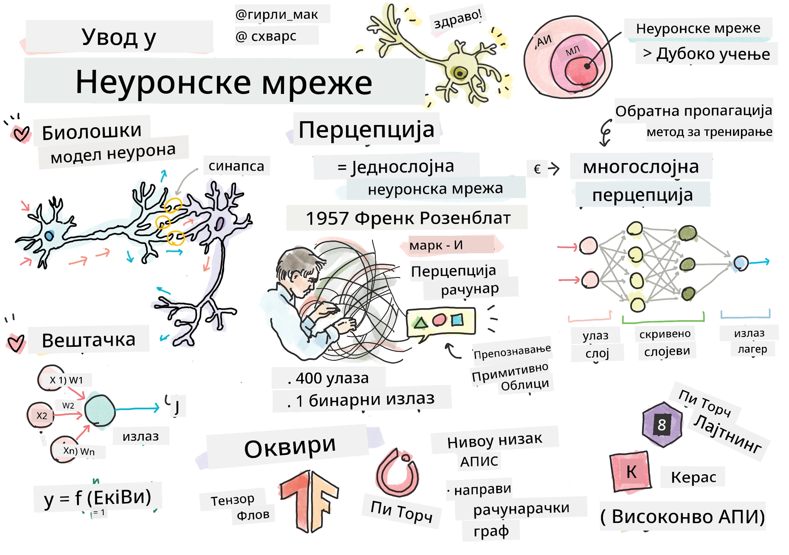
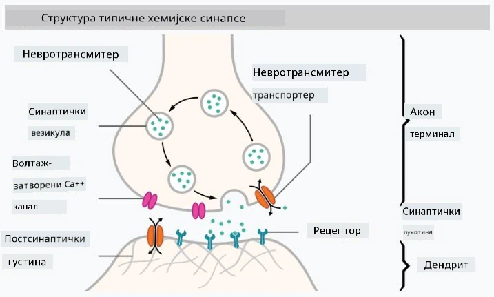
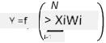

# Увод у неуронске мреже

Као што смо разговарали у уводу, један од начина да се постигне интелигенција је да се обучи **рачунарски модел** или **вештачки мозак**. Од средине 20. века, истраживачи су испробавали различите математичке моделе, све док се у последњим годинама овај правац није показао као изузетно успешан. Такви математички модели мозга називају се **неуронске мреже**.

> Понекад се неуронске мреже називају *вештачке неуронске мреже* (Artificial Neural Networks, ANNs), како би се нагласило да говоримо о моделима, а не о стварним мрежама неурона.

## Машинско учење

Неуронске мреже су део шире дисциплине која се зове **машинско учење**, чији је циљ да се користе подаци за обуку рачунарских модела који могу да решавају проблеме. Машинско учење чини велики део вештачке интелигенције, међутим, у овом курикулуму не покривамо класично машинско учење.

> Посетите наш посебан курикулум **[Машинско учење за почетнике](http://github.com/microsoft/ml-for-beginners)** да бисте сазнали више о класичном машинском учењу.

У машинском учењу претпостављамо да имамо неки скуп података примера **X** и одговарајуће излазне вредности **Y**. Примери су често N-димензионални вектори који се састоје од **карактеристика**, а излазне вредности се називају **ознаке**.

Разматраћемо два најчешћа проблема машинског учења:

* **Класификација**, где треба да класификујемо улазни објекат у две или више класа.
* **Регресија**, где треба да предвидимо нумеричку вредност за сваки од улазних узорака.

> Када представљамо улазе и излазе као тензоре, улазни скуп података је матрица величине M&times;N, где је M број узорака, а N број карактеристика. Излазне ознаке Y су вектор величине M.

У овом курикулуму фокусираћемо се само на моделе неуронских мрежа.

## Модел неурона

Из биологије знамо да наш мозак састоји се од неуронских ћелија (неурона), од којих свака има више "улаза" (дендрита) и један "излаз" (аксон). И дендрити и аксони могу проводити електричне сигнале, а везе између њих — познате као синапсе — могу показивати различите степене проводљивости, које регулишу неуротрансмитери.

 | 
----|----
Прави неурон *([Слика](https://en.wikipedia.org/wiki/Synapse#/media/File:SynapseSchematic_lines.svg) са Википедије)* | Вештачки неурон *(Слика аутора)*

Дакле, најједноставнији математички модел неурона садржи неколико улаза X1, ..., XN и један излаз Y, као и низ тежина W1, ..., WN. Излаз се рачуна као:

где је f нека нелинеарна **активациона функција**.

> Рани модели неурона описани су у класичном раду [A logical calculus of the ideas immanent in nervous activity](https://www.cs.cmu.edu/~./epxing/Class/10715/reading/McCulloch.and.Pitts.pdf) од стране Ворена Макалока и Волтера Питса 1943. године. Доналд Хеб је у својој књизи "[The Organization of Behavior: A Neuropsychological Theory](https://books.google.com/books?id=VNetYrB8EBoC)" предложио начин на који се те мреже могу обучавати.

## У овом одељку

У овом одељку ћемо научити о:
* [Перцептрону](03-Perceptron/README.md), једном од најранијих модела неуронских мрежа за класификацију са две класе
* [Мрежама са више слојева](04-OwnFramework/README.md) уз пратећу свеску [како направити сопствени оквир](04-OwnFramework/OwnFramework.ipynb)
* [Оквирима за неуронске мреже](05-Frameworks/README.md), уз ове свеске: [PyTorch](05-Frameworks/IntroPyTorch.ipynb) и [Keras/Tensorflow](05-Frameworks/IntroKerasTF.ipynb)
* [Прекомерно прилагођавање](../../../../lessons/3-NeuralNetworks/05-Frameworks)

---

**Одрицање од одговорности**:  
Овај документ је преведен коришћењем услуге за превођење помоћу вештачке интелигенције [Co-op Translator](https://github.com/Azure/co-op-translator). Иако се трудимо да обезбедимо тачност, молимо вас да имате у виду да аутоматски преводи могу садржати грешке или нетачности. Оригинални документ на изворном језику треба сматрати ауторитативним извором. За критичне информације препоручује се професионални превод од стране људи. Не сносимо одговорност за било каква неспоразумевања или погрешна тумачења која могу произаћи из коришћења овог превода.