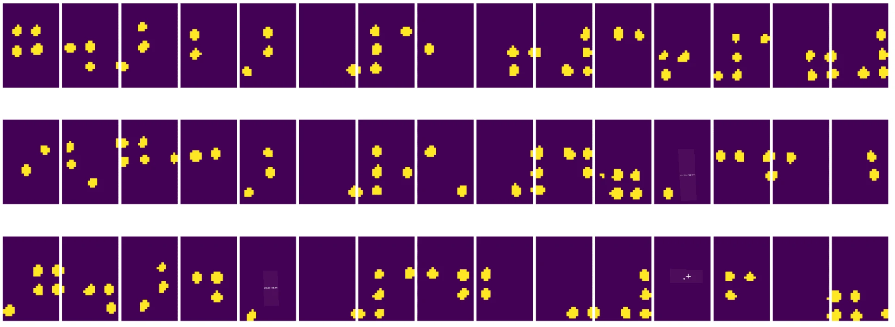
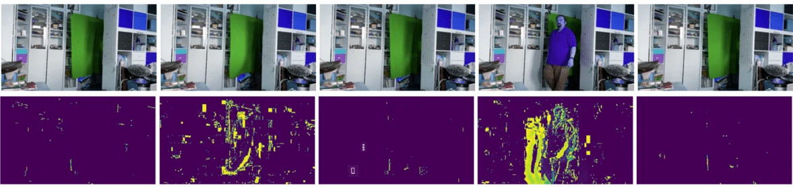

# Увод у рачунарски вид

[Рачунарски вид](https://wikipedia.org/wiki/Computer_vision) је област чији је циљ да омогући рачунарима да стекну висок ниво разумевања дигиталних слика. Ово је прилично широка дефиниција, јер *разумевање* може значити много различитих ствари, укључујући проналажење објекта на слици (**детекција објеката**), разумевање шта се дешава (**детекција догађаја**), описивање слике текстом или реконструкцију сцене у 3D. Постоје и посебни задаци везани за људске слике: процена старости и емоција, детекција и идентификација лица, као и процена 3D положаја, да наведемо само неке.

## [Квиз пре предавања](https://ff-quizzes.netlify.app/en/ai/quiz/11)

Један од најједноставнијих задатака рачунарског вида је **класификација слика**.

Рачунарски вид се често сматра граном вештачке интелигенције. Данас се већина задатака рачунарског вида решава коришћењем неуронских мрежа. У овом делу ћемо научити више о посебној врсти неуронских мрежа које се користе за рачунарски вид, [конволуционе неуронске мреже](../07-ConvNets/README.md).

Међутим, пре него што слику проследите неуронској мрежи, у многим случајевима има смисла користити неке алгоритамске технике за побољшање слике.

Постоји неколико Python библиотека доступних за обраду слика:

* **[imageio](https://imageio.readthedocs.io/en/stable/)** може се користити за читање/уписивање различитих формата слика. Такође подржава ffmpeg, користан алат за конвертовање видео кадрова у слике.
* **[Pillow](https://pillow.readthedocs.io/en/stable/index.html)** (познат и као PIL) је нешто моћнији и подржава неке манипулације сликама као што су морфинг, подешавање палете и друго.
* **[OpenCV](https://opencv.org/)** је моћна библиотека за обраду слика написана у C++, која је постала *де факто* стандард за обраду слика. Има погодан Python интерфејс.
* **[dlib](http://dlib.net/)** је C++ библиотека која имплементира многе алгоритме машинског учења, укључујући неке алгоритме рачунарског вида. Такође има Python интерфејс и може се користити за изазовне задатке као што су детекција лица и детекција карактеристичних тачака на лицу.

## OpenCV

[OpenCV](https://opencv.org/) се сматра *де факто* стандардом за обраду слика. Садржи много корисних алгоритама, имплементираних у C++. OpenCV можете користити и из Python-а.

Добро место за учење OpenCV-а је [курс Learn OpenCV](https://learnopencv.com/getting-started-with-opencv/). У нашем курикулуму, циљ нам није да научимо OpenCV, већ да вам покажемо неке примере када се може користити и како.

### Учитавање слика

Слике у Python-у могу се погодније представити помоћу NumPy низова. На пример, слике у сивим тоновима величине 320x200 пиксела биће смештене у низ величине 200x320, а колор слике истих димензија имаће облик 200x320x3 (за 3 канала боја). Да бисте учитали слику, можете користити следећи код:

```python
import cv2
import matplotlib.pyplot as plt

im = cv2.imread('image.jpeg')
plt.imshow(im)
```

Традиционално, OpenCV користи BGR (плаво-зелено-црвено) кодирање за колор слике, док остали Python алати користе традиционалнији RGB (црвено-зелено-плаво). Да би слика изгледала исправно, потребно је да је конвертујете у RGB простор боја, било заменом димензија у NumPy низу, или позивом OpenCV функције:

```python
im = cv2.cvtColor(im,cv2.COLOR_BGR2RGB)
```

Иста `cvtColor` функција може се користити за извођење других трансформација простора боја, као што је конвертовање слике у сиве тонове или у HSV (нијанса-засићеност-вредност) простор боја.

OpenCV можете користити и за учитавање видео записа кадрова по кадар - пример је дат у вежби [OpenCV Notebook](OpenCV.ipynb).

### Обрада слика

Пре него што слику проследите неуронској мрежи, можда ћете желети да примените неколико корака предобраде. OpenCV може радити многе ствари, укључујући:

* **Промену величине** слике коришћењем `im = cv2.resize(im, (320,200),interpolation=cv2.INTER_LANCZOS)`
* **Замагљивање** слике коришћењем `im = cv2.medianBlur(im,3)` или `im = cv2.GaussianBlur(im, (3,3), 0)`
* Промену **осветљености и контраста** слике можете урадити манипулацијом NumPy низовима, као што је описано [у овом Stackoverflow чланку](https://stackoverflow.com/questions/39308030/how-do-i-increase-the-contrast-of-an-image-in-python-opencv).
* Коришћење [праговања](https://docs.opencv.org/4.x/d7/d4d/tutorial_py_thresholding.html) позивом функција `cv2.threshold`/`cv2.adaptiveThreshold`, што је често пожељније од подешавања осветљености или контраста.
* Примена различитих [трансформација](https://docs.opencv.org/4.5.5/da/d6e/tutorial_py_geometric_transformations.html) на слику:
    - **[Афинске трансформације](https://docs.opencv.org/4.5.5/d4/d61/tutorial_warp_affine.html)** могу бити корисне ако треба да комбинујете ротацију, промену величине и искривљење слике и знате изворну и одредишну локацију три тачке на слици. Афинске трансформације задржавају паралелне линије паралелним.
    - **[Перспективне трансформације](https://medium.com/analytics-vidhya/opencv-perspective-transformation-9edffefb2143)** могу бити корисне када знате изворне и одредишне позиције 4 тачке на слици. На пример, ако снимите слику правоугаоног документа помоћу камере паметног телефона из неког угла, а желите да направите правоугаону слику самог документа.
* Разумевање кретања унутар слике коришћењем **[оптичког тока](https://docs.opencv.org/4.5.5/d4/dee/tutorial_optical_flow.html)**.

## Примери коришћења рачунарског вида

У нашем [OpenCV Notebook](OpenCV.ipynb), дајемо неке примере када се рачунарски вид може користити за извршавање специфичних задатака:

* **Предобрада фотографије Брајеве књиге**. Фокусирамо се на то како можемо користити праговање, детекцију карактеристика, перспективну трансформацију и манипулације NumPy низовима да бисмо раздвојили појединачне Брајеве симболе за даљу класификацију помоћу неуронске мреже.

 |  | 
----|-----|-----

> Слика из [OpenCV.ipynb](OpenCV.ipynb)

* **Детекција кретања у видеу коришћењем разлике кадрова**. Ако је камера фиксирана, онда би кадрови из видео записа требало да буду прилично слични један другом. Пошто су кадрови представљени као низови, само одузимањем тих низова за два узастопна кадра добићемо разлику пиксела, која би требало да буде мала за статичне кадрове, а да постане већа када постоји значајно кретање на слици.



> Слика из [OpenCV.ipynb](OpenCV.ipynb)

* **Детекција кретања коришћењем оптичког тока**. [Оптички ток](https://docs.opencv.org/3.4/d4/dee/tutorial_optical_flow.html) нам омогућава да разумемо како се појединачни пиксели на видео кадровима крећу. Постоје две врсте оптичког тока:

   - **Густи оптички ток** израчунава векторско поље које показује за сваки пиксел где се креће
   - **Ретки оптички ток** заснован је на узимању неких карактеристичних елемената на слици (нпр. ивица) и изградњи њихове трајекторије од кадра до кадра.


> Слика из [OpenCV.ipynb](OpenCV.ipynb)

## ✍️ Пример Notebook-а: OpenCV [испробајте OpenCV у акцији](OpenCV.ipynb)

Хајде да урадимо неке експерименте са OpenCV-ом истражујући [OpenCV Notebook](OpenCV.ipynb)

## Закључак

Понекад се релативно сложени задаци као што су детекција кретања или детекција врха прста могу решити искључиво рачунарским видом. Због тога је веома корисно знати основне технике рачунарског вида и шта библиотеке попут OpenCV-а могу да ураде.

## 🚀 Изазов

Погледајте [овај видео](https://docs.microsoft.com/shows/ai-show/ai-show--2021-opencv-ai-competition--grand-prize-winners--cortic-tigers--episode-32?WT.mc_id=academic-77998-cacaste) из AI Show-а да бисте сазнали више о пројекту Cortic Tigers и како су изградили решење засновано на блоковима за демократизацију задатака рачунарског вида путем робота. Истражите друге сличне пројекте који помажу новим ученицима да се укључе у ову област.

## [Квиз после предавања](https://ff-quizzes.netlify.app/en/ai/quiz/12)

## Преглед и самостално учење

Прочитајте више о оптичком току [у овом одличном туторијалу](https://learnopencv.com/optical-flow-in-opencv/).

## [Задатак](lab/README.md)

У овом лабораторијском раду, снимићете видео са једноставним гестовима, а ваш циљ је да извучете кретања горе/доле/лево/десно користећи оптички ток.


---

