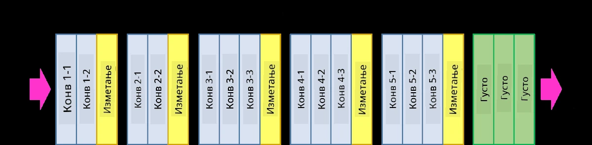
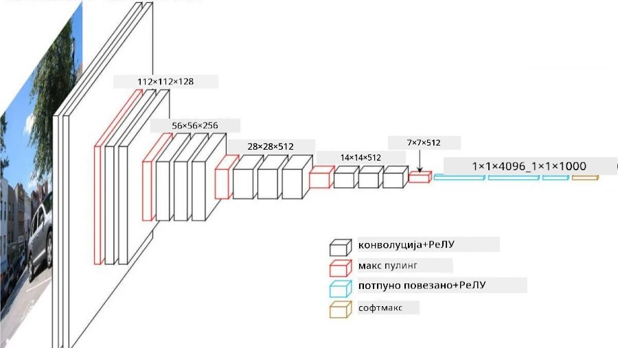
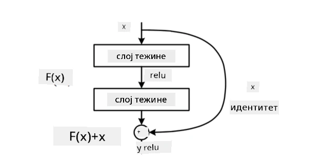
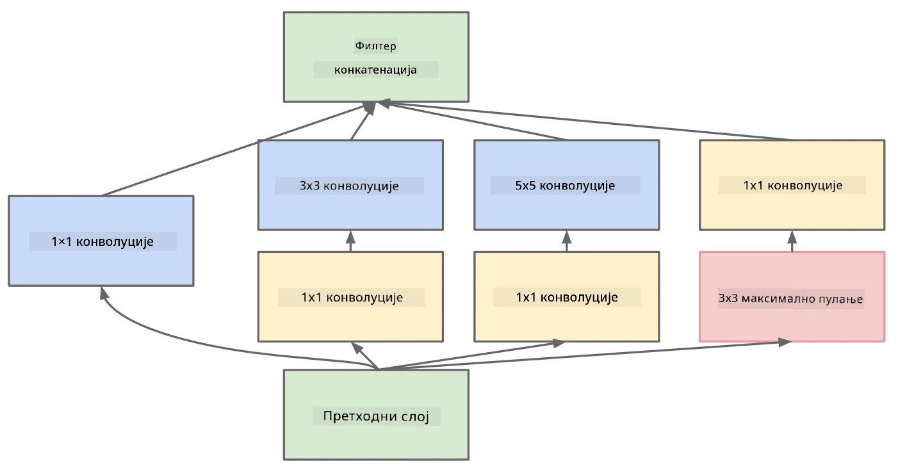

# Познате CNN архитектуре

### VGG-16

VGG-16 је мрежа која је постигла тачност од 92.7% у ImageNet top-5 класификацији 2014. године. Има следећу структуру слојева:

Као што можете видети, VGG прати традиционалну пирамидалну архитектуру, која је низ слојева за конволуцију и пуловање.

> Слика са [Researchgate](https://www.researchgate.net/figure/Vgg16-model-structure-To-get-the-VGG-NIN-model-we-replace-the-2-nd-4-th-6-th-7-th_fig2_335194493)

### ResNet

ResNet је породица модела коју је предложио Microsoft Research 2015. године. Главна идеја ResNet-а је коришћење **резидуалних блокова**:

> Слика из [овог рада](https://arxiv.org/pdf/1512.03385.pdf)

Разлог за коришћење идентификационог пролаза је да слој предвиђа **разлику** између резултата претходног слоја и излаза резидуалног блока - отуда назив *резидуални*. Ови блокови су много лакши за тренирање, и могу се конструисати мреже са неколико стотина оваквих блокова (најчешће варијанте су ResNet-52, ResNet-101 и ResNet-152).

Можете замислити ову мрежу као способну да прилагоди своју сложеност датом скупу података. У почетку, када почињете са тренирањем мреже, вредности тежина су мале, и већина сигнала пролази кроз идентификационе слојеве. Како тренинг напредује и тежине постају веће, значај параметара мреже расте, а мрежа се прилагођава да обезбеди потребну изражајну моћ за исправну класификацију слика за тренинг.

### Google Inception

Google Inception архитектура иде корак даље и гради сваки слој мреже као комбинацију неколико различитих путева:

> Слика са [Researchgate](https://www.researchgate.net/figure/Inception-module-with-dimension-reductions-left-and-schema-for-Inception-ResNet-v1_fig2_355547454)

Овде треба нагласити улогу конволуција 1x1, јер на први поглед немају смисла. Зашто би нам било потребно да пролазимо кроз слику са филтером 1x1? Међутим, треба запамтити да конволуциони филтери раде и са више дубинских канала (првобитно - RGB боје, у наредним слојевима - канали за различите филтере), а конволуција 1x1 се користи за мешање тих улазних канала помоћу различитих тежина које се тренирају. Такође се може посматрати као смањење димензија (пуловање) преко дубинске димензије.

Ево [одличног блога](https://medium.com/analytics-vidhya/talented-mr-1x1-comprehensive-look-at-1x1-convolution-in-deep-learning-f6b355825578) на ову тему, као и [оригиналног рада](https://arxiv.org/pdf/1312.4400.pdf).

### MobileNet

MobileNet је породица модела са смањеном величином, погодна за мобилне уређаје. Користите их ако имате ограничене ресурсе и можете жртвовати мало тачности. Главна идеја иза њих је такозвана **дубински раздвојена конволуција**, која омогућава представљање конволуционих филтера као композицију просторних конволуција и конволуције 1x1 преко дубинских канала. Ово значајно смањује број параметара, чинећи мрежу мањом по величини, а такође и лакшом за тренирање са мање података.

Ево [одличног блога о MobileNet-у](https://medium.com/analytics-vidhya/image-classification-with-mobilenet-cc6fbb2cd470).

## Закључак

У овој јединици сте научили главни концепт иза неуронских мрежа за рачунарски вид - конволуционе мреже. Архитектуре из стварног живота које покрећу класификацију слика, детекцију објеката, па чак и мреже за генерисање слика, све су засноване на CNN-овима, само са више слојева и неким додатним триковима за тренирање.

## 🚀 Изазов

У пратећим нотебоок-овима постоје белешке на дну о томе како постићи већу тачност. Урадите неке експерименте да видите да ли можете постићи већу тачност.

## [Квиз након предавања](https://ff-quizzes.netlify.app/en/ai/quiz/14)

## Преглед и самостално учење

Иако се CNN-ови најчешће користе за задатке рачунарског вида, они су генерално добри за извлачење шаблона фиксне величине. На пример, ако радимо са звуковима, можда ћемо желети да користимо CNN-ове за тражење специфичних шаблона у аудио сигналу - у том случају филтери би били једнодимензионални (и овај CNN би се назвао 1D-CNN). Такође, понекад се користи 3D-CNN за извлачење карактеристика у вишедимензионалном простору, као што су одређени догађаји који се дешавају на видео снимку - CNN може ухватити одређене шаблоне промена карактеристика током времена. Урадите преглед и самостално учење о другим задацима који се могу радити са CNN-овима.

## [Задатак](lab/README.md)

У овом лабораторијском раду, ваш задатак је класификација различитих раса мачака и паса. Ове слике су сложеније од MNIST скупа података, имају веће димензије, и постоји више од 10 класа.

---

