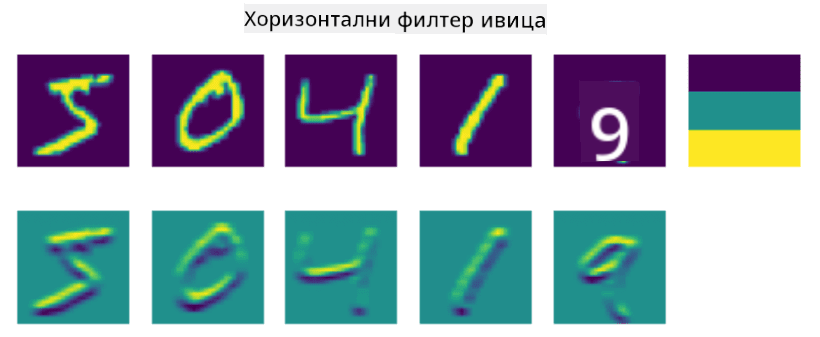
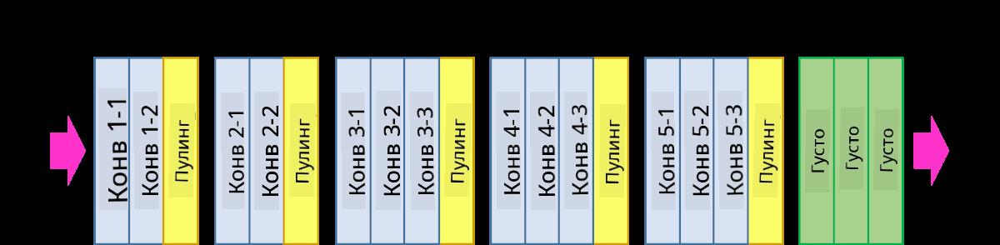

<!--
CO_OP_TRANSLATOR_METADATA:
{
  "original_hash": "088837b42b7d99198bf62db8a42411e0",
  "translation_date": "2025-08-25T22:52:56+00:00",
  "source_file": "lessons/4-ComputerVision/07-ConvNets/README.md",
  "language_code": "sr"
}
-->
# Конволуционе неуронске мреже

Већ смо видели да су неуронске мреже прилично добре у обради слика, па чак и једнослојни перцептрон може са задовољавајућом тачношћу препознати руком писане цифре из MNIST скупа података. Међутим, MNIST скуп података је веома специфичан, јер су све цифре центриране унутар слике, што чини задатак једноставнијим.

## [Квиз пре предавања](https://red-field-0a6ddfd03.1.azurestaticapps.net/quiz/107)

У стварном животу, желимо да будемо у могућности да препознамо објекте на слици без обзира на њихову тачну локацију унутар слике. Рачунарски вид се разликује од опште класификације, јер када покушавамо да пронађемо одређени објекат на слици, скенирамо слику тражећи специфичне **шаблоне** и њихове комбинације. На пример, када тражимо мачку, прво можемо тражити хоризонталне линије које могу формирати бркове, а затим одређена комбинација бркова може указати да је то заправо слика мачке. Релативна позиција и присуство одређених шаблона су важни, а не њихова тачна позиција на слици.

Да бисмо извукли шаблоне, користићемо концепт **конволуционих филтера**. Као што знате, слика је представљена 2Д-матрицом или 3Д-тензором са дубином боје. Примена филтера значи да узимамо релативно малу матрицу **језгра филтера**, и за сваки пиксел у оригиналној слици израчунавамо пондерисани просек са суседним тачкама. Ово можемо замислити као мали прозор који клизи преко целе слике и израчунава просек свих пиксела у складу са тежинама у матрици језгра филтера.

 | 
----|----

> Слика: Дмитриј Сошњиков

На пример, ако применимо 3x3 филтере за вертикалне и хоризонталне ивице на цифре из MNIST скупа, можемо добити истакнуте делове (нпр. високе вредности) тамо где постоје вертикалне и хоризонталне ивице у нашој оригиналној слици. Тако ова два филтера могу бити коришћена за "проналажење" ивица. Слично томе, можемо дизајнирати различите филтере за проналажење других ниско-нивоа шаблона:

> Слика [Leung-Malik филтер банке](https://www.robots.ox.ac.uk/~vgg/research/texclass/filters.html)

Међутим, док можемо ручно дизајнирати филтере за извлачење одређених шаблона, можемо такође дизајнирати мрежу на такав начин да она сама научи шаблоне. Ово је једна од главних идеја иза CNN-а.

## Главне идеје иза CNN-а

Начин на који CNN-ови функционишу заснован је на следећим важним идејама:

* Конволуциони филтери могу извлачити шаблоне
* Мрежу можемо дизајнирати тако да се филтери аутоматски тренирају
* Исти приступ можемо користити за проналажење шаблона у високим нивоима карактеристика, а не само у оригиналној слици. Тако екстракција карактеристика у CNN-у функционише на хијерархији карактеристика, почевши од ниско-нивоа комбинација пиксела, па све до високих нивоа комбинација делова слике.

> Слика из [рада Хислоп-Линча](https://www.semanticscholar.org/paper/Computer-vision-based-pedestrian-trajectory-Hislop-Lynch/26e6f74853fc9bbb7487b06dc2cf095d36c9021d), засновано на [њиховом истраживању](https://dl.acm.org/doi/abs/10.1145/1553374.1553453)

## ✍️ Вежбе: Конволуционе неуронске мреже

Наставимо са истраживањем како конволуционе неуронске мреже функционишу и како можемо постићи тренирање филтера, радећи кроз одговарајуће бележнице:

* [Конволуционе неуронске мреже - PyTorch](../../../../../lessons/4-ComputerVision/07-ConvNets/ConvNetsPyTorch.ipynb)
* [Конволуционе неуронске мреже - TensorFlow](../../../../../lessons/4-ComputerVision/07-ConvNets/ConvNetsTF.ipynb)

## Пирамидална архитектура

Већина CNN-ова који се користе за обраду слика прати такозвану пирамидалну архитектуру. Први конволуциони слој примењен на оригиналне слике обично има релативно мали број филтера (8-16), који одговарају различитим комбинацијама пиксела, као што су хоризонталне/вертикалне линије или потези. На следећем нивоу смањујемо просторну димензију мреже и повећавамо број филтера, што одговара већем броју могућих комбинација једноставних карактеристика. Са сваким слојем, како се приближавамо финалном класификатору, просторне димензије слике се смањују, а број филтера расте.

Као пример, погледајмо архитектуру VGG-16, мреже која је постигла 92.7% тачности у топ-5 класификацији ImageNet-а 2014. године:

> Слика са [Researchgate](https://www.researchgate.net/figure/Vgg16-model-structure-To-get-the-VGG-NIN-model-we-replace-the-2-nd-4-th-6-th-7-th_fig2_335194493)

## Најпознатије CNN архитектуре

[Наставите са проучавањем најпознатијих CNN архитектура](CNN_Architectures.md)

**Одрицање од одговорности**:  
Овај документ је преведен коришћењем услуге за превођење помоћу вештачке интелигенције [Co-op Translator](https://github.com/Azure/co-op-translator). Иако се трудимо да обезбедимо тачност, молимо вас да имате у виду да аутоматски преводи могу садржати грешке или нетачности. Оригинални документ на његовом изворном језику треба сматрати меродавним извором. За критичне информације препоручује се професионални превод од стране људи. Не преузимамо одговорност за било каква погрешна тумачења или неспоразуме који могу настати услед коришћења овог превода.