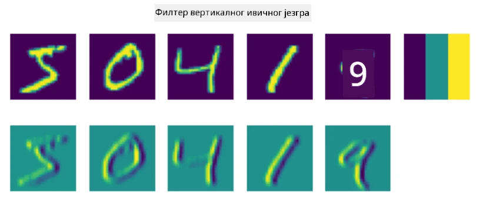
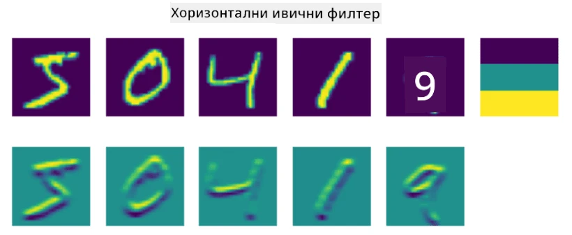
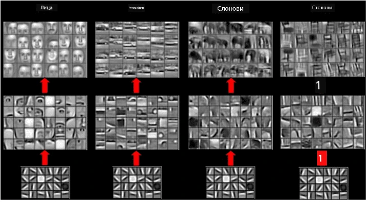

# Конволуционе неуронске мреже

Видели смо раније да су неуронске мреже прилично добре у обради слика, па чак и једнослојни перцептрон може препознати руком писане цифре из MNIST скупа података са задовољавајућом тачношћу. Међутим, MNIST скуп података је веома специфичан, и све цифре су центриране унутар слике, што задатак чини једноставнијим.

## [Квиз пре предавања](https://ff-quizzes.netlify.app/en/ai/quiz/13)

У стварном животу, желимо да будемо у стању да препознамо објекте на слици без обзира на њихову тачну локацију унутар слике. Рачунарски вид се разликује од опште класификације, јер када покушавамо да пронађемо одређени објекат на слици, скенирамо слику тражећи одређене **шаблоне** и њихове комбинације. На пример, када тражимо мачку, прво можемо потражити хоризонталне линије које могу формирати бркове, а затим одређена комбинација бркова може указати да је то заправо слика мачке. Релативна позиција и присуство одређених шаблона су важни, а не њихова тачна позиција на слици.

Да бисмо извукли шаблоне, користићемо концепт **конволуционих филтера**. Као што знате, слика је представљена као 2D-матрица или 3D-тензор са дубином боје. Примена филтера значи да узимамо релативно малу матрицу **језгра филтера**, и за сваки пиксел у оригиналној слици израчунавамо пондерисани просек са суседним тачкама. Ово можемо замислити као мали прозор који клизи преко целе слике и израчунава просек свих пиксела према тежинама у матрици језгра филтера.

 | 
----|----

> Слика: Дмитриј Сошњиков

На пример, ако применимо 3x3 филтере за вертикалне и хоризонталне ивице на MNIST цифре, можемо добити истакнуте делове (нпр. високе вредности) тамо где постоје вертикалне и хоризонталне ивице у нашој оригиналној слици. Тако ова два филтера могу бити коришћена за "тражење" ивица. Слично томе, можемо дизајнирати различите филтере за тражење других шаблона ниског нивоа:

> Слика: [Leung-Malik Filter Bank](https://www.robots.ox.ac.uk/~vgg/research/texclass/filters.html)

Међутим, док можемо ручно дизајнирати филтере за извлачење одређених шаблона, можемо такође дизајнирати мрежу на такав начин да она сама научи шаблоне. Ово је једна од главних идеја иза CNN-а.

## Главне идеје иза CNN-а

Начин на који CNN функционише заснован је на следећим важним идејама:

* Конволуциони филтери могу извлачити шаблоне
* Можемо дизајнирати мрежу тако да се филтери аутоматски тренирају
* Можемо користити исти приступ за проналажење шаблона у карактеристикама високог нивоа, а не само у оригиналној слици. Тако екстракција карактеристика у CNN-у функционише на хијерархији карактеристика, почевши од комбинација пиксела ниског нивоа, па све до комбинација делова слике високог нивоа.

> Слика из [рада Hislop-Lynch](https://www.semanticscholar.org/paper/Computer-vision-based-pedestrian-trajectory-Hislop-Lynch/26e6f74853fc9bbb7487b06dc2cf095d36c9021d), засновано на [њиховом истраживању](https://dl.acm.org/doi/abs/10.1145/1553374.1553453)

## ✍️ Вежбе: Конволуционе неуронске мреже

Наставимо са истраживањем како конволуционе неуронске мреже функционишу и како можемо постићи тренирање филтера, кроз рад на одговарајућим нотебуцима:

* [Конволуционе неуронске мреже - PyTorch](ConvNetsPyTorch.ipynb)
* [Конволуционе неуронске мреже - TensorFlow](ConvNetsTF.ipynb)

## Пирамидална архитектура

Већина CNN-а који се користе за обраду слика следи такозвану пирамидалну архитектуру. Први конволуциони слој примењен на оригиналне слике обично има релативно мали број филтера (8-16), који одговарају различитим комбинацијама пиксела, као што су хоризонталне/вертикалне линије или потези. На следећем нивоу, смањујемо просторну димензију мреже и повећавамо број филтера, што одговара већем броју могућих комбинација једноставних карактеристика. Са сваким слојем, како се приближавамо финалном класификатору, просторне димензије слике се смањују, а број филтера расте.

Као пример, погледајмо архитектуру VGG-16, мреже која је постигла 92.7% тачности у ImageNet топ-5 класификацији 2014. године:

> Слика са [Researchgate](https://www.researchgate.net/figure/Vgg16-model-structure-To-get-the-VGG-NIN-model-we-replace-the-2-nd-4-th-6-th-7-th_fig2_335194493)

## Најпознатије CNN архитектуре

[Наставите са изучавањем најпознатијих CNN архитектура](CNN_Architectures.md)

---

