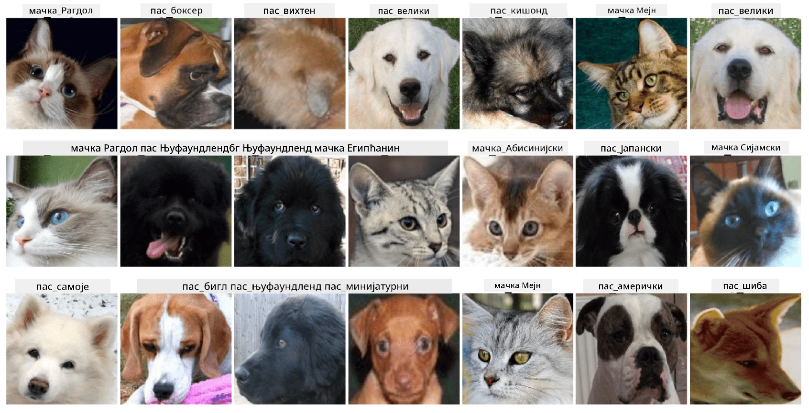

# Класификација лица кућних љубимаца

Задатак из [AI for Beginners Curriculum](https://github.com/microsoft/ai-for-beginners).

## Задатак

Замислите да треба да развијете апликацију за расадник кућних љубимаца како бисте каталогизовали све љубимце. Једна од одличних функција такве апликације била би аутоматско откривање расе са фотографије. Ово се успешно може урадити помоћу неуронских мрежа.

Потребно је да обучите конволуциону неуронску мрежу за класификацију различитих раса мачака и паса користећи **Pet Faces** скуп података.

## Скуп података

Користићемо [Oxford-IIIT Pet Dataset](https://www.robots.ox.ac.uk/~vgg/data/pets/), који садржи слике 37 различитих раса паса и мачака.



Да бисте преузели скуп података, користите овај код:

```python
!wget https://thor.robots.ox.ac.uk/~vgg/data/pets/images.tar.gz
!tar xfz images.tar.gz
!rm images.tar.gz
```

**Напомена:** Слике у Oxford-IIIT Pet Dataset су организоване по имену датотеке (нпр. `Abyssinian_1.jpg`, `Bengal_2.jpg`). У нотебуку је укључен код за организовање ових слика у поддиректоријуме специфичне за расу ради лакше класификације.

## Почетни нотебук

Започните лабораторију отварањем [PetFaces.ipynb](PetFaces.ipynb)

## Закључак

Решили сте релативно сложен проблем класификације слика од нуле! Било је прилично много класа, а ипак сте успели да постигнете разумну тачност! Такође има смисла мерити top-k тачност, јер је лако помешати неке класе које нису јасно различите чак ни за људско око.

---

**Одрицање од одговорности**:  
Овај документ је преведен коришћењем услуге за превођење помоћу вештачке интелигенције [Co-op Translator](https://github.com/Azure/co-op-translator). Иако се трудимо да обезбедимо тачност, молимо вас да имате у виду да аутоматски преводи могу садржати грешке или нетачности. Оригинални документ на његовом изворном језику треба сматрати ауторитативним извором. За критичне информације препоручује се професионални превод од стране људи. Не преузимамо одговорност за било каква погрешна тумачења или неспоразуме који могу настати услед коришћења овог превода.