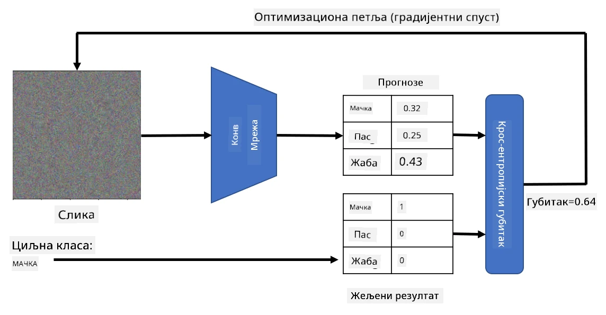

# Предобучене мреже и трансфер учење

Тренирање CNN-а може да траје дуго и захтева много података. Међутим, велики део времена се троши на учење најбољих ниско-нивоских филтера које мрежа може да користи за издвајање образаца из слика. Поставља се природно питање - можемо ли користити неуронску мрежу обучену на једном скупу података и прилагодити је за класификацију различитих слика без потребе за комплетним процесом тренирања?

## [Квиз пре предавања](https://ff-quizzes.netlify.app/en/ai/quiz/15)

Овај приступ се назива **трансфер учење**, јер преносимо одређено знање са једног модела неуронске мреже на други. Код трансфер учења, обично почињемо са предобученим моделом, који је обучен на неком великом скупу слика, као што је **ImageNet**. Ти модели већ добро раде на издвајању различитих карактеристика из општих слика, а у многим случајевима само изградња класификатора на основу тих издвојених карактеристика може дати добар резултат.

> ✅ Трансфер учење је термин који се користи и у другим академским областима, као што је образовање. Он се односи на процес преношења знања из једне области и његову примену у другој.

## Предобучени модели као екстрактори карактеристика

Конволуционе мреже о којима смо говорили у претходном делу садрже бројне слојеве, од којих је сваки намењен издвајању одређених карактеристика из слике, почевши од ниско-нивоских комбинација пиксела (као што су хоризонталне/вертикалне линије или потези), па до виших комбинација карактеристика које одговарају стварима као што је око пламена. Ако обучимо CNN на довољно великом скупу општих и разноврсних слика, мрежа би требало да научи да издваја те заједничке карактеристике.

И Keras и PyTorch садрже функције за лако учитавање предобучених тежина неуронских мрежа за неке уобичајене архитектуре, од којих је већина обучена на ImageNet сликама. Најчешће коришћене описане су на страници [Архитектуре CNN-а](../07-ConvNets/CNN_Architectures.md) из претходног часа. Конкретно, можете размотрити коришћење једног од следећих:

* **VGG-16/VGG-19** су релативно једноставни модели који и даље дају добру тачност. Често је коришћење VGG-а као првог покушаја добар избор да се види како трансфер учење функционише.
* **ResNet** је породица модела коју је предложио Microsoft Research 2015. године. Имају више слојева, па самим тим захтевају више ресурса.
* **MobileNet** је породица модела смањене величине, погодна за мобилне уређаје. Користите их ако имате ограничене ресурсе и можете жртвовати мало тачности.

Ево примера карактеристика издвојених из слике мачке помоћу VGG-16 мреже:

## Скуп података: Мачке и пси

У овом примеру, користићемо скуп података [Мачке и пси](https://www.microsoft.com/download/details.aspx?id=54765&WT.mc_id=academic-77998-cacaste), који је веома близак стварном сценарију класификације слика.

## ✍️ Вежба: Трансфер учење

Хајде да видимо трансфер учење у пракси у одговарајућим нотебуковима:

* [Трансфер учење - PyTorch](TransferLearningPyTorch.ipynb)
* [Трансфер учење - TensorFlow](TransferLearningTF.ipynb)

## Визуелизација идеалне мачке

Предобучена неуронска мрежа садржи различите обрасце у свом *мозгу*, укључујући концепте **идеалне мачке** (као и идеалног пса, идеалне зебре, итд.). Било би занимљиво некако **визуелизовати ову слику**. Међутим, то није једноставно, јер су обрасци распоређени широм тежина мреже и организовани у хијерархијску структуру.

Један приступ који можемо применити је да почнемо са насумичном сликом и затим покушамо да користимо технику **оптимизације градијентног спуштања** како бисмо прилагодили ту слику на такав начин да мрежа почне да мисли да је то мачка.

Међутим, ако то урадимо, добићемо нешто веома слично насумичном шуму. То је зато што *постоји много начина да мрежа помисли да је улазна слика мачка*, укључујући неке који визуелно немају смисла. Иако те слике садрже много образаца типичних за мачку, ништа их не ограничава да буду визуелно препознатљиве.

Да бисмо побољшали резултат, можемо додати још један члан у функцију губитка, који се назива **губитак варијације**. То је метрика која показује колико су слични суседни пиксели слике. Минимизирање губитка варијације чини слику глаткијом и уклања шум - чиме открива визуелно привлачније обрасце. Ево примера таквих "идеалних" слика, које се класификују као мачка и као зебра са високом вероватноћом:

 | 
-----|-----
 *Идеална мачка* | *Идеална зебра*

Сличан приступ може се користити за извођење такозваних **адверзаријалних напада** на неуронску мрежу. Претпоставимо да желимо да преваримо неуронску мрежу и учинимо да пас изгледа као мачка. Ако узмемо слику пса, коју мрежа препознаје као пса, можемо је мало изменити користећи оптимизацију градијентног спуштања, док мрежа не почне да је класификује као мачку:

 | 
-----|-----
*Оригинална слика пса* | *Слика пса класификована као мачка*

Погледајте код за репродукцију горе наведених резултата у следећем нотебуку:

* [Идеална и адверзаријална мачка - TensorFlow](AdversarialCat_TF.ipynb)

## Закључак

Користећи трансфер учење, можете брзо направити класификатор за задатак класификације прилагођених објеката и постићи високу тачност. Можете видети да сложенији задаци које сада решавамо захтевају већу рачунарску снагу и не могу се лако решити на CPU-у. У следећој јединици покушаћемо да користимо лакшу имплементацију за тренирање истог модела користећи мање ресурсе, што резултира само мало нижом тачношћу.

## 🚀 Изазов

У пратећим нотебуцима постоје белешке на крају о томе како трансфер знања најбоље функционише са донекле сличним подацима за тренирање (нпр. нова врста животиње). Урадите експерименте са потпуно новим типовима слика да видите колико добро или лоше ваши модели трансфер знања функционишу.

## [Квиз после предавања](https://ff-quizzes.netlify.app/en/ai/quiz/16)

## Преглед и самостално учење

Прочитајте [TrainingTricks.md](TrainingTricks.md) да бисте продубили своје знање о другим начинима тренирања модела.

## [Задатак](lab/README.md)

У овом лабораторијском раду, користићемо стварни [Oxford-IIIT](https://www.robots.ox.ac.uk/~vgg/data/pets/) скуп података о кућним љубимцима са 35 раса мачака и паса, и направићемо класификатор за трансфер учење.

---

