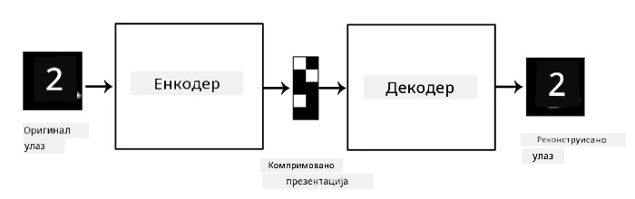
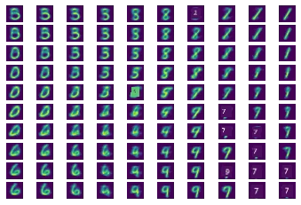

# Аутоенкодери

При тренингу CNN-а, један од проблема је то што нам је потребно много означених података. У случају класификације слика, морамо да раздвојимо слике у различите класе, што захтева ручни рад.

## [Квиз пре предавања](https://ff-quizzes.netlify.app/en/ai/quiz/17)

Међутим, можда желимо да користимо необрађене (неозначене) податке за тренинг CNN екстрактора карактеристика, што се назива **само-надгледано учење**. Уместо ознака, користићемо слике за тренинг као улаз и излаз мреже. Главна идеја **аутоенкодера** је да имамо **енкодер мрежу** која претвара улазну слику у неки **латентни простор** (обично је то само вектор мање величине), а затим **декодер мрежу**, чији је циљ да реконструише оригиналну слику.

> ✅ [Аутоенкодер](https://wikipedia.org/wiki/Autoencoder) је "тип вештачке неуронске мреже која се користи за учење ефикасног кодирања неозначених података."

Пошто тренирамо аутоенкодер да ухвати што више информација из оригиналне слике ради тачне реконструкције, мрежа покушава да пронађе најбоље **уграђивање** улазних слика како би ухватила њихово значење.

> Слика са [Keras блога](https://blog.keras.io/building-autoencoders-in-keras.html)

## Сценарији за коришћење аутоенкодера

Иако реконструкција оригиналних слика сама по себи не изгледа корисно, постоји неколико сценарија где су аутоенкодери посебно корисни:

* **Смањење димензије слика ради визуализације** или **тренинг уграђивања слика**. Обично аутоенкодери дају боље резултате од PCA, јер узимају у обзир просторну природу слика и хијерархијске карактеристике.
* **Уклањање шума**, односно уклањање шума са слике. Пошто шум носи много бескорисних информација, аутоенкодер не може да уклопи све у релативно мали латентни простор, и тако хвата само важан део слике. При тренингу за уклањање шума, почињемо са оригиналним сликама и користимо слике са вештачки додатим шумом као улаз за аутоенкодер.
* **Супер-резолуција**, повећање резолуције слике. Почињемо са сликама високе резолуције и користимо слике са нижом резолуцијом као улаз за аутоенкодер.
* **Генеративни модели**. Када тренирамо аутоенкодер, део декодера може се користити за креирање нових објеката почевши од случајних латентних вектора.

## Варијациони аутоенкодери (VAE)

Традиционални аутоенкодери на неки начин смањују димензију улазних података, откривајући важне карактеристике улазних слика. Међутим, латентни вектори често немају много смисла. Другим речима, узимајући MNIST датасет као пример, није лако утврдити који бројеви одговарају различитим латентним векторима, јер блиски латентни вектори не морају нужно одговарати истим бројевима.

С друге стране, за тренинг *генеративних* модела боље је имати неко разумевање латентног простора. Ова идеја нас води до **варијационог аутоенкодера** (VAE).

VAE је аутоенкодер који учи да предвиђа *статистичку дистрибуцију* латентних параметара, такозвану **латентну дистрибуцију**. На пример, можемо желети да латентни вектори буду нормално распоређени са неком средњом вредношћу zmean и стандардном девијацијом zsigma (и средња вредност и стандардна девијација су вектори неке димензије d). Енкодер у VAE учи да предвиђа те параметре, а затим декодер узима случајни вектор из те дистрибуције да реконструише објекат.

Укратко:

 * Из улазног вектора предвиђамо `z_mean` и `z_log_sigma` (уместо да предвиђамо саму стандардну девијацију, предвиђамо њен логаритам)
 * Узимамо узорак вектора `sample` из дистрибуције N(zmean,exp(zlog\_sigma))
 * Декодер покушава да декодира оригиналну слику користећи `sample` као улазни вектор

 

> Слика из [овог блога](https://ijdykeman.github.io/ml/2016/12/21/cvae.html) аутора Исака Дајкемана

Варијациони аутоенкодери користе сложену функцију губитка која се састоји из два дела:

* **Губитак реконструкције** је функција губитка која показује колико је реконструисана слика близу циљу (може бити средња квадратична грешка, или MSE). То је иста функција губитка као код нормалних аутоенкодера.
* **KL губитак**, који осигурава да дистрибуција латентних променљивих остане близу нормалне дистрибуције. Заснован је на концепту [Кулбак-Лајблерове дивергенције](https://www.countbayesie.com/blog/2017/5/9/kullback-leibler-divergence-explained) - метрици за процену сличности две статистичке дистрибуције.

Једна важна предност VAE-а је то што нам омогућава да релативно лако генеришемо нове слике, јер знамо из које дистрибуције узимамо узорке латентних вектора. На пример, ако тренирамо VAE са 2D латентним вектором на MNIST-у, можемо затим мењати компоненте латентног вектора да добијемо различите бројеве:

> Слика аутора [Дмитрија Сошњикова](http://soshnikov.com)

Приметите како се слике међусобно стапају, док почињемо да добијамо латентне векторе из различитих делова латентног параметарског простора. Такође можемо визуализовати овај простор у 2D:

 

> Слика аутора [Дмитрија Сошњикова](http://soshnikov.com)

## ✍️ Вежбе: Аутоенкодери

Сазнајте више о аутоенкодерима у овим одговарајућим нотебуцима:

* [Аутоенкодери у TensorFlow-у](AutoencodersTF.ipynb)
* [Аутоенкодери у PyTorch-у](AutoEncodersPyTorch.ipynb)

## Карактеристике аутоенкодера

* **Специфични за податке** - добро раде само са типом слика на којима су тренирани. На пример, ако тренирамо мрежу за супер-резолуцију на цветовима, неће добро радити на портретима. То је зато што мрежа може произвести слику више резолуције узимајући фине детаље из карактеристика научених из тренинг скупа.
* **Губитак информација** - реконструисана слика није иста као оригинална слика. Природа губитка је дефинисана *функцијом губитка* која се користи током тренинга.
* Ради са **неозначеним подацима**

## [Квиз после предавања](https://ff-quizzes.netlify.app/en/ai/quiz/18)

## Закључак

У овом предавању, научили сте о различитим типовима аутоенкодера доступним AI научницима. Научили сте како да их изградите и како да их користите за реконструкцију слика. Такође сте научили о VAE-у и како да га користите за генерисање нових слика.

## 🚀 Изазов

У овом предавању, научили сте о коришћењу аутоенкодера за слике. Али они се могу користити и за музику! Погледајте пројекат Magenta [MusicVAE](https://magenta.tensorflow.org/music-vae), који користи аутоенкодере за учење реконструкције музике. Урадите неке [експерименте](https://colab.research.google.com/github/magenta/magenta-demos/blob/master/colab-notebooks/Multitrack_MusicVAE.ipynb) са овом библиотеком да видите шта можете да креирате.

## [Квиз после предавања](https://ff-quizzes.netlify.app/en/ai/quiz/16)

## Преглед и самостално учење

За референцу, прочитајте више о аутоенкодерима у овим ресурсима:

* [Изградња аутоенкодера у Keras-у](https://blog.keras.io/building-autoencoders-in-keras.html)
* [Блог пост на NeuroHive](https://neurohive.io/ru/osnovy-data-science/variacionnyj-avtojenkoder-vae/)
* [Објашњење варијационих аутоенкодера](https://kvfrans.com/variational-autoencoders-explained/)
* [Условни варијациони аутоенкодери](https://ijdykeman.github.io/ml/2016/12/21/cvae.html)

## Задатак

На крају [овог нотебука у TensorFlow-у](AutoencodersTF.ipynb), наћи ћете 'задатак' - користите га као свој задатак.

---

