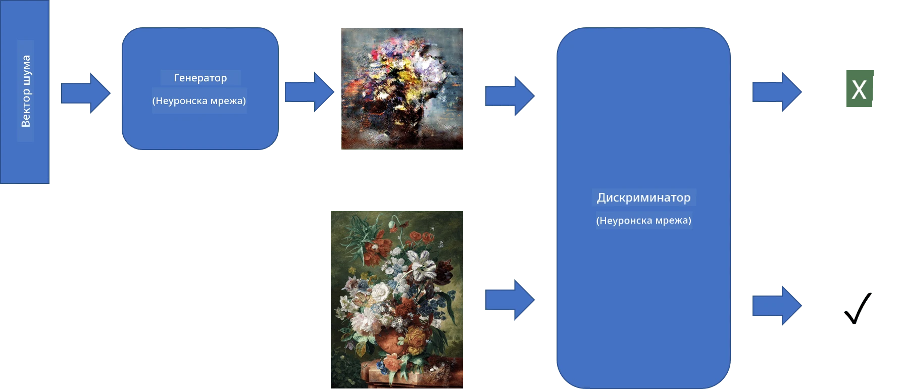
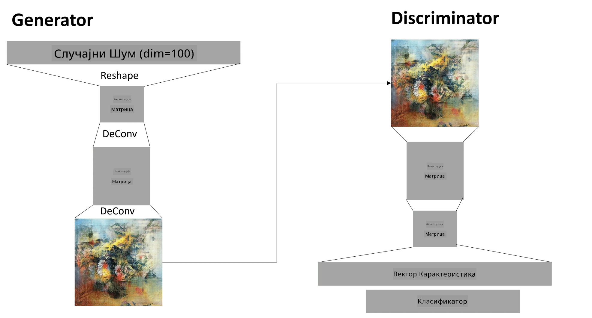

# Генеративне Адверзаријалне Мреже

У претходном делу смо научили о **генеративним моделима**: моделима који могу да генеришу нове слике сличне онима из скупа за тренирање. ВАЕ је био добар пример генеративног модела.

## [Квиз пре предавања](https://ff-quizzes.netlify.app/en/ai/quiz/19)

Међутим, ако покушамо да генеришемо нешто заиста значајно, као што је слика у разумној резолуцији, користећи ВАЕ, видећемо да тренинг не конвергира добро. За овај случај употребе, требало би да научимо о другој архитектури која је посебно намењена генеративним моделима - **Генеративне Адверзаријалне Мреже**, или ГАН-ови.

Главна идеја ГАН-а је да има две неуронске мреже које ће се тренирати једна против друге:

> Слика од [Дмитрија Сошњикова](http://soshnikov.com)

> ✅ Мали речник:
> * **Генератор** је мрежа која узима неки случајни вектор и производи слику као резултат.
> * **Дискриминатор** је мрежа која узима слику и треба да одреди да ли је то права слика (из скупа за тренирање) или је генерисана од стране генератора. У суштини, то је класификатор слика.

### Дискриминатор

Архитектура дискриминатора се не разликује од обичне мреже за класификацију слика. У најједноставнијем случају, то може бити потпуно повезан класификатор, али највероватније ће бити [конволуциона мрежа](../07-ConvNets/README.md).

> ✅ ГАН заснован на конволуционим мрежама назива се [DCGAN](https://arxiv.org/pdf/1511.06434.pdf)

Дискриминатор заснован на ЦНН-у састоји се од следећих слојева: неколико конволуција+пулинга (са смањењем просторне величине) и једног или више потпуно повезаних слојева за добијање "векторa карактеристика", завршног бинарног класификатора.

> ✅ 'Пулинг' у овом контексту је техника која смањује величину слике. "Пулинг слојеви смањују димензије података комбиновањем излазa кластера неурона на једном слоју у један неурон на следећем слоју." - [извор](https://wikipedia.org/wiki/Convolutional_neural_network#Pooling_layers)

### Генератор

Генератор је мало сложенији. Можете га сматрати обрнутим дискриминатором. Почевши од латентног вектора (уместо вектора карактеристика), он има потпуно повезан слој за конверзију у потребну величину/облик, праћен деконволуцијама+увећањем. Ово је слично *декодеру* дела [аутоенкодера](../09-Autoencoders/README.md).

> ✅ Пошто је конволуциони слој имплементиран као линеарни филтер који пролази кроз слику, деконволуција је суштински слична конволуцији и може се имплементирати користећи исту логику слоја.

> Слика од [Дмитрија Сошњикова](http://soshnikov.com)

### Тренинг ГАН-а

ГАН-ови се називају **адверзаријалним** јер постоји стално такмичење између генератора и дискриминатора. Током овог такмичења, и генератор и дискриминатор се побољшавају, тако да мрежа учи да производи све боље и боље слике.

Тренинг се одвија у две фазе:

* **Тренинг дискриминатора**. Овај задатак је прилично једноставан: генеришемо серију слика помоћу генератора, означавајући их са 0, што означава лажну слику, и узимамо серију слика из улазног скупа података (са ознаком 1, права слика). Добијамо неки *губитак дискриминатора* и изводимо бацкпроп.
* **Тренинг генератора**. Ово је мало сложеније, јер директно не знамо очекивани излаз за генератор. Узимамо целу ГАН мрежу која се састоји од генератора праћеног дискриминатором, напајамо је неким случајним векторима и очекујемо да резултат буде 1 (што одговара правим сликама). Затим замрзавамо параметре дискриминатора (не желимо да га тренирамо у овом кораку) и изводимо бацкпроп.

Током овог процеса, губици генератора и дискриминатора не опадају значајно. У идеалној ситуацији, они би требало да осцилирају, што одговара побољшању перформанси обе мреже.

## ✍️ Вежбе: ГАН-ови

* [ГАН бележница у TensorFlow/Keras](GANTF.ipynb)
* [ГАН бележница у PyTorch](GANPyTorch.ipynb)

### Проблеми са тренингом ГАН-а

Познато је да су ГАН-ови посебно тешки за тренирање. Ево неколико проблема:

* **Колапс модела**. Овим термином мислимо да генератор научи да производи једну успешну слику која завара дискриминатор, а не разноврсност различитих слика.
* **Осетљивост на хиперпараметре**. Често можете видети да ГАН уопште не конвергира, а онда изненада смањење стопе учења доводи до конвергенције.
* Одржавање **равнотеже** између генератора и дискриминатора. У многим случајевима губитак дискриминатора може брзо пасти на нулу, што резултира тиме да генератор не може да настави са тренингом. Да бисмо ово превазишли, можемо покушати да поставимо различите стопе учења за генератор и дискриминатор или да прескочимо тренинг дискриминатора ако је губитак већ сувише низак.
* Тренинг за **високу резолуцију**. Одражавајући исти проблем као код аутоенкодера, овај проблем се јавља јер реконструкција превише слојева конволуционе мреже доводи до артефаката. Овај проблем се обично решава такозваним **прогресивним растом**, када се прво неколико слојева тренира на сликама ниске резолуције, а затим се слојеви "откључавају" или додају. Друго решење би било додавање додатних веза између слојева и тренинг на више резолуција одједном - погледајте овај [Multi-Scale Gradient GANs рад](https://arxiv.org/abs/1903.06048) за детаље.

## Пренос стила

ГАН-ови су одличан начин за генерисање уметничких слика. Још једна занимљива техника је такозвани **пренос стила**, који узима једну **слику садржаја** и поново је црта у другом стилу, примењујући филтере из **слике стила**.

Како то функционише:
* Почињемо са случајном шумском сликом (или са сликом садржаја, али ради разумевања је лакше почети са случајним шумом).
* Наш циљ би био да створимо такву слику која би била блиска и слици садржаја и слици стила. Ово би се одредило помоћу две функције губитка:
   - **Губитак садржаја** се рачуна на основу карактеристика које ЦНН извлачи на неким слојевима из тренутне слике и слике садржаја.
   - **Губитак стила** се рачуна између тренутне слике и слике стила на паметан начин користећи Грамове матрице (више детаља у [примеру бележнице](StyleTransfer.ipynb)).
* Да би слика била глаткија и уклонила шум, уводимо и **губитак варијације**, који рачуна просечну удаљеност између суседних пиксела.
* Главна оптимизациона петља прилагођава тренутну слику користећи градијентни спуст (или неки други алгоритам оптимизације) да минимизира укупни губитак, који је пондерисана сума свих три губитка.

## ✍️ Пример: [Пренос стила](StyleTransfer.ipynb)

## [Квиз после предавања](https://ff-quizzes.netlify.app/en/ai/quiz/20)

## Закључак

У овом лекцији сте научили о ГАН-овима и како их тренирати. Такође сте научили о посебним изазовима са којима се овај тип неуронске мреже може суочити и неким стратегијама како их превазићи.

## 🚀 Изазов

Прођите кроз [бележницу за пренос стила](StyleTransfer.ipynb) користећи своје слике.

## Преглед и самостално учење

За референцу, прочитајте више о ГАН-овима у овим ресурсима:

* Марко Пасини, [10 лекција које сам научио тренирајући ГАН-ове годину дана](https://towardsdatascience.com/10-lessons-i-learned-training-generative-adversarial-networks-gans-for-a-year-c9071159628)
* [StyleGAN](https://en.wikipedia.org/wiki/StyleGAN), *де факто* ГАН архитектура коју треба размотрити
* [Креирање генеративне уметности користећи ГАН-ове на Azure ML](https://soshnikov.com/scienceart/creating-generative-art-using-gan-on-azureml/)

## Задатак

Поново посетите једну од две бележнице повезане са овом лекцијом и поново тренирајте ГАН на својим сликама. Шта можете да створите?

---

