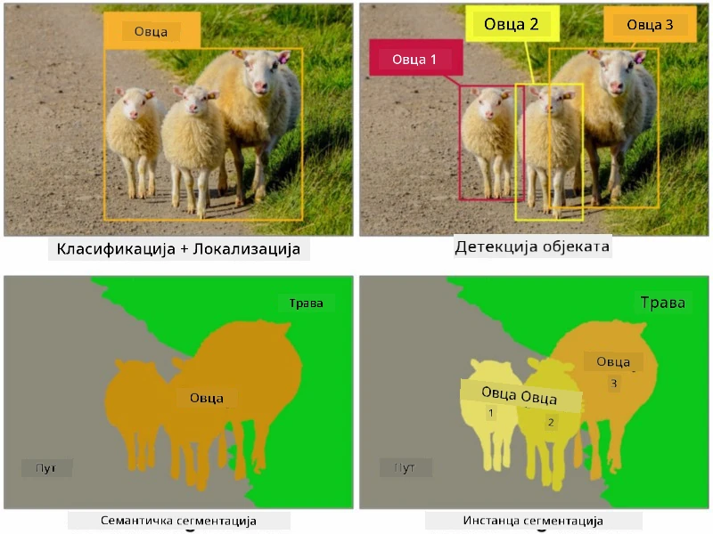
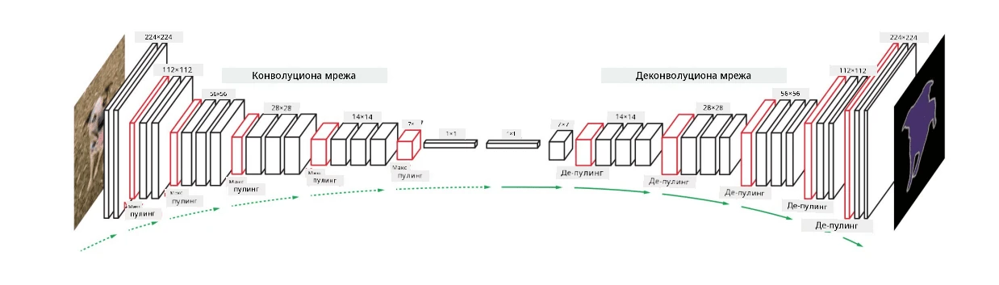

# Сегментација

Раније смо учили о детекцији објеката, која нам омогућава да лоцирамо објекте на слици предвиђањем њихових *ограничених оквира*. Међутим, за неке задатке нам нису потребни само ограничени оквири, већ и прецизнија локализација објеката. Овај задатак се назива **сегментација**.

## [Квиз пре предавања](https://ff-quizzes.netlify.app/en/ai/quiz/23)

Сегментација се може посматрати као **класификација пиксела**, где за **сваки** пиксел слике морамо предвидети његову класу (*позадина* је једна од класа). Постоје два главна алгоритма за сегментацију:

* **Семантичка сегментација** само одређује класу пиксела, без разликовања различитих објеката исте класе.
* **Инстант сегментација** дели класе на различите инстанце.

На пример, за инстант сегментацију, ове овце су различити објекти, али за семантичку сегментацију све овце су представљене као једна класа.

> Слика из [овог блога](https://nirmalamurali.medium.com/image-classification-vs-semantic-segmentation-vs-instance-segmentation-625c33a08d50)

Постоје различите неуронске архитектуре за сегментацију, али све имају исту структуру. На неки начин, сличне су аутоенкодеру о којем сте раније учили, али уместо реконструкције оригиналне слике, наш циљ је реконструкција **маске**. Дакле, мрежа за сегментацију има следеће делове:

* **Енкодер** извлачи карактеристике из улазне слике.
* **Декодер** трансформише те карактеристике у **слику маске**, са истом величином и бројем канала који одговарају броју класа.

> Слика из [ове публикације](https://arxiv.org/pdf/2001.05566.pdf)

Посебно треба поменути функцију губитка која се користи за сегментацију. Код класичних аутоенкодера, потребно је измерити сличност између две слике, и за то можемо користити средњу квадратну грешку (MSE). Код сегментације, сваки пиксел у циљној слици маске представља број класе (једнохот-кодиран дуж треће димензије), па је потребно користити функције губитка специфичне за класификацију - губитак унакрсне ентропије, просечен преко свих пиксела. Ако је маска бинарна - користи се **губитак бинарне унакрсне ентропије** (BCE).

> ✅ Једнохот-кодирање је начин кодирања ознаке класе у вектор чија је дужина једнака броју класа. Погледајте [овај чланак](https://datagy.io/sklearn-one-hot-encode/) о овој техници.

## Сегментација у медицинској дијагностици

У овом предавању ћемо видети сегментацију у пракси тако што ћемо обучити мрежу да препозна људске невусе (познате и као младеже) на медицинским сликама. Користићемо <a href="https://www.fc.up.pt/addi/ph2%20database.html">PH2 базу података</a> дермоскопских слика као извор слика. Овај скуп података садржи 200 слика три класе: типични невус, атипични невус и меланом. Све слике такође садрже одговарајућу **маску** која обележава невус.

> ✅ Ова техника је посебно погодна за ову врсту медицинских слика, али које друге примене у стварном свету можете замислити?

> Слика из PH2 базе података

Обучаваћемо модел да сегментира било који невус од његове позадине.

## ✍️ Вежбе: Семантичка сегментација

Отворите следеће свеске да бисте сазнали више о различитим архитектурама семантичке сегментације, вежбали рад са њима и видели их у акцији.

* [Семантичка сегментација у Pytorch](SemanticSegmentationPytorch.ipynb)
* [Семантичка сегментација у TensorFlow](SemanticSegmentationTF.ipynb)

## [Квиз после предавања](https://ff-quizzes.netlify.app/en/ai/quiz/24)

## Закључак

Сегментација је веома моћна техника за класификацију слика, која иде даље од ограничених оквира до класификације на нивоу пиксела. То је техника која се користи у медицинској дијагностици, између осталих примена.

## 🚀 Изазов

Сегментација тела је само један од уобичајених задатака који можемо радити са сликама људи. Други важни задаци укључују **детекцију скелета** и **детекцију позе**. Испробајте [OpenPose](https://github.com/CMU-Perceptual-Computing-Lab/openpose) библиотеку да видите како се детекција позе може користити.

## Преглед и самостално учење

Овај [чланак на Википедији](https://wikipedia.org/wiki/Image_segmentation) нуди добар преглед различитих примена ове технике. Сазнајте више о поддоменима инстант сегментације и паноптичке сегментације у овој области истраживања.

## [Задатак](lab/README.md)

У овом лабораторијском раду, испробајте **сегментацију људског тела** користећи [Segmentation Full Body MADS Dataset](https://www.kaggle.com/datasets/tapakah68/segmentation-full-body-mads-dataset) са Kaggle-а.

---

