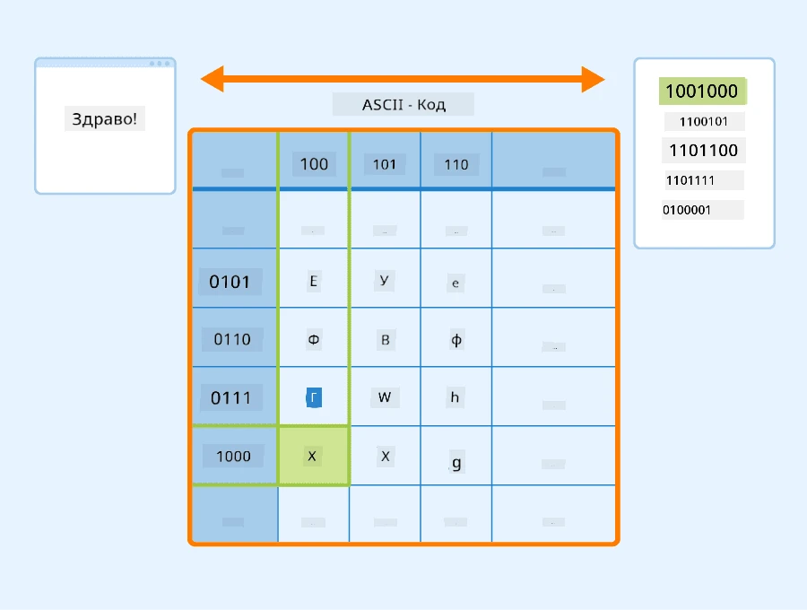
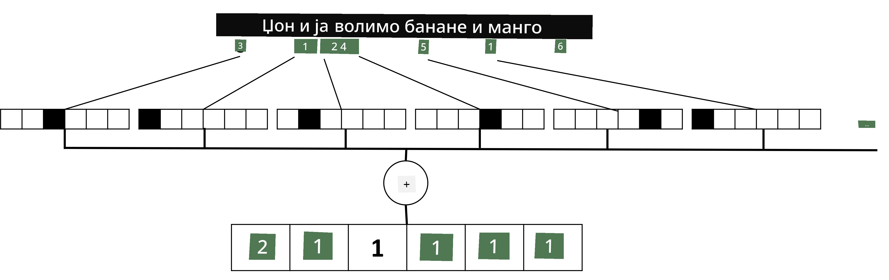

# Представљање текста као тензора

## [Квиз пре предавања](https://ff-quizzes.netlify.app/en/ai/quiz/25)

## Класификација текста

У првом делу овог одељка фокусираћемо се на задатак **класификације текста**. Користићемо [AG News](https://www.kaggle.com/amananandrai/ag-news-classification-dataset) скуп података, који садржи вести попут следећих:

* Категорија: Наука/Технологија  
* Наслов: Компанија из Кентакија добила грант за проучавање пептида (АП)  
* Тело: АП - Компанија коју је основао истраживач хемије са Универзитета у Луисвилу добила је грант за развој...

Наш циљ ће бити да класификујемо вест у једну од категорија на основу текста.

## Представљање текста

Ако желимо да решавамо задатке обраде природног језика (NLP) помоћу неуронских мрежа, потребан нам је начин да текст представимо као тензоре. Рачунари већ представљају текстуалне карактере као бројеве који се мапирају на фонтове на вашем екрану користећи енкодинге као што су ASCII или UTF-8.

> [Извор слике](https://www.seobility.net/en/wiki/ASCII)

Људи разумеју шта сваки карактер **представља** и како се сви карактери спајају да би формирали речи у реченици. Међутим, рачунари сами по себи немају такво разумевање, па неуронска мрежа мора да научи значење током тренинга.

Због тога можемо користити различите приступе у представљању текста:

* **Репрезентација на нивоу карактера**, када текст представљамо тако што сваки карактер третирамо као број. Ако имамо *C* различитих карактера у нашем корпусу текста, реч *Hello* би била представљена као тензор величине 5x*C*. Сваки карактер би одговарао једној колони тензора у one-hot енкодовању.  
* **Репрезентација на нивоу речи**, где креирамо **речник** свих речи у тексту и затим представљамо речи користећи one-hot енкодовање. Овај приступ је донекле бољи, јер појединачни карактери сами по себи немају много значења, па коришћењем семантички виших концепата - речи - поједностављујемо задатак за неуронску мрежу. Међутим, због велике величине речника, морамо се носити са високо-димензионалним ретким тензорима.

Без обзира на репрезентацију, прво морамо конвертовати текст у секвенцу **токена**, где је један токен или карактер, реч или чак део речи. Затим конвертујемо токен у број, обично користећи **речник**, а тај број се може унети у неуронску мрежу користећи one-hot енкодовање.

## N-Грамови

У природном језику, прецизно значење речи може се одредити само у контексту. На пример, значења *неуронска мрежа* и *риболовна мрежа* су потпуно различита. Један од начина да се ово узме у обзир је да изградимо модел на основу парова речи и третирамо парове речи као засебне токене у речнику. На овај начин, реченица *Волим да идем у риболов* би била представљена следећом секвенцом токена: *Волим да*, *да идем*, *идем у*, *у риболов*. Проблем са овим приступом је што величина речника значајно расте, а комбинације попут *идем у риболов* и *идем у куповину* се представљају различитим токенима, који не деле никакву семантичку сличност упркос истом глаголу.

У неким случајевима можемо размотрити коришћење три-грамова — комбинација три речи. Због тога се овај приступ често назива **n-грамови**. Такође, има смисла користити n-грамове са репрезентацијом на нивоу карактера, где n-грамови отприлике одговарају различитим слоговима.

## Bag-of-Words и TF/IDF

Када решавамо задатке као што је класификација текста, потребно је да текст представимо једним вектором фиксне величине, који ћемо користити као улаз за финални густ класификатор. Један од најједноставнијих начина за то је комбиновање свих појединачних репрезентација речи, нпр. њиховим сабирањем. Ако саберемо one-hot енкодовања сваке речи, добићемо вектор фреквенција, који показује колико се пута свака реч појављује у тексту. Оваква репрезентација текста се назива **bag of words** (BoW).

> Слика аутора

BoW у суштини представља које речи се појављују у тексту и у којим количинама, што заиста може бити добар показатељ о чему се текст ради. На пример, чланак о политици вероватно садржи речи као што су *председник* и *држава*, док би научна публикација имала речи попут *сударивач*, *откривено* итд. Стога, фреквенције речи могу у многим случајевима бити добар индикатор садржаја текста.

Проблем са BoW је што се одређене уобичајене речи, као што су *и*, *је* итд., појављују у већини текстова и имају највише фреквенције, прикривајући речи које су заиста важне. Можемо смањити значај тих речи узимајући у обзир фреквенцију са којом се речи појављују у целокупној колекцији докумената. Ово је главна идеја иза TF/IDF приступа, који је детаљније обрађен у нотебуцима приложеним уз ову лекцију.

Међутим, ниједан од ових приступа не може у потпуности узети у обзир **семантику** текста. За то су нам потребни моћнији модели неуронских мрежа, о којима ћемо говорити касније у овом одељку.

## ✍️ Вежбе: Репрезентација текста

Наставите са учењем у следећим нотебуцима:

* [Репрезентација текста са PyTorch-ом](TextRepresentationPyTorch.ipynb)  
* [Репрезентација текста са TensorFlow-ом](TextRepresentationTF.ipynb)

## Закључак

До сада смо проучавали технике које могу додати тежину фреквенције различитим речима. Оне, међутим, нису у стању да представе значење или редослед. Како је чувени лингвиста Џ. Р. Фирт рекао 1935. године: "Потпуно значење речи је увек контекстуално, и ниједно проучавање значења ван контекста не може се озбиљно схватити." Касније у курсу ћемо научити како да ухватимо контекстуалне информације из текста користећи језичко моделирање.

## 🚀 Изазов

Испробајте неке друге вежбе користећи bag-of-words и различите моделе података. Можда ћете бити инспирисани овим [такмичењем на Kaggle-у](https://www.kaggle.com/competitions/word2vec-nlp-tutorial/overview/part-1-for-beginners-bag-of-words)

## [Квиз након предавања](https://ff-quizzes.netlify.app/en/ai/quiz/26)

## Преглед и самостално учење

Увежбајте своје вештине са техникама уграђивања текста и bag-of-words на [Microsoft Learn](https://docs.microsoft.com/learn/modules/intro-natural-language-processing-pytorch/?WT.mc_id=academic-77998-cacaste)

## [Задатак: Нотебуци](assignment.md)

---

