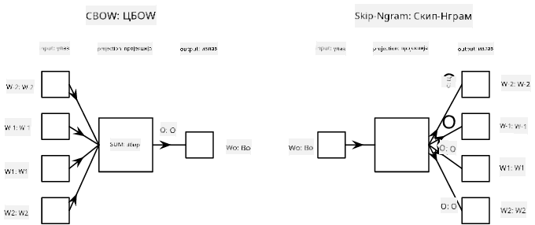

<!--
CO_OP_TRANSLATOR_METADATA:
{
  "original_hash": "e40b47ac3fd48f71304ede1474e66293",
  "translation_date": "2025-08-25T21:40:03+00:00",
  "source_file": "lessons/5-NLP/14-Embeddings/README.md",
  "language_code": "sr"
}
-->
# Уграђивања

## [Квиз пре предавања](https://red-field-0a6ddfd03.1.azurestaticapps.net/quiz/114)

Када смо обучавали класификаторе засноване на BoW или TF/IDF, радили смо са векторима високе димензионалности у облику вреће речи дужине `vocab_size`, и експлицитно смо конвертовали из вектора позиционе репрезентације ниске димензионалности у ретке one-hot репрезентације. Међутим, ова one-hot репрезентација није меморијски ефикасна. Поред тога, свака реч се третира независно од других, тј. one-hot кодирани вектори не изражавају никакву семантичку сличност између речи.

Идеја **уграђивања** је да се речи представе векторима ниже димензионалности, који на неки начин одражавају семантичко значење речи. Касније ћемо разговарати о томе како изградити смислена уграђивања речи, али за сада ћемо их посматрати као начин смањења димензионалности вектора речи.

Дакле, слој за уграђивање би узимао реч као улаз и производио излазни вектор одређене величине `embedding_size`. У неком смислу, веома је сличан `Linear` слоју, али уместо да узима one-hot кодирани вектор, он може узети број речи као улаз, чиме избегавамо креирање великих one-hot кодираних вектора.

Коришћењем слоја за уграђивање као првог слоја у нашој мрежи класификатора, можемо прећи са модела вреће речи на модел **вреће уграђивања**, где прво конвертујемо сваку реч у тексту у одговарајуће уграђивање, а затим израчунавамо неку агрегатну функцију над свим тим уграђивањима, као што су `sum`, `average` или `max`.  

> Слика аутора

## ✍️ Вежбе: Уграђивања

Наставите са учењем у следећим нотебуковима:
* [Уграђивања са PyTorch-ом](../../../../../lessons/5-NLP/14-Embeddings/EmbeddingsPyTorch.ipynb)
* [Уграђивања са TensorFlow-ом](../../../../../lessons/5-NLP/14-Embeddings/EmbeddingsTF.ipynb)

## Семантичка уграђивања: Word2Vec

Иако је слој за уграђивање научио да мапира речи у векторску репрезентацију, та репрезентација није нужно имала много семантичког значења. Било би корисно научити векторску репрезентацију тако да сличне речи или синоними одговарају векторима који су блиски једни другима у смислу неке векторске удаљености (нпр. Еуклидске удаљености).

Да бисмо то постигли, потребно је да претходно обучимо наш модел за уграђивање на великој колекцији текста на специфичан начин. Један од начина за обуку семантичких уграђивања назива се [Word2Vec](https://en.wikipedia.org/wiki/Word2vec). Он се заснива на две главне архитектуре које се користе за производњу дистрибуиране репрезентације речи:

 - **Континуирана врећа речи** (CBoW) — у овој архитектури, обучавамо модел да предвиди реч из околног контекста. Дат је ngram $(W_{-2},W_{-1},W_0,W_1,W_2)$, циљ модела је да предвиди $W_0$ из $(W_{-2},W_{-1},W_1,W_2)$.
 - **Континуирани skip-gram** је супротан CBoW-у. Модел користи околни прозор контекстуалних речи да би предвидео тренутну реч.

CBoW је бржи, док је skip-gram спорији, али боље представља ретке речи.

> Слика из [овог рада](https://arxiv.org/pdf/1301.3781.pdf)

Унапред обучена уграђивања Word2Vec (као и други слични модели, попут GloVe) могу се користити уместо слоја за уграђивање у неуронским мрежама. Међутим, морамо се бавити речницима, јер се речник коришћен за претходну обуку Word2Vec/GloVe вероватно разликује од речника у нашем корпусу текста. Погледајте горе наведене нотебукове да бисте видели како се овај проблем може решити.

## Контекстуална уграђивања

Једно од кључних ограничења традиционалних унапред обучених репрезентација уграђивања, као што је Word2Vec, је проблем разликовања значења речи. Иако унапред обучена уграђивања могу ухватити део значења речи у контексту, свако могуће значење речи је кодирано у исто уграђивање. Ово може изазвати проблеме у моделима који долазе након тога, јер многе речи, попут речи 'play', имају различита значења у зависности од контекста у којем се користе.

На пример, реч 'play' у следећим реченицама има прилично различита значења:

- Ишао сам на **представу** у позоришту.
- Џон жели да се **игра** са својим пријатељима.

Унапред обучена уграђивања горе представљају оба ова значења речи 'play' у истом уграђивању. Да бисмо превазишли ово ограничење, потребно је да изградимо уграђивања заснована на **језичком моделу**, који је обучен на великом корпусу текста и *зна* како се речи могу комбиновати у различитим контекстима. Разматрање контекстуалних уграђивања је ван домета овог туторијала, али ћемо се вратити на њих када будемо говорили о језичким моделима касније у курсу.

## Закључак

У овој лекцији сте открили како да изградите и користите слојеве за уграђивање у TensorFlow-у и PyTorch-у како бисте боље одразили семантичка значења речи.

## 🚀 Изазов

Word2Vec је коришћен за неке занимљиве примене, укључујући генерисање текстова песама и поезије. Погледајте [овај чланак](https://www.politetype.com/blog/word2vec-color-poems) који објашњава како је аутор користио Word2Vec за генерисање поезије. Погледајте и [овај видео Дана Шифмана](https://www.youtube.com/watch?v=LSS_bos_TPI&ab_channel=TheCodingTrain) како бисте открили другачије објашњење ове технике. Затим покушајте да примените ове технике на свој корпус текста, можда преузет са Kaggle-а.

## [Квиз после предавања](https://red-field-0a6ddfd03.1.azurestaticapps.net/quiz/214)

## Преглед и самостално учење

Прочитајте овај рад о Word2Vec-у: [Efficient Estimation of Word Representations in Vector Space](https://arxiv.org/pdf/1301.3781.pdf)

## [Задатак: Нотебукови](assignment.md)

**Одрицање од одговорности**:  
Овај документ је преведен коришћењем услуге за превођење помоћу вештачке интелигенције [Co-op Translator](https://github.com/Azure/co-op-translator). Иако се трудимо да обезбедимо тачност, молимо вас да имате у виду да аутоматски преводи могу садржати грешке или нетачности. Оригинални документ на његовом изворном језику треба сматрати меродавним извором. За критичне информације препоручује се професионални превод од стране људи. Не преузимамо одговорност за било каква погрешна тумачења или неспоразуме који могу настати услед коришћења овог превода.