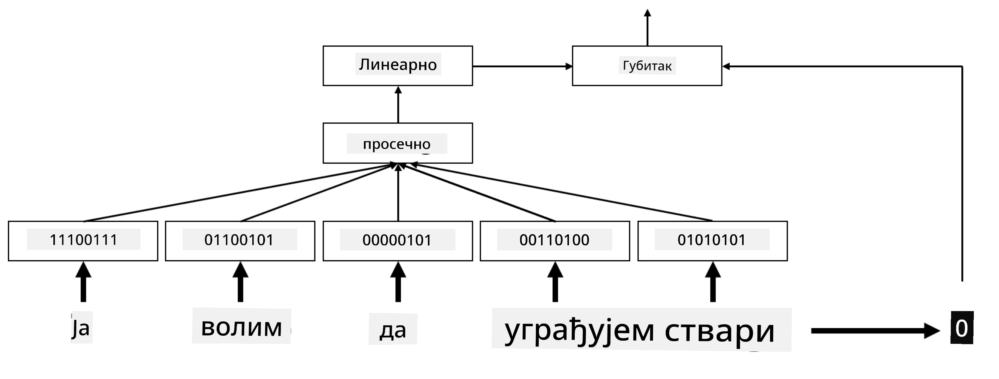
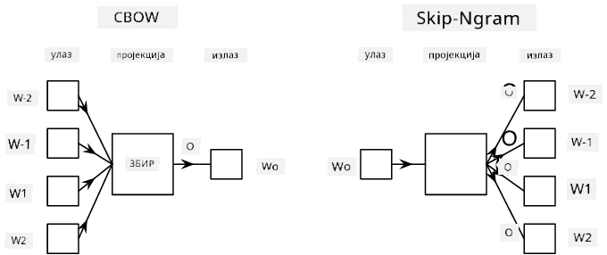

# Угњеждења

## [Квиз пре предавања](https://ff-quizzes.netlify.app/en/ai/quiz/27)

Када смо тренирали класификаторе засноване на BoW или TF/IDF, радили смо са векторима високе димензионалности заснованим на торби речи, чија је дужина `vocab_size`, и експлицитно смо конвертовали из вектора ниске димензионалности у позиционом представљању у ретке једнохотне представе. Међутим, ова једнохотна представа није меморијски ефикасна. Поред тога, свака реч се третира независно од других, тј. једнохотни кодирани вектори не изражавају никакву семантичку сличност између речи.

Идеја **угњеждења** је да се речи представе као вектори ниже димензионалности, који на неки начин одражавају семантичко значење речи. Касније ћемо разговарати о томе како изградити значајна угњеждења речи, али за сада само замислите угњеждења као начин смањења димензионалности вектора речи.

Дакле, слој угњеждења би узимао реч као улаз и производио излазни вектор одређене величине `embedding_size`. У суштини, веома је сличан слоју `Linear`, али уместо да узима једнохотни кодирани вектор, он ће моћи да узима број речи као улаз, омогућавајући нам да избегнемо креирање великих једнохотних кодираних вектора.

Коришћењем слоја угњеждења као првог слоја у нашој мрежи класификатора, можемо прећи са модела торбе речи на модел **торбе угњеждења**, где прво конвертујемо сваку реч у нашем тексту у одговарајуће угњеждење, а затим израчунавамо неку агрегатну функцију над свим тим угњеждењима, као што су `sum`, `average` или `max`.

> Слика аутора

## ✍️ Вежбе: Угњеждења

Наставите учење у следећим нотебуцима:
* [Угњеждења са PyTorch](EmbeddingsPyTorch.ipynb)
* [Угњеждења са TensorFlow](EmbeddingsTF.ipynb)

## Семантичка угњеждења: Word2Vec

Иако је слој угњеждења научио да мапира речи у векторску представу, та представa није нужно имала много семантичког значења. Било би корисно научити векторску представу тако да сличне речи или синоними одговарају векторима који су блиски једни другима у смислу неке векторске удаљености (нпр. Еуклидске удаљености).

Да бисмо то постигли, потребно је да претходно обучимо наш модел угњеждења на великој колекцији текста на специфичан начин. Један од начина за тренирање семантичких угњеждења назива се [Word2Vec](https://en.wikipedia.org/wiki/Word2vec). Он се заснива на две главне архитектуре које се користе за производњу расподељене представе речи:

- **Континуирана торба речи** (CBoW) — у овој архитектури, тренирамо модел да предвиди реч из околног контекста. Дат је нграм $(W_{-2},W_{-1},W_0,W_1,W_2)$, циљ модела је да предвиди $W_0$ из $(W_{-2},W_{-1},W_1,W_2)$.
- **Континуирани скип-грам** је супротан CBoW-у. Модел користи околни прозор контекстуалних речи да предвиди тренутну реч.

CBoW је бржи, док је скип-грам спорији, али боље представља ретке речи.

> Слика из [овог рада](https://arxiv.org/pdf/1301.3781.pdf)

Претходно обучена угњеждења Word2Vec (као и други слични модели, као што је GloVe) могу се користити уместо слоја угњеждења у неуронским мрежама. Међутим, морамо се позабавити речницима, јер речник који се користи за претходно тренирање Word2Vec/GloVe вероватно се разликује од речника у нашем корпусу текста. Погледајте горе наведене нотебуке да бисте видели како се овај проблем може решити.

## Контекстуална угњеждења

Једно од главних ограничења традиционалних претходно обучених представa угњеждења, као што је Word2Vec, је проблем разјашњења значења речи. Иако претходно обучена угњеждења могу ухватити део значења речи у контексту, свако могуће значење речи је кодирано у исто угњеждење. Ово може изазвати проблеме у моделима који се користе касније, јер многе речи, као што је реч 'play', имају различита значења у зависности од контекста у којем се користе.

На пример, реч 'play' у следећим реченицама има прилично различита значења:

- Ишао сам на **представу** у позоришту.
- Џон жели да се **игра** са својим пријатељима.

Претходно обучена угњеждења представљају оба ова значења речи 'play' у истом угњеждењу. Да бисмо превазишли ово ограничење, потребно је да изградимо угњеждења заснована на **језичком моделу**, који је обучен на великом корпусу текста и *зна* како се речи могу комбиновати у различитим контекстима. Разматрање контекстуалних угњеждења је ван домашаја овог туторијала, али ћемо се вратити на њих када будемо говорили о језичким моделима касније у курсу.

## Закључак

У овој лекцији, открили сте како да изградите и користите слојеве угњеждења у TensorFlow-у и Pytorch-у како бисте боље одразили семантичка значења речи.

## 🚀 Изазов

Word2Vec је коришћен за неке занимљиве апликације, укључујући генерисање текстова песама и поезије. Погледајте [овај чланак](https://www.politetype.com/blog/word2vec-color-poems) који објашњава како је аутор користио Word2Vec за генерисање поезије. Погледајте и [овај видео Дана Шифмана](https://www.youtube.com/watch?v=LSS_bos_TPI&ab_channel=TheCodingTrain) да бисте открили другачије објашњење ове технике. Затим покушајте да примените ове технике на сопствени корпус текста, можда изворно са Kaggle-а.

## [Квиз после предавања](https://ff-quizzes.netlify.app/en/ai/quiz/28)

## Преглед и самостално учење

Прочитајте овај рад о Word2Vec-у: [Efficient Estimation of Word Representations in Vector Space](https://arxiv.org/pdf/1301.3781.pdf)

## [Задатак: Нотебуци](assignment.md)

---

