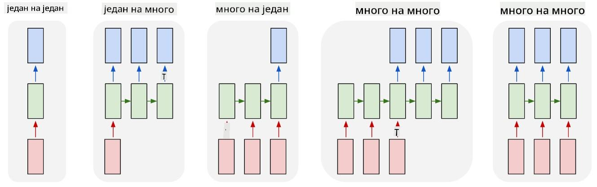
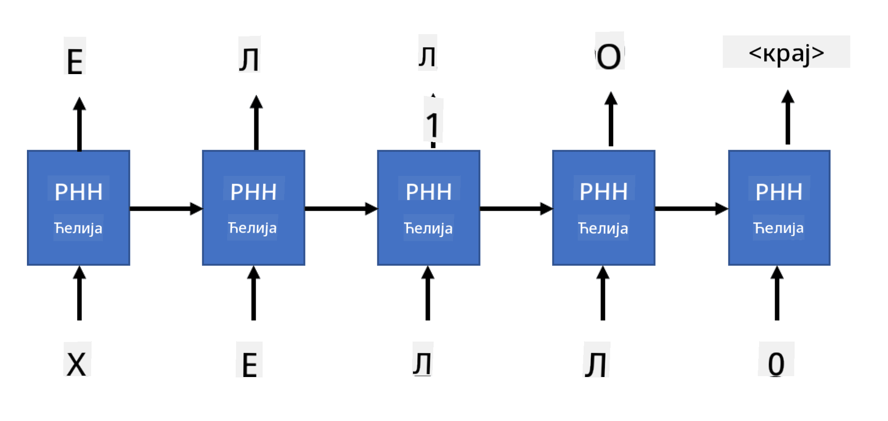

<!--
CO_OP_TRANSLATOR_METADATA:
{
  "original_hash": "d9de7847385eeeda67cfdcce1640ab72",
  "translation_date": "2025-08-25T21:45:39+00:00",
  "source_file": "lessons/5-NLP/17-GenerativeNetworks/README.md",
  "language_code": "sr"
}
-->
# Генеративне мреже

## [Квиз пре предавања](https://ff-quizzes.netlify.app/en/ai/quiz/33)

Рекурентне неуронске мреже (RNN) и њихове варијанте са "гейтованим" ћелијама, као што су Long Short Term Memory ћелије (LSTM) и Gated Recurrent Units (GRU), пружају механизам за моделирање језика јер могу да науче редослед речи и дају предвиђања за следећу реч у низу. Ово нам омогућава да користимо RNN за **генеративне задатке**, као што су обично генерисање текста, машинско превођење, па чак и генерисање описа слика.

> ✅ Размислите о свим ситуацијама у којима сте имали користи од генеративних задатака, као што је довршавање текста док куцате. Истражите своје омиљене апликације да видите да ли су користиле RNN.

У RNN архитектури коју смо разматрали у претходној јединици, свака RNN јединица је производила следеће скривено стање као излаз. Међутим, можемо додати још један излаз свакој рекурентној јединици, што би нам омогућило да добијемо **секвенцу** (једнаке дужине као оригинална секвенца). Штавише, можемо користити RNN јединице које не прихватају улаз на сваком кораку, већ само узимају почетни вектор стања и затим производе секвенцу излаза.

Ово омогућава различите неуронске архитектуре које су приказане на слици испод:



> Слика из блога [Unreasonable Effectiveness of Recurrent Neural Networks](http://karpathy.github.io/2015/05/21/rnn-effectiveness/) аутора [Андреја Карпатија](http://karpathy.github.io/)

* **Један-на-један** је традиционална неуронска мрежа са једним улазом и једним излазом
* **Један-на-много** је генеративна архитектура која прихвата једну улазну вредност и генерише секвенцу излазних вредности. На пример, ако желимо да обучимо мрежу за **генерисање описа слика** која би производила текстуални опис слике, можемо узети слику као улаз, пропустити је кроз CNN да добијемо њено скривено стање, а затим користити рекурентни ланац да генерише опис реч по реч
* **Много-на-један** одговара RNN архитектурама које смо описали у претходној јединици, као што је класификација текста
* **Много-на-много**, или **секвенца-на-секвенцу**, одговара задацима као што је **машинско превођење**, где прва RNN сакупља све информације из улазне секвенце у скривено стање, а друга RNN развија ово стање у излазну секвенцу.

У овој јединици, фокусираћемо се на једноставне генеративне моделе који нам помажу да генеришемо текст. Ради једноставности, користићемо токенизацију на нивоу карактера.

Обучаваћемо ову RNN да генерише текст корак по корак. На сваком кораку, узимамо секвенцу карактера дужине `nchars` и тражимо од мреже да генерише следећи излазни карактер за сваки улазни карактер:



Приликом генерисања текста (током инференције), почињемо са неким **подстицајем** (prompt), који се пропушта кроз RNN ћелије да би се генерисало његово интермедијарно стање, а затим из овог стања почиње генерисање. Генеришемо један карактер у исто време и прослеђујемо стање и генерисани карактер следећој RNN ћелији да генерише следећи, све док не генеришемо довољно карактера.


> Слика аутора

## ✍️ Вежбе: Генеративне мреже

Наставите са учењем у следећим бележницама:

* [Генеративне мреже са PyTorch](../../../../../lessons/5-NLP/17-GenerativeNetworks/GenerativePyTorch.ipynb)
* [Генеративне мреже са TensorFlow](../../../../../lessons/5-NLP/17-GenerativeNetworks/GenerativeTF.ipynb)

## Меко генерисање текста и температура

Излаз сваке RNN ћелије је расподела вероватноће карактера. Ако увек узимамо карактер са највишом вероватноћом као следећи карактер у генерисаном тексту, текст често може постати "цикличан", понављајући исте секвенце карактера изнова и изнова, као у овом примеру:

```
today of the second the company and a second the company ...
```

Међутим, ако погледамо расподелу вероватноће за следећи карактер, може се десити да разлика између неколико највиших вероватноћа није велика, нпр. један карактер може имати вероватноћу 0.2, а други 0.19, итд. На пример, када тражимо следећи карактер у секвенци '*play*', следећи карактер може једнако добро бити размак или **е** (као у речи *player*).

Ово нас доводи до закључка да није увек "праведно" изабрати карактер са највишом вероватноћом, јер избор другог највишег може и даље довести до смисленог текста. Паметније је **узорковати** карактере из расподеле вероватноће коју даје излаз мреже. Такође можемо користити параметар, **температура**, који ће изравнати расподелу вероватноће ако желимо да додамо више случајности, или је учинити стрмијом ако желимо да се више држимо карактера са највишом вероватноћом.

Истражите како је ово меко генерисање текста имплементирано у бележницама повезаним изнад.

## Закључак

Иако генерисање текста може бити корисно само по себи, главне предности долазе из могућности генерисања текста помоћу RNN из неког почетног вектора карактеристика. На пример, генерисање текста се користи као део машинског превођења (секвенца-на-секвенцу, у овом случају вектор стања из *енкодера* се користи за генерисање или *декодирање* преведене поруке), или за генерисање текстуалног описа слике (у ком случају вектор карактеристика долази из CNN екстрактора).

## 🚀 Изазов

Похађајте неке лекције на Microsoft Learn на ову тему

* Генерисање текста са [PyTorch](https://docs.microsoft.com/learn/modules/intro-natural-language-processing-pytorch/6-generative-networks/?WT.mc_id=academic-77998-cacaste)/[TensorFlow](https://docs.microsoft.com/learn/modules/intro-natural-language-processing-tensorflow/5-generative-networks/?WT.mc_id=academic-77998-cacaste)

## [Квиз након предавања](https://ff-quizzes.netlify.app/en/ai/quiz/34)

## Преглед и самостално учење

Ево неких чланака за проширивање знања:

* Различити приступи генерисању текста са Марковљевим ланцем, LSTM и GPT-2: [блог пост](https://towardsdatascience.com/text-generation-gpt-2-lstm-markov-chain-9ea371820e1e)
* Пример генерисања текста у [Keras документацији](https://keras.io/examples/generative/lstm_character_level_text_generation/)

## [Задатак](lab/README.md)

Видели смо како се текст генерише карактер по карактер. У лабораторији ћете истражити генерисање текста на нивоу речи.

**Одрицање од одговорности**:  
Овај документ је преведен коришћењем услуге за превођење помоћу вештачке интелигенције [Co-op Translator](https://github.com/Azure/co-op-translator). Иако настојимо да обезбедимо тачност, молимо вас да имате у виду да аутоматски преводи могу садржати грешке или нетачности. Оригинални документ на његовом изворном језику треба сматрати меродавним извором. За критичне информације препоручује се професионални превод од стране људи. Не преузимамо одговорност за било каква погрешна тумачења или неспоразуме који могу настати услед коришћења овог превода.